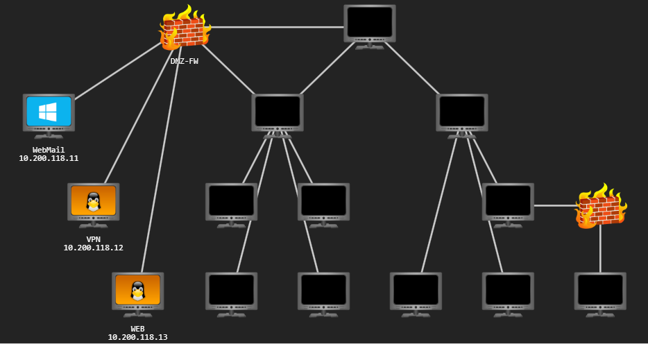

# Red-Team Capstone

## Project Goal

The purpose of this assessment is to evaluate whether the corporate division can be compromised and, if so, determine if it could compromise the bank division. A simulated fraudulent money transfer must be performed to fully demonstrate the compromise.

To do this safely, TheReserve will create two new core banking accounts for you. You will need to demonstrate that it's possible to transfer funds between these two accounts. The only way this is possible is by gaining access to SWIFT, the core backend banking system.

**Note:** SWIFT (Society for Worldwide Interbank Financial Telecommunications) is the actual system that is used by banks for backend transfers. In this assessment, a core backend system has been created. However, for security reasons, intentional inaccuracies have been introduced into this process. If you wish to learn more about actual SWIFT and its security, feel free to go do some research! To put it in other words, the information that follows here has been made up.

To help you understand the project goal, the government of Trimento has shared some information about the SWIFT backend system. SWIFT runs in an isolated secure environment with restricted access. While the word impossible should not be used lightly, the likelihood of the compromise of the actual hosting infrastructure is so slim that it is fair to say that it is impossible to compromise this infrastructure.

However, the SWIFT backend exposes an internal web application at [http://swift.bank.thereserve.loc/](http://swift.bank.thereserve.loc/), which TheReserve uses to facilitate transfers. The government has provided a general process for transfers. To transfer funds:

1. A customer makes a request that funds should be transferred and receives a transfer code.
2. The customer contacts the bank and provides this transfer code.
3. An employee with the capturer role authenticates to the SWIFT application and captures the transfer.
4. An employee with the approver role reviews the transfer details and, if verified, approves the transfer. This has to be performed from a jump host.
5. Once approval for the transfer is received by the SWIFT network, the transfer is facilitated and the customer is notified.
6. Separation of duties is performed to ensure that no single employee can both capture and approve the same transfer.

## Project Scope

This section details the project scope.

In-Scope

- Security testing of TheReserve's internal and external networks, including all IP ranges accessible through your VPN connection.
- OSINTing of TheReserve's corporate website, which is exposed on the external network of TheReserve. Note, this means that all OSINT activities should be limited to the provided network subnet and no external internet OSINTing is required.
- Phishing of any of the employees of TheReserve.
- Attacking the mailboxes of TheReserve employees on the WebMail host (.11).
- Using any attack methods to complete the goal of performing the transaction between the provided accounts.

Out-of-Scope

- Security testing of any sites not hosted on the network.
- Security testing of the TryHackMe VPN (.250) and scoring servers, or attempts to attack any other user connected to the network.
- Any security testing on the WebMail server (.11) that alters the mail server configuration or its underlying infrastructure.
- Attacking the mailboxes of other red teamers on the WebMail portal (.11).
- External (internet) OSINT gathering.
- Attacking any hosts outside of the provided subnet range. Once you have completed the questions below, your subnet will be displayed in the network diagram. This 10.200.X.0/24 network is the only in-scope network for this challenge.
- Conducting DoS attacks or any attack that renders the network inoperable for other users.

## Project Tools

In order to perform the project, the government of Trimento has decided to disclose some information and provide some tools that might be useful for the exercise. You do not have to use these tools and are free to use whatever you prefer. If you wish to use this information and tools, you can either find them on the AttackBox under `/root/Rooms/CapstoneChallenge` or download them as a task file using the blue button at the top of this task above the video. If you download them as a task file, use the password of `Capstone` to extract the zip. Note that these tools will be flagged as malware on Windows machines.

**Note:** For the provided password policy that requires a special character, the characters can be restricted to the following: `!@#$%^`

## Project Registration

The Trimento government mandates that all red teamers from TryHackMe participating in the challenge must register to allow their single point of contact for the engagement to track activities. As the island's network is segregated, this will also provide the testers access to an email account for communication with the government and an approved phishing email address, should phishing be performed.

To register, you need to get in touch with the government through its e-Citizen communication portal that uses SSH for communication. Here are the SSH details provided:

| | |
| --- | --- |
| SSH Username  | e-citizen |
| SSH Password  | stabilitythroughcurrency |
| SSH IP        | X.X.X.250 |

Once you complete the questions below, the network diagram at the start of the room will show the IP specific to your network. Use that information to replace the X values in your SSH IP.

Once you authenticate, you will be able to communicate with the e-Citizen system. Follow the prompts to register for the challenge, and save the information you get for future reference. Once registered, follow the instructions to verify that you have access to all the relevant systems.

The VPN server and the e-Citizen platform are not in scope for this assessment, and any security testing of these systems may lead to a ban from the challenge.

As you make your way through the network, you will need to prove your compromises. In order to do that, you will be requested to perform specific steps on the host that you have compromised. Please note the hostnames in the network diagram above, as you will need this information. Flags can only be accessed from matching hosts, so even if you have higher access, you will need to lower your access to the specific host required to submit the flag.

**Note: If the network has been reset or if you have joined a new subnet after your time in the network expired, your e-Citizen account will remain active. However, you will need to request that the system recreates your mailbox for you. This can be done by authenticating to e-Citizen and then selecting option 3.**

## Initial Reconnaissance

From what is provided :

[http://swift.bank.thereserve.loc/](http://swift.bank.thereserve.loc/) :

- exposed by the SWIFT backend system
- facilitates transfers
- transfert process:

1. A customer makes a request that funds should be transferred and receives a transfer code.
2. The customer contacts the bank and provides this transfer code.
3. An employee with the capturer role authenticates to the SWIFT application and captures the transfer.
4. An employee with the approver role reviews the transfer details and, if verified, approves the transfer. This has to be performed from a jump host.
5. Once approval for the transfer is received by the SWIFT network, the transfer is facilitated and the customer is notified.
6. Separation of duties is performed to ensure that no single employee can both capture and approve the same transfer.

### Hosts



| item | IP | comment |
| --- | --- | --- |
| Web server | 10.200.121.13 |  |
| VPN | 10.200.121.12 | |
| Webmail | 10.200.121.11 | |

### register 

To register, you need to get in touch with the government through its e-Citizen communication portal that uses SSH for communication. Here are the SSH details provided:

| | |
| --- | --- |
| SSH Username  | e-citizen |
| SSH Password  | stabilitythroughcurrency |
| SSH IP        | **10.200.121**.250 |

```shell
ssh e-citizen@10.200.121.250
```

Result:

```text
Welcome to the e-Citizen platform!
Please make a selection:
[1] Register
[2] Authenticate
[3] Exit
Selection:1
Please provide your THM username: ewhat
Creating email user
User has been succesfully created


=======================================
Thank you for registering on e-Citizen for the Red Team engagement against TheReserve.
Please take note of the following details and please make sure to save them, as they will not be displayed again.
=======================================
Username: ewhat
Password: XtuS5OpbDWWjJF43
MailAddr: ewhat@corp.th3reserve.loc
IP Range: 10.200.121.0/24
=======================================

These details are now active. As you can see, we have already purchased a domain for domain squatting to be used for phishing.
Once you discover the webmail server, you can use these details to authenticate and recover additional project information from your mailbox.
Once you have performed actions to compromise the network, please authenticate to e-Citizen in order to provide an update to the government. If your update is sufficient, you will be awarded a flag to indicate progress.

=======================================
Please note once again that the e-Citizen platform, and this VPN server, 10.200.121.250, are not in-scope for this assessment.
Any attempts made against this machine will result in a ban from the challenge.
=======================================

Best of luck and
may
you
hack
the
bank!


Thank you for using e-Citizen, goodbye!
Connection to 10.200.121.250 closed.
```

| | |
| --- | --- |
| Username | ewhat |
| Password | XtuS5OpbDWWjJF43 |
| MailAddr | ewhat@corp.th3reserve.loc |
| IP Range | 10.200.121.0/24 |

Using Thunderbird email client, or claws-mail, we can read emails :

- Name: ewhat@corp.th3reserve.loc
- Incoming server :
  - protocol: IMAP
  - Hostname: 10.200.121.11
  - Port: 143
  - security: None
  - Authentication method: Normal password
  - Username: ewhat@corp.th3reserve.loc
- Outgoing server:
  - Hostname: 10.200.121.11
  - Port: 587
  - security: None
  - Authentication method: Normal password
  - Username: ewhat@corp.th3reserve.loc

There is a mail :

```text
From: Am0 <amoebaman@corp.th3reserve.loc>
Subject: Rules of Engagement

Hey there!

My name is Am03baM4n, I'm the Head of Security for TheReserve and your main point of contact for this engagement. I am super excited that we finally have approval for this engagement. I have been preaching to ExCo on how we need to improve our security.

I hear that the project scope has already been shared with you. Please take careful note of these details and make sure that remain within scope for the engagement. I will be in touch as you progress through the engagement.
Best of luck!,
Am0
```

## Writeup

[[breaching_perimeter]]

[[domain-corp]]

[[forest-root]]

[[domain-bank]]

[[swift]]

