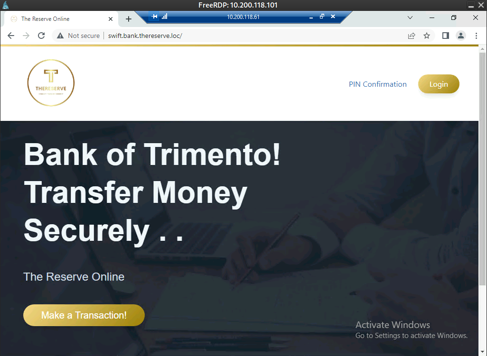

# swift


From the project goal, we also have a procedure:

```A customer makes a request that funds should be transferred and receives a transfer code.
1. The customer contacts the bank and provides this transfer code.
2. An employee with the capturer role authenticates to the SWIFT application and captures the transfer.
3. An employee with the approver role reviews the transfer details and, if verified, approves the transfer. This has to be performed from a jump host.
4. Once approval for the transfer is received by the SWIFT network, the transfer is facilitated and the customer is notified.
```

From BankDC, connect to the JMP host with our fake user. From its name and the network diagram, this seems to be the host to go to connect to the swift.

The swift seems accessible:

```shell
ping swift.bank.thereserve.loc
```

```text
Pinging swift.bank.thereserve.loc [10.200.118.201] with 32 bytes of data:
Reply from 10.200.118.201: bytes=32 time<1ms TTL=64
Reply from 10.200.118.201: bytes=32 time<1ms TTL=64
Reply from 10.200.118.201: bytes=32 time<1ms TTL=64

Ping statistics for 10.200.118.201:
    Packets: Sent = 3, Received = 3, Lost = 0 (0% loss),
Approximate round trip times in milli-seconds:
    Minimum = 0ms, Maximum = 0ms, Average = 0ms
```

Open a web browser (chrome), and bvrowse to the [SWIFT web interface](http://swift.bank.thereserve.loc) : [http://swift.bank.thereserve.loc](http://swift.bank.thereserve.loc)



## Validate SWIFT Web access

To validate the access to the SWIFT Web, we have a specific procedure :

```
In order to proof that you have access to the SWIFT system, dummy accounts have been created for you and you will have to perform the following steps to prove access.
===============================================
Account Details:
Source Email:		ewhat@source.loc
Source Password:	M6T1aA4LDzRy7w
Source AccountID:	6478f69182d52057ed26e648
Source Funds:		$ 10 000 000

Destination Email:	ewhat@destination.loc
Destination Password:	4rhHtP1vRt6A1Q
Destination AccountID:	6478f69382d52057ed26e649
Destination Funds:	$ 10
===============================================

Using these details, perform the following steps:
1. Go to the SWIFT web application
2. Navigate to the Make a Transaction page
3. Issue a transfer using the Source account as Sender and the Destination account as Receiver. You will have to use the corresponding account IDs.
4. Issue the transfer for the full 10 million dollars
5. Once completed, request verification of your transaction here (No need to check your email once the transfer has been created).
```


Login with the source credential


When using the dashboard buton :


go back and use button "Make transaction"


provide the SenderId, ReceiverId, and the amount of 10000000 to get the flag


This validate the web access flag

We receive special mail :

```text
From: Am0 <amoebaman@corp.th3reserve.loc>
To: ewhat <ewhat@corp.th3reserve.loc>
Subject: Flag: SWIFT Web Access

Congratulations! You have received the flag for: SWIFT Web Access

Your flag value is: THM{xxxxxxxxxxxxxxxxxxxxxxxxxxxx}

Your PIN for your transaction is: 4547

Please keep your PIN and your two sets of user credentials safe as you will require them for later tasks!
```

Your PIN for your transaction is: **4547**

## SWIFT Capturer Access

```
In order to proof that you have capturer access to the SWIFT system, a dummy transaction has been created for you.

Please look for a transaction with these details:

FROM:	631f60a3311625c0d29f5b32
TO:	6478f69182d52057ed26e648

Look for this transfer and capture (forward) the transaction.
```

### Enumeration

From the enumerated AD, we have 2 interesting groups :

```
CN=Payment Approvers,OU=Groups,DC=bank,DC=thereserve,DC=loc                           Security      Global Payment Approvers
CN=Payment Capturers,OU=Groups,DC=bank,DC=thereserve,DC=loc                           Security      Global Payment Capturers
```

**payment approvers** :

```shell
net group "Payment Approvers" /domain
```

- a.holt
- a.turner
- r.davies
- s.kemp

and payment capturers :

```shell
net group "Payment Capturers" /domain
```

- a.barker
- c.young
- g.watson
- s.harding
- t.buckley

From the project goal, the transaction have been made, and an employee with the capturer role have to authenticates to the SWIFT application and captures the transfer. An employee with the approver role will also be required later on.

On this host WORK1 (10.200.118.51), we have users :


a.barker have a text file `C:\Users\a.barker\Documents\Swift\Swift.txt`:

```
Welcome capturer to the SWIFT team.

You're credentials have been activated. For ease, your most recent AD password was replicated to the SWIFT application. Please feel free to change this password should you deem it necessary.

You can access the SWIFT system here: http://swift.bank.thereserve.loc
```

It's password is a copy from AD. thus, changing it in AD is useless since it is not working with AD authentication.

g.watson have another file `C:\Users\g.watson\Documents\Swift\Swift.txt`, interesting :

```
Welcome capturer to the SWIFT team.

You're credentials have been activated. For ease, your most recent AD password was replicated to the SWIFT application. Please feel free to change this password should you deem it necessary.

You can access the SWIFT system here: http://swift.bank.thereserve.loc

#Storing this here:
Corrected1996
```

So the password of **g.watson** on SWIFT could be : **Corrected1996**

On JMP host, a.holt have also an interesting text file `C:\Users\a.holt\Documents\Swift\swift.txt` :

```
Welcome approverto the SWIFT team.

You're credentials have been activated. As you are an approver, this has to be a unique password and AD replication is disallowed.

You can access the SWIFT system here: http://swift.bank.thereserve.loc
```

So the user of this account have a custom password, not copyed from AD.

### Validate

log out of SWIFT, and re-login with the capturer account :

- email: g.watson@bank.thereserve.loc
- password: Corrected1996

then go on the dashboard :


Then on "transactions", and forward the transaction.


This validate the capturer flag

## SWIFT Approver Access

```text
In order to proof that you have approver access to the SWIFT system, a dummy transaction has been created for you.

Please look for a transaction with these details:

FROM:	631f60a3311625c0d29f5b31
TO:	6478f69182d52057ed26e648

Look for this transfer and approve (forward) the transaction.
```

### Enumerate

The supposed approver is a.holt@bank.thereserve.loc

This user must use the JMP host to connect to SWIFT. The password to this account is not in AD. As many users, the password can be saved in its web broser for easy access.

In an admin console, change this user passowrd :

```shell
net user a.holt P@ssw0rd! /domain
```

close RDP, and re-open a remote connection to JMP:

- host: 10.200.118.61
- username: a.holt
- password: P@ssw0rd!

Open chrome browser, and open settings > Autofill > Password Manager


The password for swift : 

- URL: http://swift.bank.thereserve.loc/login
- username: a.holt@bank.thereserve.loc
- password: willnotguessthis1@

### Validate

log out of SWIFT, and re-login with the capturer account :

- email: a.holt@bank.thereserve.loc
- password: willnotguessthis1@

Then Dashboard > Transactions


This validate the approver flag

## SWIFT Payment Made

```text
This is the final check! Please do not attempt this if you haven't completed all of the other flags.
Once done, follow these steps:
1. Using your DESTINATION credentials, authenticate to SWIFT
2. Using the PIN provided in the SWIFT access flag email, verify the transaction.
3. Using your capturer access, capture the verified transaction.
4. Using your approver access, approve the captured transaction.
5. Profit?
```

log out of SWIFT, and re-login with the destination account, and use "PIN confirmation" :


So we have to wait a little bit, then log out and log in as capturer:

- email: g.watson@bank.thereserve.loc
- password: Corrected1996

Then dashboard > transactions


log out again and log in as approver:

- username: a.holt@bank.thereserve.loc
- password: willnotguessthis1@

Then dashboard > transactions


The transaction is completed !


